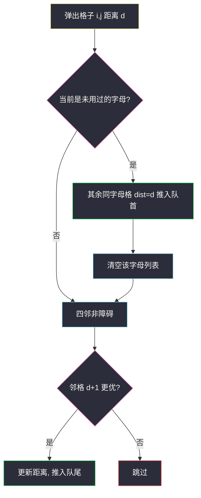
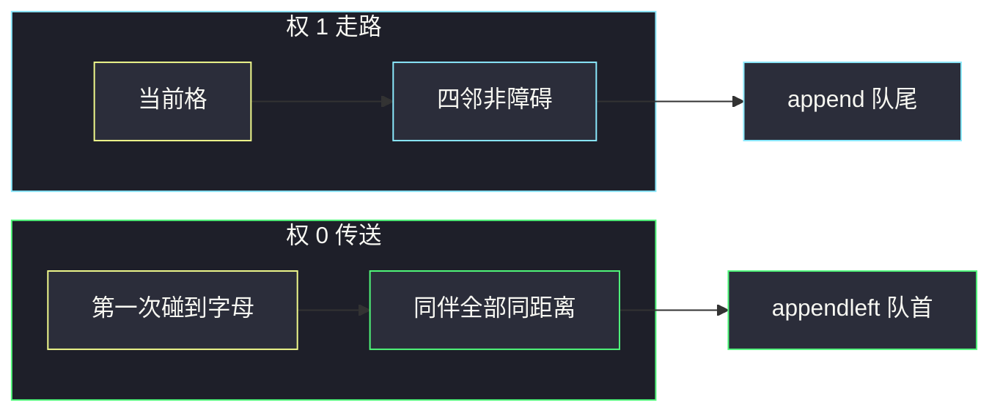

# 网格传送门旅游（0-1 BFS · 字母当超级源）

## 一、问题描述

`m × n` 字符网格：`.` 空地、`#` 障碍、大写字母 `A`–`Z` 传送门。从 `(0,0)` 走到 `(m-1,n-1)`。四连通走到非障碍格，**每次移动 +1**。踏上一扇传送门且该字母还没用过，可以立刻传到任意一个同字母格子，**传送不计步数**，每种字母全程最多用一次。不能到达返回 `-1`。

保证 `matrix[0][0]` 不是障碍。起点本身是传送门时，出发前就可以传（官方示例 1）。

> 🔗 LeetCode 3552：https://leetcode.cn/problems/grid-teleportation-traversal/
>
> 数据范围：`1 ≤ m, n ≤ 1000`，格子最多 `1e6`，必须线性。
>
> 📚 灵茶题单：**三、网格图 0-1 BFS**。⚠️ 新题。

**示例 1**

```
输入：matrix = ["A..",".A.","..."]
输出：2

A . .
. A .
. . .
```

`(0,0)` 的 `A` 传到 `(1,1)`（0 步），再右、下，共 2 步。

**示例 2**

```
输入：matrix = [".#...",".#.#.",".#.#.","...#."]
输出：13
```

没有传送门，绕开 `#` 走到右下，最短 13。

**直观理解**

走路边权 1，同字母传送边权 0，且每种字母只「激活」一次。边权只有 0 和 1，最短路用 **0-1 BFS**（双端队列），不要普通 BFS，也不要每次传送枚举全部同伴造成平方。

---

## 二、暴力解法

建图：四邻边权 1；每个字母的传送门两两连边权 0。再 Dijkstra。

```python
from collections import defaultdict
from heapq import heappush, heappop
from math import inf
from typing import List

class Solution:
    def minMoves(self, matrix: List[str]) -> int:
        m, n = len(matrix), len(matrix[0])
        pos = defaultdict(list)
        for i, row in enumerate(matrix):
            for j, c in enumerate(row):
                if c.isalpha():
                    pos[c].append((i, j))
        dist = [[inf] * n for _ in range(m)]
        dist[0][0] = 0
        h = [(0, 0, 0)]
        DIRS = ((0, 1), (0, -1), (1, 0), (-1, 0))
        used = set()
        while h:
            d, i, j = heappop(h)
            if d > dist[i][j]:
                continue
            if i == m - 1 and j == n - 1:
                return d
            c = matrix[i][j]
            if c.isalpha() and c not in used:
                used.add(c)
                for x, y in pos[c]:
                    if d < dist[x][y]:
                        dist[x][y] = d
                        heappush(h, (d, x, y))
            for di, dj in DIRS:
                x, y = i + di, j + dj
                if 0 <= x < m and 0 <= y < n and matrix[x][y] != "#" and d + 1 < dist[x][y]:
                    dist[x][y] = d + 1
                    heappush(h, (d + 1, x, y))
        return -1
```

若在每个传送格都扫一遍同字母列表，最坏全图同一个字母，松弛次数到 `O((mn)²)`。`mn = 1e6` 不可用。堆本身也比双端队列慢一截。

### 🔴 瓶颈在哪里

两件事必须同时成立：

1. 边权只有 0/1 → 0-1 BFS，deque 队首放 0、队尾放 1。
2. 每种字母只处理一次：第一次到达该字母的任意一格时，把其余同字母格以**相同距离**推进队首，然后清空该字母列表。同字母再中转没有意义——最短路不会在同一字母集合里跳第二次。

---

## 三、优化探索（核心章节）

> 📚 本题在灵茶题单中属于 **三、网格图 0-1 BFS**。官方 hint：同字母看成超级源；每个格子入队常数次即可。

### 3.1 边权

| 操作 | 边权 | deque |
|------|------|-------|
| 四连通走一步 | 1 | `append` 队尾 |
| 传送到同字母格 | 0 | `appendleft` 队首 |

0-1 BFS 保证：队头弹出的距离单调不减，第一次弹出终点就是最短。

### 3.2 每种字母只展开一次



第一次碰到字母 `A`，这次的 `d` 就是到达「任意一个 A」的最短距离（0-1 BFS 的弹出顺序）。其余 A 用 0 代价接到同一距离。之后删掉列表，后面再走到 A 只当普通走路。

单个字母没有「另一个」同伴：列表里只剩自己，`d < dist` 不成立，等于没传。

### 3.3 一句话核心

> **走路权 1 放队尾，传送权 0 放队首；每种字母第一次到达时把同伴全部灌进队首并清空。**

---

## 四、代码实现

### Python（主解：0-1 BFS）

```python
from collections import defaultdict, deque
from math import inf
from typing import List

class Solution:
    def minMoves(self, matrix: List[str]) -> int:
        m, n = len(matrix), len(matrix[0])
        pos = defaultdict(list)
        for i, row in enumerate(matrix):
            for j, c in enumerate(row):
                if c.isalpha():
                    pos[c].append((i, j))

        dist = [[inf] * n for _ in range(m)]
        dist[0][0] = 0
        q = deque([(0, 0)])
        DIRS = ((0, 1), (0, -1), (1, 0), (-1, 0))

        while q:
            i, j = q.popleft()
            d = dist[i][j]
            if i == m - 1 and j == n - 1:
                return d
            c = matrix[i][j]
            if c in pos:
                for x, y in pos[c]:
                    if d < dist[x][y]:
                        dist[x][y] = d
                        q.appendleft((x, y))
                del pos[c]
            for di, dj in DIRS:
                x, y = i + di, j + dj
                if 0 <= x < m and 0 <= y < n and matrix[x][y] != "#" and d + 1 < dist[x][y]:
                    dist[x][y] = d + 1
                    q.append((x, y))
        return -1
```

松弛条件写成 `新距离 < dist`，传送和走路都一样。弹出终点即可返回；走不出去返回 `-1`。起点即终点时第一次弹出就返回 0。

---

## 五、具体例子演示

### 示例 1：deque 逐步跟踪

```
A . .      传送门 A: (0,0), (1,1)
. A .
. . .
```

| 弹出 | d | 传送（队首） | 走路（队尾） | 队列（左是队头） |
|------|---|--------------|--------------|------------------|
| 开始 | | | | `(0,0)` |
| `(0,0)` | 0 | `(1,1)` 距离 0 | `(0,1)`、`(1,0)` 距离 1 | `(1,1), (0,1), (1,0)` |
| `(1,1)` | 0 | A 已清空 | `(1,2)`、`(2,1)` 距离 1 | `(0,1), (1,0), (1,2), (2,1)` |
| `(0,1)` | 1 | 无 | `(0,2)` 距离 2 | `(1,0), (1,2), (2,1), (0,2)` |
| `(1,0)` | 1 | 无 | `(2,0)` 距离 2 | `(1,2), (2,1), (0,2), (2,0)` |
| `(1,2)` | 1 | 无 | `(2,2)` 距离 2 | `(2,1), (0,2), (2,0), (2,2)` |
| … | | | | |
| `(2,2)` | 2 | | | 到达，返回 2 |

`(0,0)` 自己也在 A 列表里，但 `dist` 已是 0，不会重复推入。先传后走：队头始终是距离更小的传送结果。

最终 `dist`：

```
0 1 2
1 0 1
2 1 2
```

不传、只走路要 4 步；传送省 2 步。与官方一致。

### 示例 2：无传送，普通最短路

```
. # . . .
. # . # .
. # . # .
. . . # .
```

一条最短路（13 步）：

`(0,0) → 下行到 (3,0) → 右到 (3,2) → 上到 (0,2) → 右到 (0,4) → 下到 (3,4)`。

对拍输出 13。若右下是 `#` 或被墙封死，返回 `-1`。



---

## 六、复杂度分析

| 方法 | 时间 | 空间 | 说明 |
|------|------|------|------|
| 传送两两连边 + 堆 | 最坏 `O((mn)² log(mn))` | `O(mn)` | 同字母太多会平方 |
| 0-1 BFS + 字母清空（主解） | `O(mn)` | `O(mn)` | 每格松弛常数次，每字母列表扫一遍 |

26 个字母，每个坐标只在预处理里出现一次，清空后不再扫。

---

## 七、对比总结

| 维度 | 普通 BFS | Dijkstra 堆 | 0-1 BFS |
|------|----------|-------------|---------|
| 边权 | 必须全 1 | 任意非负 | 只有 0 和 1 |
| 传送 | 会把 0 代价当成 1 | 正确但多 log | 队首弹出，正好 |
| 同字母展开 | 易重复平方 | 同样要清空 | 第一次到达就灌完 |

**易错点**

1. **每个传送格都枚举全部同伴**：全图同一字母时直接平方，`1e6` 必 TLE。
2. **用普通队列 BFS**：0 代价传送和 1 代价走路混在同一层，距离不是最短。
3. **传送也 +1**：题面明确不计移动次数。
4. **字母可反复用**：最短路在同一字母集合里跳来跳去无益，而且题面限制只用一次。
5. **障碍 `#` 仍被传送落地**：传送目标来自预处理，只收集字母格，不会是 `#`；走路时必须判 `#`。
6. **起点是传送门忘了出发前可传**：0-1 BFS 弹出 `(0,0)` 就会激活该字母，不必特判。

---

## 八、举一反三

| 题目 | 关系 |
|------|------|
| [2290. 到达角落需要移除障碍物的最小数目](https://leetcode.cn/problems/minimum-obstacle-removal-to-reach-corner/) | 空地权 0、障碍权 1，标准 0-1 BFS |
| [1368. 使网格图至少有一条有效路径的最小代价](https://leetcode.cn/problems/minimum-cost-to-make-at-least-one-valid-path-in-a-grid/) | 顺箭头 0、改方向 1 |
| [3286. 穿越网格图的安全路径](https://leetcode.cn/problems/find-a-safe-walk-through-a-grid/) | 健康值约束，也可 0-1 / 最短路 |
| [1293. 网格中的最短路径](https://leetcode.cn/problems/shortest-path-in-a-grid-with-obstacles-elimination/) | 可拆 k 个障碍，状态多一维 |

**思想迁移**

- 网格里混着「免费跳跃」和「走一步」→ 先预处理跳跃点，再 0-1 BFS。
- 某一类传送只能用一次 → 第一次到达该类就把同伴灌完，列表清空。
- 口诀：**「0 进队首，1 进队尾；每种字母只灌一次。」**
