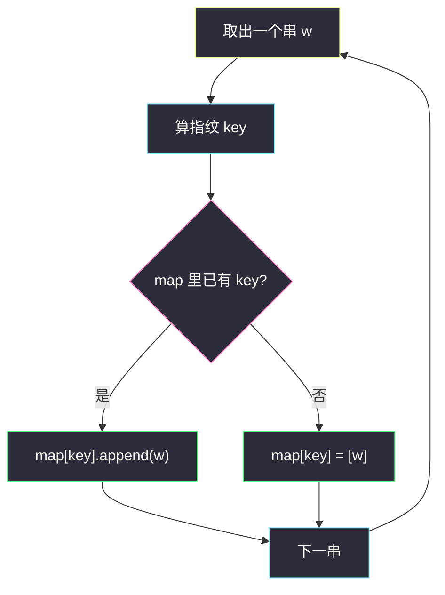
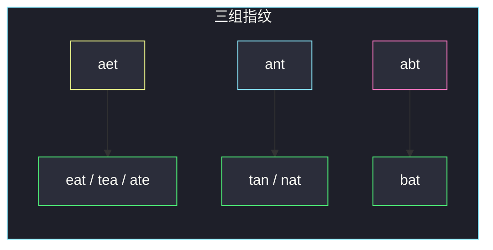

# 字母异位词分组（等价转化 · 排序后当哈希键）

## 一、问题描述

给你一个字符串数组 `strs`，请把**字母异位词**分到同一组。可以按任意顺序返回答案；组内顺序也任意。

字母异位词：两个串所含字母种类与个数完全相同，只是排列不同。例如 `"eat"`、`"tea"`、`"ate"` 互为异位词；`"bat"` 与它们不是。

> 🔗 LeetCode 49：https://leetcode.cn/problems/group-anagrams/
>
> 数据范围：`1 ≤ strs.length ≤ 10^4`，`0 ≤ strs[i].length ≤ 100`，`strs[i]` 只含小写英文字母。
>
> 📚 灵茶题单：**§5.3 等价转化**（无评分）。不要两两比较字符串，把「是不是同一类」转化成「规范化之后相不相等」。

**示例 1**

```
输入：strs = ["eat","tea","tan","ate","nat","bat"]
输出：[["bat"],["nat","tan"],["ate","eat","tea"]]
解释：组内、组间顺序都可以变。官方一种可能输出如上。
```

**示例 2**

```
输入：strs = [""]
输出：[[""]]
```

**示例 3**

```
输入：strs = ["a"]
输出：[["a"]]
```

**直观理解**

异位词 = 同一袋字母的不同排列。把每袋字母倒出来排成一种**唯一代表**（排序后的串，或 26 维计数元组），代表相同的就进同一组。哈希表：`key → 该组所有原串`。

---

## 二、暴力解法

对每个串，去已经分好的各组里找一个「代表」做异位词检查（排序后相等，或 26 计数相等）。找不到就新开一组。

```python
class Solution:
    def groupAnagrams(self, strs: list[str]) -> list[list[str]]:
        groups: list[list[str]] = []
        keys: list[str] = []  # 每组的规范化代表

        def norm(t: str) -> str:
            return "".join(sorted(t))

        for w in strs:
            k = norm(w)
            put = False
            for i, gk in enumerate(keys):
                if k == gk:
                    groups[i].append(w)
                    put = True
                    break
            if not put:
                keys.append(k)
                groups.append([w])
        return groups
```

最坏每个串都独成一组：第 `i` 个串要和前 `i` 组比一次，总时间 `O(n² · k log k)`（`k` 为串长）。`n = 10^4` 会超时。

### 🔴 瓶颈在哪里

「找这个 key 属于哪一组」是查表，不该线性扫已有组。哈希表把查找从 `O(组数)` 降到期望 `O(1)`。规范化本身才是真正要做的工作。

---

## 三、优化探索（核心章节）

> 📚 本题在灵茶题单中属于 **§5.3 等价转化**：判断「两个对象是否同一类」时，先找一个**与类别一一对应**的指纹，再比较指纹。异位词的指纹就是字母多重集。

### 3.1 为什么排序后的串能当指纹

串 `w` 排序后得到 `key`。两个串是异位词，当且仅当它们排序结果相同：

- 异位词字母多重集相同 → 排序后唯一确定同一串。
- 非异位词多重集不同 → 排序结果至少有一位不同。

所以 `key` 与「异位词等价类」一一对应。不必保留排列信息。

另一种指纹：长度为 26 的计数元组 `(c_a, c_b, …, c_z)`。同样一一对应，少了 `k log k` 的排序，变成 `O(k)` 统计。

### 3.2 不要两两比较

暴力的本质是：对每个新串，问「它和已有哪一组等价」。等价关系一旦有了规范代表，这个问题就是 `map[key].append(word)`。



### 3.3 两种 key 怎么选

| 指纹 | 时间（单个串） | 实现 | 适用 |
|------|----------------|------|------|
| `"".join(sorted(w))` | `O(k log k)` | 一行，面试友好 | `k ≤ 100` 完全够 |
| 26 计数元组 | `O(k)` | 稍长 | 想卡排序、或字母表固定时 |

总时间分别是 `O(n k log k)` 与 `O(n k)`。`n k = 10^6` 量级，两种都能过；主解用排序 key，下面补一版计数。

注意：Python 里 list 不能当 dict 的键，计数要用 `tuple(cnt)`。不要把计数拼成 `"1#2#0..."` 再当字符串键——能做，但元组更干净。

### 3.4 一句话核心

> **异位词 = 同一多重集。把每个串变成排序串（或 26 计数）当哈希键，相同键丢进同一列表。**

---

## 四、代码实现

### Python（主解：排序当 key）

```python
from collections import defaultdict


class Solution:
    def groupAnagrams(self, strs: list[str]) -> list[list[str]]:
        mp: dict[str, list[str]] = defaultdict(list)
        for w in strs:
            mp["".join(sorted(w))].append(w)
        return list(mp.values())
```

**变量含义**

| 写法 | 含义 |
|------|------|
| `mp` | 指纹 → 该等价类里的原串列表 |
| `"".join(sorted(w))` | `w` 的规范代表 |
| `mp.values()` | 所有组；顺序由哈希决定，题目允许任意 |

空串 `""` 的 key 仍是 `""`，单独成一组，示例 2 自动正确。多个空串会进同一组。

### Python（可选：26 计数元组）

```python
from collections import defaultdict


class Solution:
    def groupAnagrams(self, strs: list[str]) -> list[list[str]]:
        mp: dict[tuple[int, ...], list[str]] = defaultdict(list)
        for w in strs:
            cnt = [0] * 26
            for ch in w:
                cnt[ord(ch) - 97] += 1
            mp[tuple(cnt)].append(w)
        return list(mp.values())
```

计数版对单个串是线性的。以 `"ate"` 为例：`cnt[0]=1`（a）、`cnt[4]=1`（e）、`cnt[19]=1`（t），其余 0；`"eat"`、`"tea"` 得到同一元组，哈希到同一格。

### Java（可选：排序 key）

```java
class Solution {
    public List<List<String>> groupAnagrams(String[] strs) {
        Map<String, List<String>> mp = new HashMap<>();
        for (String w : strs) {
            char[] cs = w.toCharArray();
            Arrays.sort(cs);
            mp.computeIfAbsent(new String(cs), k -> new ArrayList<>()).add(w);
        }
        return new ArrayList<>(mp.values());
    }
}
```

---

## 五、具体例子演示

**示例 1**：`strs = ["eat","tea","tan","ate","nat","bat"]`。

排序关键字（每串独立排序，**不是**对 `strs` 整体排序）：

| 步 | 原串 | 排序 key | 操作后 map |
|----|------|----------|------------|
| 1 | eat | aet | `{aet: [eat]}` |
| 2 | tea | aet | `{aet: [eat, tea]}` |
| 3 | tan | ant | `{aet: [eat, tea], ant: [tan]}` |
| 4 | ate | aet | `{aet: [eat, tea, ate], ant: [tan]}` |
| 5 | nat | ant | `{aet: [eat, tea, ate], ant: [tan, nat]}` |
| 6 | bat | abt | 再多一组 `[bat]` |



返回这三组即可。对拍：`eat/tea/ate` 计数都是 `a:1,e:1,t:1`；`tan/nat` 都是 `a:1,n:1,t:1`；`bat` 独一份。

**示例 2、3**：只有一个串，哈希表里只有一个 key，答案就是 `[[该串]]`。

**易混输入**：`["ab","ba","abc"]` → 两组，长度为 2 的一对、长度为 3 的单独一组。长度不同一定不是异位词，排序 key 也会自动分开（`ab` vs `abc`）。

**重复空串**：`["",""]` → `[["", ""]]`，两个空串是异位词（多重集都空）。`["a","a"]` 同理并成一组，题目不要求去重。

---

## 六、复杂度分析

设 `n = strs.length`，`k` 为单个串最大长度。

| 方法 | 时间 | 空间 | 说明 |
|------|------|------|------|
| 线性扫已有组 | `O(n² · k log k)` | `O(n k)` 存答案 | `n = 10^4` 超时 |
| 排序 key + 哈希（主解） | `O(n k log k)` | `O(n k)` | 哈希额外存 key |
| 计数元组 + 哈希 | `O(n k)` | `O(n k)` | 每个 key 固定 26 元组 |

答案本身就要 `O(n k)` 空间，哈希表不改变量级。

---

## 七、对比总结

| 维度 | 两两比较 | 排序 key | 计数元组 |
|------|----------|----------|----------|
| 等价转化 | 无，直接比原串 | 多重集 → 有序串 | 多重集 → 26 维向量 |
| 查找组 | 扫列表 | 哈希 | 哈希 |
| 代码量 | 中 | 最短 | 略长 |
| 推荐 | 否 | 面试默写 | 想要线性于 `k` 时 |

**易错点**

1. **对 `strs` 整体排序**：要排序的是**每个串内部的字符**，不是数组下标。
2. **用 `set(w)` 当 key**：丢掉了字母出现次数，`"aab"` 和 `"ab"` 会错误并组。
3. **Python 把 `list` 当 dict 键**：`cnt` 必须转 `tuple`。
4. **纠结返回顺序**：题目明确任意顺序；不要为了「和示例长得一样」去稳定排序，除非本地对拍。
5. **把本题当成贪心选组**：没有「从最小/最大开始」的决策，就是分类。放在贪心①批次是因为它在灵神「思维」§5.3。

---

## 八、举一反三

| 题目 | 关系 |
|------|------|
| [242. 有效的字母异位词](https://leetcode.cn/problems/valid-anagram/) | 同一指纹，只判断两个串是否同类 |
| [438. 找到字符串中所有字母异位词](https://leetcode.cn/problems/find-all-anagrams-in-a-string/) | 指纹变成滑动窗口上的 26 计数 |
| [2273. 移除字母异位词后的结果数组](https://leetcode.cn/problems/find-resultant-array-after-removing-anagrams/) | 相邻异位词用同一 key 压缩 |
| [1347. 制造字母异位词的最小步骤数](https://leetcode.cn/problems/minimum-number-of-steps-to-make-two-strings-anagram/) | 比较两个 26 计数的差 |
| [763. 划分字母区间](https://leetcode.cn/problems/partition-labels/)（`partition-labels.md`） | 同属「先给字母一个身份，再按身份决策」，但那边是区间合并 |

**思想迁移**

- 等价类问题先问：有没有一个**规范形**，算出来就能 `O(1)` 判断同类。
- 口诀：**「每个串内部排序当 key，哈希表按 key 分组。」**
