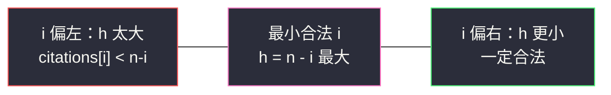
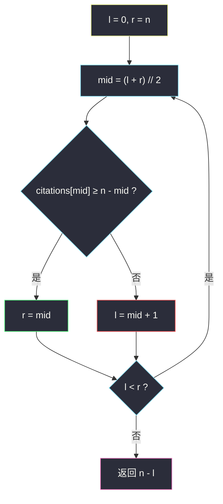
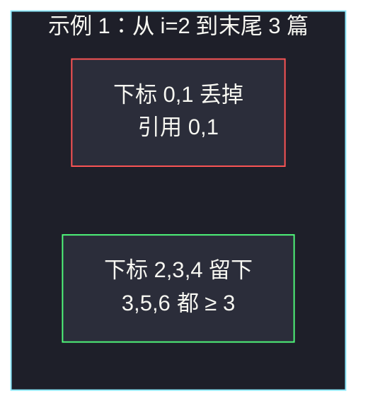

# H 指数 II（有序数组上二分求最大 h）

## 一、问题描述

给你一个整数数组 `citations`，其中 `citations[i]` 表示某研究者第 `i` 篇论文的引用次数。数组**已经按升序排好**。请计算该研究者的 H 指数。

H 指数定义为：最大的 `h`，使得**至少有 `h` 篇**论文的引用次数都 `≥ h`。

> 🔗 LeetCode 275：https://leetcode.cn/problems/h-index-ii/
>
> 数据范围：`1 <= n <= 10^5`，`0 <= citations[i] <= 1000`，`citations` 非递减。进阶要求：对数时间。

**示例 1**

```
输入：citations = [0,1,3,5,6]
输出：3
解释：共 5 篇。有 3 篇（3、5、6）引用 ≥ 3；不存在 4 篇都 ≥ 4。
```

**示例 2**

```
输入：citations = [1,2,100]
输出：2
解释：2 篇（2、100）引用 ≥ 2；只有 1 篇 ≥ 3，所以 h 不能取 3。
```

**直观理解**

从右边数：引用最高的那 `h` 篇里，最差的一篇也至少被引 `h` 次。数组已升序，这「最差的一篇」就是下标 `n - h` 处。二分去找最大的合法 `h`，不要再扫一遍。

---

## 二、暴力解法

`h` 从 `n` 降到 `0`，第一个满足「至少 h 篇 ≥ h」的就是答案。有序时，等价于看 `citations[n - h] >= h`：

```python
class Solution:
    def hIndex(self, citations: List[int]) -> int:
        n = len(citations)
        for h in range(n, -1, -1):
            if h == 0 or citations[n - h] >= h:
                return h
        return 0
```

### 复杂度

- **时间**：`O(n)`。`n = 10^5` 能过，但浪费了「已升序」——题目进阶点名 `O(log n)`。
- **空间**：`O(1)`。

### 🔴 瓶颈在哪里

`check(h)` = 「至少 h 篇引用 ≥ h」关于 `h` **左真右假**：`h` 越小越容易满足，`h` 越大越苛刻。这是典型的「求最大」单调性，线性从大到小扫，等于没吃单调性。主解必须二分。

---

## 三、优化探索（核心章节）

> 📚 本题在灵茶题单中属于 **二分算法 · §2.2 求最大**。不要把主解写成 `O(n)` 扫描；用左闭右开在下标上二分，答案 `h = n - i`。

### 3.1 下标 i 与 h 的对应

0-based，数组升序。若从下标 `i` 一直取到末尾，一共 `n - i` 篇，其中引用最少的是 `citations[i]`。这 `n - i` 篇要全部 `≥ n - i`，当且仅当：

```
citations[i] ≥ n - i
```

此时 `h = n - i` 合法。`i` 越小 → `h` 越大。**求最大 h = 求最小的合法 i**（找不到则 `i = n`，`h = 0`）。

### 3.2 check 的单调性（必须讲清）

令 `ok(i) = citations[i] >= n - i`（`i ∈ [0, n)`）。`i` 增大时：左边 `citations[i]` 不减，右边 `n - i` 严格变小，所以 `ok` 一旦变真就一直为真——**左假右真**。

例 `[0,1,3,5,6]`，`n = 5`：

| i | citations[i] | n-i | ok? |
|---|--------------|-----|-----|
| 0 | 0 | 5 | 假 |
| 1 | 1 | 4 | 假 |
| 2 | 3 | 3 | 真 |
| 3 | 5 | 2 | 真 |
| 4 | 6 | 1 | 真 |

最小真下标 `i = 2`，最大 `h = 3`。这就是 §2.2：在「能取的 h」里取最大，落到下标上是「求最小真 i」。

从 `h` 视角同样单调：`check(h) = (h == 0) or citations[n-h] >= h` 左真右假，求最大 `h`。两种视角一个答案；题解按下标写，少一次「h=0 特判」。



### 3.3 左闭右开求最小 i

答案 `i` 落在 `[0, n]`（含哨兵 `n` 表示 h=0）。区间 `[l, r)` 表示「第一个 ok 的下标 ∈ `[l, r)`」：

```
l, r = 0, n                 # [l, r)，r=n 表示「全体都不 ok」
while l < r:
    mid = (l + r) // 2
    if citations[mid] >= n - mid:
        r = mid             # mid 已合法，试试更小 i（更大 h）
    else:
        l = mid + 1         # mid 不合法，i 还得往右
return n - l                # l 为最小合法 i（或 n）
```

全程同一套左闭右开：合法就收右端 `r = mid`，不合法就丢左端 `l = mid + 1`。不要中途改成闭区间。



### 3.4 为什么不是 citations[i] ≥ i

0-based 下「右边还有几篇」是 `n - i`，不是 `i`。`i` 是「左边丢掉的篇数」。H 指数只关心引用最高的那一段。

### 3.5 一句话核心

> **升序数组里，最大 h 等于「最小的 i 满足 citations[i] ≥ n-i」，再用 h = n-i；左假右真，左闭右开求最小 i。**

---

## 四、代码实现

### Python（主解：二分下标，O(log n)）

```python
class Solution:
    def hIndex(self, citations: List[int]) -> int:
        n = len(citations)
        l, r = 0, n                         # 第一个合法 i ∈ [l, r)
        while l < r:
            mid = (l + r) // 2
            if citations[mid] >= n - mid:   # 从 mid 到末尾这 n-mid 篇都够
                r = mid
            else:
                l = mid + 1
        return n - l
```

**变量含义**

| 变量 | 含义 |
|------|------|
| `n` | 论文篇数 |
| `mid` | 猜测的起点下标 |
| `n - mid` | 从 `mid` 到末尾的篇数，候选 h |
| `citations[mid] >= n - mid` | 这 h 篇里最少的一篇也 ≥ h |
| `l` | 循环结束后 = 最小合法 i |
| `n - l` | 最大 h |

**循环不变式**：`[0, l)` 均不合法，`[r, n)` 均合法（或 `r = n` 表示尚未发现合法下标）。

### Java（最优解同款）

```java
class Solution {
    public int hIndex(int[] citations) {
        int n = citations.length;
        int l = 0, r = n;                    // [l, r)
        while (l < r) {
            int mid = l + (r - l) / 2;
            if (citations[mid] >= n - mid) r = mid;
            else l = mid + 1;
        }
        return n - l;
    }
}
```

不要额外写一遍从右往左的线性扫描当「主解」——那是 #274（无序）的做法。

---

## 五、具体例子演示

以示例 1 `citations = [0,1,3,5,6]`，`n = 5`。初始 `l = 0`，`r = 5`。

| 轮次 | l | r | mid | citations[mid] | n-mid | ≥ ? | 动作 |
|------|---|---|-----|----------------|-------|-----|------|
| 1 | 0 | 5 | 2 | 3 | 3 | ✓ | `r = 2` |
| 2 | 0 | 2 | 1 | 1 | 4 | ✗ | `l = 2` |

`l == r == 2`，返回 `5 - 2 = 3` ✓。`h = 4` 时 `citations[1] = 1 < 4`，确认 3 已是最大。

示例 2 `citations = [1,2,100]`，`n = 3`：

| 轮次 | l | r | mid | citations[mid] | n-mid | ≥ ? | 动作 |
|------|---|---|-----|----------------|-------|-----|------|
| 1 | 0 | 3 | 1 | 2 | 2 | ✓ | `r = 1` |
| 2 | 0 | 1 | 0 | 1 | 3 | ✗ | `l = 1` |

返回 `3 - 1 = 2` ✓。

边界：`[0,0,0]` 全程 `ok` 为假，`l` 走到 `n`，返回 0。`[100]`：`citations[0] >= 1` 为真，`l = 0`，返回 1。



---

## 六、复杂度分析

| 方法 | 时间 | 空间 | 说明 |
|------|------|------|------|
| 从大到小枚举 h | `O(n)` | `O(1)` | 能过，不满足进阶 |
| 二分下标（主解） | `O(log n)` | `O(1)` | 每轮一次比较，约 17 轮封顶 |

---

## 七、对比总结

| 维度 | #274 H 指数 | 本题 #275 |
|------|-------------|-----------|
| 输入 | 无序 | **已升序** |
| 主解 | 计数 / 排序后 `O(n)` | **`O(log n)` 二分** |
| check | 桶或扫一遍 | `citations[i] ≥ n-i` |

§2.1 求最小 vs §2.2 求最大（同一套左闭右开）：

| 小节 | 单调形状 | 合法时 | 返回 |
|------|----------|--------|------|
| §2.1 求最小 | 左假右真 | `r = mid` | `l` |
| 本题（下标） | 左假右真（对 i） | `r = mid` | `n - l`（h 是最大） |
| §2.2 直接二分 h | 左真右假 | 要用「求最大」另一套 | 本篇不采用，避免两套混用 |

本篇把「求最大 h」**翻译成「求最小 i」**，于是和 §2.1 共用同一套 `r = mid` / `l = mid + 1`，区间种类不切换。

**易错点**

1. **主解写成 `for` 扫描**：能过但没达到 `O(log n)`，进阶挂掉。
2. **比较写成 `citations[mid] >= mid`**：右边必须是篇数 `n - mid`。
3. **`h` 最大是 `n` 不是 `citations[-1]`**：引用 1000 但只有 3 篇，h 最多 3。
4. **全 0**：答案 0，区间右开端点 `r = n` 当哨兵，不要访问 `citations[n]`。
5. **中途把 `r = mid` 改成 `r = mid - 1`**：那是闭区间写法，和 `while l < r` 配在一起会漏解。

**模板（有序数组，最小 i 使 `a[i] >= n-i`）**

```python
l, r = 0, n
while l < r:
    mid = (l + r) // 2
    if a[mid] >= n - mid: r = mid
    else:                 l = mid + 1
return n - l
```

---

## 八、举一反三

| 题目 | 关系 |
|------|------|
| [274. H 指数](https://leetcode.cn/problems/h-index/) | 无序版：先计数或排序，不能直接 `O(log n)` |
| [34. 在排序数组中查找元素的第一个和最后一个位置](https://leetcode.cn/problems/find-first-and-last-position-of-element-in-sorted-array/) | 同样「左假右真，求第一个真」 |
| [875. 爱吃香蕉的珂珂](https://leetcode.cn/problems/koko-eating-bananas/) | §2.1 求最小，模板动作与本篇下标二分相同 |
| [2226. 每个小孩最多能分到多少糖果](https://leetcode.cn/problems/maximum-candies-allocated-to-k-children/) | §2.2 直接二分答案（求最大），check 左真右假 |
| [378. 有序矩阵中第 K 小的元素](https://leetcode.cn/problems/kth-smallest-element-in-a-sorted-matrix/) | 有序结构上二分判定计数 |
| [704. 二分查找](https://leetcode.cn/problems/binary-search/) | 左闭右开骨架 |
| [1170. 比较字符串最小字母出现频次](https://leetcode.cn/problems/compare-strings-by-frequency-of-the-smallest-character/) | 同批：有序数组上二分计数，见 `compare-strings-by-frequency-of-the-smallest-character.md` |

**思想迁移**

- 已排序 + 「至少一个前缀/后缀满足条件」→ 条件对下标单调 → 二分下标，不要扫。
- 「求最大 h」若能与下标单调绑定，优先翻译成「求最小 i」，区间写法就不用换套。
- 口诀：**「右段 n-i 篇，最少的一篇也得 ≥ n-i；最小真 i 一到手，最大 h 就是 n-i。」**
