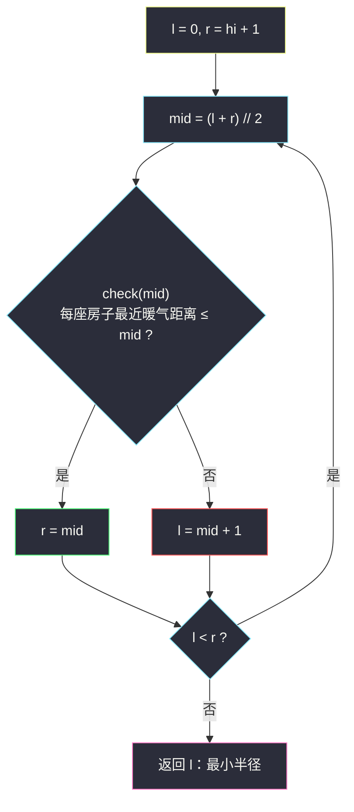
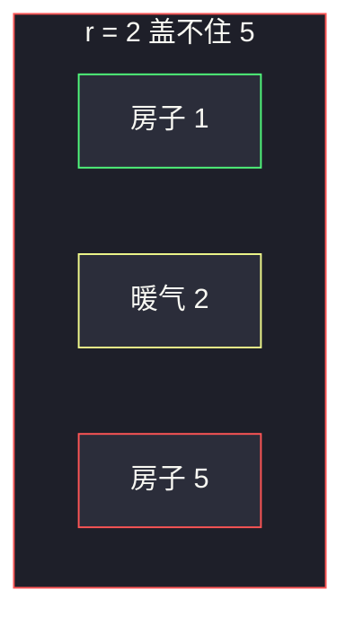

# 供暖器（二分答案求最小半径）

## 一、问题描述

冬季来了。房屋 `houses` 和供暖器 `heaters` 都在一条数轴上，坐标由两个整数数组给出。每个供暖器使用**相同**的加热半径 `r`：位于 `x` 的供暖器可以覆盖 `[x - r, x + r]` 内的所有房屋。

请找出能覆盖所有房屋的**最小**加热半径 `r`。若某房屋与某供暖器坐标相同，半径 0 即可覆盖。

> 🔗 LeetCode 475：https://leetcode.cn/problems/heaters/
>
> 数据范围：`1 <= houses.length, heaters.length <= 3·10^4`，`1 <= houses[i], heaters[i] <= 10^9`。

**示例 1**

```
输入：houses = [1,2,3], heaters = [2]
输出：1
解释：半径 1 时，供暖器 2 覆盖 [1, 3]，三座房屋都在里面。半径 0 盖不住 1 和 3。
```

**示例 2**

```
输入：houses = [1,2,3,4], heaters = [1,4]
输出：1
解释：1 管 1、2；4 管 3、4。半径 1 刚好。
```

**示例 3**

```
输入：houses = [1,5], heaters = [2]
输出：3
解释：房屋 5 到供暖器 2 的距离是 3，半径至少 3。
```

**直观理解**

半径越大越好盖，越小越可能漏房。问的是「刚好盖住全部房屋」的最小 r——§2.1 求最小。不去枚举谁给谁供暖，而是猜一个 r，检查是否每座房子都能被某个暖气够到。

---

## 二、暴力解法

`r` 从 0 往上加，直到所有房屋都被覆盖。每次检查：对每座房子扫全部暖气，看最小距离是否 `≤ r`：

```python
class Solution:
    def findRadius(self, houses: List[int], heaters: List[int]) -> int:
        r = 0
        while True:
            ok = True
            for h in houses:
                if min(abs(h - t) for t in heaters) > r:
                    ok = False
                    break
            if ok:
                return r
            r += 1
```

### 复杂度

- **时间**：`O(n · m · MAX)`。坐标到 `10^9`，不可接受。
- **空间**：`O(1)`。

### 🔴 瓶颈在哪里

「半径 r 够不够」随 r 增大从假变真，一刀切。`r` 的搜索范围是 `0 .. 10^9`，线性试会跑 `10^9` 轮。二分答案把轮数打到 `≈ 30`，每轮再快速判断覆盖。

---

## 三、优化探索（核心章节）

> 📚 本题在灵茶题单中属于 **二分算法 · §2.1 求最小**。二分的是半径 r；check 要讲清单调性。houses / heaters 都先排序，每个房子用二分找最近暖气（也可用双指针）。

### 3.1 check(r)：每座房子是否被盖住

房子 `h` 能被半径 `r` 覆盖 ⇔ 存在暖气 `t` 使 `|h - t| ≤ r` ⇔ `h` 到**最近**暖气的距离 `≤ r`。

最近暖气一定是：把 `heaters` 排序后，`h` 的插入位置左右邻居之一（再往外只更远）。对排序后的 `heaters` 做 `bisect_left(heaters, h)` 得到插入点 `i`，看 `heaters[i]`（若存在）和 `heaters[i-1]`（若存在），取最小距离。

### 3.2 check 关于 r 的单调性

`r` 增大，原先盖得住的仍然盖得住，盖不住的可能变为盖得住。所以 `check(r)` **左假右真**：半径太小漏房（红），半径够大全覆盖（蓝）。要的答案 = **最小的蓝色 r**。`r = 0` 可能已合法（每座房子上都有暖气）；`r = max(houses, heaters)` 的坐标差一定合法，上界取 `10^9` 或 `max(max(houses), max(heaters))` 都安全。


### 3.3 左闭右开求最小 r（一套走到底）

答案落在 `[0, hi]`。区间 `[l, r)` 表示「最小可行半径 ∈ `[l, r)`」：

```
l, r = 0, hi + 1
while l < r:
    mid = (l + r) // 2
    if check(mid): r = mid      # 蓝：还能再压半径
    else:          l = mid + 1  # 红：必须加大
return l
```

合法就收右端，不合法就丢左端。不要改成闭区间的 `r = mid - 1`。



### 3.4 check 里的双指针写法

两数组都升序后，指针 `j` 只前进：对每座房子，推到第一个 `heaters[j] >= h - r`，再看是否 `≤ h + r`。单次 check `O(n + m)`。主解仍用每房二分最近暖气，和「二分答案」同一家族更好记。

### 3.5 一句话核心

> **半径越大越能盖满（左假右真）→ 左闭右开求最小 r；check = 每座房子到最近暖气的距离 ≤ r。**

---

## 四、代码实现

### Python（主解：二分 r + 每房二分最近暖气）

```python
from bisect import bisect_left

class Solution:
    def findRadius(self, houses: List[int], heaters: List[int]) -> int:
        houses.sort()
        heaters.sort()
        m = len(heaters)

        def check(r: int) -> bool:
            for h in houses:
                i = bisect_left(heaters, h)     # 第一个 ≥ h 的暖气
                d = 10**18
                if i < m:
                    d = min(d, heaters[i] - h)
                if i > 0:
                    d = min(d, h - heaters[i - 1])
                if d > r:
                    return False
            return True

        hi = max(abs(max(houses) - min(heaters)),
                 abs(max(heaters) - min(houses)))
        l, r = 0, hi + 1                        # 最小可行 r ∈ [l, r)
        while l < r:
            mid = (l + r) // 2
            if check(mid):
                r = mid
            else:
                l = mid + 1
        return l
```

**变量含义**

| 变量 | 含义 |
|------|------|
| `r` / `mid` | 猜测的统一加热半径 |
| `i = bisect_left(heaters, h)` | `h` 右侧（含重合）最近暖气下标 |
| `i-1` | 左侧最近暖气 |
| `d` | `h` 到最近暖气的距离 |
| `l` / `r` | 左闭右开：`[0,l)` 已确认不够，`[r, hi+1)` 已确认够 |

上界 `hi` 取端点差即可；写成 `10^9` 只是多几轮二分。

### Java（最优解同款）

```java
class Solution {
    public int findRadius(int[] houses, int[] heaters) {
        Arrays.sort(houses);
        Arrays.sort(heaters);
        int hi = 0;
        for (int h : houses) {
            hi = Math.max(hi, Math.abs(h - heaters[0]));
            hi = Math.max(hi, Math.abs(h - heaters[heaters.length - 1]));
        }
        int l = 0, r = hi + 1;                   // [l, r)
        while (l < r) {
            int mid = l + (r - l) / 2;
            if (check(houses, heaters, mid)) r = mid;
            else l = mid + 1;
        }
        return l;
    }

    private boolean check(int[] houses, int[] heaters, int rad) {
        int m = heaters.length;
        for (int h : houses) {
            int i = lowerBound(heaters, h);
            long d = Long.MAX_VALUE;
            if (i < m) d = Math.min(d, (long) heaters[i] - h);
            if (i > 0) d = Math.min(d, (long) h - heaters[i - 1]);
            if (d > rad) return false;
        }
        return true;
    }

    private int lowerBound(int[] a, int x) {
        int l = 0, r = a.length;                 // [l, r) 第一个 ≥ x
        while (l < r) {
            int mid = l + (r - l) / 2;
            if (a[mid] >= x) r = mid;
            else l = mid + 1;
        }
        return l;
    }
}
```

---

## 五、具体例子演示

以示例 3：`houses = [1,5]`，`heaters = [2]`。`hi = max(|5-2|, |1-2|) = 3`，初始 `l = 0`，`r = 4`。

最近暖气：房子 1 → 距离 1；房子 5 → 距离 3。故 `check(r) ⇔ r ≥ 3`。

| 轮次 | l | r | mid | 房1距离≤mid | 房5距离≤mid | check | 动作 |
|------|---|---|-----|-------------|-------------|-------|------|
| 1 | 0 | 4 | 2 | 1≤2 ✓ | 3≤2 ✗ | 假 | `l = 3` |
| 2 | 3 | 4 | 3 | 1≤3 ✓ | 3≤3 ✓ | 真 | `r = 3` |

`l == r == 3`，返回 **3** ✓。示例 1 `houses = [1,2,3]`、`heaters = [2]` 最近距离 1、0、1，同样两轮锁到半径 1。



---

## 六、复杂度分析

| 方法 | 时间 | 空间 | 说明 |
|------|------|------|------|
| r 从 0 递增 + 暴力最近 | `O(nm · MAX)` | `O(1)` | MAX 达 `10^9` |
| 二分 r + 每房二分暖气（主解） | `O(n log n + n log RANGE)` | `O(1)` 额外 | 含排序；RANGE ≤ `10^9`，约 30 轮 |
| 二分 r + 双指针 check | `O((n + m) log RANGE)` | `O(1)` 额外 | 单次 check 线性，另加排序 |

---

## 七、对比总结

| 维度 | 暴力加 r | 二分答案 |
|------|----------|----------|
| 利用单调性 | 否 | 左假右真，求最小蓝 |
| 轮数 | 与坐标成正比 | `log RANGE` |
| check | 可相同 | 必须足够快 |

**易错点**

1. **忘了排序**：`bisect` / 双指针都要求 `heaters` 有序；houses 双指针时也要有序。题目没保证输入有序。
2. **只看右侧暖气**：插入点 `i == 0` 或 `i == m` 时只有一侧邻居，另一侧不能访问。
3. **check 写成「存在一座房子被覆盖」**：要的是**所有**房子。一个漏网就返回假。
4. **区间改成闭的却没改 `while`**：`r = mid - 1` 配 `while l < r` 会把唯一可行的 `mid` 扔掉。
5. **上界取 `max(houses)`**：暖气可能比所有房子都靠左/靠右，半径是坐标差，不是坐标本身。

**模板（§2.1 求最小，左闭右开）**

```python
l, r = 0, hi + 1
while l < r:
    mid = (l + r) // 2
    if check(mid): r = mid
    else:          l = mid + 1
return l
```

---

## 八、举一反三

| 题目 | 关系 |
|------|------|
| [875. 爱吃香蕉的珂珂](https://leetcode.cn/problems/koko-eating-bananas/) | §2.1 求最小的招牌题，模板动作完全相同 |
| [1011. 在 D 天内送达包裹的能力](https://leetcode.cn/problems/capacity-to-ship-packages-within-d-days/) | 最小化载重，check 换成贪心装船 |
| [410. 分割数组的最大值](https://leetcode.cn/problems/split-array-largest-sum/) | 最小化最大值：二分段和上限 |
| [1283. 使结果不超过阈值的最小除数](https://leetcode.cn/problems/find-the-smallest-divisor-given-a-threshold/) | 二分除数，check 是求和 |
| [1482. 制作 m 束花所需的最少天数](https://leetcode.cn/problems/minimum-number-of-days-to-make-m-bouquets/) | §2.1：二分天数，check 改成滑窗数花束 |
| [35. 搜索插入位置](https://leetcode.cn/problems/search-insert-position/) | check 内部用的 `bisect_left` 原型 |
| [275. H 指数 II](https://leetcode.cn/problems/h-index-ii/) | 同批 §2.2：单调反过来求最大，见 `h-index-ii.md` |

**思想迁移**

- 见到「最小化某个覆盖/速度/容量参数」，先写 `check(参数)`，确认左假右真，再套求最小模板。
- 数轴上「点到最近特殊点的距离」= 排序后看插入位置的左右邻居，不必对每个点扫全部特殊点。
- 口诀：**「半径左假右真，往左压到不能压；每座房子看左右最近那一盏暖气。」**
