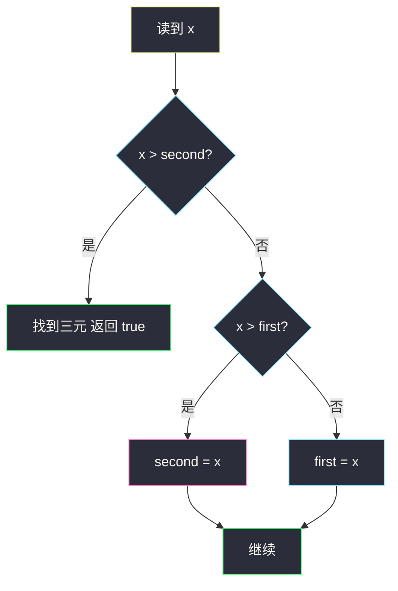
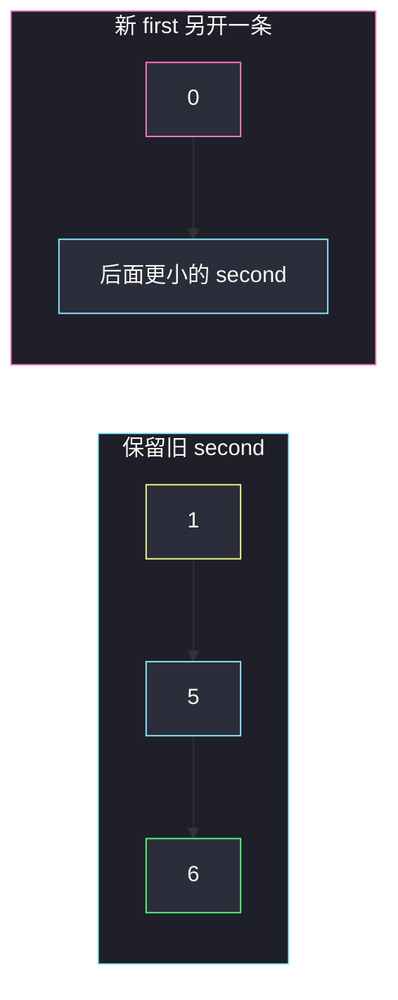

# 递增的三元子序列（LIS 长度为 3 的贪心）

## 一、问题描述

给你整数数组 `nums`，判断是否存在下标 `i < j < k`，使得 `nums[i] < nums[j] < nums[k]`。存在返回 `true`，否则 `false`。只要子序列，不必相邻。

> 🔗 LeetCode 334：https://leetcode.cn/problems/increasing-triplet-subsequence/
>
> 数据范围：`1 ≤ n ≤ 5·10^5`，`-2^31 ≤ nums[i] ≤ 2^31-1`。题目要求 **`O(n)` 时间、`O(1)` 额外空间**。
>
> 📚 灵茶题单：**§4.2 最长递增子序列（LIS）**。问的不是 LIS 全长，只问长度是否 ≥ 3。把「贪心 + 二分」那套 `tails` 缩到只维护长度为 1、2 的最小结尾，就是两个变量 `first` / `second`。

方法名 `increasingTriplet`。

**示例 1**

```
输入：nums = [1,2,3,4,5]
输出：true
解释：任意递增三连都成立，例如 1,2,3。
```

**示例 2**

```
输入：nums = [5,4,3,2,1]
输出：false
解释：严格递减，凑不出升序三元。
```

**示例 3**

```
输入：nums = [2,1,5,0,4,6]
输出：true
解释：0,4,6 是一组（1,5,6 也是）。
```

**直观理解**

从左往右走，手里始终捏着「目前最好的长度为 1 的结尾」和「最好的长度为 2 的结尾」。新来的数：比长度为 2 的结尾还大，就凑齐三个；否则尽量把这两个结尾改得更小，给后面更多机会。

---

## 二、暴力解法

### 枚举三下标

三重循环检查 `i<j<k` 且递增。`O(n³)`，直接放弃。

### O(n²) 的 LIS

`dp[i]` = 以 `i` 结尾的 LIS 长度，枚举前驱。若某个 `dp[i] ≥ 3` 则 true。

```python
class Solution:
    def increasingTriplet(self, nums: list[int]) -> bool:
        n = len(nums)
        dp = [1] * n
        for i in range(n):
            for j in range(i):
                if nums[j] < nums[i]:
                    dp[i] = max(dp[i], dp[j] + 1)
            if dp[i] >= 3:
                return True
        return False
```

官方三例都能过。`n=5·10^5` 时 `O(n²)` 超时，空间也是 `O(n)`，不满足 `O(1)`。

### 🔴 瓶颈在哪里

只要知道「有没有长度 3」，不必保留每个下标的 LIS。LIS 贪心数组 `tails[len]` = 长度为 `len` 的递增子序列的最小结尾值。本题 `len` 最多关心 1 和 2，两个变量即可。

---

## 三、优化探索（核心章节）

> 📚 本题在灵茶题单中属于 **§4.2 LIS**。`tails` 贪心：同样长度，结尾越小越容易往后接。这里 `tails` 只需两格。

### 3.1 两个候选

- `first`：当前见到的、长度为 1 的递增子序列的最小结尾（可以理解成「最小的小数」）。
- `second`：当前见到的、长度为 2 的递增子序列的最小结尾（「最小的次小数」，它的前面一定存在过一个比它小的数）。

初始都是 `+∞`。对每个 `x`：

1. `x > second`：已经有 `a < b < x`，返回 true；
2. 否则若 `x > first`：用 `x` 更新 `second`（把长度为 2 的结尾改小或首次得到长度为 2）；
3. 否则：`x ≤ first`，更新 `first = x`。

第三条**不要**把 `second` 清掉。`first` 变小只代表「以后更可能开一条新的长度为 2」；旧的 `(更早的小数, second)` 仍然合法。



### 3.2 为什么 first 更新后 second 仍有效

`second` 的含义不是「`first` 和 `second` 必须是一对」。它的含义是：**历史上存在某个数 `< second`，且那个数出现在 `second` 对应元素的左边**。

`[1,5,0,6]`：

- 扫完 `1,5` 后 `first=1, second=5`，已经有一对 `(1,5)`；
- 遇到 `0`：`first` 改成 0，`second` 仍是 5；
- 遇到 `6`：`6 > 5`，用的是旧对 `(1,5,6)`，不是 `(0,5)`（0 在 5 右边，本来就不能配 5）。

若更新 `first` 时把 `second` 重置，这组会漏掉，错成 false。

判断顺序必须先比 `second` 再比 `first`。若先更新 `first`，一个本该接在 `second` 后面的数可能被当成新的 `first`。

### 3.3 和 tails 数组的对应

| LIS tails | 本题 |
|-----------|------|
| `tails[0]` | `first` |
| `tails[1]` | `second` |
| `tails` 长度达到 3 | 返回 true |

严格小于才延长；相等时走「更新 first」分支，不会把相等的数当成第二、第三项。

### 3.4 一句话核心

> **维护最小的 first、最小的 second；碰到比 second 大的就成功。更新 first 绝不清空 second。**

---

## 四、代码实现

### Python（主解：first / second）

```python
class Solution:
    def increasingTriplet(self, nums: list[int]) -> bool:
        first = second = 2**31  # 大于任意 nums[i] 的哨兵也可 inf
        for x in nums:
            # 状态：first / second 分别是长 1、长 2 递增子序列的最小结尾
            if x > second:
                return True
            if x > first:
                second = x
            else:
                first = x
        return False
```

哨兵用 `float('inf')` 或 `2**31` 都可以（元素最大是 `2^31-1`）。不要用会与元素撞车的值。

**变量含义**

| 写法 | 含义 |
|------|------|
| `first` | 长度为 1 的最小结尾 |
| `second` | 长度为 2 的最小结尾 |
| 先比 `second` | 一旦能接第三项立刻返回 |

### Java（最优解）

```java
class Solution {
    public boolean increasingTriplet(int[] nums) {
        int first = Integer.MAX_VALUE, second = Integer.MAX_VALUE;
        for (int x : nums) {
            if (x > second) {
                return true;
            }
            if (x > first) {
                second = x;
            } else {
                first = x;
            }
        }
        return false;
    }
}
```

`Integer.MAX_VALUE` 本身可能是数组元素。若 `x == MAX_VALUE`：`x > second` 在 `second` 仍是 MAX 时为 false，然后 `x > first` 同样 false，走 `first = x`，不会误报 true。只有已经存在真正的 `second < MAX` 时，后面更大的数才会命中第一支。数组里全是 `MAX_VALUE` 仍正确返回 false。

---

## 五、具体例子演示

逐步跟踪 `first` / `second`（`∞` 表示还没形成该长度）。

### 5.1 官方示例 1

`[1,2,3,4,5]`

| x | first | second | 动作 |
|----|-------|--------|------|
| 1 | 1 | ∞ | 更新 first |
| 2 | 1 | 2 | 2>first，更新 second |
| 3 | 1 | 2 | 3>second，true |

对拍官方。后面 4、5 不用看。

### 5.2 官方示例 2

`[5,4,3,2,1]`

| x | first | second |
|----|-------|--------|
| 5 | 5 | ∞ |
| 4 | 4 | ∞ |
| 3 | 3 | ∞ |
| 2 | 2 | ∞ |
| 1 | 1 | ∞ |

始终没有第二项，false。对拍官方。

### 5.3 官方示例 3：更新 first 不拆 second

`[2,1,5,0,4,6]`

| x | first | second | 说明 |
|----|-------|--------|------|
| 2 | 2 | ∞ | |
| 1 | 1 | ∞ | 更小的开端 |
| 5 | 1 | 5 | 得到 (1,5) |
| 0 | 0 | 5 | first 变 0，**second 仍是 5** |
| 4 | 0 | 4 | 4>0，把长度为 2 的结尾改成 4，对应 (0,4) |
| 6 | 0 | 4 | 6>4，true，例如 0,4,6 |

对拍官方。即使 0 出现在 5 后面，旧的 `(1,5)` 也一直活在 `second=5` 里，直到被更小的 `second=4` 替换（替换仍然合法，因为 0<4 且 0 在 4 左边）。

### 5.4 必须保留 second 的反例

`[1,5,0,6]`：若错误地在 `first=0` 时清空 `second`，扫到 6 只会得到长度为 2，返回 false。实际上 `1,5,6` 是合法三元。主解在 `x=6` 时 `second` 仍为 5，返回 true。



---

## 六、复杂度分析

| 方法 | 时间 | 空间 | 说明 |
|------|------|------|------|
| 三重循环 | `O(n³)` | `O(1)` | 不可用 |
| LIS `O(n²)` | `O(n²)` | `O(n)` | 超时且空间超标 |
| first / second（主解） | `O(n)` | `O(1)` | 满足题面约束 |

---

## 七、对比总结

| 维度 | 300 求 LIS 长度 | 本题 |
|------|-----------------|------|
| 目标 | 最长是多少 | 是否 ≥ 3 |
| tails | 动态数组 + 二分 | 两个变量 |
| 相等 | 不延长 | 同样不延长，归入更新 first |

**易错点**

1. **更新 first 时重置 second**：漏掉「新小数在旧 second 右边」但仍可用旧三元的情况。
2. **先更新 first 再比 second**：判断顺序反了。
3. **允许相等**：题面是严格 `<`。`[1,1,1]` 必须 false。
4. **以为 first 和 second 必须来自同一条链的当前值**：`second` 只保证历史上存在过更小的前驱。
5. **额外开数组记左侧最小值、右侧最大值**：能做但空间 `O(n)`，不满足本题 `O(1)`。

---

## 八、举一反三

| 题目 | 关系 |
|------|------|
| [300. 最长递增子序列](https://leetcode.cn/problems/longest-increasing-subsequence/) | §4.2 原型；`solutions/base/longest-increasing-subsequence.md` |
| [674. 最长连续递增序列](https://leetcode.cn/problems/longest-continuous-increasing-subsequence/) | 子数组版，只要相邻 |
| [354. 俄罗斯套娃信封问题](https://leetcode.cn/problems/russian-doll-envelopes/) | 二维 LIS |
| [2407. 最长递增子序列 II](https://leetcode.cn/problems/longest-increasing-subsequence-ii/) | 有差约束的 LIS |
| [1218. 最长定差子序列](https://leetcode.cn/problems/longest-arithmetic-subsequence-of-given-difference/) | 同批 §7.4，前驱唯一，不是「任意更小」 |
| [2552. 统计上升四元组](https://leetcode.cn/problems/count-increasing-quadruplets/) | 更长的递增模式计数 |

**思想迁移**

- 只关心 LIS 是否达到 k 且 k 很小，就把 `tails` 截成 k-1 个变量。
- 口诀：**「first / second 最小结尾；大于 second 就成；改 first 别动 second。」**
