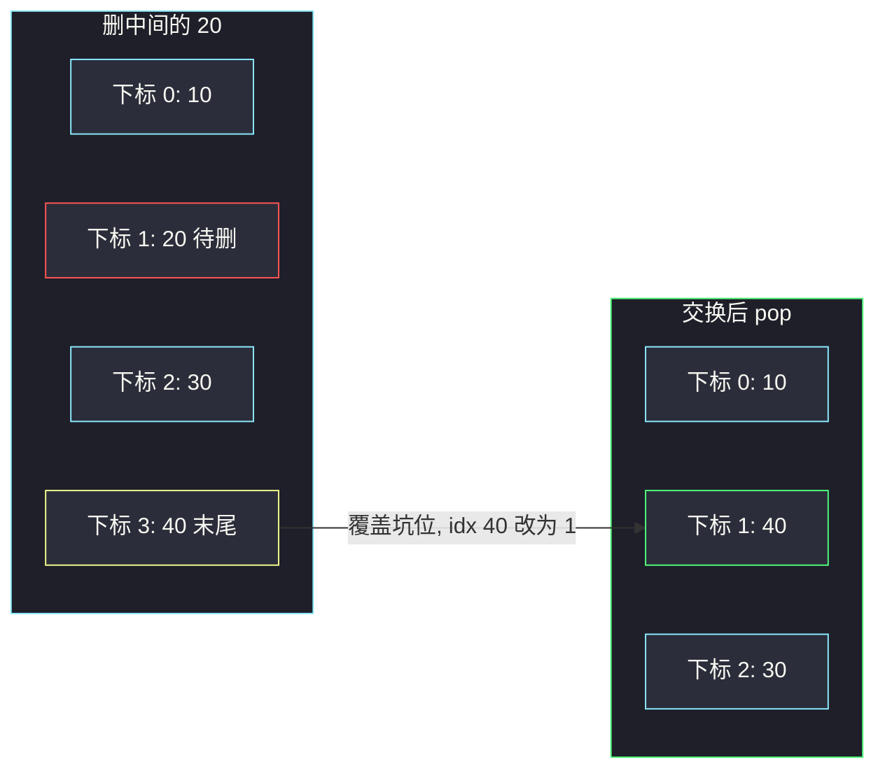

# O(1) 时间插入、删除和获取随机元素（数组 + 哈希下标）

## 一、问题描述

实现 `RandomizedSet`：集合中存放不重复的整数，支持三个操作，均摊都要 `O(1)`：

- `insert(val)`：插入。已存在返回 `false`，否则插入并返回 `true`。
- `remove(val)`：删除。不存在返回 `false`，否则删掉并返回 `true`。
- `getRandom()`：以**均等概率**返回当前集合里的某一个元素。

> 🔗 LeetCode 380：https://leetcode.cn/problems/insert-delete-getrandom-o1/
>
> 数据范围：`val` 在 `[-2^31, 2^31-1]`，操作次数最多 `2·10^5`；`getRandom` 调用时集合非空。
>
> 📚 灵茶题单：**§6.1 随机数**（无评分）。列表存值 + 哈希 `val → 下标`；删除时与末尾交换再 pop，并更新被换过来那个元素的下标。不要用 `set` 当主解。

**示例 1**

```
输入：
["RandomizedSet","insert","remove","insert","getRandom","remove","insert","getRandom"]
[[],[1],[2],[2],[],[1],[2],[]]
输出：[null,true,false,true,2,true,false,2]
解释：
insert(1) → 集合 {1}
remove(2) → 2 不在，false
insert(2) → {1,2}
getRandom() → 1 或 2 等概率，本例返回 2
remove(1) → {2}
insert(2) → 已在，false
getRandom() → 只有 2
```

**直观理解**

哈希表插入删除是 `O(1)`，但不能按下标均匀随机（Python 的 `set` 迭代顺序是插入序，不是随机，转成 list 又是 `O(n)`）。动态数组按下标 `O(1)` 随机，但按值删除要扫描。两边拼起来：数组负责随机，哈希表负责「值在数组的哪一格」，删除变成「跟最后一格对调再弹栈」。

---

## 二、暴力解法

只用一个 list：插入前 `in` 检查 `O(n)`，删除 `remove` 也是 `O(n)`，`random.choice` 才是 `O(1)`。

```python
import random

class RandomizedSet:
    def __init__(self):
        self.vals: list[int] = []

    def insert(self, val: int) -> bool:
        if val in self.vals:
            return False
        self.vals.append(val)
        return True

    def remove(self, val: int) -> bool:
        if val not in self.vals:
            return False
        self.vals.remove(val)
        return True

    def getRandom(self) -> int:
        return random.choice(self.vals)
```

`2·10^5` 次操作会超时。只用 `set` 则 `getRandom` 做不到 `O(1)` 等概率：`random.choice(tuple(s))` 每次线性拷贝。

### 🔴 瓶颈在哪里

缺一张「值 → 下标」的表。有了它，插入仍是 append；删除可以 `O(1)` 定位，再花 `O(1)` 与末尾交换。三个 API 才能同时均摊 `O(1)`。

---

## 三、优化探索（核心章节）

> 📚 本题在灵茶题单中属于 **§6.1 随机数**。等概率随机的前提是：**底层是一段连续下标 `0 .. n-1`，每个位置一个元素**。`random.choice` / `rand() % n` 才合法。

### 3.1 两个结构、三条不变量

- `vals`：动态数组，存当前元素，下标 `0 .. n-1` 无空洞。
- `idx`：哈希表，`idx[v] = v 在 vals 中的下标`。

任何一次 `insert` / `remove` 结束后必须同时成立：

1. **互逆**：对每个下标 `i`，`idx[vals[i]] == i`；对每个键 `v`，`vals[idx[v]] == v`。
2. **无重复**：`vals` 里每个值出现一次，`len(vals) == len(idx)`。
3. **无空洞**：随机只看 `len(vals)`，末尾必须是有效元素（删除用交换压实）。

`getRandom` 不修结构，只读不变量 3。

### 3.2 插入

若 `val in idx`，返回 false。否则：

- `idx[val] = len(vals)`（即将落到的下标）
- `vals.append(val)`

两步都是 `O(1)`。顺序可以先 append 再写 `idx[val] = len(vals)-1`。

### 3.3 删除：与末尾交换再 pop

数组中间删除会留下空洞，后面元素左移是 `O(n)`。集合不在乎顺序，把**待删位置和最后一个位置对调**，再 `pop` 末尾，数组重新变成紧凑的 `0 .. n-2`。

步骤（删 `val`，它在下标 `i`，末尾元素是 `last`）：

1. 找不到 `val` → false。
2. `i = idx[val]`，`last = vals[-1]`。
3. `vals[i] = last`（末尾盖到被删坑里）。
4. `idx[last] = i`（被换过来的值更新下标）。
5. `vals.pop()`，`del idx[val]`。

若删的本来就是末尾，第 3～4 步是自己赋给自己，仍然正确。必须**先写 `idx[last]=i`，再删 `idx[val]`**：当 `val` 就是 `last` 时，若先 `del idx[val]` 再写 `idx[last]`，会把刚删掉的键写回来。先更新再删则自己覆盖自己，随后 `del` 干净。



### 3.4 随机

`return random.choice(self.vals)`。等概率来自：每个现存元素占且只占一个下标。不要对 `idx.keys()` 随机——哈希键迭代不是均匀随机源，CPython 3.7+ 还是插入序。

### 3.5 一句话核心

> **数组提供下标随机，哈希提供 O(1) 定位；删除用末尾覆盖坑位，并改被挪过来那个值的下标。**

---

## 四、代码实现

### Python（主解：list + dict）

```python
import random

class RandomizedSet:
    def __init__(self):
        self.vals: list[int] = []
        self.idx: dict[int, int] = {}

    def insert(self, val: int) -> bool:
        if val in self.idx:
            return False
        self.idx[val] = len(self.vals)
        self.vals.append(val)
        return True

    def remove(self, val: int) -> bool:
        if val not in self.idx:
            return False
        i = self.idx[val]
        last = self.vals[-1]
        self.vals[i] = last
        self.idx[last] = i
        self.vals.pop()
        del self.idx[val]
        return True

    def getRandom(self) -> int:
        return random.choice(self.vals)
```

**变量含义**

| 写法 | 含义 |
|------|------|
| `vals` | 当前集合，按下标均匀随机 |
| `idx[v]` | `v` 在 `vals` 中的位置 |
| `i` | 待删元素下标 |
| `last` | 交换前的末尾元素 |

`getRandom` 题目保证集合非空，不必判空。

### Java（可选）

```java
class RandomizedSet {
    private final List<Integer> vals = new ArrayList<>();
    private final Map<Integer, Integer> idx = new HashMap<>();
    private final Random rng = new Random();

    public boolean insert(int val) {
        if (idx.containsKey(val)) {
            return false;
        }
        idx.put(val, vals.size());
        vals.add(val);
        return true;
    }

    public boolean remove(int val) {
        Integer iObj = idx.get(val);
        if (iObj == null) {
            return false;
        }
        int i = iObj;
        int last = vals.get(vals.size() - 1);
        vals.set(i, last);
        idx.put(last, i);
        vals.remove(vals.size() - 1);
        idx.remove(val);
        return true;
    }

    public int getRandom() {
        return vals.get(rng.nextInt(vals.size()));
    }
}
```

Java 必须 `remove(size-1)` 按下标删末尾；`remove(Integer)` 会按值删，可能 O(n)。

---

## 五、具体例子演示

按官方示例逐步跟踪 `vals` 与 `idx`。

| 操作 | vals | idx | 返回 |
|------|------|-----|------|
| 构造 | `[]` | `{}` | |
| insert(1) | `[1]` | `{1:0}` | true |
| remove(2) | 无 2 | 不变 | false |
| insert(2) | `[1, 2]` | `{1:0, 2:1}` | true |
| getRandom | 下标 0 或 1 各 1/2，本例抽到 2 | 不变 | 2 |
| remove(1) | 见下方交换 | | true |
| insert(2) | 2 已在 | 不变 | false |
| getRandom | 只有 `[2]` | `{2:0}` | 2 |

**remove(1) 的交换**（哈希表 + 数组交换删除，这是本题必须看清的一步）：

当时 `vals = [1, 2]`，`idx = {1:0, 2:1}`。要删的 1 在下标 `i=0`，末尾 `last=2`。

1. `vals[0] = 2` → `vals = [2, 2]`（末尾还没 pop）
2. `idx[2] = 0`
3. `vals.pop()` → `vals = [2]`
4. `del idx[1]` → `idx = {2:0}`

不变量恢复：`vals[0]=2` 且 `idx[2]=0`。对拍官方后续 `insert(2)` 为 false、`getRandom` 为 2。

**再演示删真正的中间元**：`vals = [10, 20, 30, 40]`，`idx` 为 `10→0, 20→1, 30→2, 40→3`，`remove(20)`。

| 步骤 | vals | idx 关键变化 |
|------|------|----------------|
| 定位 | `[10,20,30,40]` | `i=1`，`last=40` |
| 覆盖 | `[10,40,30,40]` | `idx[40]=1` |
| pop + 删键 | `[10,40,30]` | 去掉 20 |

30 的下标仍是 2，没动。40 从 3 改到 1。下一次 `getRandom` 在三个下标上等概率。

**删末尾**：`remove(30)` 此时 `i=2==n-1`，`last` 也是 30，自己覆盖自己，pop 后 `[10,40]`，`del idx[30]`。

**边界**：插入已存在 → false，结构不动；删除不存在 → false；单元素插入再删再插，下标始终从 0 长出来。

---

## 六、复杂度分析

| 方法 | insert | remove | getRandom | 说明 |
|------|--------|--------|-----------|------|
| 纯 list | `O(n)` | `O(n)` | `O(1)` | `in` / `list.remove` |
| 纯 set | 均摊 `O(1)` | 均摊 `O(1)` | `O(n)` | 无法 O(1) 均匀随机 |
| list + 哈希（主解） | 均摊 `O(1)` | 均摊 `O(1)` | `O(1)` | 哈希均摊，数组末尾增删 |

空间 `O(n)`，n 为当前元素个数。ArrayList / list 扩容均摊 `O(1)`。

---

## 七、对比总结

| 维度 | 本题（无重复） | 381 允许重复 | 纯哈希随机 |
|------|----------------|--------------|------------|
| 哈希值 | 一个下标 | 一袋下标 / 链表 | 没有数组 |
| 删除 | 与末尾换 | 还要在袋里改下标 | — |
| getRandom | `choice(vals)` | 同样扫数组 | 不正 |

**易错点**

1. **用 set 当主解**：`getRandom` 要么 O(n)，要么不是均匀随机。
2. **删除后忘了改 `idx[last]`**：被挪过来的值还指向旧的末尾下标，之后删它会写到已 pop 的位置。
3. **先 `del idx[val]` 再更新 `last`**：删末尾元素时 `val==last`，会把键写回表里。
4. **Java `ArrayList.remove(val)`**：按对象删是扫描；必须按下标删最后一格。
5. **`getRandom` 用 `random.choice(list(idx))`**：每次建 list 是 O(n)，且 3.7+ 的插入序不是随机。
6. **插入已存在仍 append**：数组出现重复，随机概率倾斜，且 `idx` 只记一个下标，删除会丢数据。

---

## 八、举一反三

| 题目 | 关系 |
|------|------|
| [381. O(1) 时间插入、删除和获取随机元素 - 允许重复](https://leetcode.cn/problems/insert-delete-getrandom-o1-duplicates-allowed/) | 哈希值改为下标集合，删除仍换尾 |
| [710. 黑名单中的随机数](https://leetcode.cn/problems/random-pick-with-blacklist/) | 把黑名单映射到区间尾部，等价「删除后紧凑」 |
| [398. 随机数索引](https://leetcode.cn/problems/random-pick-index/) | 蓄水池 / 下标列表，只读随机 |
| [382. 链表随机节点](https://leetcode.cn/problems/linked-list-random-node/) | 蓄水池抽样，不能按下标访问时的 §6.1 |
| [528. 按权重随机选择](https://leetcode.cn/problems/random-pick-with-weight/) | 前缀和 + 二分，概率不再均匀 |

**思想迁移**

- 要 O(1) 按值改、又要均匀按下标抽，就「数组 + 哈希下标」，删除永远换尾。
- 口诀：**「哈希找坑，末尾填坑，改被挪来的人的下标。」**
