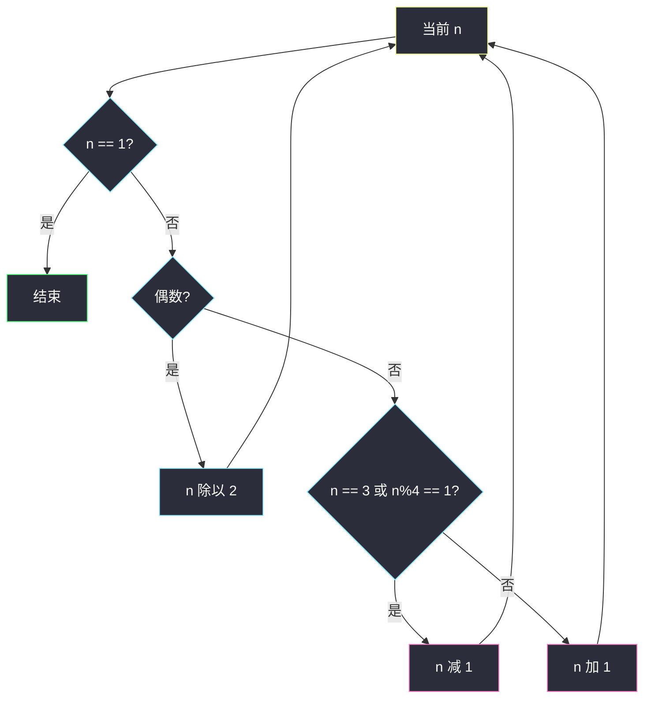
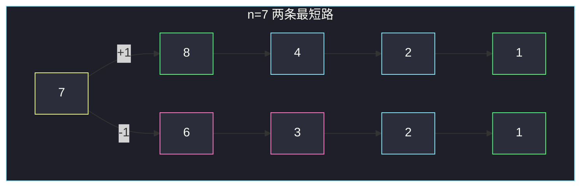

# 整数替换（贪心位运算 / 记忆化）

## 一、问题描述

给定正整数 `n`。若当前是偶数，必须变成 `n/2`；若是奇数，可以选择 `n+1` 或 `n-1`。每次算一步操作。问把 `n` 变成 `1` 的最少操作次数。

> 🔗 LeetCode 397：https://leetcode.cn/problems/integer-replacement/
>
> 数据范围：`1 ≤ n ≤ 2^31-1`。不能开 `O(n)` 数组。Python 整数不溢出；Java 里 `n = Integer.MAX_VALUE` 时 `n+1` 会爆 `int`，要用 `long`。
>
> 📚 灵茶题单：**其他**（记忆化搜索 / 贪心，不是某节标准线性 DP）。值域到 `2^31`，沿 `/2` 迅速变小，分支因子在奇数处才是 2，适合记搜；也能用位运算在 `O(log n)` 内直接贪心。

方法名 `integerReplacement`。

**示例 1**

```
输入：n = 8
输出：3
解释：8 → 4 → 2 → 1。
```

**示例 2**

```
输入：n = 7
输出：4
解释：7 → 8 → 4 → 2 → 1（7 → 6 → 3 → 2 → 1 也是 4 步）。
```

**直观理解**

偶数只能除以 2，没有选择。真正的分叉全在奇数。`+1` 还是 `-1`，目标是尽快制造更多的末尾 0（更可连续除 2）。看 `n` 的末两位即可决定。

---

## 二、暴力解法

奇数两岔递归，偶数只能 `/2`。无记忆时同一值会算多次。

```python
class Solution:
    def integerReplacement(self, n: int) -> int:
        def dfs(x: int) -> int:
            if x == 1:
                return 0
            if x % 2 == 0:
                return dfs(x // 2) + 1
            return min(dfs(x + 1), dfs(x - 1)) + 1

        return dfs(n)
```

`n=8、7` 能过。最坏沿奇数链指数爆炸，且 `n` 到 `2^31` 时无记忆会超时；有记忆后状态不多，能过，但递归深度和哈希常数不如贪心干净。

### 🔴 瓶颈在哪里

`n` 太大，不能 `dp[1..n]`。观察到：除了 `n=3` 这个特例，奇数时总有一边能让结果更「容易被 4 整除」，从而少走弯路。不必两岔都搜。

---

## 三、优化探索（核心章节）

> 📚 本题在灵茶题单中标为 **其他**。下面先给可证明直觉的贪心，再给记忆化作为对照。

### 3.1 贪心规则

`n` 为偶数：只能 `n //= 2`，步数 +1。

`n` 为奇数：看 `n % 4`（等价于末两位）：

- `n == 3`：走 `3 → 2 → 1`（2 步），不要 `3 → 4 → 2 → 1`（3 步）；
- `n % 4 == 1`（末两位 `01`）：选 `-1`；
- `n % 4 == 3`（末两位 `11`，且 `n≠3`）：选 `+1`。

`n=1` 已经结束，0 步。

### 3.2 为什么看末两位

奇数只有 `01` 或 `11` 两种末两位。

- `n = 4k+1`：`n-1 = 4k`，后面至少连续两次 `/2`。若走 `+1` 得到 `4k+2 = 2(2k+1)`，只吃一次 `/2` 又碰到奇数 `2k+1`，更亏。
- `n = 4k+3`（`k≥1`）：`n+1 = 4k+4 = 4(k+1)`，同样连续两次 `/2`。若走 `-1` 得到 `4k+2`，只吃一次 `/2` 落到 `2k+1`。

`n=3` 是 `4·0+3`：按上面会 `+1` 到 4，但 `3-1=2` 已经贴近终点，特例单独减。



位运算写法：奇数且 `(n & 2) != 0` 表示末两位是 `11`，应 `+1`（再排除 3）。

### 3.3 记忆化

`dfs(x)` = 从 `x` 到 1 的最少步。偶数一枝，奇数两岔取 min。Python `@cache` 即可。它用来对拍贪心，也覆盖「不想记特例」的写法。

BFS 从 `n` 扩到 1 同样正确，每步边权 1，第一次碰到 1 就是最短。状态沿 `/2` 收缩，空间可接受。

### 3.4 一句话核心

> **偶数必除 2；奇数看末两位：01 减一，11 加一；唯独 3 要减。**

---

## 四、代码实现

### Python（主解：贪心）

```python
class Solution:
    def integerReplacement(self, n: int) -> int:
        ans = 0
        while n != 1:
            if n % 2 == 0:
                n //= 2
            elif n == 3 or n % 4 == 1:
                n -= 1
            else:
                n += 1
            ans += 1
        return ans
```

等价位运算：`n % 4 == 1` 即奇数且 `(n & 2) == 0`；`n % 4 == 3` 即 `(n & 2) != 0`。

### Python（记忆化，用来对拍）

```python
from functools import cache

class Solution:
    def integerReplacement(self, n: int) -> int:
        @cache
        def dfs(x: int) -> int:
            if x == 1:
                return 0
            if x % 2 == 0:
                return dfs(x // 2) + 1
            return min(dfs(x + 1), dfs(x - 1)) + 1

        return dfs(n)
```

**变量含义**

| 写法 | 含义 |
|------|------|
| `n % 4 == 1` | 末两位 `01`，减一能连除 |
| `n % 4 == 3` | 末两位 `11`，加一能连除（3 除外） |
| `ans` | 已经走的步数 |

### Java（最优解：long 防溢出）

```java
class Solution {
    public int integerReplacement(int n) {
        long x = n;
        int ans = 0;
        while (x != 1) {
            if (x % 2 == 0) {
                x /= 2;
            } else if (x == 3 || x % 4 == 1) {
                x--;
            } else {
                x++;
            }
            ans++;
        }
        return ans;
    }
}
```

`n = 2147483647`（`2^31-1`，末位全 1）时会走到 `+1 = 2^31`，`int` 溢出变成负数。必须 `long`。

---

## 五、具体例子演示

### 5.1 官方示例 1：纯偶数

`n = 8 = 1000₂`，一路 `/2`：

| 步 | n | 动作 |
|----|---|------|
| 0 | 8 | 偶 |
| 1 | 4 | 偶 |
| 2 | 2 | 偶 |
| 3 | 1 | 停 |

3 步，对拍官方。

### 5.2 官方示例 2：7 的两种走法一样长

`7 = 111₂`，`7 % 4 == 3` 且 `≠3`，贪心 `+1`：

| 步 | n | 动作 |
|----|---|------|
| 0 | 7 | 奇数，%4==3，+1 |
| 1 | 8 | /2 |
| 2 | 4 | /2 |
| 3 | 2 | /2 |
| 4 | 1 | 停 |

4 步。另一条 `7-1=6 → 3 → 2 → 1` 也是 4。对拍官方。



### 5.3 特例 3：必须减一

| 策略 | 路径 | 步数 |
|------|------|------|
| 贪心特例 -1 | 3 → 2 → 1 | 2 |
| 误用 %4==3 去 +1 | 3 → 4 → 2 → 1 | 3 |

若没有 `n==3` 分支，贪心会多 1 步。`n=11`：`11%4==3`，`+1` 得 `12→6→3→2→1` 共 5 步，与搜出来的最优一致。

### 5.4 n=15：11 末位走 +1

`15=1111₂`，`%4==3`，`15→16→8→4→2→1` 共 5 步。若 `-1`：`14→7→…` 至少 6 步。贪心对。

---

## 六、复杂度分析

| 方法 | 时间 | 空间 | 说明 |
|------|------|------|------|
| 无记忆递归 | 指数 | `O(log n)` 栈 | 超时 |
| 记忆化 / BFS | `O(log n)` 量级状态 | 同阶哈希 | 能过 |
| 贪心（主解） | `O(log n)` | `O(1)` | 每步至少去掉一个二进制位 |

`n` 最大约 `2^31`，贪心循环次数几十步。

---

## 七、对比总结

| 维度 | 1342 变成 0 | 本题 |
|------|-------------|------|
| 偶数 | /2 | 同 |
| 奇数 | 只能 -1（题面规定） | **可选 +1 或 -1** |
| 溢出 | 一般无 | Java `MAX+1` |

**易错点**

1. **奇数一律减 1**：`15` 会变差。
2. **忘了 `n==3`**：会多一步。
3. **Java 用 `int` 做 `n+1`**：`2147483647+1` 溢出。
4. **`n=1` 返回 1**：已经是 1，应返回 0。
5. **开 `dp[n]`**：`n` 到二十亿，内存直接炸。

---

## 八、举一反三

| 题目 | 关系 |
|------|------|
| [1342. 将数字变成 0 的操作次数](https://leetcode.cn/problems/number-of-steps-to-reduce-a-number-to-zero/) | 奇数只能减 1，无选择 |
| [1404. 将二进制表示减到 1 的最少次数](https://leetcode.cn/problems/number-of-steps-to-reduce-a-number-in-binary-representation-to-one/) | 大整数二进制上的 +1 / /2 |
| [2571. 将整数减少到零需要的最少操作数](https://leetcode.cn/problems/minimum-operations-to-reduce-an-integer-to-0/) | 加减 2 的幂 |
| [2139. 得到目标值的最少行动次数](https://leetcode.cn/problems/minimum-moves-to-reach-target-score/) | 反向：减一或折半，有次数配额 |
| [1387. 将整数按权重排序](https://leetcode.cn/problems/sort-integers-by-the-power-value/) | 同目录 `sort-integers-by-the-power-value.md`，3n+1 步数 |
| [397 的 BFS 亲戚：2059. 转化数字的最小运算数](https://leetcode.cn/problems/minimum-operations-to-convert-number/) | 同目录 `minimum-operations-to-convert-number.md`，整数上 BFS |

**思想迁移**

- 不能按值域开表时，优先找 `O(log n)` 贪心或按运算收缩的记忆化。
- 口诀：**「偶必折半；奇看末两位，01 减、11 加；三要减。」**
