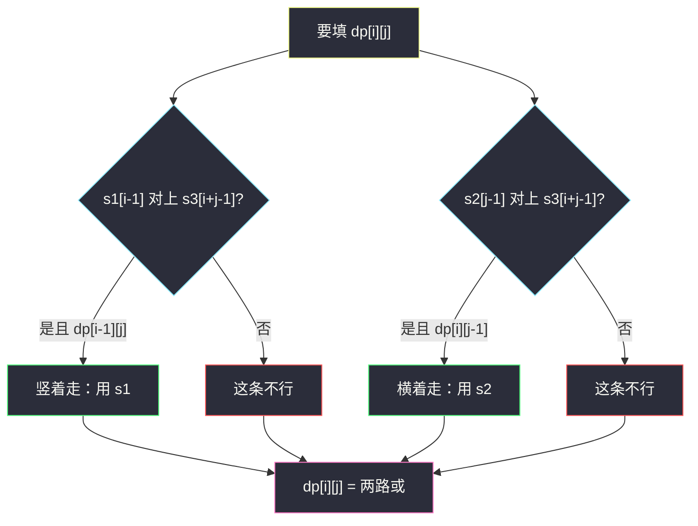
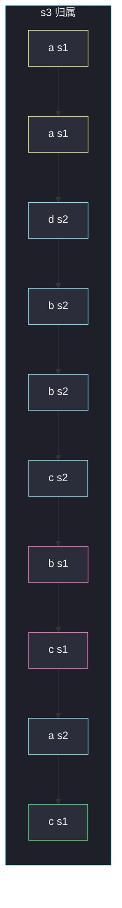

# 交错字符串（LCS 型二维布尔 DP）

## 一、问题描述

给定三个字符串 `s1`、`s2`、`s3`。判断 `s3` 是否由 `s1` 和 `s2` **交错**组成：把两个串按字符拆开、再按相对顺序合并成 `s3`。每个串内部的相对顺序必须保持，相当于用两根指针分别扫 `s1`、`s2`，每步选一根指针吐一个字符，拼出来恰好是 `s3`。

> 🔗 LeetCode 97：https://leetcode.cn/problems/interleaving-string/
>
> 数据范围：`0 ≤ len(s1), len(s2) ≤ 100`，`len(s3) ≤ 200`。字符均为小写。
>
> 📚 灵茶题单：**§4.1 最长公共子序列（LCS）**。和 1143 同一张「双串前缀」二维表：状态是「`s1` 用了前 i 个、`s2` 用了前 j 个」。本题不是求长度，而是问能否**用尽**两串，拼出 `s3` 的对应前缀。

方法名 `isInterleave`。

**示例 1**

```
输入：s1 = "aabcc", s2 = "dbbca", s3 = "aadbbcbcac"
输出：true
解释：一种拆法：s1 贡献 a,a,b,c,c，s2 贡献 d,b,b,c,a，交错后得到 s3。
```

**示例 2**

```
输入：s1 = "aabcc", s2 = "dbbca", s3 = "aadbbbaccc"
输出：false
解释：长度对得上，但中段那个晚到的 a 对不上任何串当前该吐的字符。
```

**示例 3**

```
输入：s1 = "", s2 = "", s3 = ""
输出：true
解释：两空串交错仍是空串。
```

**直观理解**

把 `s1` 画成纵轴、`s2` 画成横轴。从 `(0,0)` 走到 `(m,n)`：向下走一步表示用 `s1` 的下一个字符，向右走一步表示用 `s2` 的下一个字符。每一步踩到的字符必须等于 `s3` 里对应位置的字符。能走到右下角，就能交错。

先判 `len(s1)+len(s2)==len(s3)`，长度不对直接 false。

---

## 二、暴力解法

两个指针 `i`、`j` 分别指向 `s1`、`s2` 下一个要匹配的位置。当前 `s3[i+j]` 若等于 `s1[i]` 就进左枝，等于 `s2[j]` 就进右枝，都相等就两边都试。

```python
class Solution:
    def isInterleave(self, s1: str, s2: str, s3: str) -> bool:
        m, n = len(s1), len(s2)
        if m + n != len(s3):
            return False

        def dfs(i: int, j: int) -> bool:
            if i + j == len(s3):
                return True
            ok = False
            if i < m and s1[i] == s3[i + j]:
                ok = dfs(i + 1, j)
            if not ok and j < n and s2[j] == s3[i + j]:
                ok = dfs(i, j + 1)
            return ok

        return dfs(0, 0)
```

官方三例都能过。最坏每次两岔，`O(2^{m+n})`，`m=n=100` 不可用。同一对 `(i,j)` 会被重复搜到。

### 🔴 瓶颈在哪里

决策只依赖「各用了多长前缀」，状态一共 `(m+1)*(n+1)` 个。改成填表或记忆化就是多项式。这和 LCS 把 `f(i,j)` 做成二维表是同一套方法论。

---

## 三、优化探索（核心章节）

> 📚 本题在灵茶题单中属于 **§4.1 LCS**。灵神双串模板：用**长度**定义状态，避免下标 `-1`。`dp[i][j]` 看 `s1` 前 i、`s2` 前 j，对应 `s3` 前 `i+j`。

### 3.1 状态

`dp[i][j]` = `s1` 的前 `i` 个字符与 `s2` 的前 `j` 个字符，能否交错组成 `s3` 的前 `i+j` 个字符。

目标：`dp[m][n]`。

### 3.2 转移

`s3` 的最后一个字符 `s3[i+j-1]` 只能来自 `s1[i-1]` 或 `s2[j-1]`：

- 来自 `s1`：需要 `i>0`、`s1[i-1]==s3[i+j-1]`，且 `dp[i-1][j]` 为真；
- 来自 `s2`：需要 `j>0`、`s2[j-1]==s3[i+j-1]`，且 `dp[i][j-1]` 为真。

两者有一个成立即可。

边界：

- `dp[0][0] = True`（两空对空）；
- 只用 `s1`：`dp[i][0] = dp[i-1][0] and s1[i-1]==s3[i-1]`；
- 只用 `s2`：`dp[0][j] = dp[0][j-1] and s2[j-1]==s3[j-1]`。

填表顺序：`i` 从小到大，`j` 从小到大，因为依赖左边和上边。



### 3.3 和 LCS 的差别

1143 在字符不等时取 `max(跳过 s1, 跳过 s2)`，允许丢掉字符。本题**一个都不能丢**：`s1`、`s2` 的每个字符都必须出现在 `s3` 里，且 `s3` 也没有多余字符。所以是布尔「能否」，不是求最长。长度和必须先相等。

不能简化成「`s1` 是 `s3` 的子序列且 `s2` 是剩下的子序列」各做一次：`s3` 里哪些位置留给 `s1` 是耦合的，必须在同一张表里同时推进两个指针。

### 3.4 滚动到一维

`dp[i][j]` 只依赖上一行的 `dp[i-1][j]` 和本行左边的 `dp[i][j-1]`。用一维数组 `dp[j]` 表示当前行：

- 内层 `j` 从小到大：`dp[j]` 在被覆盖前仍是上一行，正好当 `dp[i-1][j]`；`dp[j-1]` 已经是本行，正好当 `dp[i][j-1]`。
- 每一行开始先更新 `dp[0]`（只用 `s1` 的那一列）。

### 3.5 一句话核心

> **`dp[i][j]`：两串前缀能否拼出 s3 前 i+j；当前字符来自 s1 或 s2，两路或。**

---

## 四、代码实现

### Python（主解：二维 DP）

```python
class Solution:
    def isInterleave(self, s1: str, s2: str, s3: str) -> bool:
        m, n = len(s1), len(s2)
        if m + n != len(s3):
            return False
        # dp[i][j] = s1 前 i 与 s2 前 j 能否组成 s3 前 i+j
        dp = [[False] * (n + 1) for _ in range(m + 1)]
        dp[0][0] = True
        for i in range(1, m + 1):
            dp[i][0] = dp[i - 1][0] and s1[i - 1] == s3[i - 1]
        for j in range(1, n + 1):
            dp[0][j] = dp[0][j - 1] and s2[j - 1] == s3[j - 1]
        for i in range(1, m + 1):
            for j in range(1, n + 1):
                from1 = dp[i - 1][j] and s1[i - 1] == s3[i + j - 1]
                from2 = dp[i][j - 1] and s2[j - 1] == s3[i + j - 1]
                dp[i][j] = from1 or from2
        return dp[m][n]
```

### Python（滚动一维）

```python
class Solution:
    def isInterleave(self, s1: str, s2: str, s3: str) -> bool:
        m, n = len(s1), len(s2)
        if m + n != len(s3):
            return False
        dp = [False] * (n + 1)
        dp[0] = True
        for j in range(1, n + 1):
            dp[j] = dp[j - 1] and s2[j - 1] == s3[j - 1]
        for i in range(1, m + 1):
            dp[0] = dp[0] and s1[i - 1] == s3[i - 1]
            for j in range(1, n + 1):
                dp[j] = (dp[j] and s1[i - 1] == s3[i + j - 1]) or (
                    dp[j - 1] and s2[j - 1] == s3[i + j - 1]
                )
        return dp[n]
```

**变量含义**

| 写法 | 含义 |
|------|------|
| `dp[i][j]` | 两前缀能否拼出 `s3[:i+j]` |
| `from1` | 当前字符配给 `s1` |
| `from2` | 当前字符配给 `s2` |

### Java（最优解：一维）

```java
class Solution {
    public boolean isInterleave(String s1, String s2, String s3) {
        int m = s1.length(), n = s2.length();
        if (m + n != s3.length()) {
            return false;
        }
        boolean[] dp = new boolean[n + 1];
        dp[0] = true;
        for (int j = 1; j <= n; j++) {
            dp[j] = dp[j - 1] && s2.charAt(j - 1) == s3.charAt(j - 1);
        }
        for (int i = 1; i <= m; i++) {
            dp[0] = dp[0] && s1.charAt(i - 1) == s3.charAt(i - 1);
            for (int j = 1; j <= n; j++) {
                dp[j] = (dp[j] && s1.charAt(i - 1) == s3.charAt(i + j - 1))
                     || (dp[j - 1] && s2.charAt(j - 1) == s3.charAt(i + j - 1));
            }
        }
        return dp[n];
    }
}
```

---

## 五、具体例子演示

### 5.1 官方示例 1：逐格填表

`s1 = aabcc`，`s2 = dbbca`，`s3 = aadbbcbcac`。`.` 表示 false，`T` 表示 true。行是 `s1` 用了几个，列是 `s2` 用了几个。

| i\j | 0 | 1 d | 2 b | 3 b | 4 c | 5 a |
|-----|---|-----|-----|-----|-----|-----|
| 0 | T | . | . | . | . | . |
| 1 a | T | . | . | . | . | . |
| 2 a | T | T | T | T | T | . |
| 3 b | . | T | T | . | T | . |
| 4 c | . | . | T | T | T | T |
| 5 c | . | . | . | T | . | T |

`dp[5][5] = T`，对拍官方。

一条走到右下角的路径（竖=用 s1，横=用 s2）：

`(0,0)↓(1,0)↓(2,0)→(2,1)→(2,2)→(2,3)→(2,4)↓(3,4)↓(4,4)→(4,5)↓(5,5)`

对应 s3 的归属：`s1,s1,s2,s2,s2,s2,s1,s1,s2,s1`。



### 5.2 官方示例 2：中途全灭

`s3 = aadbbbaccc`。同样填表：

| i\j | 0 | 1 d | 2 b | 3 b | 4 c | 5 a |
|-----|---|-----|-----|-----|-----|-----|
| 0 | T | . | . | . | . | . |
| 1 a | T | . | . | . | . | . |
| 2 a | T | T | T | T | . | . |
| 3 b | . | T | T | T | . | . |
| 4 c | . | . | . | . | . | . |
| 5 c | . | . | . | . | . | . |

前缀 `aadbbb` 还能走；接下来是 `a`。此时 `s1` 的两个 a 已经用完，`s2` 的 a 前面还压着一个 c 没用。谁都吐不出 a，第 4 行起全是 false。`dp[5][5] = false`，对拍官方。

长度相等不是充分条件。

### 5.3 三空

`dp` 只有一格 `dp[0][0] = True`。对拍官方。

---

## 六、复杂度分析

| 方法 | 时间 | 空间 | 说明 |
|------|------|------|------|
| 暴力 DFS | 指数 | `O(m+n)` 栈 | 超时 |
| 二维 DP（主解） | `O(mn)` | `O(mn)` | `m,n≤100` 足够 |
| 滚动一维 | `O(mn)` | `O(n)` | 只留一行 |

---

## 七、对比总结

| 维度 | 1143 LCS | 本题 |
|------|----------|------|
| 状态 | 两前缀的最长公共长 | 两前缀能否拼出 s3 前缀 |
| 字符不等 | 允许跳过 | 当前格直接失败（除非另一条来源能配） |
| 必须用尽 | 否 | 是，且长度和等于 `len(s3)` |

**易错点**

1. **忘了先比长度**：长度不等必 false，也避免后面 `s3[i+j-1]` 越界。
2. **当成子串**：交错可以你一个我一个，不必连续块。
3. **只检查 s1、s2 各自是 s3 的子序列**：两个子序列会抢同一位置。
4. **一维滚动把 `j` 从大到小**：覆盖顺序反了，会读到错误的旧值。
5. **空串**：`s1=""` 时，`s3` 必须等于 `s2`（边界列 / 边界行处理）。

---

## 八、举一反三

| 题目 | 关系 |
|------|------|
| [1143. 最长公共子序列](https://leetcode.cn/problems/longest-common-subsequence/) | §4.1 原型；站点 `solutions/base/longest-common-subsequence.md` |
| [72. 编辑距离](https://leetcode.cn/problems/edit-distance/) | 同一张双串前缀表，转移多了改/插/删 |
| [115. 不同的子序列](https://leetcode.cn/problems/distinct-subsequences/) | 双串 DP，问方案数 |
| [10. 正则表达式匹配](https://leetcode.cn/problems/regular-expression-matching/) | 二维布尔，当前格匹配与否 |
| [392. 判断子序列](https://leetcode.cn/problems/is-subsequence/) | 单指针特殊情况：另一串为空或只当「取/不取」 |
| [2486. 追加字符以获得子序列](https://leetcode.cn/problems/append-characters-to-string-to-make-subsequence/) | 同目录 `append-characters-to-string-to-make-subsequence.md` |

**思想迁移**

- 双串问题先写 `dp[i][j]` = 两前缀的某性质；当前字符从谁来，就从上或左转移。
- 口诀：**「先比长度；dp[i][j] 两路或：当前字符给 s1 或给 s2。」**
