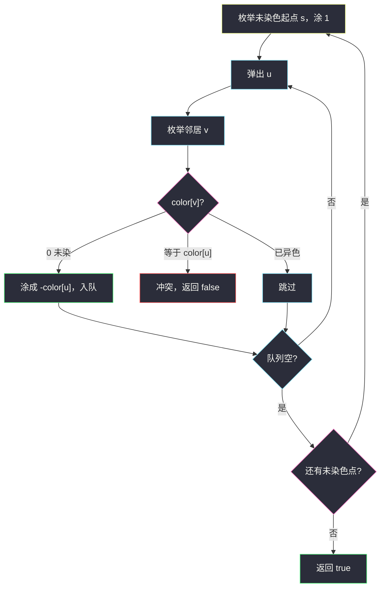
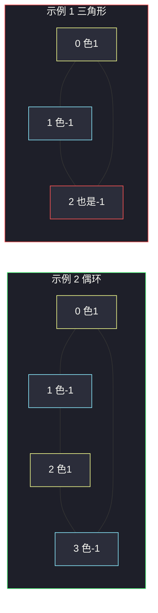

# 判断二分图（染色 · 相邻必须异色）

## 一、问题描述

无向图以邻接表 `graph` 给出：`graph[i]` 是节点 `i` 的邻居列表。判断这张图是不是**二分图**——能否把节点分成两集合，使得每条边的两端分属不同集合。等价说法：给每个点涂两种颜色之一，相邻点必须异色。

> 🔗 LeetCode 785：https://leetcode.cn/problems/is-graph-bipartite/
>
> 数据范围：`1 <= n <= 100`，`graph.length == n`，无自环、无重边，无向。
>
> 📚 灵茶题单：**七、二分图染色**（1625 分）。

**示例 1**

```
输入：graph = [[1,2,3],[0,2],[0,1,3],[0,2]]
输出：false
图形：0 连 1、2、3；1 连 0、2；2 连 0、1、3。
0-1-2 构成三角形（奇环），无法 2-染色。
```

**示例 2**

```
输入：graph = [[1,3],[0,2],[1,3],[0,2]]
输出：true
图形：
0 -- 1
|    |
3 -- 2
四边形（偶环），可把 {0,2} 涂色 1，{1,3} 涂色 -1。
```

**直观理解**

二分图 = 没有奇环。不必专门找环：从任意未染色点出发，邻居涂成相反色；若某邻居已经同色，说明这条边把两种颜色「拧」在一起，图不是二分图。图可能不连通，每个连通块都要染一遍。

本题输入**已经是邻接表**，不用再从边列表建图；其它题给 `edges` 时才先双向加边。

---

## 二、暴力解法

每个点两种颜色，枚举 `2^n` 种涂法，再扫所有边检查是否异色：

```python
class Solution:
    def isBipartite(self, graph: list[list[int]]) -> bool:
        n = len(graph)
        for mask in range(1 << n):
            ok = True
            for u in range(n):
                cu = (mask >> u) & 1
                for v in graph[u]:
                    if v > u:
                        continue
                    cv = (mask >> v) & 1
                    if cu == cv:
                        ok = False
                        break
                if not ok:
                    break
            if ok:
                return True
        return False
```

### 复杂度

- **时间**：`O(2^n · (n + m))`。`n = 100` 完全不可用。
- **空间**：`O(1)` 额外（不含输入）。

### 🔴 瓶颈在哪里

颜色一旦确定一个点，它的邻居就被**强迫**成另一种颜色，根本没有 `2^n` 的自由。沿着边推过去即可，冲突立刻失败。这就是染色 BFS/DFS。

---

## 三、优化探索（核心章节）

> 📚 本题在灵茶题单中属于 **七、二分图染色**。无向图（已给邻接表）上，相邻点必须异色；冲突则不是二分图。图可不连通，要枚举每个未染色起点。

### 3.1 颜色与冲突

用 `0` 表示未染色，`1` / `-1` 表示两种颜色（取负就是换色，写起来短）。从起点 `s` 涂 `1`，邻居涂 `-color[u]`。

遇到邻居 `v`：

- `color[v] == 0`：涂成异色并入队（或递归）。
- `color[v] == color[u]`：同色相邻，返回 `false`。
- `color[v] == -color[u]`：已经异色，合法，跳过。

### 3.2 必须扫遍每个连通块

只从 `0` 出发会漏掉「另一块」里的奇环。外层 `for i in range(n)`，仅当 `color[i] == 0` 时开一次新的 BFS/DFS。



### 3.3 为什么正确

染色过程给每个连通块一张「棋盘」。若存在奇环，环走一圈后会对某个点提出两种颜色，必在某条边上撞上「已同色」。若无奇环，每种推法都不会冲突。BFS 与 DFS 只是遍历顺序不同，判定力一样。

### 3.4 一句话核心

> **邻接表上 2-染色：未染色邻居涂成相反色；同色相邻则 false；每个连通块都要找一个未染色起点。**

---

## 四、代码实现

### Python（主解：BFS 染色）

```python
from collections import deque

class Solution:
    def isBipartite(self, graph: list[list[int]]) -> bool:
        n = len(graph)
        color = [0] * n
        for s in range(n):
            if color[s] != 0:
                continue
            color[s] = 1
            q = deque([s])
            while q:
                u = q.popleft()
                for v in graph[u]:
                    if color[v] == 0:
                        color[v] = -color[u]
                        q.append(v)
                    elif color[v] == color[u]:
                        return False
        return True
```

**变量含义**

| 变量 | 含义 |
|------|------|
| `color[i]` | `0` 未染，`1` / `-1` 两种色 |
| `s` | 当前连通块的染色起点 |
| `q` | BFS 队列，里面的点都已染色 |

入队时已经涂色，避免同一点重复进队。无向边会走回头，回头看到的是父亲，颜色已经异色，第三种分支直接跳过。

DFS 把队列换成递归即可；`n ≤ 100` 两种都行。主解用 BFS，和「一层层把约束推出去」的直觉一致。

### Java（可选）

```java
class Solution {
    public boolean isBipartite(int[][] graph) {
        int n = graph.length;
        int[] color = new int[n];
        ArrayDeque<Integer> q = new ArrayDeque<>();
        for (int s = 0; s < n; s++) {
            if (color[s] != 0) continue;
            color[s] = 1;
            q.add(s);
            while (!q.isEmpty()) {
                int u = q.poll();
                for (int v : graph[u]) {
                    if (color[v] == 0) {
                        color[v] = -color[u];
                        q.add(v);
                    } else if (color[v] == color[u]) {
                        return false;
                    }
                }
            }
        }
        return true;
    }
}
```

---

## 五、具体例子演示

### 示例 2（成功染色）

```
0 -- 1
|    |
3 -- 2
```

`color` 初始全 `0`。从 `0` 开始涂 `1`。

| 步 | 弹出 | color[u] | 邻居判定 | 队列 | color |
|----|------|----------|----------|------|-------|
| 开始 | — | — | 起点 0 涂 1 | `[0]` | `[1,0,0,0]` |
| 1 | 0 | 1 | 1、3 未染 → 涂 -1 入队 | `[1,3]` | `[1,-1,0,-1]` |
| 2 | 1 | -1 | 0 已异色，跳过；2 未染 → 涂 1 入队 | `[3,2]` | `[1,-1,1,-1]` |
| 3 | 3 | -1 | 0 已异色；2 已是 1，与 -1 异色，合法 | `[2]` | 不变 |
| 4 | 2 | 1 | 1、3 均为 -1，异色 | `[]` | 不变 |

所有点已染，返回 `true`。`{0,2}` 一色，`{1,3}` 另一色。

### 示例 1（奇环冲突）

`graph[0]=[1,2,3]`。从 0 涂 1，把 1、2、3 全涂成 -1。接着弹出 1：邻居 2 的颜色已经是 -1，与 1 同色 → 边 `1-2` 冲突，返回 `false`。



边 `1-2` 两端同色，这就是奇环被染色抓住的瞬间。

---

## 六、复杂度分析

| 方法 | 时间 | 空间 | 说明 |
|------|------|------|------|
| 枚举 `2^n` 涂法 | `O(2^n · (n+m))` | `O(1)` | `n=100` 超时 |
| BFS/DFS 染色（主解） | `O(n+m)` | `O(n)` 颜色数组 + 队列 | 每点每边常数次 |

`m` 是边数，无向图邻接表里每条边出现两次，仍是 `O(n+m)`。

---

## 七、对比总结

| 维度 | 枚举涂色 | BFS 染色 |
|------|----------|----------|
| 自由度 | 每个点独立选色 | 一块里只有起点那 1 bit 自由 |
| 冲突发现 | 全部涂完再检查 | 推到冲突边立刻失败 |
| 不连通 | 自然覆盖 | 必须外层枚举未染色点 |

**易错点**

1. **只从 0 出发**：其它连通块里的奇环漏检。
2. **用 `visited` 代替颜色**：只能防回头，发现不了「绕一圈同色」。
3. **颜色用 0/1 却把 0 当未染色**：和「未染色」撞车。用 `1/-1`，或 `0` 未染、`1/2` 两色。
4. **有向图写法**：本题是无向图且输入已双向；若只加单向边会漏邻居。
5. 孤立点合法，保持默认色或随便涂一种即可。

---

## 八、举一反三

| 题目 | 关系 |
|------|------|
| [886. 可能的二分法](https://leetcode.cn/problems/possible-bipartition/) | 互不喜欢的人连边，再判二分图 |
| [207. 课程表](https://leetcode.cn/problems/course-schedule/) | 有向图判环（三色 DFS / 入度）；同属「图上推约束」 |
| [1042. 不邻接植花](https://leetcode.cn/problems/flower-planting-with-no-adjacent/) | 度数 ≤ 3 的 4-染色，相邻不同色 |
| [785. 判断二分图](https://leetcode.cn/problems/is-graph-bipartite/) | 本题 |
| [2493. 将节点分成尽可能多的组](https://leetcode.cn/problems/divide-nodes-into-the-maximum-number-of-groups/) | 先判二分图，再在每个连通块里 BFS 求最长层数 |

**思想迁移**

- 二分图判定 = 2-染色 = 无奇环。
- 口诀：**「未染色就涂反色；同色相邻就失败；每个连通块都要新开一个起点。」**
