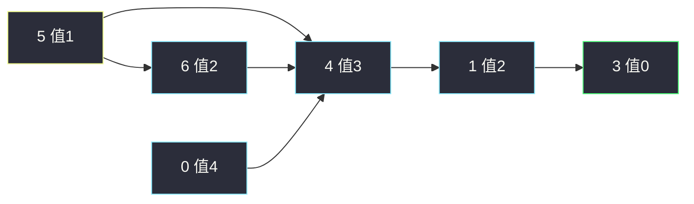
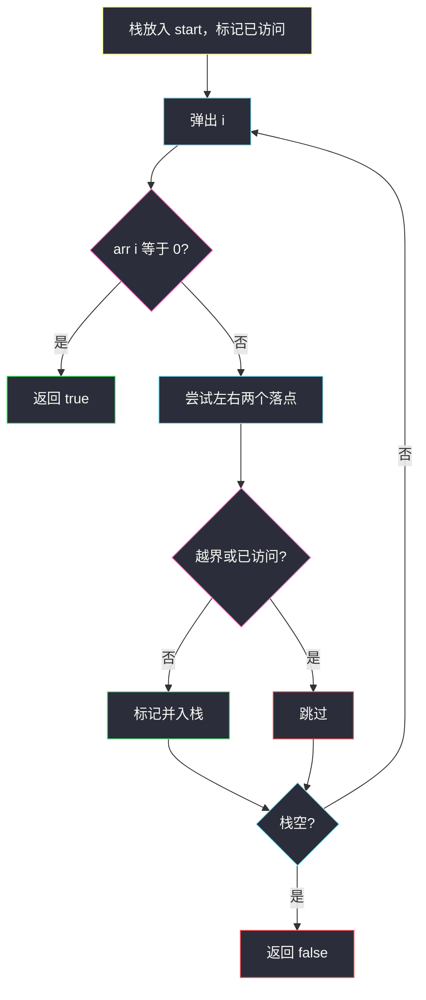

# 跳跃游戏 III（数组当图 · DFS）

## 一、问题描述

下标数组 `arr`，从下标 `start` 出发。在下标 `i` 可以跳到 `i + arr[i]` 或 `i - arr[i]`（不越界）。问能否到达**某个值为 0 的下标**。

> 🔗 LeetCode 1306：https://leetcode.cn/problems/jump-game-iii/
>
> 数据范围：`1 ≤ arr.length ≤ 5·10^4`，`0 ≤ arr[i] < n`，`0 ≤ start < n`。
>
> 📚 灵茶题单：**图论 · §1.1 深度优先搜索（DFS）**（1397 分）。

**示例 1**

```
输入：arr = [4,2,3,0,3,1,2], start = 5
输出：true
一条路：5 → 4 → 1 → 3（值为 0）。
另一条：5 → 6 → 4 → 1 → 3。
```

**示例 2**

```
输入：arr = [4,2,3,0,3,1,2], start = 0
输出：true
0 → 4 → 1 → 3。
```

**示例 3**

```
输入：arr = [3,0,2,1,2], start = 2
输出：false
从 2 只能在 {0,2,3,4} 里打转，到不了下标 1 的 0。
```

**直观理解**

每个下标是图上的一个点，出边最多两条：`i±arr[i]`。问从 `start` 能否走到某个「值为 0」的点。这是图上的可达性，不是跳跃游戏 I 那种贪心覆盖。

---

## 二、暴力解法

每次跳都重新选左右，不做访问标记。数组里可以构成环，例如示例 3 的 `2 ⇄ 4`。无 `visited` 的递归会转圈到爆栈 / 超时。

```python
class Solution:
    def canReach(self, arr: list[int], start: int) -> bool:
        n = len(arr)

        def dfs(i: int) -> bool:
            if i < 0 or i >= n:
                return False
            if arr[i] == 0:
                return True
            return dfs(i + arr[i]) or dfs(i - arr[i])

        return dfs(start)
```

示例 3 在 `2` 与 `4` 之间无限递归。即使加深度上限，复杂度仍可能指数（同一点反复进）。

### 🔴 瓶颈在哪里

图的节点只有 `n` 个。每个点的出边固定，**每个下标最多处理一次**就够：能走到 0 则在第一次走到时发现；走不到则整块连通分量扫完即可。必须 `visited` 防环。`n` 达 `5·10^4`，递归 DFS 在链状图上还会打穿 Python 默认栈，遍历用显式栈或 BFS 更稳。

---

## 三、优化探索（核心章节）

> 📚 本题在灵茶题单中属于 **图论 · §1.1 DFS**。下标当节点、`i±arr[i]` 当边，从 `start` DFS/BFS，`visited` 防环；碰到 `arr[i]==0` 返回 true。

### 3.1 建图其实不用邻接表

不必真的 `g[i] = [i+arr[i], i-arr[i]]`。遍历到 `i` 时现场算两个邻居、越界丢弃即可。这就是「数组当图」。

示例 1 的边（合法跳）：



`start = 5` 能顺着走到绿点 3。`start = 0` 从另一头也能并入同一块。

### 3.2 访问标记

入栈/入队时就把 `seen[j] = True`，避免同一点进两次。值为 0 的点也可以先入再判，或弹出时判，效果相同。已经访问过的点再走不会提供新的 0（0 若可达，第一次到就会返回）。



DFS 与 BFS 在「能否到达」上等价。边权无意义（不是最短跳数）。主解用显式栈 DFS，避开 Python 递归深度。

### 3.3 一句话核心

> **下标当点，i±arr[i] 当边；visited 防环，碰到 0 就 true，栈空则 false。**

---

## 四、代码实现

### Python（主解：显式栈 DFS）

```python
class Solution:
    def canReach(self, arr: list[int], start: int) -> bool:
        n = len(arr)
        seen = [False] * n
        st = [start]
        seen[start] = True
        while st:
            i = st.pop()
            if arr[i] == 0:
                return True
            for j in (i + arr[i], i - arr[i]):
                if 0 <= j < n and not seen[j]:
                    seen[j] = True
                    st.append(j)
        return False
```

**变量含义**

| 变量 | 含义 |
|------|------|
| `st` | DFS 栈，待处理下标 |
| `seen` | 已入栈（已访问），防环、防重复 |
| `j` | 左右两个候选落点 |

把 `st.pop()` 换成 `popleft()` 就是 BFS，对拍同一布尔结果。递归版把 `st` 换成函数调用即可，但 `n = 5·10^4` 的链（如全 1、从 0 出发）会 `RecursionError`，所以默写用栈。

原地修改 `arr[i] = -1` 当访问标记也能过，省掉 `seen`，但会破坏输入，面试里数组不可改时用布尔数组更稳。

`start` 处已经是 0 时，循环第一轮弹出即返回 true，不必特判。邻居算出自己（`arr[i]=0` 时 `i±0=i`）也会被 `seen` 挡住，不会原地死循环。

递归 DFS 与栈版等价，仅作对照（大数据链上可能爆栈）：

```python
def canReach(self, arr, start):
    n = len(arr)
    seen = [False] * n

    def dfs(i: int) -> bool:
        if i < 0 or i >= n or seen[i]:
            return False
        if arr[i] == 0:
            return True
        seen[i] = True
        return dfs(i + arr[i]) or dfs(i - arr[i])

    return dfs(start)
```

### Java（可选）

```java
class Solution {
    public boolean canReach(int[] arr, int start) {
        int n = arr.length;
        boolean[] seen = new boolean[n];
        ArrayDeque<Integer> st = new ArrayDeque<>();
        st.push(start);
        seen[start] = true;
        while (!st.isEmpty()) {
            int i = st.pop();
            if (arr[i] == 0) {
                return true;
            }
            for (int j : new int[] {i + arr[i], i - arr[i]}) {
                if (j >= 0 && j < n && !seen[j]) {
                    seen[j] = true;
                    st.push(j);
                }
            }
        }
        return false;
    }
}
```

---

## 五、具体例子演示

示例 1：`arr = [4,2,3,0,3,1,2]`，`start = 5`。栈 DFS（后入先出，先压 `i+arr[i]` 再压 `i-arr[i]`，因此先弹左边）。

| 步 | 弹出 | 值 | 邻居 | 新入栈 | 栈（顶在右） | seen 新标记 |
|----|------|----|------|--------|--------------|-------------|
| 初 | — | — | — | 5 | `[5]` | `{5}` |
| 1 | 5 | 1 | 6, 4 | 6, 4 | `[6, 4]` | `{5,6,4}` |
| 2 | 4 | 3 | 7 越界，1 | 1 | `[6, 1]` | `{5,6,4,1}` |
| 3 | 1 | 2 | 3, -1 | 3 | `[6, 3]` | 加上 3 |
| 4 | 3 | **0** | — | — | 返回 **true** | |

没有轮到弹出 6，但 0 已经找到。另一条 `5-6-4-1-3` 同样可达，不必搜完。

同一输入改成 **BFS 队列**（左出右入），到达 0 的顺序可能不同，布尔结果相同：

| 步 | 弹出 | 邻居入队 | 队列（左为队头） |
|----|------|----------|------------------|
| 1 | 5 | 6, 4 | `[6, 4]` |
| 2 | 6 | 4 已访问 | `[4]` |
| 3 | 4 | 1 | `[1]` |
| 4 | 1 | 3 | `[3]` |
| 5 | 3 | 值为 0，true | — |

示例 2 `start = 0`：`0` 只能到 `4`（`0-4` 越界丢掉左边），之后与上表从 4 开始的后缀相同，仍落到 3。

示例 3：`arr = [3,0,2,1,2]`，`start = 2`。值为 0 的是下标 **1**。

| 步 | 弹出 | 邻居 | 入栈 | 栈 | seen |
|----|------|------|------|-----|------|
| 1 | 2 | 4, 0 | 4, 0 | `[4, 0]` | `{2,4,0}` |
| 2 | 0 | 3, -3 | 3 | `[4, 3]` | `{2,4,0,3}` |
| 3 | 3 | 4 已访问，2 已访问 | — | `[4]` | 不变 |
| 4 | 4 | 6 越界，2 已访问 | — | `[]` | 不变 |

栈空，下标 1 从未出现，**false**。环 `2 ⇄ 4`、`0-3-4` 被 `seen` 剪掉。

---

## 六、复杂度分析

| 方法 | 时间 | 空间 | 说明 |
|------|------|------|------|
| 无 vis 递归 | 可能不终止 | 爆栈 | 有环必挂 |
| 显式栈 DFS（主解） | `O(n)` | `O(n)` | 每点至多一次，每点两条边 |
| 队列 BFS | `O(n)` | `O(n)` | 与 DFS 同复杂度，只是顺序不同 |

---

## 七、对比总结

| 维度 | 跳跃游戏 I（55） | 本题 |
|------|------------------|------|
| 边 | `i` 可到 `i+1 .. i+arr[i]` 一段 | 只有 `i±arr[i]` 两点 |
| 算法 | 贪心最远覆盖 | 图可达 DFS/BFS |
| 环 | 只能往右，无环 | 能往左，必须 vis |

**易错点**

1. **忘 vis**：环上死循环。
2. **越界没判**：`i - arr[i] < 0` 或 `i + arr[i] ≥ n`。
3. **把 0 理解成「不能跳」**：`arr[i]==0` 正是成功条件；该点出边是 `i` 自己，不 vis 会原地转。
4. **Python 递归**：链长 `5·10^4` 爆栈，用显式栈。
6. **`start` 合法却返回 false**：先检查 `arr[start]==0` 的短路径；主解弹出即判，不会漏。
7. **左右只写了一个**：必须 `i+arr[i]` 与 `i-arr[i]` 都试，示例 1 从 5 出发缺一边就到不了 3。

---

## 八、举一反三

| 题目 | 关系 |
|------|------|
| [55. 跳跃游戏](https://leetcode.cn/problems/jump-game/) | 只能向右一段区间，贪心最远覆盖 |
| [45. 跳跃游戏 II](https://leetcode.cn/problems/jump-game-ii/) | 同 55 的图，求最少跳数，反向贪心或 BFS 层数 |
| [1345. 跳跃游戏 IV](https://leetcode.cn/problems/jump-game-iv/) | 额外「同值传送」边，BFS 最短路，用完同值边要清掉 |
| [1654. 到家的最少跳跃次数](https://leetcode.cn/problems/minimum-jumps-to-reach-home/) | 前跳 a、后跳 b，带「禁止点 + 连续后跳限制」的 BFS |
| [1871. 跳跃游戏 VII](https://leetcode.cn/problems/jump-game-vii/) | 下标区间跳，滑动窗口 / 队列优化 |

**思想迁移**

- 数组下标 + 固定跳步 = 隐式图；先画点边，再套遍历模板。
- 口诀：**「i 连 i±arr[i]；seen 防环；弹出是 0 就成，栈空就败。」**
