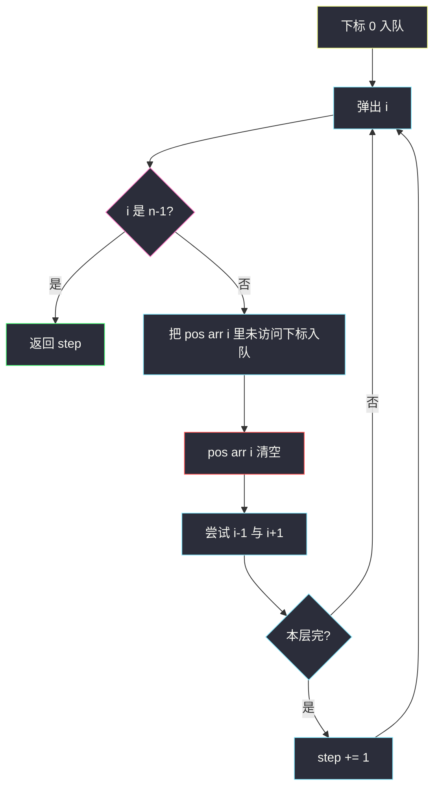
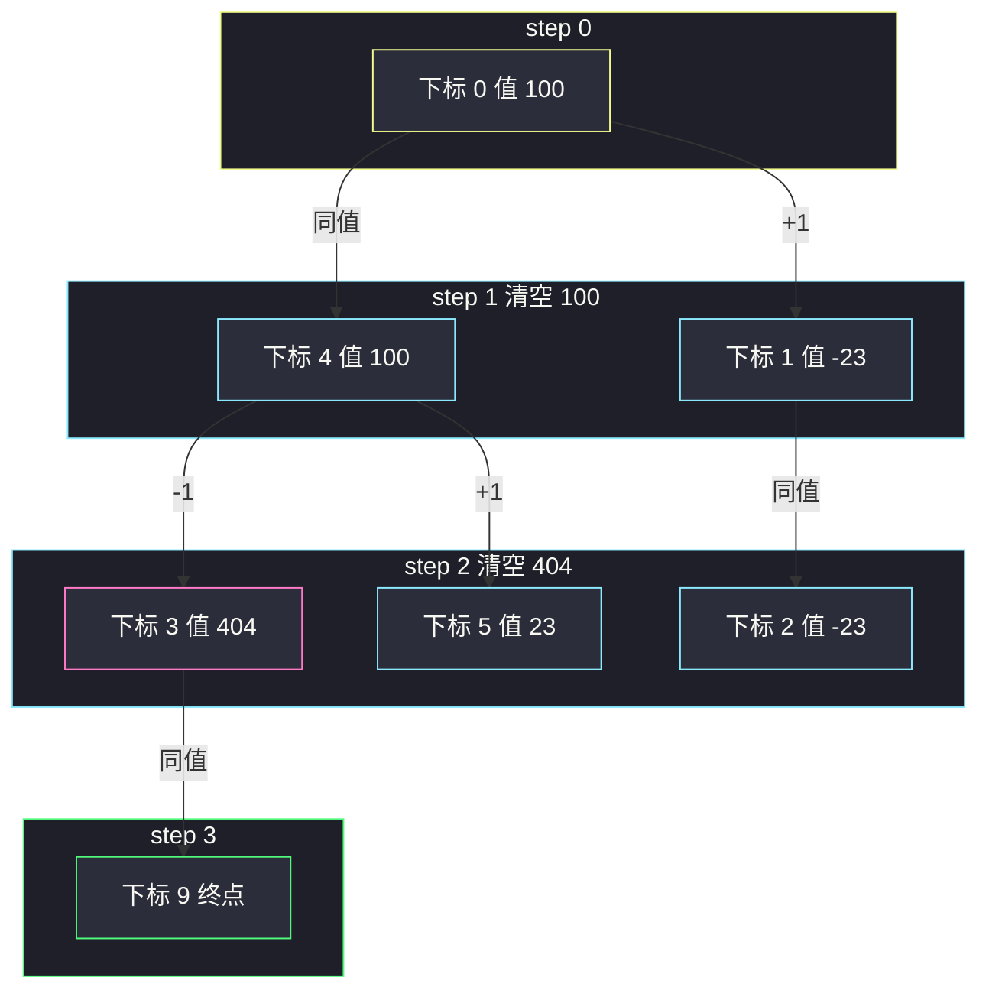

# 跳跃游戏 IV（同值下标当虚拟完全图 · BFS + 清空剪枝）

## 一、问题描述

下标数组 `arr`。从下标 `i` 出发，一次跳跃可以到：

- `i - 1`（不越界）
- `i + 1`（不越界）
- **任意** 满足 `arr[j] == arr[i]` 且 `j != i` 的下标 `j`

求从下标 `0` 跳到下标 `n-1` 的 **最少次数**。保证一定能到达（沿相邻下标总能走到尽头，最坏 `n-1` 步）。

> 🔗 LeetCode 1345：https://leetcode.cn/problems/jump-game-iv/
>
> 数据范围：`1 ≤ n ≤ 5·10^4`，`arr[i]` 在 `[-10^8, 10^8]`。
>
> 📚 灵茶题单：**图论 · §1.3 图论建模 + BFS 最短路**（1810 分）。下标当点；邻接边 + 同值边；同值关系是一张 **虚拟完全图**。

**示例 1**

```
输入：arr = [100,-23,-23,404,100,23,23,23,3,404]
输出：3
一条最短路：0 → 4 → 3 → 9
下标 0 与 4 都是 100，4 的邻居 3 是 404，3 与 9 都是 404。
```

**示例 2**

```
输入：arr = [7]
输出：0
已经在终点（唯一一个下标）。
```

**示例 3**

```
输入：arr = [7,6,9,6,9,6,9,7]
输出：1
下标 0 和 7 都是 7，直接同值跳到终点。
```

**直观理解**

每个下标是图上一个点。边有两类：

1. 位置边：`i — i+1`（数组是一条链）。
2. 同值边：所有值为 `x` 的下标两两相连。

边权全是 1，最少跳跃 = BFS。同值点如果真去建完全图，值为 7 的下标有 `k` 个就会有 `k²` 条边——`k = n/2` 时直接 `O(n²)` TLE。建模时要承认这张完全图存在，实现时 **不能把边真建出来**。

---

## 二、暴力解法

哈希表 `value → 下标列表`。BFS 弹出 `i` 时，把 `i±1` 以及列表里 **每一个** 同值下标都当邻居尝试入队。列表一直留着，每个同值点被弹出时都会再扫一遍整张表。

```python
from collections import defaultdict, deque

class Solution:
    def minJumps(self, arr: list[int]) -> int:
        n = len(arr)
        pos = defaultdict(list)
        for i, v in enumerate(arr):
            pos[v].append(i)
        q = deque([0])
        seen = [False] * n
        seen[0] = True
        step = 0
        while q:
            for _ in range(len(q)):
                i = q.popleft()
                if i == n - 1:
                    return step
                for j in pos[arr[i]]:          # 列表从不删除
                    if not seen[j]:
                        seen[j] = True
                        q.append(j)
                for j in (i - 1, i + 1):
                    if 0 <= j < n and not seen[j]:
                        seen[j] = True
                        q.append(j)
            step += 1
        return -1
```

`arr = [7,7,...,7]`（5e4 个 7）时，每个点弹出都扫 5e4 个同值下标，总时间 `O(n²)`，必 TLE。逻辑上 BFS 仍正确，只是边被重复枚举。

### 复杂度

- **时间**：最坏 `O(n²)`。
- **空间**：`O(n)`。

### 🔴 瓶颈在哪里

同值完全图的边数是平方级，但 **最短路只需要用一次「从已到达的某个 x 跳到所有还没到的 x」**。第一次处理值 `x` 时把所有 `x` 的下标入队，这张完全图就用完了，列表应当立刻清空。

---

## 三、优化探索（核心章节）

> 📚 本题在灵茶题单中属于 **§1.3 图论建模 + BFS**。点 = 下标；转移 = 左右一格或同值传送；某个值的下标一旦全部入队，哈希表里该值的列表立刻清空，否则最坏平方超时。

### 3.1 隐式图

不建邻接表。预处理 `pos[v] = 值为 v 的所有下标`。弹出 `i` 后邻居只有三类：`pos[arr[i]]`、`i-1`、`i+1`。

`n == 1` 时起点即终点，返回 0（队列弹出 0 立刻命中，或特判）。

### 3.2 关键剪枝：清空该值列表

弹出下标 `i`、值 `x = arr[i]` 时：

1. 若 `i == n-1`，返回当前步数。
2. 遍历 `pos[x]`，未访问的全部标记、入队（从 `i` 跳过去，下一步才处理它们）。
3. **`pos[x] = []`**（或 `del pos[x]`）。
4. 再尝试 `i±1`。

为什么必须在「第一次处理某个 `x`」时清空？

- 从任意一个已到达的 `x` 出发，一步之内可以到 **所有** 其它 `x`。BFS 同一层或下一层会把它们收进队列。
- 之后再弹出另一个 `x` 的下标，同值传送已经提供过了，只需走位置边 `±1`。
- 若不清空：每个 `x` 下标都会把另外 `k-1` 个再扫一遍，合计 `k²`。

入队时标记 `seen`，保证每个下标只扩展一次。清空列表 **不会** 丢掉 `±1` 边：那两条边不依赖哈希表。



### 3.3 正确性

- 边权 1，BFS 第一次弹出 `n-1` 即最少步。
- 同值完全图上，从连通的「已访问 x」到「未访问 x」只需 1 步。第一次弹出某个 `x` 时把其余 `x` 入队，等价于把这些完全图边都用了一次；更晚再走这些边不会更短。
- 位置边每次弹出都检查：同值传送清掉之后，仍能沿着数组走到旁边的新值。
- 清空发生在入队之后：本轮同值邻居不会丢。

顺序：先同值后 `±1`，或反过来，都不影响最短步数（只可能改变同一层内的入队顺序）。建议先同值再清空再 `±1`，避免还没传送就清空。

### 3.4 和公交路线剪枝的对照

[公交路线](./bus-routes.md) 处理完一个站就把 `stop_to_buses[s]` 清空；本题处理完一个值就把 `pos[x]` 清空。都是「一类边只展开一次」，把隐式完全图/星形换乘从平方降到线性。

### 3.5 一句话核心

> **下标当点，±1 与同值传送当边；BFS 求到 n-1 的最短路；某个值一旦把所有下标入队，立刻清空该值列表，否则平方 TLE。**

---

## 四、代码实现

### Python（主解）

```python
from collections import defaultdict, deque

class Solution:
    def minJumps(self, arr: list[int]) -> int:
        n = len(arr)
        pos = defaultdict(list)
        for i, v in enumerate(arr):
            pos[v].append(i)

        q = deque([0])
        seen = [False] * n
        seen[0] = True
        step = 0
        while q:
            for _ in range(len(q)):
                i = q.popleft()
                if i == n - 1:
                    return step
                for j in pos[arr[i]]:
                    if not seen[j]:
                        seen[j] = True
                        q.append(j)
                pos[arr[i]] = []
                for j in (i - 1, i + 1):
                    if 0 <= j < n and not seen[j]:
                        seen[j] = True
                        q.append(j)
            step += 1
        return -1
```

**变量含义**

| 变量 | 含义 |
|------|------|
| `pos[v]` | 值等于 `v` 的下标；用过即空 |
| `seen` | 下标是否已入队 |
| `step` | 已跳次数 = BFS 层号 |

入队即 `seen = True`。`pos[arr[i]]` 可能仍包含 `i` 自己，`seen[i]` 已真，循环会跳过。

### Java

```java
class Solution {
    public int minJumps(int[] arr) {
        int n = arr.length;
        Map<Integer, List<Integer>> pos = new HashMap<>();
        for (int i = 0; i < n; i++) {
            pos.computeIfAbsent(arr[i], k -> new ArrayList<>()).add(i);
        }
        ArrayDeque<Integer> q = new ArrayDeque<>();
        boolean[] seen = new boolean[n];
        q.add(0);
        seen[0] = true;
        int step = 0;
        while (!q.isEmpty()) {
            int sz = q.size();
            for (int t = 0; t < sz; t++) {
                int i = q.poll();
                if (i == n - 1) return step;
                List<Integer> same = pos.get(arr[i]);
                if (same != null) {
                    for (int j : same) {
                        if (!seen[j]) {
                            seen[j] = true;
                            q.add(j);
                        }
                    }
                    same.clear();
                }
                for (int j : new int[] {i - 1, i + 1}) {
                    if (j >= 0 && j < n && !seen[j]) {
                        seen[j] = true;
                        q.add(j);
                    }
                }
            }
            step++;
        }
        return -1;
    }
}
```

Java 用 `same.clear()` 即可，不要 `pos.remove` 后再找 ±1 出问题——±1 不靠这个 map。

---

## 五、具体例子演示

示例 1：`arr = [100, -23, -23, 404, 100, 23, 23, 23, 3, 404]`，`n = 10`，终点下标 9。

预处理（值 → 下标）：

```
100 → [0, 4]
-23 → [1, 2]
404 → [3, 9]
 23 → [5, 6, 7]
  3 → [8]
```

逐步跟踪队列，并记下 **何时清空**。

**step = 0，队列：`[0]`**

弹出 0，不是终点。值 100 的列表 `[0,4]`：0 已 seen，**入队 4**。立刻 `pos[100] = []`。再 ±1：入队 1。  
本层结束队列：`[4, 1]`。100 的完全图已经用完。

**step = 1，队列：`[4, 1]`**

弹出 4。`pos[100]` 已空，只走 ±1：**入队 3、5**。  
弹出 1。值 -23 的列表 `[1,2]`：入队 2，清空 `pos[-23]`。±1 的 0 已 seen，2 刚入队。  
队列：`[3, 5, 2]`。

**step = 2，队列：`[3, 5, 2]`**

弹出 3。值 404 的列表 `[3,9]`：**入队 9**，清空 `pos[404]`。±1：2 可能未 seen（若还在队列则已 seen）。  
弹出 5。值 23 → 入队 6、7，清空。  
弹出 2。`pos[-23]` 已空，±1 都已 seen。  
队列：`[9, 6, 7]`（以及可能的 8 还没到）。

**step = 3，队列：`[9, …]`**

弹出 **9 == n-1**，返回 **3**。

路径之一：`0 → 4 → 3 → 9`。同值边 `0—4`、`3—9` 各用一次，中间靠位置边 `4—3`。



示例 3：`[7,6,9,6,9,6,9,7]`。step 0 弹出 0，同值列表 `[0,7]` 直接入队 7。下一层弹出 7 即终点，步数 1。若忘了同值边，沿链要走 7 步。

最坏数据想象：五万个相同值。清空之后，只有 **第一个弹出的下标** 会扫这五万个点一次，其余点只看 ±1，总时间线性。不清空就是五万乘五万。

---

## 六、复杂度分析

| 方法 | 时间 | 空间 | 说明 |
|------|------|------|------|
| BFS 不清空列表 | 最坏 `O(n²)` | `O(n)` | 同值完全图被反复枚举 |
| BFS + 清空（主解） | `O(n)` | `O(n)` | 每个下标入队一次；每个值的列表只遍历一次 |

每个下标作为 `±1` 邻居最多被考虑两次，作为同值邻居只在该值第一次处理时考虑。哈希表 `O(n)`。

---

## 七、对比总结

| 维度 | 真建同值完全图 | 隐式 + 清空 |
|------|----------------|-------------|
| 边数 | `Σ k_v²` | 不建边 |
| 第一次到终点 | BFS 仍最短 | 同左 |
| 能否过 5e4 | 否 | 是 |

和 [跳跃游戏 III](./jump-game-iii.md) 不同：III 问的是能否到达值为 0 的下标，边只有 `i±arr[i]`，DFS/BFS 都能做。IV 多了同值传送，必须当最短路 BFS，还带平方陷阱。

和 [打开转盘锁](./open-the-lock.md) 相同：状态当点、边权 1、入队即标记。差别是邻居生成要记得拆掉已经用过的同值包。

**易错点**

1. **清空写在遍历列表之前**：同值邻居一个都入不了队。
2. **从不清空**：大数据 TLE，本地小样例看不出来。
3. **`n == 1` 没处理**：应返回 0。主解弹出 0 时 `n-1 == 0` 也会对。
4. **出队再标记 `seen`**：同值点会被同一层的多个前驱重复入队。
5. **把值当节点而不是下标**：不同下标同值仍是不同位置，终点是下标 `n-1` 不是「值为 arr[n-1]」。
6. 只写了同值忘了 `±1`：两个相同值中间隔着别的数时，需要先走到其中一个再传送，但走到它往往靠相邻边。
7. 用 DFS 求最少步：同值边一多，深度和回溯都不可控。

---

## 八、举一反三

| 题目 | 关系 |
|------|------|
| [1306. 跳跃游戏 III](https://leetcode.cn/problems/jump-game-iii/) | 数组当图，边是 `i±arr[i]`，问可达 |
| [752. 打开转盘锁](https://leetcode.cn/problems/open-the-lock/) | 状态 BFS。题解：[open-the-lock.md](./open-the-lock.md) |
| [433. 最小基因变化](https://leetcode.cn/problems/minimum-genetic-mutation/) | 隐式邻居 + set。题解：[minimum-genetic-mutation.md](./minimum-genetic-mutation.md) |
| [127. 单词接龙](https://leetcode.cn/problems/word-ladder/) | 同样最少步 BFS。题解：[word-ladder.md](./word-ladder.md) |
| [815. 公交路线](https://leetcode.cn/problems/bus-routes/) | 「一批点一次性展开再清空」同一技巧。题解：[bus-routes.md](./bus-routes.md) |
| [1129. 颜色交替的最短路径](https://leetcode.cn/problems/shortest-path-with-alternating-colors/) | BFS 但状态要带「上一边颜色」 |

**思想迁移**

- 看见「相等的元素之间可以任意跳」，先想到完全图，再想到 **列表只扫一次**。
- 口诀：**「下标当点 BFS；同值包入队后立刻清空；±1 每次都还要走。」**
