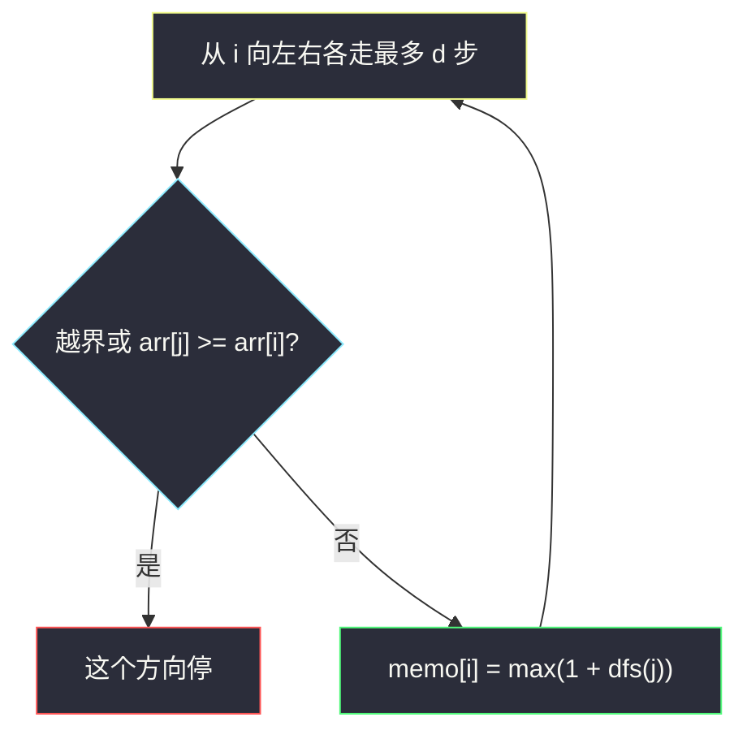
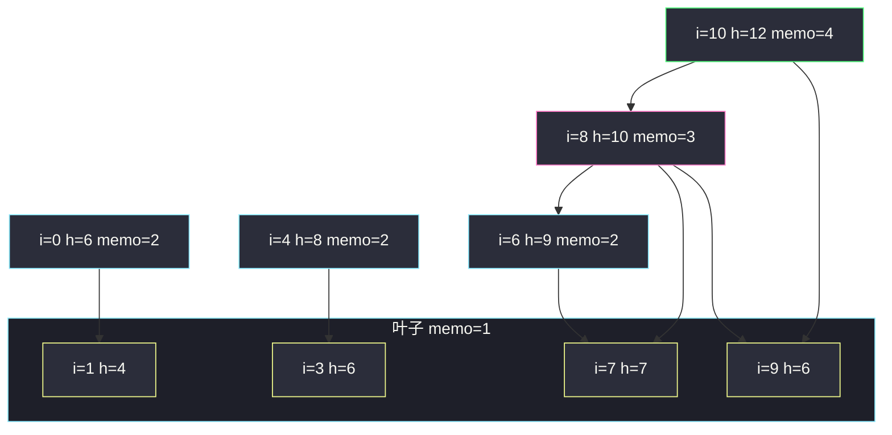

# 跳跃游戏 V（记忆化 DFS：只能跳到更矮且中间更矮）

## 一、问题描述

给你下标数组 `arr` 和整数 `d`。从下标 `i` 出发，一次跳跃可以落到 `j`，当且仅当：

1. `0 < |i - j| ≤ d`（左右最多跨 `d` 步，且不越界）
2. `arr[j] < arr[i]`（必须跳到**更矮**的柱）
3. 开区间 `(min(i,j), max(i,j))` 里所有 `arr[k] < arr[i]`（中间不能有 ≥ 起点的柱挡路）

可以从**任意**下标起跳，跳跃次数不限。求一次出发最多能访问多少个下标（含起点）。任何时刻不能跳出数组。

> 🔗 LeetCode 1340：https://leetcode.cn/problems/jump-game-v/
>
> 数据范围：`1 <= arr.length <= 1000`，`1 <= arr[i] <= 10^5`，`1 <= d <= arr.length`。`n ≤ 1000`，记忆化 DFS 里每个点向左右各扫最多 `d` 步，`O(n d)` 可通过。
>
> 📚 灵茶题单：**单调栈 · §1.2 进阶**（也常被放在跳跃 / DAG 记忆化一组）。跳跃形成的是**严格降高的 DAG**，没有环，适合 `dfs(i) = 1 + max(dfs(可跳到的 j))`。也可按高度从低到高 DP。

**示例 1**

```
输入：arr = [6,4,14,6,8,13,9,7,10,6,12], d = 2
输出：4
解释：从下标 10 出发：10 → 8 → 6 → 7，访问 4 个下标。
```

下标与高度：

```
 i    0  1   2  3  4   5  6  7   8  9  10
arr   6  4  14  6  8  13  9  7  10  6  12
```

**示例 2**

```
输入：arr = [3,3,3,3,3], d = 3
输出：1
解释：高度全相等，`arr[j] < arr[i]` 永不成立，哪都跳不了。
```

**示例 3**

```
输入：arr = [7,6,5,4,3,2,1], d = 1
输出：7
解释：从 0 每次向右跳 1 格，高度严格递减，中间为空，可以走完整条。
```

**示例 4**

```
输入：arr = [7,1,7,1,7,1], d = 2
输出：2
```

**直观理解**

把数组看成柱子。你站在柱 `i` 上，只能跳到视线范围内（距离 ≤ d）更矮的柱，且中间不能冒出一根 ≥ 自己的柱——那根会挡住。落到 `j` 之后规则相同。因为每次高度严格变小，路径不会成环，最长路径 = 1 + 所有后继里最长的那条。从每个点算一次，取全局最大。

---

## 二、暴力解法

从每个起点做不记忆化的 DFS，每次把「当前路径长度」带下去，访问过的点不再走（其实 DAG 上同一点从不同路径进来，子问题仍相同，不记忆会重复爆搜）。

```python
class Solution:
    def maxJumps(self, arr: list[int], d: int) -> int:
        n = len(arr)

        def dfs(i: int) -> int:
            best = 1
            for direction in (-1, 1):
                for step in range(1, d + 1):
                    j = i + direction * step
                    if j < 0 or j >= n or arr[j] >= arr[i]:
                        break          # 越界或被挡住 / 不够矮
                    best = max(best, 1 + dfs(j))
            return best

        return max(dfs(i) for i in range(n))
```

这段其实已经是「正确转移」，但**没有 memo**。最坏每个点的后继互相重叠，时间接近指数（例如严格递减且 `d` 较大时，递归树巨大）。`n = 1000` 会超时。

### 复杂度

- **时间**：指数级（无记忆化）。
- **空间**：递归深度 `O(n)`（高度最多降 n 次）。

### 🔴 瓶颈在哪里

`dfs(i)` 只依赖 `i`，与怎么跳到 `i` 无关。同一点会被无数条路径重复计算。加数组 `memo[i]` 后每个 i 只展开一次后继，变成 `O(n d)`。

---

## 三、优化探索（核心章节）

> 📚 本题在灵茶题单中属于 **§1.2 进阶**。和 [#55 跳跃游戏](https://leetcode.cn/problems/jump-game/) 不同：55 是「能跳多远不限高度」；这里高度是硬约束，图是 DAG。和 [#1345 跳跃游戏 IV](https://leetcode.cn/problems/jump-game-iv/) 也不同：IV 是同值传送 + BFS 最短路；本题求**最长访问次数**，用 DFS/DP 不是 BFS。

### 3.1 合法后继怎么扫

从 `i` 向左、向右分别走。步长 1, 2, …, d：

- 一旦 `j` 越界，这一个方向停
- 一旦 `arr[j] ≥ arr[i]`：这根柱要么不够矮不能落，要么它 ≥ 起点会挡住更远的格子，**更远也不看了**
- 否则 `arr[j] < arr[i]`，且中间已经一路都 `< arr[i]`（否则前面就 break 了），`j` 是合法落点

相邻时开区间为空，条件退化成「距离 ≤ d 且更矮」。

### 3.2 记忆化方程

`dfs(i) = 1 + max{ dfs(j) | j 是 i 的合法后继 }`；没有后继则为 1。

答案 `max_i dfs(i)`。

因为 `arr[j] < arr[i]`，递归只走向更矮柱，不存在环，记忆化顺序任意（递归自然按拓扑走）。

### 3.3 按高度排序的自底向上 DP

同样的转移：先处理最矮的柱（它们 `dp = 1`，往往没有后继，或后继更矮……等，更矮的已经算完）。按 `arr[i]` 升序填 `dp[i]`：枚举后继 `j` 时 `arr[j] < arr[i]`，`dp[j]` 已是终值。`dp[i] = 1 + max(dp[j])`。和 DFS 等价，有人更喜欢「矮的先算」。

### 3.4 不变式

- `memo[i]` 一旦算完，就是从 `i` 出发能访问的最大下标数（含 `i`）
- 扫描方向时，「已经走过的中间格」全部 `< arr[i]`
- 全局答案不必从最高柱出发：最高柱后继多，但不一定路径最长（示例 1 最高是下标 2 的 14，`dfs=3`，不如下标 10 的 4）



### 3.5 一句话核心

> **从 i 往左右扫到第一根 ≥ 自己的柱为止，更矮的都能跳；`dfs(i) = 1 + max(后继)`，高度严格下降所以记忆化无环。**

---

## 四、代码实现

### Python（主解：记忆化 DFS）

```python
class Solution:
    def maxJumps(self, arr: list[int], d: int) -> int:
        n = len(arr)
        memo = [-1] * n

        def dfs(i: int) -> int:
            if memo[i] != -1:
                return memo[i]
            best = 1
            for direction in (-1, 1):
                for step in range(1, d + 1):
                    j = i + direction * step
                    if j < 0 or j >= n or arr[j] >= arr[i]:
                        break
                    best = max(best, 1 + dfs(j))
            memo[i] = best
            return best

        return max(dfs(i) for i in range(n))
```

**变量含义**

| 变量 | 含义 |
|------|------|
| `memo[i]` | 从 i 出发最多访问多少下标；-1 未算 |
| `direction` | -1 向左，+1 向右 |
| `step` | 1..d，中途被挡则 break |
| `best` | 1 + 后继 dfs 的最大值 |

### Python（按高度升序 DP，对照用）

```python
class Solution:
    def maxJumps(self, arr: list[int], d: int) -> int:
        n = len(arr)
        dp = [1] * n
        for i in sorted(range(n), key=lambda x: arr[x]):
            for direction in (-1, 1):
                for step in range(1, d + 1):
                    j = i + direction * step
                    if j < 0 or j >= n or arr[j] >= arr[i]:
                        break
                    dp[i] = max(dp[i], 1 + dp[j])
        return max(dp)
```

升序保证后继 `j` 更矮、已经填好。相等高度谁先谁后无所谓：相等不能互跳。

### Java（记忆化 DFS）

```java
class Solution {
    private int[] arr, memo;
    private int d, n;

    public int maxJumps(int[] arr, int d) {
        this.arr = arr;
        this.d = d;
        n = arr.length;
        memo = new int[n];
        java.util.Arrays.fill(memo, -1);
        int ans = 0;
        for (int i = 0; i < n; i++) {
            ans = Math.max(ans, dfs(i));
        }
        return ans;
    }

    private int dfs(int i) {
        if (memo[i] != -1) {
            return memo[i];
        }
        int best = 1;
        for (int dir = -1; dir <= 1; dir += 2) {
            for (int step = 1; step <= d; step++) {
                int j = i + dir * step;
                if (j < 0 || j >= n || arr[j] >= arr[i]) {
                    break;
                }
                best = Math.max(best, 1 + dfs(j));
            }
        }
        memo[i] = best;
        return best;
    }
}
```

---

## 五、具体例子演示

### 5.1 官方示例 1：每个下标的可跳集合与 memo

`arr = [6,4,14,6,8,13,9,7,10,6,12]`，`d = 2`。

先列出每个 `i` 向左右扫出来的合法 `j`（遇 `≥ arr[i]` 或越界即停）：

| i | arr[i] | 向左（步 1..2） | 向右 | 可跳集合 |
|---|--------|-----------------|------|----------|
| 0 | 6 | 无 | j=1 的 4<6；j=2 的 14≥6 停 | `{1}` |
| 1 | 4 | j=0 的 6≥4 停 | j=2 的 14≥4 停 | `∅` |
| 2 | 14 | 4<14，6<14 | 6<14，8<14 | `{1,0,3,4}` |
| 3 | 6 | 14≥6 停 | 8≥6 停 | `∅` |
| 4 | 8 | 6<8；14≥8 停 | 13≥8 停 | `{3}` |
| 5 | 13 | 8<13，6<13 | 9<13，7<13 | `{4,3,6,7}` |
| 6 | 9 | 13≥9 停 | 7<9；10≥9 停 | `{7}` |
| 7 | 7 | 9≥7 停 | 10≥7 停 | `∅` |
| 8 | 10 | 7<10，9<10 | 6<10；12≥10 停 | `{7,6,9}` |
| 9 | 6 | 10≥6 停 | 12≥6 停 | `∅` |
| 10 | 12 | 6<12，10<12 | 无 | `{9,8}` |

注意下标 6（高度 9）**不能**跳到下标 4：距离 2 倒是 ≤ d，但中间下标 5 高度 13 ≥ 9，向左第一步就撞墙。题面说的「从 6 不能到 5、也不能到 4」就是这件事。

叶子（可跳为空）`dfs = 1`：i ∈ `{1,3,7,9}`。

自底向上看 memo（递归会先算更矮的后继）：

| i | 转移 | memo[i] |
|---|------|---------|
| 1,3,7,9 | 无后继 | 1 |
| 0 | 1+dfs(1)=2 | 2 |
| 4 | 1+dfs(3)=2 | 2 |
| 6 | 1+dfs(7)=2 | 2 |
| 8 | 1+max(dfs(7),dfs(6),dfs(9))=1+max(1,2,1)=3 | 3 |
| 10 | 1+max(dfs(9),dfs(8))=1+max(1,3)=**4** | **4** |
| 2 | 1+max(2,1,1,2)=3 | 3 |
| 5 | 1+max(2,1,2,1)=3 | 3 |

全局最大 4，起点是下标 10。路径之一：`10(12) → 8(10) → 6(9) → 7(7)`。



### 5.2 示例 3：递减链，d=1

`arr = [7,6,5,4,3,2,1]`，`d = 1`。每个 i 只能向右跳到 i+1（更矮且相邻）。

| i | 可跳 | memo（从右算） |
|---|------|----------------|
| 6 | ∅ | 1 |
| 5 | {6} | 2 |
| 4 | {5} | 3 |
| 3 | {4} | 4 |
| 2 | {3} | 5 |
| 1 | {2} | 6 |
| 0 | {1} | **7** |

从 0 出发 7 步访问全部下标。向左都是更高柱，第一步就 break。

### 5.3 示例 2 与 4

全 3：任意 `j` 都有 `arr[j] ≥ arr[i]`，第一步全部 break，人人 `memo=1`，答案 1。

`[7,1,7,1,7,1]`，`d=2`。偶数下标高度 7，奇数 1。从某个 7 可以跳到旁边的 1（相邻更矮），但不能越过 1 落到另一个 7（高度相等，且 1 虽然更矮挡不住「≥7」，距离 2 的那个 7 本身 `≥` 起点，扫到它就 break 且不能落）。从 1 哪都跳不了。所以最长是 `7 → 1`，答案 2。

### 5.4 记忆化返回值怎么复用

算 `dfs(10)` 会递归 `dfs(8)`，`dfs(8)` 再算 `dfs(6)`。之后算 `dfs(2)` 不会再走 10 这条链，但若某点后继撞上已经算过的 8，直接读 `memo[8]=3`，不会把 8→6→7 再搜一遍。这就是暴力指数变成 `O(n d)` 的原因。

---

## 六、复杂度分析

| 方法 | 时间 | 空间 | 说明 |
|------|------|------|------|
| 无记忆化 DFS | 指数 | `O(n)` 栈 | `n=1000` 超时 |
| 记忆化 DFS（主解） | `O(n d)` | `O(n)` | 每点每方向扫最多 d 次，只展开一次 |
| 按高度升序 DP | `O(n d + n log n)` | `O(n)` | 排序多 `O(n log n)` |

递归深度最坏 `O(n)`（严格单调）。`d ≤ n`，最坏约 `10^6` 量级判断，可通过。

---

## 七、对比总结

| 维度 | 55 跳跃游戏 | 1345 跳跃 IV | 本题 V |
|------|-------------|--------------|--------|
| 边 | 向右任意 ≤ arr[i] | 同值传送 + 相邻 | 更矮 + 中间更矮 + 距离 d |
| 目标 | 能否到终点 | 最少步数 | **最多访问点数** |
| 算法 | 贪心最远 | BFS | 记忆化 DFS / 按高度 DP |
| 图性质 | 可有「跳过」 | 无权最短路 | **降高 DAG** |

**易错点**

1. **中间有 ≥ 起点的柱还继续扫**：必须 `break` 不是 `continue`。`continue` 会跳过挡板去落更远的点，示例 1 会从 6 错误跳到 4。
2. **允许跳到等高**：`arr[j] < arr[i]` 是严格小于；等高既不能落，也挡住后面（`≥` 就停）。
3. **漏掉「含起点」**：没有后继时应返回 1 不是 0。
4. **当成最少跳跃次数去做 BFS**：本题要最长路径，BFS 层数是最短路，用错。
5. **记忆化写成路径上的 vis**：DAG 上同一点子问题相同，应该按点记忆，不要把「这条路径访问过」当成 vis 禁掉后继（后继是更矮点，本来就不会走回）。若误用 vis 且不回溯，会算少。
6. **只从最高柱出发**：示例 1 最高柱 dfs=3，不是全局最优。

**模板（§1.2 降高 DAG 最长路）**

```python
# 左右扫：越界或 arr[j] >= arr[i] 则 break，否则 j 可跳
# dfs(i) = 1 + max(dfs(j))，memo[i] 记下来
# 答案是 max(dfs(0..n-1))
```

---

## 八、举一反三

| 题目 | 关系 |
|------|------|
| [55. 跳跃游戏](https://leetcode.cn/problems/jump-game/) | 只问能否到终点，贪心覆盖 |
| [45. 跳跃游戏 II](https://leetcode.cn/problems/jump-game-ii/) | 最少跳数，反向贪心或 BFS |
| [1306. 跳跃游戏 III](https://leetcode.cn/problems/jump-game-iii/) | ±arr[i] 跳，问能否到 0，DFS/BFS |
| [1345. 跳跃游戏 IV](https://leetcode.cn/problems/jump-game-iv/) | 同值传送，BFS 最短路 |
| [329. 矩阵中的最长递增路径](https://leetcode.cn/problems/longest-increasing-path-in-a-matrix/) | 同样「严格升降 + 记忆化 DFS 最长路」，二维版 |
| [403. 青蛙过河](https://leetcode.cn/problems/frog-jump/) | 跳跃带状态 (下标, 步长)，也是记忆化 |

**思想迁移**

- 见到「只能跳到更小 / 更大」，先确认是 DAG，再记忆化最长（或最短）路。
- 口诀：**「左右扫到第一根挡路柱；dfs 等于 1 加后继最大值；从所有点出发取 max。」**
