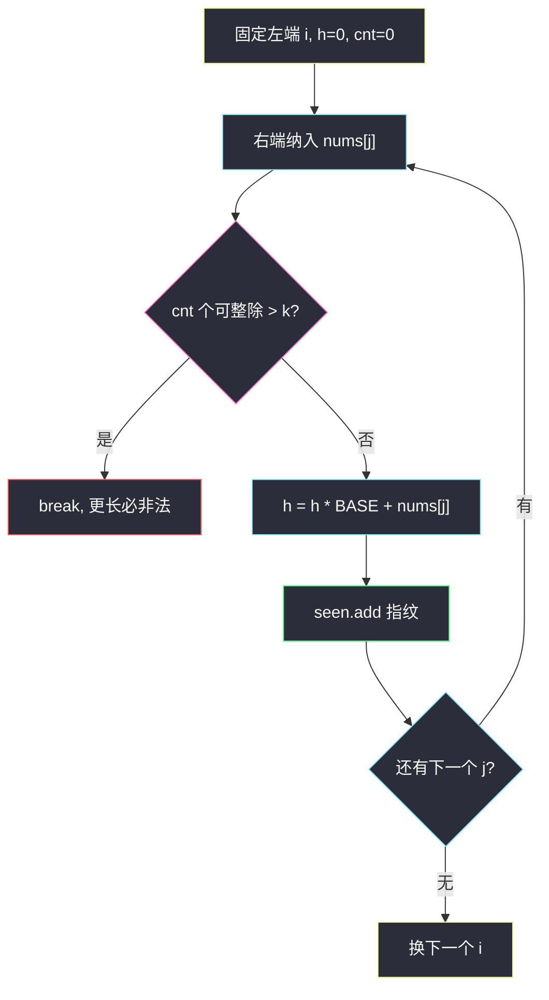
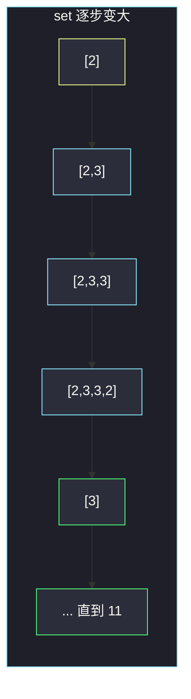

# 含最多 K 个可整除元素的子数组（枚举 + 滚动哈希去重）

## 一、问题描述

给你整数数组 `nums` 和两个整数 `k`、`p`。统计有多少个**不同的子数组**，满足：子数组里「能被 `p` 整除的元素个数」不超过 `k`。

两个子数组不同，指它们的**序列**不同（内容或长度至少有一项不同）。同一段序列在数组里出现多次，只算一次。子数组必须连续。

> 🔗 LeetCode 2261：https://leetcode.cn/problems/k-divisible-elements-subarrays/
>
> 数据范围：`1 ≤ nums.length ≤ 200`，`1 ≤ nums[i], p ≤ 200`，`1 ≤ k ≤ nums.length`。
>
> 📚 灵茶题单：**四、字符串哈希**。`n ≤ 200`，可以 `O(n²)` 枚举全部子数组；去重不要把整段拷进 set 再比内容，用滚动哈希（或 tuple）把「这段序列」压成指纹。

**示例 1**

```
输入：nums = [2,3,3,2,2], k = 2, p = 2
输出：11
解释：下标 0、3、4 的元素能被 2 整除。
至多 2 个可整除元素的不同子数组是：
[2], [2,3], [2,3,3], [2,3,3,2], [3], [3,3], [3,3,2], [3,3,2,2], [3,2], [3,2,2], [2,2]。
全程 [2,3,3,2,2] 有 3 个偶数，不计入。
[2] 和 [3] 各出现多次，每种只计 1。
```

**示例 2**

```
输入：nums = [1,2,3,4], k = 4, p = 1
输出：10
解释：每个数都能被 1 整除。全部 n(n+1)/2 = 10 个子数组都合法，且序列两两不同。
```

**直观理解**

先不管去重：从每个左端点往右扩，数「能被 p 整除」的个数，一超过 k 就停——更长的只会更超。去重的对象是**值序列**，不是下标区间：`[2]` 在 0 和 3 各出现一次，仍是同一个子数组。

---

## 二、暴力解法

双重循环枚举 `[i, j]`，维护可整除个数 `cnt`，合法就把 `tuple(nums[i..j])` 丢进 set。

```python
class Solution:
    def countDistinct(self, nums: list[int], k: int, p: int) -> int:
        n = len(nums)
        seen: set[tuple[int, ...]] = set()
        for i in range(n):
            cnt = 0
            cur: list[int] = []
            for j in range(i, n):
                if nums[j] % p == 0:
                    cnt += 1
                if cnt > k:
                    break
                cur.append(nums[j])
                seen.add(tuple(cur))
        return len(seen)
```

`n = 200` 时子数组最多约 `200 × 201 / 2 ≈ 2×10^4` 个，tuple 拷贝总长 `O(n³)` 量级也能过，但和题单「字符串哈希」对不上。

### 🔴 瓶颈在哪里

瓶颈不在「枚举」，而在「把整段序列当 key」。每次 `tuple(cur)` 要拷当前长度，合计 `O(n³)` 时间和空间。滚动哈希让右端每扩一格只做一次 `h = h * BASE + nums[j]`，指纹 `O(1)` 更新、`O(1)` 入 set。

---

## 三、优化探索（核心章节）

> 📚 本题在灵茶题单中属于 **四、字符串哈希**。数组当字符串，`nums[i]` 当字符。多项式滚动哈希：从左往右扩一格，旧哈希乘底数再加新字符，得到新串的指纹。

### 3.1 合法子数组：左端固定，右端最多走到哪

对固定左端 `i`，从 `j = i` 往右扫，`cnt` 记 `nums[j] % p == 0` 的次数。`cnt` 单调不减，一旦 `cnt > k`，`[i, j]` 以及所有 `j' > j` 都非法，直接 `break`。不必再往右。

### 3.2 去重：哈希的是值，不是「是否整除」

两个子数组相同 ⇔ 长度相同且每一位相等。只把 `0/1`（能不能整除）哈希进去会把 `[2]` 和 `[4]` 判成同一个（`p = 2` 时都是偶数），答案偏小。

`nums[i] ∈ [1, 200]`，底数 `BASE` 必须 **大于 200**（例如 313），这样一段序列作为「BASE 进制数」的编码本身不冲突。哈希碰撞另说：双模（两个大质数）把误判压到可以忽略。

递推（对每个左端点重置 `h1 = h2 = 0`）：

```
h1 = (h1 * BASE1 + nums[j]) mod MOD1
h2 = (h2 * BASE2 + nums[j]) mod MOD2
seen.add( (h1, h2) )
```



### 3.3 一句话核心

> **O(n²) 枚举合法子数组；右端每扩一格，用滚动哈希 O(1) 更新序列指纹，set 大小就是答案。**

---

## 四、代码实现

### Python（主解：双模滚动哈希）

```python
class Solution:
    def countDistinct(self, nums: list[int], k: int, p: int) -> int:
        n = len(nums)
        BASE1, BASE2 = 313, 317
        MOD1, MOD2 = 10**9 + 7, 10**9 + 9
        seen: set[tuple[int, int]] = set()
        for i in range(n):
            cnt = 0
            h1 = h2 = 0
            for j in range(i, n):
                if nums[j] % p == 0:
                    cnt += 1
                if cnt > k:
                    break
                h1 = (h1 * BASE1 + nums[j]) % MOD1
                h2 = (h2 * BASE2 + nums[j]) % MOD2
                seen.add((h1, h2))
        return len(seen)
```

每个左端点哈希从 0 重算，没有「减去左边」的减哈希，写起来最稳。`n ≤ 200` 完全够用。

**变量含义**

| 写法 | 含义 |
|------|------|
| `cnt` | 当前 `[i, j]` 里能被 `p` 整除的个数 |
| `h1, h2` | 子数组 `nums[i..j]` 的双模指纹 |
| `BASE > 200` | 编码时每位取值小于底数，序列与「BASE 进制」一一对应 |
| `seen` | 出现过的指纹集合；大小 = 不同合法子数组数 |

---

## 五、具体例子演示

**示例 1**：`nums = [2,3,3,2,2]`，`k = 2`，`p = 2`。偶数位置：`T F F T T`。

下面按 `(i, j)` 插入。`new` 表示这次指纹第一次进 set。哈希过程与 tuple 去重同步：右端每进一步，set 里多一个（或撞上已有）指纹。

| i | j | 子数组 | 可整除个数 | 是否新序列 | set 大小 |
|---|---|--------|------------|------------|----------|
| 0 | 0 | `[2]` | 1 | 是 | 1 |
| 0 | 1 | `[2,3]` | 1 | 是 | 2 |
| 0 | 2 | `[2,3,3]` | 1 | 是 | 3 |
| 0 | 3 | `[2,3,3,2]` | 2 | 是 | 4 |
| 0 | 4 | `[2,3,3,2,2]` | 3 | 丢弃，break | 4 |
| 1 | 1 | `[3]` | 0 | 是 | 5 |
| 1 | 2 | `[3,3]` | 0 | 是 | 6 |
| 1 | 3 | `[3,3,2]` | 1 | 是 | 7 |
| 1 | 4 | `[3,3,2,2]` | 2 | 是 | 8 |
| 2 | 2 | `[3]` | 0 | 否，已有 | 8 |
| 2 | 3 | `[3,2]` | 1 | 是 | 9 |
| 2 | 4 | `[3,2,2]` | 2 | 是 | 10 |
| 3 | 3 | `[2]` | 1 | 否，已有 | 10 |
| 3 | 4 | `[2,2]` | 2 | 是 | 11 |
| 4 | 4 | `[2]` | 1 | 否，已有 | 11 |

最终 11，对拍官方示例 1。

以 `i = 0` 为例看哈希滚动（示意只写一模，`BASE = 313`）：

| j | 纳入 | 新 h |
|---|------|------|
| 0 | 2 | `0*313+2 = 2` |
| 1 | 3 | `2*313+3 = 629` |
| 2 | 3 | `629*313+3` |
| 3 | 2 | 再乘 313 加 2 |

`i = 3` 的 `[2]` 再次得到 `h = 2`，和 `i = 0` 的 `[2]` 撞进同一个桶——这正是「序列相同只计一次」。



粉/黄是第一次出现的短序列；绿是后来新增长度或新内容。`i = 2` 的 `[3]`、`i = 3/4` 的 `[2]` 不再增加计数。

**示例 2**：`nums = [1,2,3,4]`，`k = 4`，`p = 1`。每个数都能整除，所有 10 个子数组序列都不同（长度 1 的有 4 个值，长度 2 的有 3 段……），答案 10。对拍官方。

**边界**：`k = 0` 时，子数组里不能出现任何能被 `p` 整除的数，右端碰到第一个倍数就停。单元素若本身能整除，这个单元素也不计入。

---

## 六、复杂度分析

| 方法 | 时间 | 空间 | 说明 |
|------|------|------|------|
| 枚举 + tuple | `O(n³)` | `O(n³)` | 拷贝序列；n=200 能过 |
| 枚举 + 双模滚动哈希（主解） | `O(n²)` | `O(n²)` | 每个子数组 O(1) 更新指纹 |
| 字典树按值插入 | `O(n²)` | `O(n²)` | 去重正确，但不是题单这一节的模板 |

`n ≤ 200`，主解的 set 最多约 2×10⁴ 个二元组。

---

## 七、对比总结

| 维度 | tuple 去重 | 滚动哈希 | 只哈希「是否整除」 |
|------|------------|----------|-------------------|
| 正确性 | 对 | 双模下 practically 对 | 错：`[2]` 与 `[4]` 会合并 |
| 与题单 | 能过 | **四、字符串哈希** | 偏题 |
| 更新代价 | 拷整段 | O(1) | O(1) 但语义错 |

**易错点**

1. **只哈希 0/1**：题面要的是值序列不同，不是奇偶模式不同。
2. **BASE ≤ 200**：`[12]` 与 `[1,2]` 在「无分隔拼接」时会乱；滚动哈希只要 `BASE > max(nums[i])` 就不会在编码层撞。字符串版用逗号拼接 `"12,"` 也能避，但不如哈希干净。
3. **子数组不连续**：这题不是子序列。
4. **按区间去重**：`(i,j)` 不同但值相同仍算一个。
5. **cnt 超了还不 break**：浪费，且会把非法段放进 set。
6. **单模碰撞**：竞赛里双模或 2⁶⁴ 溢出更稳；Python 整数无限大，必须自己取模。

---

## 八、举一反三

| 题目 | 关系 |
|------|------|
| [187. 重复的 DNA 序列](https://leetcode.cn/problems/repeated-dna-sequences/) | 定长窗口滚动哈希，set 里出现第二次就记录 |
| [718. 最长重复子数组](https://leetcode.cn/problems/maximum-length-of-repeated-subarray/) | 二分长度 + 哈希判两数组是否有相同子段 |
| [1044. 最长重复子串](https://leetcode.cn/problems/longest-duplicate-substring/) | 同一套「二分 + 哈希」 |
| [1297. 子串的最大出现次数](https://leetcode.cn/problems/maximum-number-of-occurrences-of-a-substring/) | 仍是哈希计数，多了字母种类约束 |
| [28. 找出字符串中第一个匹配项的下标](https://leetcode.cn/problems/find-the-index-of-the-first-occurrence-in-a-string/) | 精确匹配用 KMP；本题是「全部不同子串计数」，哈希更合适 |

**思想迁移**

- `n` 到 200、要统计**不同连续段**：枚举全部 + 指纹去重。
- 口诀：**「扩右端、超 k 就停；哈希的是值，不是奇偶。」**
