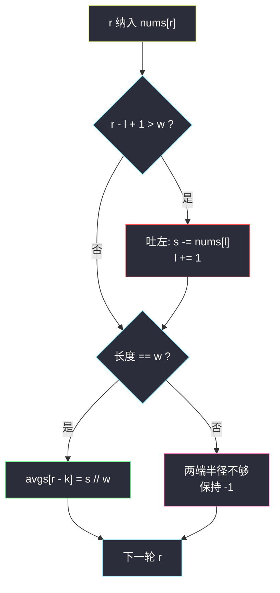

# 半径为 k 的子数组平均值（定长滑窗 · 中心窗口）

## 一、问题描述

给你一个下标从 **0** 开始的数组 `nums` 和一个整数 `k`。半径为 `k` 的子数组平均值定义如下：

- 对下标 `i`，若下标 `i - k` 与 `i + k` **都在数组范围内**，则 `avgs[i]` 等于子数组 `nums[i-k .. i+k]`（含两端，共 `2k + 1` 个元素）的**整数除法**平均值（即 ⌊和 / (2k+1)⌋）；
- 否则 `avgs[i] = -1`（半径不够，窗口缺边）。

返回长度为 `n` 的数组 `avgs`。

> 🔗 LeetCode 2090：https://leetcode.cn/problems/k-radius-subarray-averages/
>
> 数据范围：`1 <= nums.length <= 10^5`，`0 <= nums[i], k <= 10^5`。

**示例 1**

```
输入：nums = [7,4,3,9,1,8,5,2,6], k = 3
输出：[-1,-1,-1,5,4,4,-1,-1,-1]
解释：窗口长 7。i=3 时 [7,4,3,9,1,8,5] 和 37，⌊37/7⌋=5；
      i=4 时和 32，⌊32/7⌋=4；i=5 时和 34，⌊34/7⌋=4。
```

**示例 2**

```
输入：nums = [100000], k = 0
输出：[100000]
解释：k = 0 时窗口就是元素自己，平均值等于自身。
```

**示例 3**

```
输入：nums = [8], k = 100000
输出：[-1]
解释：半径远超数组，下标 0 两侧都不够，填 -1。
```

**直观理解**

每个合法下标对应一段**定长** `w = 2k + 1` 的窗口，中心是 `i`，左右各 `k` 个邻居。两端各有 `k` 个下标永远缺邻居，直接 `-1`。中间那些窗口一个接一个向右挪一格——正是 §1.1 定长滑窗。也可用前缀和 `O(1)` 查任意闭区间和，两种做法时间都是线性。

---

## 二、暴力解法

对每个 `i` 判断是否越界，再扫 `[i-k, i+k]` 求和：

```python
class Solution:
    def getAverages(self, nums: List[int], k: int) -> List[int]:
        n = len(nums)
        avgs = [-1] * n
        w = 2 * k + 1
        for i in range(n):
            if i - k < 0 or i + k >= n:
                continue
            avgs[i] = sum(nums[i - k:i + k + 1]) // w
        return avgs
```

### 复杂度

- **时间**：`O(n·k)`。每个合法中心都扫 `2k + 1` 个数。
- **空间**：`O(n)` 存答案（输出不算的话，求和切片还要 `O(k)`）。

`n` 与 `k` 同为 `10^5` 时约 `10¹⁰`，超时。和最大 `10^5 * 10^5 = 10¹⁰`，语言若用 32 位整数还会溢出。

### 🔴 瓶颈在哪里

相邻中心 `i` 与 `i+1` 的窗口只差两端各一个元素：左边 `nums[i-k]` 出去，右边 `nums[i+1+k]` 进来。暴力把中间 `2k - 1` 个共享元素全部重算。定长滑窗或前缀和都能把每次查询降到 `O(1)`。

---

## 三、优化探索（核心章节）

> 📚 本题在灵茶题单中属于 **01-滑动窗口与双指针 · §1.1 基础**。窗口长度固定为 `w = 2k + 1`，骨架仍是：**纳入 → 若 `r - l + 1 > w` 则吐左 → 更新中心格的平均值。**

### 3.1 窗口与中心的下标关系

当右端 `r` 第一次让窗口长度为 `w` 时，窗口是 `nums[0 .. 2k]`，中心是下标 `k`。之后每纳入 / 吐左一次，窗口变为 `nums[r-2k .. r]`，中心是 `r - k`。写入：

```
avgs[r - k] = s // w
```

两端各 `k` 个位置从未成为任何长度为 `w` 的窗口的中心，保持初始值 `-1`。若 `w > n`，根本形不成完整窗口，答案全是 `-1`——循环里更新条件永远不成立，无需特判。

### 3.2 定长骨架套上去

与「计数有多少个长度为 k 的窗口」相比，本题只是：长度改成 `2k+1`，更新动作从 `ans += 1` 换成「把整数均值写到中心下标」。



### 3.3 前缀和等价做法

令 `pre[0] = 0`，`pre[i+1] = pre[i] + nums[i]`，则 `nums[L..R]` 的和是 `pre[R+1] - pre[L]`。对每个合法中心 `i ∈ [k, n-k-1]`：

```
avgs[i] = (pre[i + k + 1] - pre[i - k]) // w
```

一次预处理 `O(n)`，每个中心 `O(1)`。空间多一个 `O(n)` 前缀数组。滑窗只用几个变量，空间更省，骨架与 §1.1 完全一致，作主解。

### 3.4 整数除法与 k = 0

题目要的是向零截断的非负整数除（Python `//`、Java `/` 对非负都是下取整）。`nums[i] ≥ 0`，和不会为负，没有「负向零」的坑。

`k = 0` 时 `w = 1`，每个单元素窗口的中心就是自己，`avgs[i] = nums[i]`。骨架：纳入后长度恰好 1，从不吐左，`avgs[r - 0] = s // 1`。不必特判。

### 3.5 一句话核心

> **半径 k 就是定长 `2k+1` 的尺子：纳入 / 吐左，长度够了就把 ⌊和 / w⌋ 写到中心 `r - k`；两边各 k 格永远是 -1。**

---

## 四、代码实现

### Python（主解：定长滑窗）

```python
class Solution:
    def getAverages(self, nums: List[int], k: int) -> List[int]:
        n = len(nums)
        avgs = [-1] * n
        w = 2 * k + 1                           # 窗口长度
        s = l = 0
        for r, x in enumerate(nums):
            s += x                              # 1. 纳入
            if r - l + 1 > w:                   # 2. 过长则吐左
                s -= nums[l]
                l += 1
            if r - l + 1 == w:                  # 3. 更新中心
                avgs[r - k] = s // w
        return avgs
```

**前缀和写法（等价）**

```python
class Solution:
    def getAverages(self, nums: List[int], k: int) -> List[int]:
        n = len(nums)
        avgs = [-1] * n
        w = 2 * k + 1
        pre = [0] * (n + 1)
        for i, x in enumerate(nums):
            pre[i + 1] = pre[i] + x
        for i in range(k, n - k):
            avgs[i] = (pre[i + k + 1] - pre[i - k]) // w
        return avgs
```

**变量含义**

| 变量 | 含义 |
|------|------|
| `w` | `2k + 1`，完整半径窗口的长度 |
| `r`, `l` | 窗口右 / 左端 |
| `s` | 当前窗口和（须能装下 `10¹⁰`，Python int 自动扩） |
| `avgs[r - k]` | 以 `r - k` 为中心的整数均值 |

**循环不变式**：吐左之后，若长度等于 `w`，则窗口为 `nums[r-2k .. r]`，中心 `r - k` 合法（因为 `r ≥ 2k` 推出 `r - k ≥ k` 且 `r - k + k = r < n`）。

### Java（最优解同款）

```java
class Solution {
    public int[] getAverages(int[] nums, int k) {
        int n = nums.length;
        int[] avgs = new int[n];
        Arrays.fill(avgs, -1);
        int w = 2 * k + 1, l = 0;
        long s = 0;                             // 和最大 1e10，必须 long
        for (int r = 0; r < n; r++) {
            s += nums[r];
            if (r - l + 1 > w) s -= nums[l++];
            if (r - l + 1 == w) {
                avgs[r - k] = (int) (s / w);
            }
        }
        return avgs;
    }
}
```

---

## 五、具体例子演示

以示例 1 `nums = [7,4,3,9,1,8,5,2,6]`，`k = 3`，`w = 7`。逐步跟踪**每轮窗口和 / 均值**（长度不足 7 时中心尚未产生）：

| r | 纳入 | 吐左 | 窗口 | s | 中心 `r-3` | ⌊s/7⌋ | avgs 写入 |
|---|------|------|------|---|------------|--------|-----------|
| 0 | 7 | — | `[7]` | 7 | — | — | — |
| 1 | 4 | — | 长 2 | 11 | — | — | — |
| 2 | 3 | — | 长 3 | 14 | — | — | — |
| 3 | 9 | — | 长 4 | 23 | — | — | — |
| 4 | 1 | — | 长 5 | 24 | — | — | — |
| 5 | 8 | — | 长 6 | 32 | — | — | — |
| 6 | 5 | 否 | `[7,4,3,9,1,8,5]` | 37 | 3 | **5** | avgs[3]=5 |
| 7 | 2 | 吐 7 | `[4,3,9,1,8,5,2]` | 32 | 4 | **4** | avgs[4]=4 |
| 8 | 6 | 吐 4 | `[3,9,1,8,5,2,6]` | 34 | 5 | **4** | avgs[5]=4 |

两端 `avgs[0..2]` 与 `avgs[6..8]` 保持 `-1`，得到 `[-1,-1,-1,5,4,4,-1,-1,-1]` ✓。

`k = 0`、`nums = [100000]`：`w = 1`，`r = 0` 纳入后长度 1，`avgs[0] = 100000 // 1` ✓。

`k` 大于 `n` 时（示例 3）：`w = 200001 > 1`，`r` 走完长度始终是 1，更新条件永不成立，`avgs = [-1]` ✓。前缀和写法里 `range(k, n-k)` 为空区间，同样不会写入。


---

## 六、复杂度分析

| 方法 | 时间 | 空间 | 说明 |
|------|------|------|------|
| 每个中心重新求和 | `O(n·k)` | `O(n)` 答案 | `k` 大时超时 |
| 定长滑窗（主解） | `O(n)` | `O(n)` 答案 / `O(1)` 额外 | 每个元素进、出一次 |
| 前缀和 | `O(n)` | `O(n)` 前缀 + 答案 | 随机区间和更直观 |

---

## 七、对比总结

| 维度 | 本题 | #1343 定长计数 |
|------|------|----------------|
| 窗口长 | `2k + 1` | `k` |
| 更新 | 写 `avgs[中心]` | `ans += 1`（过线才加） |
| 非法位置 | 两端各 k 格填 `-1` | 不存在（每个长 k 窗口都统计） |
| 和的大小 | 最大 `10¹⁰`，Java 用 `long` | 最大 `10^9` |

**易错点**

1. **中心下标是 `r - k` 不是 `r`**：窗口 `[r-2k, r]` 的中点才是半径 k 的圆心。
2. **Java `int` 溢出**：窗口和用 `long`，最后再 `(int)(s / w)`。
3. **先吐后写**：纳入后长度可能是 `w + 1`，必须先减左端再 `s // w`。
4. **`k = 0` 不要提前 `return nums` 改原数组**：应返回新数组；骨架已覆盖。
5. **`w > n`**：更新从不触发，全 `-1` 正确，别除以 0——此时根本不会执行 `s // w`。
6. 题目是下取整均值，不要四舍五入。

**模板（§1.1 定长，中心在 `r - radius`）**

```python
w = 2 * k + 1
s = l = 0
for r in range(n):
    s += nums[r]                # 纳入
    if r - l + 1 > w:           # 吐左
        s -= nums[l]
        l += 1
    if r - l + 1 == w:          # 更新
        avgs[r - k] = s // w
```

---

## 八、举一反三

| 题目 | 关系 |
|------|------|
| [1343. 大小为 K 且平均值大于等于阈值的子数组数目](https://leetcode.cn/problems/number-of-sub-arrays-of-size-k-and-average-greater-than-or-equal-to-threshold/) | 同批姊妹篇：同一骨架，计数 vs 写回中心 |
| [643. 子数组最大平均数 I](https://leetcode.cn/problems/maximum-average-subarray-i/) | 定长窗口维护和，取最大均值 |
| [303. 区域和检索 - 数组不可变](https://leetcode.cn/problems/range-sum-query-immutable/) | 前缀和原型，本题每个中心一次查询 |
| [1456. 定长子串中元音的最大数目](https://leetcode.cn/problems/maximum-number-of-vowels-in-a-substring-of-given-length/) | 定长统计，维护对象从和换成计数 |
| [1652. 拆炸弹](https://leetcode.cn/problems/defuse-the-bomb/) | 定长（环形）窗口和 |
| [1109. 航班预订统计](https://leetcode.cn/problems/corporate-flight-bookings/) | 差分数组：区间加的对偶，和前缀和同一家族 |
| [238. 除自身以外数组的乘积](https://leetcode.cn/problems/product-of-array-except-self/) | 前缀信息写回每一位，思想相近 |

**思想迁移**

- 「以 i 为中心、左右各 k」先翻译成定长 `2k+1`，再套纳入 / 吐左；写回位置永远是窗口的中点。
- 需要随机区间和时前缀和更直白；只扫一遍相邻窗口时滑窗更省空间。
- 口诀：**「半径 k 尺子长 2k+1；吐左纳入对齐中心，⌊和/w⌋ 写入 r-k。」**
