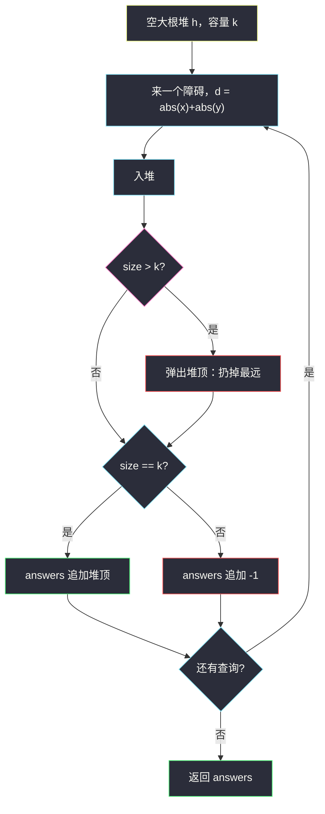
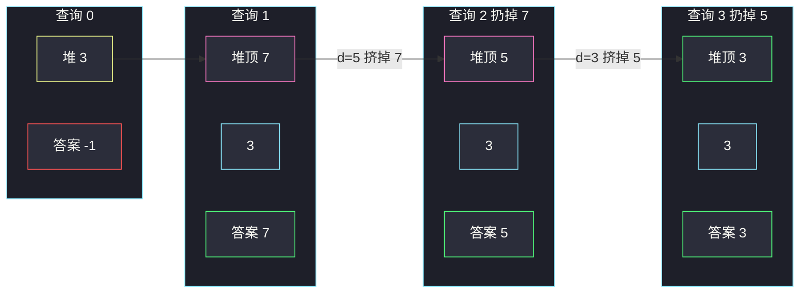

# 第 K 近障碍物查询（大小为 k 的大根堆）

## 一、问题描述

无限二维平面，一开始没有任何障碍物。给定正整数 `k` 和查询数组 `queries`。`queries[i] = [x, y]` 表示在坐标 `(x, y)` **新建**一个障碍物（保证该坐标此前没有障碍）。

每次建造之后，求当前所有障碍物里，距离原点**第 k 近**的那个的曼哈顿距离 `|x| + |y|`。若障碍物不足 `k` 个，该次答案为 `-1`。

返回与 `queries` 等长的数组。

> 🔗 LeetCode 3275：https://leetcode.cn/problems/k-th-nearest-obstacle-queries/
>
> 数据范围：`1 <= queries.length <= 2·10^5`，坐标在 `[-10^9, 10^9]`，`1 <= k <= 10^5`，所有查询坐标互不相同。

**示例 1**

```
输入：queries = [[1,2],[3,4],[2,3],[-3,0]], k = 2
输出：[-1, 7, 5, 3]
解释：距离依次为 3、7、5、3。
  第 1 次后只有 1 个，不足 k → -1
  第 2 次后距离 [3, 7]，第 2 近 = 7
  第 3 次后 [3, 5, 7]，第 2 近 = 5
  第 4 次后 [3, 3, 5, 7]，第 2 近 = 3
```

**示例 2**

```
输入：queries = [[5,5],[4,4],[3,3]], k = 1
输出：[10, 8, 6]
解释：k = 1 就是动态维护当前最近距离：10 → 8 → 6。
```

**直观理解**

每来一个点，集合多一个距离，问「从小到大排第 k 个」。不要每次把全部距离排序。只需记住**目前最近的 k 个**；这 k 个里最大的那个，恰好是第 k 近。维护这 k 个用**容量为 k 的大根堆**，堆顶就是答案。

---

## 二、暴力解法

每来一个点，把目前所有距离排序，取下标 `k-1`。

```python
class Solution:
    def resultsArray(self, queries: List[List[int]], k: int) -> List[int]:
        ds, ans = [], []
        for x, y in queries:
            ds.append(abs(x) + abs(y))
            if len(ds) < k:
                ans.append(-1)
            else:
                ans.append(sorted(ds)[k - 1])
        return ans
```

### 复杂度

- **时间**：`O(n² log n)`。每次全排序，`n = 2·10^5` 不可接受。
- **空间**：`O(n)`。

### 🔴 瓶颈在哪里

第 `k+1` 近及更远的障碍，**永远不可能**成为之后某次的答案——以后只可能加进更近的点，第 k 近只降不升。所以远处的点可以直接扔掉。保留 k 个最近的，用堆维护其中的最大值即可。

---

## 三、优化探索（核心章节）

> 📚 本题在灵茶题单中属于 **堆 · §5.1 基础**：「第 K 大 / 第 K 小」用容量为 k 的堆。这里求第 k **小**（第 k 近），堆里装最近的 k 个，用**大根堆**让堆顶暴露这 k 个里的最大值。

### 3.1 为什么是大根堆

「第 k 小」的经典写法：

- 小根堆装全部 → 堆顶是最小，要第 k 小得弹 k-1 次，而且不能在线；
- **大根堆只留 k 个最小**：新来的比堆顶还大，它连前 k 都进不去，丢掉；比堆顶小，就挤掉当前最远的那个。

堆的大小到达 k 之后，堆顶 = 这 k 个里的最大 = 全局第 k 小。

### 3.2 操作

对每个距离 `d`：

1. 入堆；
2. 若 `size > k`，弹出堆顶（扔掉目前这 k+1 个里最远的）；
3. `size == k` 则答案是堆顶，否则 `-1`。

Python `heapq` 是小根堆，存 **`-d`**：最小的负数对应最大的 `d`，`heappop` 扔掉的就是最远。



### 3.3 可选的剪枝写法

`size == k` 且 `d >= 堆顶` 时，新点进不了前 k，可以直接忽略（答案仍是旧堆顶）。与「先推再弹」等价，常数略好，不是必须。

距离 `|x| + |y|` 最大 `2·10^9`，用 `int` 即可。坐标可负，距离取绝对值。

### 3.4 一句话核心

> **容量 k 的大根堆只留最近的 k 个距离；堆顶就是第 k 近。不足 k 个输出 -1。**

---

## 四、代码实现

### Python（主解）

```python
class Solution:
    def resultsArray(self, queries: List[List[int]], k: int) -> List[int]:
        h = []                               # 存 -d，小根堆模拟大根堆
        ans = []
        for x, y in queries:
            d = abs(x) + abs(y)
            heapq.heappush(h, -d)
            if len(h) > k:
                heapq.heappop(h)             # 扔掉最远
            if len(h) == k:
                ans.append(-h[0])            # 堆顶 = 第 k 近
            else:
                ans.append(-1)
        return ans
```

**变量含义**

| 变量 | 含义 |
|------|------|
| `h` | 容量至多为 k 的大根堆（取负存放） |
| `h[0]` | 负数，对应这 k 个距离里的最大值 |
| `d` | 当前障碍到原点的曼哈顿距离 |

不要每次 `sorted`。`n = 2·10^5` 时全排序必超时。

### Java（最优解同款）

```java
class Solution {
    public int[] resultsArray(int[][] queries, int k) {
        PriorityQueue<Integer> pq = new PriorityQueue<>(Comparator.reverseOrder());
        int n = queries.length;
        int[] ans = new int[n];
        for (int i = 0; i < n; i++) {
            int d = Math.abs(queries[i][0]) + Math.abs(queries[i][1]);
            pq.offer(d);
            if (pq.size() > k) pq.poll();
            ans[i] = pq.size() == k ? pq.peek() : -1;
        }
        return ans;
    }
}
```

---

## 五、具体例子演示

堆内容按**逻辑从大到小**（大根堆，堆顶在左）。Python 实际存的是这些数的相反数。

### 5.1 `queries = [[1,2],[3,4],[2,3],[-3,0]]`，`k = 2`

| i | 点 | d | 动作 | 堆（逻辑） | size | answers[i] |
|---|-----|---|------|------------|------|------------|
| 0 | (1,2) | 3 | 入堆 | `[3]` | 1 < 2 | **-1** |
| 1 | (3,4) | 7 | 入堆 | `[7, 3]` | 2 | **7**（堆顶） |
| 2 | (2,3) | 5 | 入堆 `[7, 5, 3]`，size>2 弹出 7 | `[5, 3]` | 2 | **5** |
| 3 | (-3,0) | 3 | 入堆 `[5, 3, 3]`，弹出 5 | `[3, 3]` | 2 | **3** |

返回 `[-1, 7, 5, 3]` ✓。

第 2 步弹出 7：7 曾经是第 2 近，但 5 插进来之后 7 变成第 3 近，永远不会再当答案。



### 5.2 `queries = [[5,5],[4,4],[3,3]]`，`k = 1`

容量 1 的大根堆 = 动态维护最小值（堆顶既是最大也是唯一那个）。

| i | d | 入堆后 | 弹出 | 堆 | 答案 |
|---|---|--------|------|-----|------|
| 0 | 10 | `[10]` | — | `[10]` | 10 |
| 1 | 8 | `[10, 8]` | 10 | `[8]` | 8 |
| 2 | 6 | `[8, 6]` | 8 | `[6]` | 6 |

返回 `[10, 8, 6]` ✓。对拍：随机查询上「每次全排序取 `k-1`」与大小为 k 的大根堆结果一致。

---

## 六、复杂度分析

| 方法 | 时间 | 空间 | 说明 |
|------|------|------|------|
| 每次全排序 | `O(n² log n)` | `O(n)` | n=2e5 超时 |
| 容量 k 的大根堆（主解） | `O(n log k)` | `O(k)` | 每次入堆 / 可能弹一次 |

不要把所有 n 个距离都留着：空间也能从 `O(n)` 收到 `O(k)`。`k` 最大 1e5，`log k` 约 17，完全可过。

---

## 七、对比总结

| 维度 | 全排序 | 容量 k 大根堆 |
|------|--------|----------------|
| 第 k 小 | 排序后下标 k-1 | 堆顶 |
| 更远的点 | 一直占空间 | 立刻扔掉 |
| 在线 | 每次重排 | 每来一个点 `O(log k)` |

**易错点**

1. **用小根堆装 k 个**：堆顶变成最近的，不是第 k 近。第 k 小要用大根堆。
2. **Python 忘取负**：直接存 `d` 会维护 k 个最大（最远），答案完全反了。
3. **不足 k 个时读堆顶**：堆顶是当前最远，不是 -1。先判 `size == k`。
4. **欧几里得距离**：题目是曼哈顿 `|x|+|y|`。
5. **k=1 当成特例重写一遍**：容量 1 的大根堆已经覆盖，不必分支。

**模板（§5.1 第 K 小 = 容量 k 的大根堆）**

```python
h = []
for d in stream:
    heapq.heappush(h, -d)
    if len(h) > k:
        heapq.heappop(h)
    ans = -h[0] if len(h) == k else -1
```

---

## 八、举一反三

| 题目 | 关系 |
|------|------|
| [703. 数据流中的第 K 大元素](https://leetcode.cn/problems/kth-largest-element-in-a-stream/) | 对称：第 K **大**用容量 k 的**小根堆** |
| [215. 数组中的第K个最大元素](https://leetcode.cn/problems/kth-largest-element-in-an-array/) | 离线第 K 大，同一容量堆 |
| [973. 最接近原点的 K 个点](https://leetcode.cn/problems/k-closest-points-to-origin/) | 离线「最近 k 个」，同样容量 k 的大根堆 |
| [347. 前 K 个高频元素](https://leetcode.cn/problems/top-k-frequent-elements/) | 频次版 Top-K，堆里比的是次数 |

**思想迁移**

- 数据流里动态第 K 小 → 容量 k 大根堆；动态第 K 大 → 容量 k 小根堆。
- 口诀：**「留最近的 k 个，最远的那个坐在大根堆顶上，它就是第 k 近。」**
