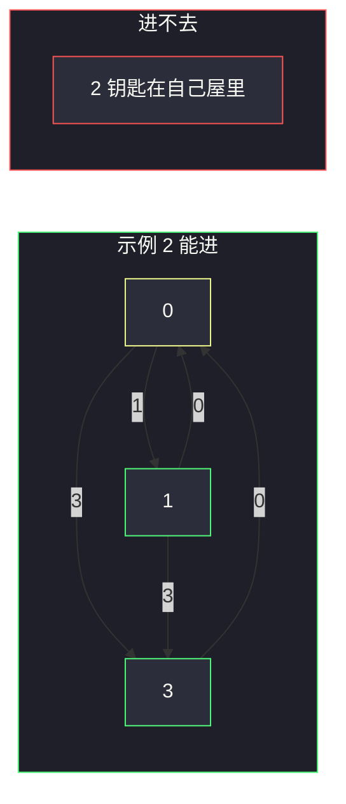
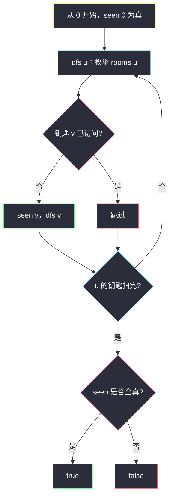

# 钥匙和房间（图遍历 · 从 0 收集钥匙）

## 一、问题描述

`n` 个房间编号 `0 .. n-1`，除 0 号外初始都锁着。`rooms[i]` 是进了房间 `i` 之后能拿到的钥匙列表（钥匙 `j` 能打开房间 `j`）。从 0 出发，问**能否打开并进入所有房间**。

> 🔗 LeetCode 841：https://leetcode.cn/problems/keys-and-rooms/
>
> 数据范围：`2 ≤ n ≤ 1000`，钥匙总数 `1 ≤ Σ rooms[i].length ≤ 3000`，同一房间内钥匙不重复。
>
> 📚 灵茶题单：**图论 · §1.1 深度优先搜索（DFS）**（1412 分）。

**示例 1**

```
输入：rooms = [[1],[2],[3],[]]
输出：true
0 拿到 1 → 1 拿到 2 → 2 拿到 3 → 进入 3。四个房间都进过。
```

**示例 2**

```
输入：rooms = [[1,3],[3,0,1],[2],[0]]
输出：false
0 能拿到 1 和 3；1 与 3 给的钥匙仍是 0、1、3。2 号钥匙在房间 2 里，进不去。
```

**直观理解**

房间是点，钥匙是有向边：`i → j` 表示「进了 i 就能去 j」。这张图从 0 出发做一次遍历，看访问过的点数是否等于 `n`。

---

## 二、暴力解法

把「当前拥有的钥匙」当集合，反复扫描所有房间：若某房间还没进、且钥匙已有，就进去把里面的钥匙并入集合。直到某一轮没有任何新房间。

```python
class Solution:
    def canVisitAllRooms(self, rooms: list[list[int]]) -> bool:
        n = len(rooms)
        have = set(rooms[0])
        have.add(0)
        opened = {0}
        changed = True
        while changed:
            changed = False
            for i in range(n):
                if i not in opened and i in have:
                    opened.add(i)
                    for k in rooms[i]:
                        have.add(k)
                    changed = True
        return len(opened) == n
```

每轮扫 `n` 个房间，最多开 `n` 间，时间 `O(n² + 总钥匙)`。`n = 1000` 能过，但是在「已经拿到钥匙」时还要傻等下一轮扫描，写法臃肿。

### 🔴 瓶颈在哪里

拿到钥匙的瞬间就该去对应房间。这正是图 DFS/BFS：点 `i` 的邻接表就是 `rooms[i]`，题目连建图都免了。从 0 遍历，`visited` 计数或最后 `all(seen)`。

---

## 三、优化探索（核心章节）

> 📚 本题在灵茶题单中属于 **图论 · §1.1 DFS**。`rooms` 本身就是有向图邻接表。从 0 DFS/BFS，能走进去的房间全部标记；最后 `visited` 个数等于 `n`。

### 3.1 边的含义

钥匙 `j` 在房间 `i` 里 ⇒ 有向边 `i → j`。可能有环（示例 2 的 `0 ⇄ 1`、`3 → 0`），必须 `visited`，否则递归转圈。

房间 2 在示例 2 里有出边到自己持有的钥匙，但**没有入边从 0 所在连通块连过来**，所以永远进不去——「2 的钥匙在 2 里面」是典型死锁。



### 3.2 遍历流程



`n ≤ 1000`，递归深度最坏 `n`，Python 默认 1000 在链上可能擦边。更稳的是显式栈 / BFS。下面主解用递归 DFS（LeetCode 实测链极少顶满）；若担心栈，把 `dfs` 换成队列即可，判断仍是 `all(seen)`。

BFS 与 DFS 只是打开房间的顺序不同：DFS 沿一把钥匙走到头，BFS 按「本层新拿到的钥匙」摊开。连通块相同，答案相同。

### 3.3 一句话核心

> **rooms 就是邻接表；从 0 DFS，钥匙指向的房间未访问就走进去。最后访问数等于 n 则为 true。**

---

## 四、代码实现

### Python（主解：DFS）

```python
class Solution:
    def canVisitAllRooms(self, rooms: list[list[int]]) -> bool:
        n = len(rooms)
        seen = [False] * n

        def dfs(u: int) -> None:
            seen[u] = True
            for v in rooms[u]:
                if not seen[v]:
                    dfs(v)

        dfs(0)
        return all(seen)
```

**变量含义**

| 变量 | 含义 |
|------|------|
| `rooms[u]` | 点 `u` 的出边，即屋里的钥匙 |
| `seen` | 已经进入过的房间 |
| `all(seen)` | 是否每个房间都进去过 |

BFS 版：队列放 0，弹出后把还没进的钥匙房间入队，最后同样 `all(seen)`。不要用集合存「钥匙」再和房间对账——进了房间就等于拥有它的钥匙，遍历本身就是在用钥匙。

```python
from collections import deque

class Solution:
    def canVisitAllRooms(self, rooms: list[list[int]]) -> bool:
        n = len(rooms)
        seen = [False] * n
        seen[0] = True
        q = deque([0])
        while q:
            u = q.popleft()
            for v in rooms[u]:
                if not seen[v]:
                    seen[v] = True
                    q.append(v)
        return all(seen)
```

与 DFS 对拍同一组样例。`n=1000` 的链上 BFS 没有递归深度问题，提交更稳。

### Java（可选）

```java
class Solution {
    public boolean canVisitAllRooms(List<List<Integer>> rooms) {
        int n = rooms.size();
        boolean[] seen = new boolean[n];
        dfs(rooms, 0, seen);
        for (boolean x : seen) {
            if (!x) {
                return false;
            }
        }
        return true;
    }

    private void dfs(List<List<Integer>> rooms, int u, boolean[] seen) {
        seen[u] = true;
        for (int v : rooms.get(u)) {
            if (!seen[v]) {
                dfs(rooms, v, seen);
            }
        }
    }
}
```

---

## 五、具体例子演示

示例 1：`rooms = [[1],[2],[3],[]]`。

| 步 | 调用 | 拿到的钥匙 | 新走进 | seen |
|----|------|------------|--------|------|
| 1 | `dfs(0)` | `[1]` | 1 | `{0,1}` |
| 2 | `dfs(1)` | `[2]` | 2 | `{0,1,2}` |
| 3 | `dfs(2)` | `[3]` | 3 | `{0,1,2,3}` |
| 4 | `dfs(3)` | `[]` | — | 四个 True |

`all(seen)` 为 true。这是一条链，DFS 顺序就是房间号 0-1-2-3。

示例 2：`rooms = [[1,3],[3,0,1],[2],[0]]`。

| 步 | 调用 | 钥匙 | 判定 | seen |
|----|------|------|------|------|
| 1 | `dfs(0)` | 1, 3 | 都未访问 | `{0}` → 先进入 1 |
| 2 | `dfs(1)` | 3, 0, 1 | 0 已访问；1 是自己；3 未访问 | `{0,1}` |
| 3 | `dfs(3)` | 0 | 0 已访问，返回 | `{0,1,3}` |
| 4 | 回到 `dfs(0)` 的钥匙 3 | 3 已访问 | 结束 | `{0,1,3}` |

房间 2 的 `seen` 仍是 false，返回 **false**。2 号钥匙从未出现在 0、1、3 的列表里。

若用 BFS，队列变化：

```
初始 q = [0]，seen = {0}
弹出 0，钥匙 1、3 入队 → q = [1, 3]
弹出 1，钥匙 3、0、1 均已 seen，不入队
弹出 3，钥匙 0 已 seen
队列空。len(seen)=3 < 4
```

「2 的钥匙在 2 里面」可以记成：有向图里 2 的入度为 0（相对 0 所在弱连通的可达部分）。遍历开始前不必算入度——搜完看 `seen[2]` 即可。若题目改成「最少要再找几把万能钥匙才能全开」，就变成：从 0 遍历后，未访问点各算一个还需打开的连通入口，那是另一题。

---

## 六、复杂度分析

| 方法 | 时间 | 空间 | 说明 |
|------|------|------|------|
| 反复扫房间 | `O(n² + m)` | `O(n)` | `m` 为钥匙总数 |
| DFS / BFS（主解） | `O(n + m)` | `O(n)` 栈或队列 | 每间房、每把钥匙常数次 |

`m = Σ |rooms[i]| ≤ 3000`，和 `n` 同量级。布尔数组 `seen` 比 `set` 更快、更好写。不必再开一份「钥匙集合」：进了房间就遍历它的列表，等价于立刻使用刚拿到的钥匙。

---

## 七、对比总结

| 维度 | 钥匙集合 + 轮扫 | 图 DFS |
|------|-----------------|--------|
| 模型 | 持有物集合 | 有向图可达 |
| 何时进房间 | 下一轮扫描才发现 | 拿到钥匙立刻递归/入队 |
| 代码量 | 长 | 邻接表已是 `rooms` |

**易错点**

1. **没从 0 开始标记**：0 默认开着，必须进 `seen`，否则 `all(seen)` 错。
2. **把钥匙当无向边**：`i` 有 `j` 的钥匙不代表 `j` 有 `i` 的钥匙，只加方向 `i → j`。
3. **用钥匙集合代替 visited**：可能拿着钥匙却还没「进入」去搜屋里更多钥匙——应在进入时遍历 `rooms[i]`。
4. **环上不 vis**：示例 2 的 `0-1` 会无限递归。
6. **`rooms[i]` 含 i 自己**：自环，`seen[i]` 已真，下一句 `if not seen` 自然跳过，不必特判。
7. **空房间**：`rooms[i] = []` 只表示没有新钥匙，该房间仍算访问过（示例 1 的 3 号）。

---

## 八、举一反三

| 题目 | 关系 |
|------|------|
| [1971. 寻找图中是否存在路径](https://leetcode.cn/problems/find-if-path-exists-in-graph/) | 无向图两点可达，同样 vis + DFS/BFS |
| [547. 省份数量](https://leetcode.cn/problems/number-of-provinces/) | 多次遍历数连通块；本题只问 0 能否覆盖全部点 |
| [2368. 受限条件下可到达节点的数目](https://leetcode.cn/problems/reachable-nodes-with-restrictions/) | 从 0 遍历，受限点当墙；本题没有墙，缺的是入边 |
| [1319. 连通网络的操作次数](https://leetcode.cn/problems/number-of-operations-to-make-network-connected/) | 先数连通块，再看多余边够不够把块连起来 |
| [133. 克隆图](https://leetcode.cn/problems/clone-graph/) | 同样从一点 DFS 整图，额外要拷贝节点 |

同目录图遍历：[2368. 受限条件下可到达节点的数目](https://leetcode.cn/problems/reachable-nodes-with-restrictions/) 也是从 0 DFS/BFS，差别只是本题邻接表已写在 `rooms` 里、没有受限墙。

**思想迁移**

- 「钥匙 / 权限 / 前置房间」都能建成有向图，从默认解锁的点遍历。
- 口诀：**「房间当点，钥匙当出边；从 0 走一遍，visited 满 n 才能全开。」**
