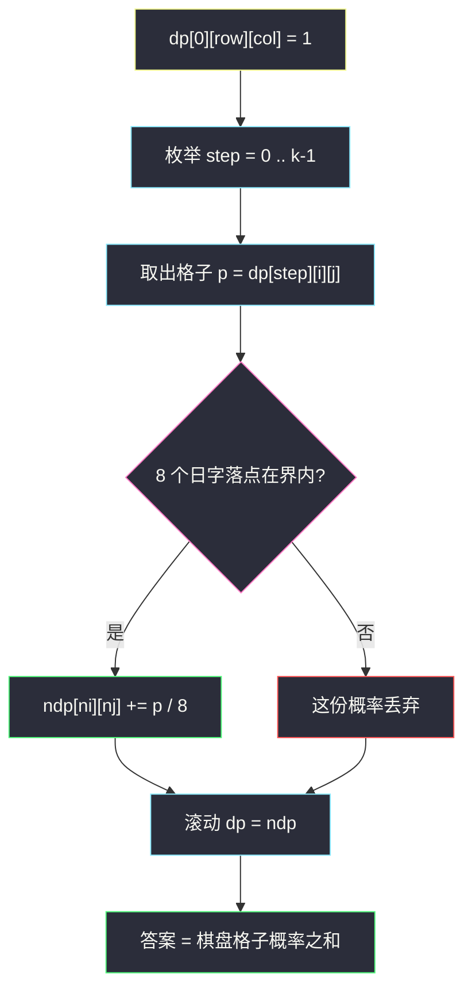
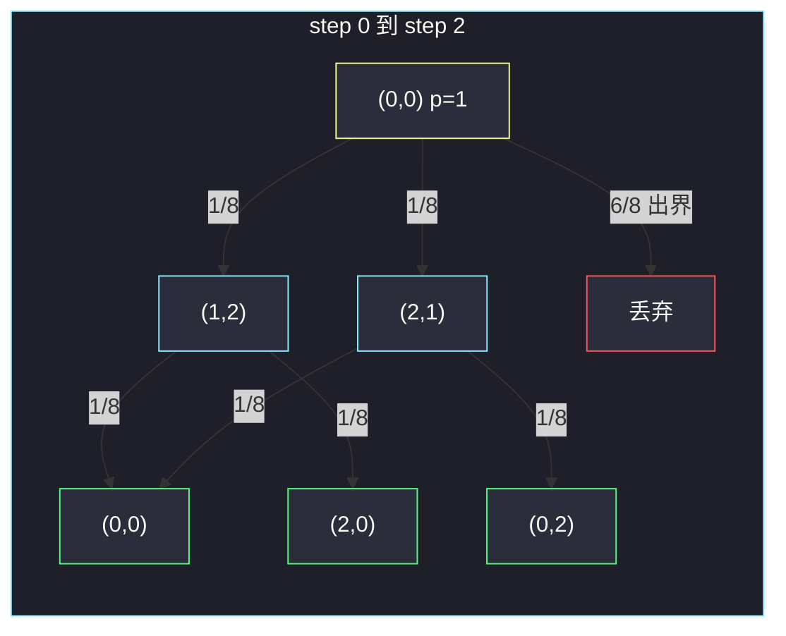

# 骑士在棋盘上的概率（概率 DP · 走 k 步仍在棋盘）

## 一、问题描述

`n × n` 棋盘，骑士从格子 `(row, column)` 出发，一共走 `k` 步。每一步有 **8 个方向**（日字：`(±1, ±2)` 与 `(±2, ±1)`），**等概率** 选一个。走出棋盘就停止（之后的步永远在棋盘外）。求走完 `k` 步后**仍在棋盘上**的概率。

> 🔗 LeetCode 688：https://leetcode.cn/problems/knight-probability-in-chessboard/
>
> 数据范围：`1 ≤ n ≤ 25`，`0 ≤ k ≤ 100`，`0 ≤ row, column ≤ n-1`。
>
> 📚 灵茶题单：**十五、概率 DP、期望 DP**。状态 `dp[step][i][j]` = 走了 `step` 步后停在 `(i, j)` 的概率；出界贡献 0，不必单独开「界外」格子。

「仍在棋盘上」= 这 `k` 步里每一步的落点都在 `[0, n) × [0, n)`。某一步出界后，后面不管怎么跳，概率都记到「出界」里，对答案没有贡献。

**示例 1**

```
输入：n = 3, k = 2, row = 0, column = 0
输出：0.0625
解释：第一步只有 (1,2)、(2,1) 两格在棋盘内，各 1/8；第二步从这两格再各有 2/8 留在棋盘。4 / 64 = 0.0625。
```

**示例 2**

```
输入：n = 1, k = 0, row = 0, column = 0
输出：1.00000
解释：0 步，人还在起点，概率 1。
```

**直观理解**

每一步把当前格子上的概率 **八等分** 泼到 8 个日字落点；落在棋盘外的那一份直接扔掉。把 `k` 步之后棋盘上所有格子的概率加起来，就是答案。浮点即可，不必分数。

---

## 二、暴力解法

递归：从 `(r, c)` 还剩 `steps` 步，返回「这 steps 步都不出界」的概率。

```python
class Solution:
    def knightProbability(self, n: int, k: int, row: int, column: int) -> float:
        dirs = ((-2, -1), (-2, 1), (-1, -2), (-1, 2),
                (1, -2), (1, 2), (2, -1), (2, 1))

        def dfs(steps: int, i: int, j: int) -> float:
            if not (0 <= i < n and 0 <= j < n):
                return 0.0
            if steps == 0:
                return 1.0
            s = 0.0
            for di, dj in dirs:
                s += dfs(steps - 1, i + di, j + dj)
            return s / 8.0

        return dfs(k, row, column)
```

官方两例都能过。每个状态分 8 叉，最坏 `O(8^k)`，`k = 100` 不可用。同一组 `(steps, i, j)` 会被算很多次——这就是概率 DP 要记住的东西。

### 🔴 瓶颈在哪里

「还剩 `t` 步、人在 `(i, j)`」的存活概率是确定的。记忆化后状态数 `k · n²`，每个 8 个后继，变成 `O(k n²)`。迭代 DP 就是把这张表从 `step = 0` 填到 `step = k`。

---

## 三、优化探索（核心章节）

> 📚 本题在灵茶题单中属于 **十五、概率 DP、期望 DP**。概率 DP 的模板：先写「到达某格子的概率」而不是「从某格子出发的存活率」；转移是「把当前概率均分给合法后继」。出界的概率自然流失，最后把棋盘上的概率求和。

### 3.1 状态

`dp[step][i][j]` = 恰好走了 `step` 步、且每一步都在棋盘内、当前停在 `(i, j)` 的概率。

- 初值：`dp[0][row][column] = 1`，其余 0。
- 转移：若 `dp[step][i][j] = p > 0`，对 8 个方向 `(ni, nj)`：
  - 在界内：`dp[step+1][ni][nj] += p / 8`
  - 出界：什么都不加（这份 `p/8` 从「在棋盘上」里消失）
- 答案：`sum(dp[k][i][j])` 对所有格子。

「出界贡献 0」已经写进转移里，不要再单独维护一个 `out` 变量。

### 3.2 为什么正向按步填

第 `step+1` 步的概率只依赖第 `step` 步。从 0 推到 `k`，每层用上一层。可以只留两层 `n × n` 滚动。

也可以记忆化「还剩 `t` 步在 `(i,j)` 的存活率」，和「已经走了 `step` 步在 `(i,j)` 的到达率」互为转置，复杂度相同。逐步画格子时，**到达率**更好对拍。



### 3.3 和「期望 DP」差在哪

本题问的是概率（事件：k 步后仍在棋盘），不是期望步数、期望分数。写法仍是概率 DP：状态是概率，转移是加 `p/8`。若问「直到出界的期望步数」，才改成期望方程。不要把答案乘格子上的「分值」——格子没有分值。

### 3.4 一句话核心

> **dp[step][i][j] 是走到这里的概率；每步把 p 均分成 8 份泼给日字格，泼出界的扔掉，最后把棋盘加起来。**

---

## 四、代码实现

### Python（主解：按步滚动）

```python
class Solution:
    def knightProbability(self, n: int, k: int, row: int, column: int) -> float:
        # dp[i][j] = 当前这一步停在 (i, j) 的概率
        dirs = ((-2, -1), (-2, 1), (-1, -2), (-1, 2),
                (1, -2), (1, 2), (2, -1), (2, 1))
        dp = [[0.0] * n for _ in range(n)]
        dp[row][column] = 1.0
        for _ in range(k):
            ndp = [[0.0] * n for _ in range(n)]
            for i in range(n):
                for j in range(n):
                    p = dp[i][j]
                    if p == 0.0:
                        continue
                    share = p / 8.0
                    for di, dj in dirs:
                        ni, nj = i + di, j + dj
                        if 0 <= ni < n and 0 <= nj < n:
                            ndp[ni][nj] += share
            dp = ndp
        return sum(sum(r) for r in dp)
```

`k = 0` 时循环 0 次，答案就是 1。`n = 1` 且 `k ≥ 1` 时 8 个方向全出界，答案 0。

**变量含义**

| 写法 | 含义 |
|------|------|
| `dp[i][j]` | 本层走完后在 `(i, j)` 的概率 |
| `share = p / 8` | 每个方向分到的概率 |
| 出界不写入 `ndp` | 等价于贡献 0 |

### 等价：记忆化「剩余步数」

```python
from functools import cache

class Solution:
    def knightProbability(self, n: int, k: int, row: int, column: int) -> float:
        dirs = ((-2, -1), (-2, 1), (-1, -2), (-1, 2),
                (1, -2), (1, 2), (2, -1), (2, 1))

        @cache
        def dfs(steps: int, i: int, j: int) -> float:
            # 还剩 steps 步、人在 (i, j)，最终仍在棋盘的概率
            if not (0 <= i < n and 0 <= j < n):
                return 0.0
            if steps == 0:
                return 1.0
            return sum(dfs(steps - 1, i + di, j + dj) for di, dj in dirs) / 8.0

        return dfs(k, row, column)
```

### Java（最优解：滚动数组）

```java
class Solution {
    private static final int[][] DIRS = {
        {-2, -1}, {-2, 1}, {-1, -2}, {-1, 2},
        {1, -2}, {1, 2}, {2, -1}, {2, 1}
    };

    public double knightProbability(int n, int k, int row, int column) {
        double[][] dp = new double[n][n];
        dp[row][column] = 1.0;
        for (int step = 0; step < k; step++) {
            double[][] ndp = new double[n][n];
            for (int i = 0; i < n; i++) {
                for (int j = 0; j < n; j++) {
                    if (dp[i][j] == 0) {
                        continue;
                    }
                    double share = dp[i][j] / 8.0;
                    for (int[] d : DIRS) {
                        int ni = i + d[0], nj = j + d[1];
                        if (ni >= 0 && ni < n && nj >= 0 && nj < n) {
                            ndp[ni][nj] += share;
                        }
                    }
                }
            }
            dp = ndp;
        }
        double ans = 0;
        for (double[] r : dp) {
            for (double x : r) {
                ans += x;
            }
        }
        return ans;
    }
}
```

---

## 五、具体例子演示

### 5.1 官方示例 1：每一步的格子

`n = 3`，`k = 2`，起点 `(0, 0)`。日字从角上只能踩到两格。

**step = 0**

|  | 0 | 1 | 2 |
|--|---|---|---|
| 0 | **1** | 0 | 0 |
| 1 | 0 | 0 | 0 |
| 2 | 0 | 0 | 0 |

从 `(0,0)` 的 8 个落点：`(1,2)`、`(2,1)` 在棋盘，其余 6 个出界。

**step = 1**（各 `1/8 = 0.125`）

|  | 0 | 1 | 2 |
|--|---|---|---|
| 0 | 0 | 0 | 0 |
| 1 | 0 | 0 | **1/8** |
| 2 | 0 | **1/8** | 0 |

棋盘上概率和 = `0.25`。已经有 75% 在第一步就掉下去了。

**step = 2**（每个在棋盘上的方向贡献 `0.125 / 8 = 1/64 = 0.015625`）

从 `(1,2)` 只剩 `(0,0)`、`(2,0)` 在界内；从 `(2,1)` 只剩 `(0,0)`、`(0,2)` 在界内。

|  | 0 | 1 | 2 |
|--|---|---|---|
| 0 | **2/64** | 0 | **1/64** |
| 1 | 0 | 0 | 0 |
| 2 | **1/64** | 0 | 0 |

和 = `4/64 = 0.0625`。对拍官方。



绿格四个贡献加起来 `4 × 1/64`。中间的 `(0,0)` 被两条路径叠了两次，所以是 `2/64`。

### 5.2 官方示例 2：k = 0

`n = 1`，`k = 0`，`(0,0)`。不滚动，`dp` 里只有 `1`，答案 `1.0`。对拍官方。

若改成 `k = 1`：唯一格子的 8 个日字全在棋盘外，`ndp` 全 0，答案 `0`。

### 5.3 为什么不能只数「合法路径条数」

角上第一步 2 条合法、第二步再 2 条，看起来像 `2 × 2 = 4` 条，除以 `8² = 64` 碰巧等于 0.0625。一旦某条路径中途经过中心，出度不再相同（中心 8 个方向可能都在棋盘内），**不同路径概率权重一样，但「仍在棋盘」的路径条数不再是 8^k 的简单分子**。必须用概率相加，不要改成整数计数再除。

---

## 六、复杂度分析

| 方法 | 时间 | 空间 | 说明 |
|------|------|------|------|
| 朴素递归 | `O(8^k)` | `O(k)` 栈 | `k=100` 超时 |
| 记忆化 / 按步 DP（主解） | `O(k n²)` | `O(n²)` 滚动，或 `O(k n²)` 三维 | `n≤25`，`k≤100`，约 `5·10^5` 次转移 |

每个状态 8 个常数方向，隐藏的 8 不写进大 O 也可以。

---

## 七、对比总结

| 维度 | 576 出界路径 | 本题 |
|------|-------------|------|
| 问什么 | 出界路径条数（模 1e9+7） | 留在棋盘的概率 |
| 出界 | 计入答案 | 丢掉，答案不加 |
| 转移 | 整数 `+1` | 浮点 `+ p/8` |

**易错点**

1. **先判断出界再判断 `steps == 0`**：已经出界即使步数用完也是 0，顺序反了会把出界格子算成 1。
2. **答案写成某个格子而不是求和**：人最终可以停在任意合法格。
3. **把 8 个方向写成国际象棋车/王**：必须是日字 8 个。
4. **`k = 0` 漏掉**：循环 0 次自然对；若写成 `for step in 1..k` 再特判也可以。
5. **用路径条数 `/ 8^k`**：中心与角落出度不同，只有「每步都 ÷8」的概率 DP 才对。

---

## 八、举一反三

| 题目 | 关系 |
|------|------|
| [576. 出界的路径数](https://leetcode.cn/problems/out-of-boundary-paths/) | 同一张棋盘、同一套走法，改成「出界条数」 |
| [935. 骑士拨号器](https://leetcode.cn/problems/knight-dialer/) | 电话键上的骑士，计方案数 |
| [688. 骑士在棋盘上的概率](https://leetcode.cn/problems/knight-probability-in-chessboard/) | 本题 |
| [62. 不同路径](https://leetcode.cn/problems/unique-paths/) | 格子 DP，但是方案数不是概率 |

**思想迁移**

- 概率均分给分支；非法分支不写回 DP，等于乘 0。
- 口诀：**「按步泼 p/8；出界扔掉；最后把棋盘加起来。」**
