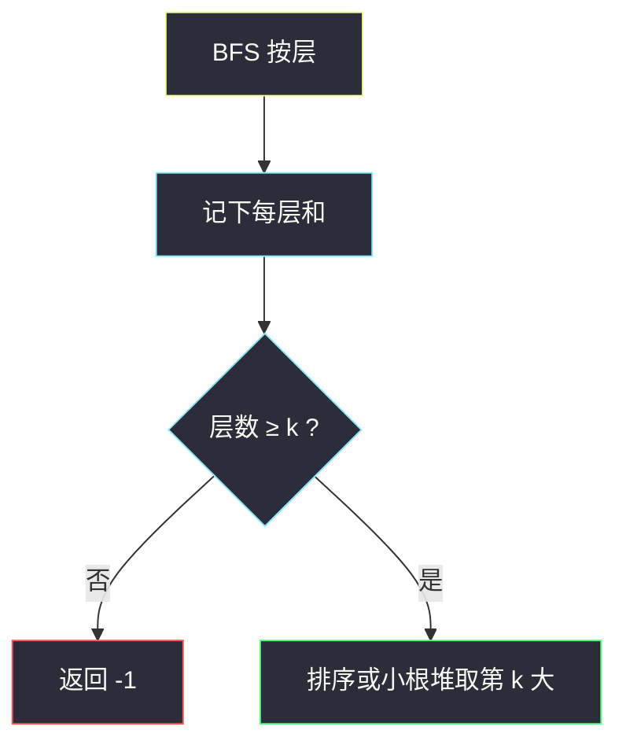
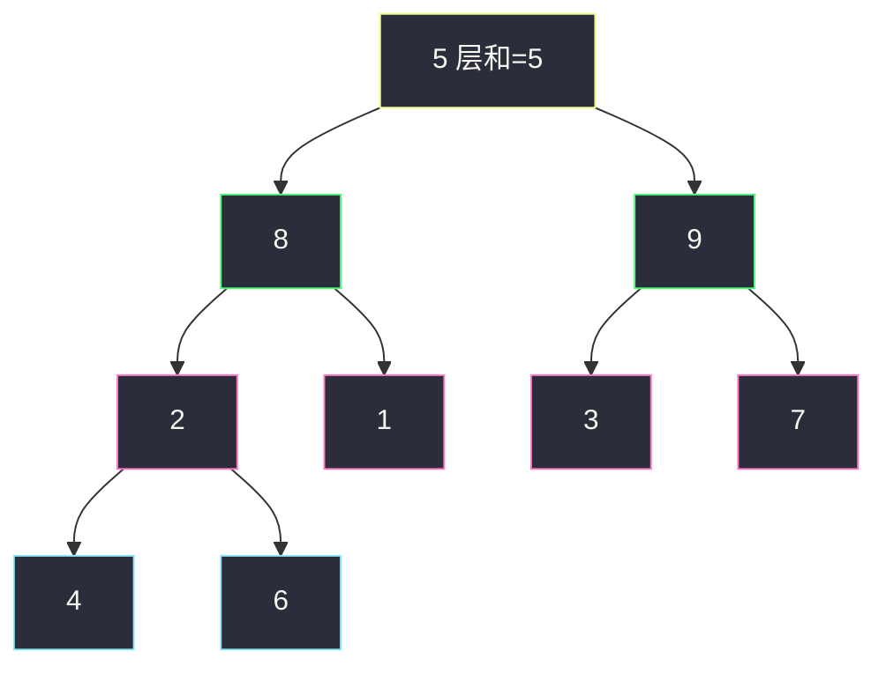

# 二叉树中的第 K 大层和（BFS 层和 · 第 k 大）

## 一、问题描述

给你二叉树根 `root` 和正整数 `k`。同一层节点值的和叫**层和**。返回第 `k` 大的层和（层和可以相同，按层计数、不去重）。层数不足 `k` 则返回 `-1`。

与根距离相同的节点算同一层。根是第 1 层。

> 🔗 LeetCode 2583：https://leetcode.cn/problems/kth-largest-sum-in-a-binary-tree/
>
> 数据范围：`2 <= n <= 10^5`，`1 <= Node.val <= 10^6`，`1 <= k <= n`。
>
> 📚 灵茶题单：**二叉树 · §2.13 二叉树 BFS**（1374 分）。

**示例 1**

```
输入：root = [5,8,9,2,1,3,7,4,6], k = 2
输出：13
树形：
        5
       / \
      8   9
     / \ / \
    2  1 3  7
   / \
  4   6
层和：5，8+9=17，2+1+3+7=13，4+6=10。
从大到小 17、13、10、5，第 2 大是 13。
```

**示例 2**

```
输入：root = [1,2,null,3], k = 1
输出：3
层和：1、2、3，最大是 3。
```

**直观理解**

先按层把每一层的和求出来，再在这至多 `n` 个数字里找第 `k` 大。求层和是标准 BFS；第 k 大就是排序或大小为 `k` 的小根堆。层和最大约 `10^5 × 10^6 = 10^11`，Python 不用担心，Java 必须用 `long`。

---

## 二、暴力解法

DFS 带深度，用哈希表累加每层和，再把所有层和丢进数组排序：

```python
class Solution:
    def kthLargestLevelSum(self, root: Optional[TreeNode], k: int) -> int:
        sums: dict[int, int] = {}

        def dfs(node: Optional[TreeNode], d: int) -> None:
            if node is None:
                return
            sums[d] = sums.get(d, 0) + node.val
            dfs(node.left, d + 1)
            dfs(node.right, d + 1)

        dfs(root, 0)
        arr = sorted(sums.values())
        if len(arr) < k:
            return -1
        return arr[-k]
```

能过，但层的天然顺序被打散，还多一张哈希表。BFS 扫完一层和就直接出来，更贴 §2.13。

### 复杂度

- **时间**：`O(n + h log h)`，`h` 为层数。
- **空间**：`O(n)` 哈希 + 递归栈。

### 🔴 瓶颈在哪里

层和是「横向」统计，哈希只是把层号当地图。队列按层推进时，当前队列里的点就是一整层，`size` 快照后累加即可，不必记层号。

---

## 三、优化探索（核心章节）

> 📚 本题在灵茶题单中属于 **二叉树 · §2.13 二叉树 BFS**。先 BFS 收齐层和，再在层和数组上取第 k 大。同节的 [最大层内元素和](https://leetcode.cn/problems/maximum-level-sum-of-a-binary-tree/)（`maximum-level-sum-of-a-binary-tree.md`）只要最大一层；本题要第 k 大，层不够给 `-1`。

### 3.1 size 快照收层和

```
q = [root]
while q 非空:
    sz = len(q)          # 本层节点数，先冻住
    s = 0
    重复 sz 次:
        出队 node，s += node.val
        左右孩子入队
    记下 s
```

内层循环开始时队列里全是本层，结束时全是下一层。

### 3.2 第 k 大

层数 `h` 通常远小于 `n`。收到 `h` 个层和之后：

- **默写版**：升序排序，取 `arr[-k]`；`h < k` 则 `-1`。
- **堆**：维护大小为 `k` 的小根堆，堆顶就是第 k 大；堆里不足 `k` 个则 `-1`。

层和可以重复，**不要去重**。两层都是 15，它们占两个名次。

### 3.3 溢出

Java 里 `int` 只有约 `2×10^9`，一层可以到 `10^11`。累加器用 `long`，列表也存 `Long`。



### 3.4 一句话核心

> **BFS 按层累加得到层和数组；层数不够回 -1，否则取第 k 大（可重复、用 long）。**

---

## 四、代码实现

### Python（主解：BFS + 排序）

```python
from collections import deque

class Solution:
    def kthLargestLevelSum(self, root: Optional[TreeNode], k: int) -> int:
        q = deque([root])
        arr = []
        while q:
            s = 0
            for _ in range(len(q)):
                node = q.popleft()
                s += node.val
                if node.left:
                    q.append(node.left)
                if node.right:
                    q.append(node.right)
            arr.append(s)
        if len(arr) < k:
            return -1
        arr.sort()
        return arr[-k]
```

**变量含义**

| 变量 | 含义 |
|------|------|
| `q` | 当前层节点 |
| `s` | 本层层和 |
| `arr` | 各层层和，稍后 `arr[-k]` 即第 k 大 |

`k` 从 1 起算：最大是 `arr[-1]`，第 2 大是 `arr[-2]`。

### 可选：大小为 k 的小根堆

```python
import heapq

h = []
for s in arr:
    heapq.heappush(h, s)
    if len(h) > k:
        heapq.heappop(h)
return h[0] if len(h) == k else -1
```

层数很少时排序更短，面试优先排序。

### Java（可选，注意 long）

```java
class Solution {
    public long kthLargestLevelSum(TreeNode root, int k) {
        Queue<TreeNode> q = new ArrayDeque<>();
        List<Long> arr = new ArrayList<>();
        q.offer(root);
        while (!q.isEmpty()) {
            long s = 0;
            int sz = q.size();
            for (int i = 0; i < sz; i++) {
                TreeNode node = q.poll();
                s += node.val;
                if (node.left != null) q.offer(node.left);
                if (node.right != null) q.offer(node.right);
            }
            arr.add(s);
        }
        if (arr.size() < k) return -1;
        Collections.sort(arr);
        return arr.get(arr.size() - k);
    }
}
```

---

## 五、具体例子演示

示例 1，`k = 2`。每层写出**进入本层时的队列**和层和。

```
        5
       / \
      8   9
     / \ / \
    2  1 3  7
   / \
  4   6
```

| 层 | 队列（从左到右） | 层和 s |
|----|------------------|--------|
| 1 | `[5]` | 5 |
| 2 | `[8, 9]` | 8+9=**17** |
| 3 | `[2, 1, 3, 7]` | 2+1+3+7=**13** |
| 4 | `[4, 6]` | 4+6=**10** |

`arr = [5, 17, 13, 10]`，排序后 `[5, 10, 13, 17]`，`arr[-2] = 13`。层数 4，若 `k = 5` 则 `-1`。



绿是第 2 层（最大和 17），粉是第 3 层（第 2 大 13）。

---

## 六、复杂度分析

| 方法 | 时间 | 空间 | 说明 |
|------|------|------|------|
| DFS + 哈希 + 排序 | `O(n + h log h)` | `O(n)` | 多一张层号表 |
| BFS + 排序（主解） | `O(n + h log h)` | `O(w + h)` | `w` 为最宽一层 |
| BFS + 大小 k 的堆 | `O(n + h log k)` | `O(w + k)` | `h` 很大且 `k` 很小时略优 |

`h ≤ n`，`n = 10^5` 排序层和完全够用。

---

## 七、对比总结

| 维度 | 只要最大层和 #1161 | 只要最深层和 #1302 | 本题第 k 大 |
|------|-------------------|-------------------|-------------|
| BFS 骨架 | 相同 | 相同 | 相同 |
| 层和之后 | 全程取 max | 覆盖，留下最后一层 | 收齐再选第 k |

**易错点**

1. **层数 `< k` 要回 `-1`**，不要下标越界。
2. **层和不要去重**：题面写「不一定不同」。
3. **Java 用 `long`**：`int` 累加会 silently 溢出，答案错得很难查。
4. **`k` 是 1-based**：排序后取 `arr[-k]` / `arr.get(size-k)`，不是 `arr[k]`。
5. `for _ in range(len(q))` 必须在循环开始时求 `len(q)`，一边入队一边用变化中的长度会把下一层算进来。

---

## 八、举一反三

| 题目 | 关系 |
|------|------|
| [1161. 最大层内元素和](https://leetcode.cn/problems/maximum-level-sum-of-a-binary-tree/) | 同节 BFS 层和，只要最大；见 `maximum-level-sum-of-a-binary-tree.md` |
| [1302. 层数最深叶子节点的和](https://leetcode.cn/problems/deepest-leaves-sum/) | 同节，留下最后一层的和；见 `deepest-leaves-sum.md` |
| [102. 二叉树的层序遍历](https://leetcode.cn/problems/binary-tree-level-order-traversal/) | `size` 快照模板本身 |
| [637. 二叉树的层平均值](https://leetcode.cn/problems/average-of-levels-in-binary-tree/) | 层和除以层节点数 |
| [215. 数组中的第K个最大元素](https://leetcode.cn/problems/kth-largest-element-in-an-array/) | 层和收齐之后的「第 k 大」 |

**思想迁移**

- 按层统计 → BFS + `size` 快照；统计完再套一个选第 k 大。
- 口诀：**「一层一和装进数组；层不够 -1，够了取倒数第 k。」**
