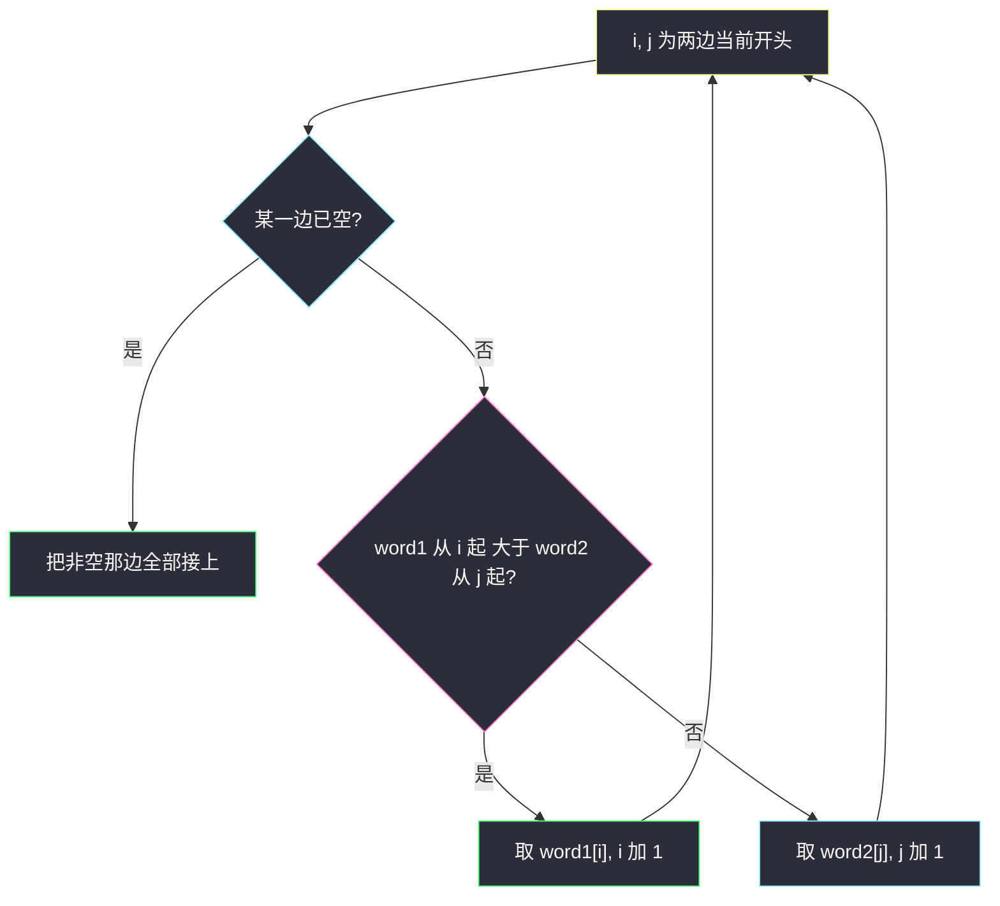
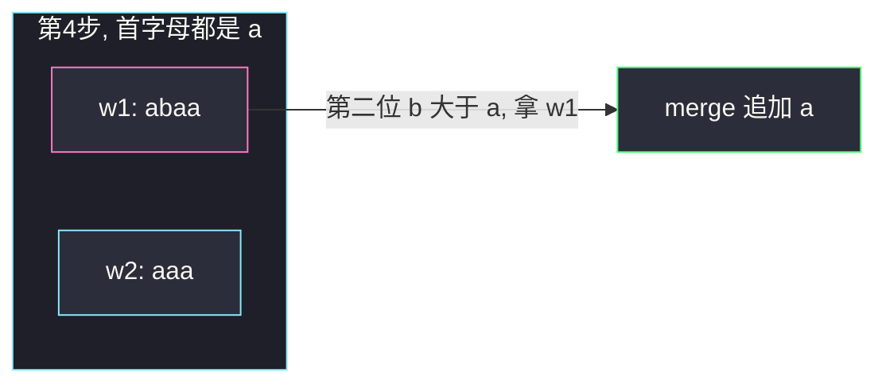

# 构造字典序最大的合并字符串（比的是剩余后缀）

## 一、问题描述

两个字符串 `word1`、`word2`。构造 `merge`：每一步从**某个非空串的当前开头**取 1 个字符接到 `merge` 末尾（该字符从原串消失）。返回能得到的**字典序最大**的 `merge`。

> 🔗 LeetCode 1754：https://leetcode.cn/problems/largest-merge-of-two-strings/
>
> 数据范围：`1 ≤ word1.length, word2.length ≤ 3000`，小写字母。
>
> 📚 灵茶题单：**§8 后缀数组 / 后缀自动机**。每步比较的是「剩下整段后缀谁更大」，后缀数组能 `O(1)` 比；`n ≤ 3000` 时朴素比后缀 `O(n²)` 已能过，**不必真建 SA**。

**示例 1**

```
输入：word1 = "cabaa", word2 = "bcaaa"
输出："cbcabaaaaa"
解释：先拿 word1 的 c，再拿 word2 的 b、c，再拿 word1 的 a、b，最后 5 个 a。
```

**示例 2**

```
输入：word1 = "abcabc", word2 = "abdcaba"
输出："abdcabcabcaba"
```

**直观理解**

像合并两条磁带，每次只能撕当前最左边那一格。想让结果尽量大：当前这一格谁大拿谁；**两个开头字母相同，不能随便挑**——要看后面谁先出现更大的字符（也就是比剩余整串）。

---

## 二、暴力解法

搜索：每步两条路，指数爆炸。记忆化「剩余下标 `(i, j)` → 从这里出发的最大 merge」是 `O(n m)` 个状态，每个状态还要生成整串，太重，`3000 × 3000` 存不下所有串。

```python
class Solution:
    def largestMerge(self, word1: str, word2: str) -> str:
        # 仅示意：爆搜在 n=3000 不可用
        def dfs(i, j):
            if i == len(word1):
                return word2[j:]
            if j == len(word2):
                return word1[i:]
            a = word1[i] + dfs(i + 1, j)
            b = word2[j] + dfs(i, j + 1)
            return a if a > b else b
        return dfs(0, 0)
```

### 🔴 瓶颈在哪里

状态多、还要比较两条完整后续。观察到：一旦这一位选了较小的那个开头，结果在这一位就已经输了；开头相同，则应选「把更大后缀留在局面里」的那一步——等价于直接比较两个剩余后缀。贪心每步 `O(n)` 比较，总共 `O(n²)`，刚好过 3000。

---

## 三、优化探索（核心章节）

> 📚 本题在灵茶题单中属于 **§8 后缀数组 / 后缀自动机**。SA 的核心能力之一就是「任意两个后缀谁大」；这里只对两条串的「当前后缀」提问，暴力扫一遍字符即可。

### 3.1 贪心规则

设指针 `i`、`j` 分别指向 `word1`、`word2` 还没拿走的开头。

- 若 `word1[i:] > word2[j:]`（字典序），拿走 `word1[i]`，`i += 1`
- 否则拿走 `word2[j]`，`j += 1`
- 某一边空了，把另一边剩余全部接上

「>」必须是**整段剩余串**的比较，不是只看 `word1[i]` 和 `word2[j]`。

### 3.2 为什么不能只比单个字符

开头不同：大的那个字符放在当前位，结果在这一位就更大，显然最优。

开头相同：只看一个字符会任意选边，后面可能立刻后悔。例如剩余 `"abaa"` 对 `"aaa"`，首字母都是 `a`：

- 拿 `"abaa"` 的 `a`，局面变成 `"baa"` vs `"aaa"`，下一位能放出 `b`
- 拿 `"aaa"` 的 `a`，局面变成 `"abaa"` vs `"aa"`，下一位只能再放 `a`

前者后续更大。而整串比较 `"abaa" > "aaa"`（第二位 `b > a`）正好告诉你该拿 word1。

若一边是另一边的真前缀：Python 里 `"aa" < "aaa"`，更长的那个更大——先把更长那边的 `a` 拿掉，不会亏（后面全是同样的字符时结果唯一）。



### 3.3 一句话核心

> **每次比较两条剩余后缀，谁大拿谁的当前字符；首字符相同必须继续往后看。**

---

## 四、代码实现

### Python（主解：后缀比较贪心）

```python
class Solution:
    def largestMerge(self, word1: str, word2: str) -> str:
        i = j = 0
        n, m = len(word1), len(word2)
        out = []
        while i < n and j < m:
            if word1[i:] > word2[j:]:
                out.append(word1[i])
                i += 1
            else:
                out.append(word2[j])
                j += 1
        out.append(word1[i:])
        out.append(word2[j:])
        return "".join(out)
```

切片 `word1[i:]` 在 CPython 是拷贝，总时间仍是 `O((n+m)²)`，`3000` 可过。不想切片时手写比较：

```python
def ge(a: str, i: int, b: str, j: int) -> bool:
    na, nb = len(a), len(b)
    while i < na and j < nb:
        if a[i] != b[j]:
            return a[i] > b[j]
        i += 1
        j += 1
    return i < na  # a 更长且 b 是 a 的前缀 → a 更大
```

主循环改成 `if ge(word1, i, word2, j)` 即可。相等时 `ge` 为假，拿 word2，与 `>` 的语义一致；两边剩余一模一样时拿哪边结果相同。

**变量含义**

| 写法 | 含义 |
|------|------|
| `i, j` | 两条串下一个要拿走的下标 |
| `word1[i:] > word2[j:]` | 剩余后缀的字典序比较 |
| `out` | 逐字符拼接，最后 join |

---

## 五、具体例子演示

**示例 1**：`word1 = "cabaa"`，`word2 = "bcaaa"`。每步写出两个剩余后缀、比较结果、拿走谁：

| 步 | word1 剩余 | word2 剩余 | 比较 | 拿走 | merge |
|----|------------|------------|------|------|-------|
| 1 | `cabaa` | `bcaaa` | `c > b` | w1 的 c | `c` |
| 2 | `abaa` | `bcaaa` | `a < b` | w2 的 b | `cb` |
| 3 | `abaa` | `caaa` | `a < c` | w2 的 c | `cbc` |
| 4 | `abaa` | `aaa` | 首字母同，第二位 `b > a` | **w1 的 a** | `cbca` |
| 5 | `baa` | `aaa` | `b > a` | w1 的 b | `cbcab` |
| 6 | `aa` | `aaa` | `aa < aaa`（真前缀） | w2 的 a | `cbcaba` |
| 7 | `aa` | `aa` | 相等，走 else 拿 w2 | w2 的 a | `cbcabaa` |
| 8 | `aa` | `a` | `aa > a` | w1 的 a | `cbcabaaa` |
| 9 | `a` | `a` | 相等 | w2 的 a | `cbcabaaaa` |
| 10 | `a` | 空 | 尾巴 | w1 的 a | `cbcabaaaaa` |

第 4 步是本题的考点：若只比当前字符 `a == a` 再随便选 w2，merge 会变成 `cbca` 之后接 `aaa…`，第 5 位是 `a` 而不是 `b`，字典序立刻输给 `cbcab…`。

对拍官方 `"cbcabaaaaa"`。



粉节点是该拿的那条后缀：表面一样的 `a`，后面藏着 `b`。

**示例 2**：`word1 = "abcabc"`，`word2 = "abdcaba"`。

前四步 word2 的后缀一直更大（`"abcabc" < "abdcaba"`，因为第三位 `c < d`），连续拿走 `a b d c`，merge = `"abdc"`。此时剩余 `"abcabc"` vs `"aba"`：第三位 `c > a`，改拿 word1，把 `"abcabc"` 整段吃完，最后接 `"aba"`。对拍官方 `"abdcabcabcaba"`。

**边界**：其中一个为空，答案就是另一个；两串相同，怎么拿结果都一样。

---

## 六、复杂度分析

| 方法 | 时间 | 空间 | 说明 |
|------|------|------|------|
| 爆搜两条路 | 指数 | 递归栈 | 不可用 |
| 每次比后缀（主解） | `O((n+m)²)` | `O(n+m)` | 至多 n+m 步，每步扫描 `O(n+m)` |
| 后缀数组加速比较 | `O((n+m) log(n+m))` 构建 | `O(n+m)` | 本题长度 3000 没必要 |

拼接用列表 + `join`，避免反复 `s = s + ch` 变成平方再乘一层。

---

## 七、对比总结

| 维度 | 只比当前字符 | 比剩余整串 |
|------|--------------|------------|
| 首字符不同 | 正确 | 正确 |
| 首字符相同 | 可能选错边 | 正确 |
| 与 88 题归并 | 数值小的先出 | 这里是字典序**大**的先出 |

**易错点**

1. **`word1[i] >= word2[j]` 就拿 word1**：相等时必须看后面。
2. **比较方向反了**：本题要最大 merge，拿更大的后缀。
3. **轮流取 / 先取完一个再取另一个**：都不是最大。
4. **`>=` 写成 `>` 导致相等时的分支**：相等拿哪边都行，但不要在相等时死循环（指针必须 +1）。
5. **真前缀**：`"abc"` 和 `"abcd"` 比，更长的更大；先消耗更长那边。

---

## 八、举一反三

| 题目 | 关系 |
|------|------|
| [321. 拼接最大数](https://leetcode.cn/problems/create-maximum-number/) | 两条数组里抽子序列再 merge，merge 阶段同样比后缀 |
| [402. 移掉 K 位数字](https://leetcode.cn/problems/remove-k-digits/) | 字典序最小，单调栈；对比「最大 / 最小」两种贪心 |
| [316. 去除重复字母](https://leetcode.cn/problems/remove-duplicate-letters/) | 字典序最小 + 各字母留一次 |
| [97. 交错字符串](https://leetcode.cn/problems/interleaving-string/) | 同样是按序消耗两条串，问的是能否（DP）不是最大 |
| [88. 合并两个有序数组](https://leetcode.cn/problems/merge-sorted-array/) | 归并只比「当前头」——因为有序，当前头就决定了；本题无序，必须比整段后缀 |

**思想迁移**

- 归并类贪心：当前键相同就看键的「后缀」；有序数组里后缀信息已经编码在后续元素里，无序字符串必须显式比较。
- 口诀：**「谁的剩余整串更大，就撕谁的当前字符；单字符相等一定往后看。」**
