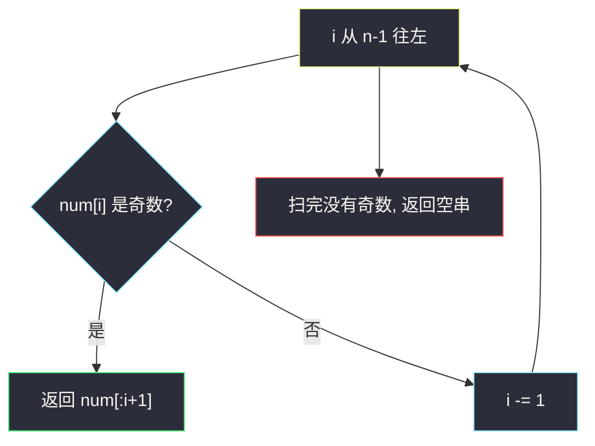
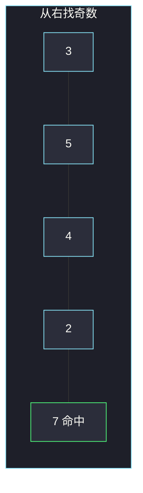

# 字符串中的最大奇数（脑筋急转弯 · 最右奇数）

## 一、问题描述

给你一个表示大正整数的字符串 `num`，返回它的一个非空子串，使得这个子串表示的整数是**奇数**，且数值**尽可能大**。没有奇数则返回空串 `""`。

子串必须连续。`num` 不含前导零。

> 🔗 LeetCode 1903：https://leetcode.cn/problems/largest-odd-number-in-string/
>
> 数据范围：`1 ≤ num.length ≤ 10^5`，`num` 只含数字且无前导零。
>
> 📚 灵茶题单：**§5.2 脑筋急转弯**（1249 分）。

**示例 1**

```
输入：num = "52"
输出："5"
解释：子串只有 "5"、"2"、"52"。奇数只有 "5"。
```

**示例 2**

```
输入：num = "4206"
输出：""
解释：每一位都是偶数，没有奇数字串。
```

**示例 3**

```
输入：num = "35427"
输出："35427"
解释：整串已经是奇数，它就是最大的。
```

**直观理解**

一个十进制数是奇数，当且仅当**个位是 1/3/5/7/9**。要数值尽量大：没有前导零时，**位数越多越大**；同样从左边开始时，应尽量把高位都留下。于是答案一定是某个前缀，且这个前缀停在**最右边的奇数位**。

---

## 二、暴力解法

枚举全部子串 `num[l..r]`，若末位为奇数，按数值比较取最大。字符串可能很长，不能 `int()`。

```python
class Solution:
    def largestOddNumber(self, num: str) -> str:
        n = len(num)
        best = ""
        for l in range(n):
            for r in range(l, n):
                if int(num[r]) % 2 == 0:
                    continue
                cand = num[l : r + 1]
                if self._greater(cand, best):
                    best = cand
        return best

    def _greater(self, a: str, b: str) -> bool:
        if not b:
            return True
        return (len(a), a) > (len(b), b)
```

子串 `O(n²)` 个，`n` 到 `10^5` 超时。`int(整串)` 还会在超长时炸掉，这是第二条死路。

### 🔴 瓶颈在哪里

奇数只取决于末位。所有「以某个奇数下标 `i` 结尾」的子串里，从 0 开始的前缀 `num[:i+1]` 位数最多、高位最大，一定不劣于从中间切开的短串。所以只需决定**切在哪一个奇数位**——切在最右那个，前缀最长。

---

## 三、优化探索（核心章节）

> 📚 本题在灵茶题单中属于 **§5.2 脑筋急转弯**：先把「最大奇数」翻译成「最长的、以奇数结尾的前缀」，再从右往左找第一个奇数位。

### 3.1 子串必须是前缀

`num` 无前导零。任意以 `i` 结尾的子串 `num[l..i]`（`l > 0`）比前缀 `num[0..i]` 更短，作为无前导零的正整数一定更小。因此候选只需考虑前缀。

### 3.2 从前缀里挑最长的奇数

前缀 `num[:k]` 是奇数 ⟺ `num[k-1]` 是奇数。最长 ⟺ `k` 尽量大 ⟺ 末位下标尽量靠右。从右往左扫，碰到第一个奇数位 `i`，答案就是 `num[:i+1]`。整串没有奇数则 `""`。



### 3.3 一句话核心

> **从右找最后一个奇数位，取到它为止的前缀；没有奇数就返回空串。不要转成 int。**

---

## 四、代码实现

### Python（主解：从右找奇数）

```python
class Solution:
    def largestOddNumber(self, num: str) -> str:
        for i in range(len(num) - 1, -1, -1):
            if int(num[i]) % 2 == 1:
                return num[: i + 1]
        return ""
```

**变量含义**

| 写法 | 含义 |
|------|------|
| `i` | 从右往左的下标 |
| `int(num[i]) % 2 == 1` | 当前位是 1/3/5/7/9 |
| `num[:i+1]` | 保留高位、切掉 `i` 右边的全部偶数尾巴 |

`num[i] in "13579"` 也可以，避免每次转 int。不要写 `int(num)`，长度可达 `10^5`。

---

## 五、具体例子演示

**示例 3**：`num = "35427"`，从右找最后一个奇数。

| 步 | i | 字符 | 奇数? | 动作 |
|----|---|------|-------|------|
| 1 | 4 | 7 | **是** | 立刻返回 `num[:5] = "35427"` |

个位已是奇数，整串保留。

**示例 1**：`num = "52"`。

| 步 | i | 字符 | 奇数? | 动作 |
|----|---|------|-------|------|
| 1 | 1 | 2 | 否 | 继续向左 |
| 2 | 0 | 5 | **是** | 返回 `num[:1] = "5"` |

**示例 2**：`num = "4206"`。

| 步 | i | 字符 | 奇数? | 动作 |
|----|---|------|-------|------|
| 1 | 3 | 6 | 否 | 向左 |
| 2 | 2 | 0 | 否 | 向左 |
| 3 | 1 | 2 | 否 | 向左 |
| 4 | 0 | 4 | 否 | 向左 |
| 5 | — | — | — | 返回 `""` |



绿格是最右奇数位；答案是从开头到这里的整段前缀。

再看 `"504"`：从右 `4` 偶、`0` 偶、`5` 奇，返回 `"5"`。中间的 `"0"` 不能单独当答案（偶数），也不能从中间截 `"04"`（前导零且更小）。

---

## 六、复杂度分析

| 方法 | 时间 | 空间 | 说明 |
|------|------|------|------|
| 枚举全部子串 | `O(n²)` 起 | `O(n)` 存答案 | `n ≤ 10^5` 不可用 |
| 从右找奇数（主解） | `O(n)` | `O(1)` 额外 | 切片答案本身 `O(n)` |

---

## 七、对比总结

| 维度 | 本题 | 普通「最大子串」 |
|------|------|------------------|
| 比大小 | 无前导零时位数优先 | 可能还要比字典序 |
| 奇偶 | 只看末位 | 通常看整体 |
| 扫描方向 | 从右往左，第一次命中即最长 | 往往要从左构造 |

**易错点**

1. **`int(num)`**：字符串太长会慢或溢出（其他语言）。只判断**一位**是否奇数。
2. **从中间截一段更大的**：没有前导零时，更短的中间子串不可能超过更长的前缀。
3. **返回最右边那一个奇数数字，丢掉高位**：`"35427"` 若只返回 `"7"` 就错了，要整段前缀。
4. **没有奇数时返回 `"0"` 或原串**：应返回 `""`。

---

## 八、举一反三

| 题目 | 关系 |
|------|------|
| [2264. 字符串中最大的 3 位相同数字](https://leetcode.cn/problems/largest-3-same-digit-number-in-string/) | 也在数字串里选「最大」子串，但约束是三位相同 |
| [1323. 6 和 9 组成的最大数字](https://leetcode.cn/problems/maximum-69-number/) | 高位优先改一位；本题是低位决定奇偶、高位尽量全留 |
| [402. 移掉 K 位数字](https://leetcode.cn/problems/remove-k-digits/) | 同样不能转 int；用栈维护字典序最小 |
| [788. 旋转数字](https://leetcode.cn/problems/rotated-digits/) | 逐位检查数字性质，不要把整段转成整数 |

**思想迁移**

- 整数奇偶只看个位；「最大」在无前导零时先拼长度。
- 超长数字当字符串处理，只动需要的那一位。
- 口诀：**「从右找奇数，切到这里当答案。」**
