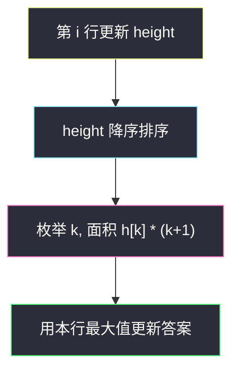
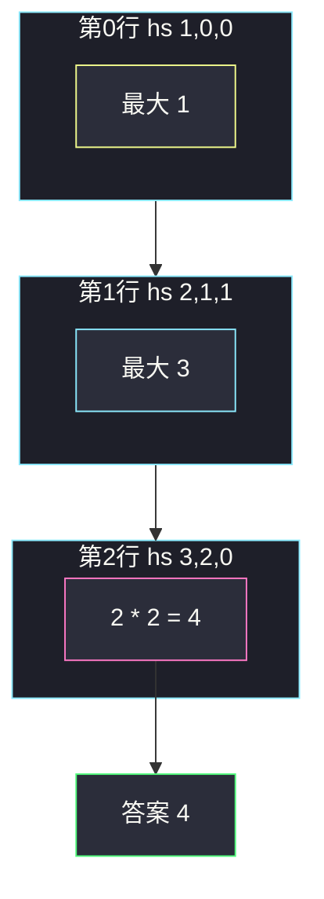

# 重新排列后的最大子矩阵（每行当底，高度排序）

## 一、问题描述

给你一个二进制矩阵 `matrix`。你可以**任意重排列**（整列一起搬家，行内 0/1 跟着列走）。重排之后，找出一个元素全为 1 的子矩阵，返回它的**最大面积**。子矩阵必须是行连续、列连续的一块。

> 🔗 LeetCode 1727：https://leetcode.cn/problems/largest-submatrix-with-rearrangements/
>
> 数据范围：`1 <= m, n <= 10^5`，`1 <= m * n <= 10^5`，`matrix[i][j]` 为 0 或 1。行×列乘积限制了总格子数，所以可以对**每一行**做一次 `O(n log n)` 排序。
>
> 📚 灵茶题单：**单调栈 · 二、矩形**。和 [#1504 统计全 1 子矩形](https://leetcode.cn/problems/count-submatrices-with-all-ones/)、[#85 最大矩形](https://leetcode.cn/problems/maximal-rectangle/) 共用「每一行当底、向上连续 1 当高度」；区别是列可以重排，**不必单调栈**，把 `height` 降序排序后取 `height_sorted[k] * (k+1)`。

**示例 1**

```
输入：matrix = [[0,0,1],[1,1,1],[1,0,1]]
输出：4
解释：把第 0 列和第 1 列对调（或把 1 都挤到一侧）后，左下可以拼出 2×2 的全 1。
```

原矩阵 / 一种重排：

```
0 0 1        1 0 0
1 1 1   →    1 1 1
1 0 1        1 1 0     ← 底两行、左两列面积 4
```

**示例 2**

```
输入：matrix = [[1,0,1,0,1]]
输出：3
解释：只有一行，把三个 1 排在一起，面积 1×3 = 3。
```

**示例 3**

```
输入：matrix = [[1,1,0],[1,0,1]]
输出：2
解释：重排后可得到 2×1 或 1×2，最大面积 2。
```

**直观理解**

列一换，某一行里的 1 可以聚到一起，但**每一列内部的 0/1 相对关系不变**——某列从第 `i` 行往上连续几个 1，重排后还是这么高。所以对「底边在第 `i` 行」这件事，每列有一个不可改的高度 `height[j]`。重排 = 给这些高度排个序。想要宽为 `w` 的全 1 矩形，就该挑**最高的 `w` 根柱**，高度取其中最矮的那根（排序后的第 `w` 名），面积 `该高度 × w`。

---

## 二、暴力解法

枚举列的全排列，对每种排列跑一遍「二进制矩阵最大矩形」（#85：每行 `height` + 单调栈）。

```python
from itertools import permutations

class Solution:
    def largestSubmatrix(self, matrix: list[list[int]]) -> int:
        m, n = len(matrix), len(matrix[0])
        ans = 0
        for perm in permutations(range(n)):
            cols = [[matrix[i][j] for j in perm] for i in range(m)]
            height = [0] * n
            for i in range(m):
                for j in range(n):
                    height[j] = height[j] + 1 if cols[i][j] else 0
                # 排列后列已相邻，最大矩形 = 直方图最大矩形
                for j in range(n):
                    left = right = j
                    while left >= 0 and height[left] >= height[j]:
                        left -= 1
                    while right < n and height[right] >= height[j]:
                        right += 1
                    ans = max(ans, height[j] * (right - left - 1))
        return ans
```

### 复杂度

- **时间**：排列 `n!`，再乘 `O(m n²)`。`n` 稍大即爆。
- **空间**：`O(m n)`。

### 🔴 瓶颈在哪里

列怎么排，只影响「哪些高度被放在一起」；最优时一定是按高度排序后取前缀。不必真的去试 `n!` 种排列。每行独立：更新 `height`，排序，枚举宽度。

---

## 三、优化探索（核心章节）

> 📚 本题在灵茶题单中属于 **二、矩形**。#84 / #85 用单调栈找「左右第一个更矮柱」；本题因为列可重排，左右邻居可以由我们指定，栈没有用武之地，**排序就是重排**。

### 3.1 高度仍然按列继承

和 1504、85 完全相同：

- `matrix[i][j] == 1`：`height[j] += 1`
- 否则 `height[j] = 0`

`height[j]`：底边在第 `i` 行时，第 `j` 列向上连续 1 的个数。列重排不会改这个数字，只改列的左右次序。

### 3.2 排序后的面积公式

把当前 `height` **降序**排成 `h0 ≥ h1 ≥ … ≥ h_{n-1}`。

对宽度 `w = k+1`（`k = 0..n-1`）：把最高的 `k+1` 列排在一起，矩形高度受最矮的那根限制，就是 `h_k`。面积 `h_k * (k+1)`。

所有宽度都试一遍，本行能得到的最大全 1 矩形就是 `max_k h_k * (k+1)`。全局再对每一行取 max。

为什么不必考虑「不取最高的那几列」？丢掉一根更高的柱、留下更矮的，高度上限只会更差或不变，宽度相同下不可能更优。



### 3.3 和单调栈最大矩形的对比

#85 列顺序锁死：宽矩形可能被中间一根矮柱拆开，必须用栈找「这根柱能向两边扩多远」。

本题列顺序自由：矮柱可以被挪到边上，不再挡路。所以「能扩多远」变成「有多少根柱高度 ≥ h」，排序后一眼看出。

### 3.4 排序会不会打乱多行的对应关系？

只对**当前这一行当底**的 `height` 数组排序，用来计算「底边在 i」的最优矩形。下一行的 `height` 仍按**原始列下标**累加，不能把排过序的数组传给下一行。实现上要 `sorted(height)` 另存，或排副本。

### 3.5 一句话核心

> **每一行当底算出各列高度，降序排序后 `max(h[k] * (k+1))` 就是本行能围出的最大全 1 矩形。**

---

## 四、代码实现

### Python（主解：每行高度降序）

```python
class Solution:
    def largestSubmatrix(self, matrix: list[list[int]]) -> int:
        m, n = len(matrix), len(matrix[0])
        height = [0] * n
        ans = 0
        for i in range(m):
            for j in range(n):
                height[j] = height[j] + 1 if matrix[i][j] else 0
            hs = sorted(height, reverse=True)   # 副本排序，原 height 留给下一行
            for k, h in enumerate(hs):
                ans = max(ans, h * (k + 1))
        return ans
```

**变量含义**

| 变量 | 含义 |
|------|------|
| `height[j]` | 原始第 `j` 列、以当前行为底的连续 1 高度 |
| `hs` | `height` 的降序副本，`hs[k]` 是第 `k+1` 高的柱 |
| `h * (k+1)` | 宽度 `k+1`、高度 `hs[k]` 的矩形面积 |
| `ans` | 所有底边、所有宽度里的最大面积 |

不要写 `height.sort(reverse=True)` 后还用同一数组去更新下一行：列下标会乱，高度会加到错误的列上。

---

## 五、具体例子演示

### 5.1 官方示例 1：逐行高度再排序

`matrix = [[0,0,1],[1,1,1],[1,0,1]]`

**第 0 行当底**

| 列 | 格子 | height |
|----|------|--------|
| 0 | 0 | 0 |
| 1 | 0 | 0 |
| 2 | 1 | 1 |

降序 `hs = [1, 0, 0]`：

| k | hs[k] | 宽度 k+1 | 面积 |
|---|-------|----------|------|
| 0 | 1 | 1 | 1 |
| 1 | 0 | 2 | 0 |
| 2 | 0 | 3 | 0 |

本行最大 1。

**第 1 行当底**（在原列顺序上累加）

| 列 | 格子 | 旧 height | 新 height |
|----|------|-----------|-----------|
| 0 | 1 | 0 | 1 |
| 1 | 1 | 0 | 1 |
| 2 | 1 | 1 | 2 |

降序 `hs = [2, 1, 1]`：

| k | hs[k] | 宽度 | 面积 | 含义 |
|---|-------|------|------|------|
| 0 | 2 | 1 | 2 | 最右那列单独一根高 2 |
| 1 | 1 | 2 | 2 | 两根 ≥1 的柱 |
| 2 | 1 | 3 | **3** | 三根都 ≥1，一整行 |

本行最大 3。把三列排成高度 `2,1,1` 后，宽 3 高 1 的条面积 3。

**第 2 行当底**

| 列 | 格子 | 旧 height | 新 height |
|----|------|-----------|-----------|
| 0 | 1 | 1 | 2 |
| 1 | 0 | 1 | **0**（切断） |
| 2 | 1 | 2 | 3 |

降序 `hs = [3, 2, 0]`：

| k | hs[k] | 宽度 | 面积 |
|---|-------|------|------|
| 0 | 3 | 1 | 3 |
| 1 | 2 | 2 | **4** |
| 2 | 0 | 3 | 0 |

`k = 1`：两根最高柱高度 3 和 2，矩形高取 2、宽 2，面积 4。这就是把原第 0 列和第 2 列排在一起、底边在最后一行的 2×2。全局答案 4。



### 5.2 示例 2：单行把 1 聚拢

`[[1,0,1,0,1]]`，`height = [1,0,1,0,1]`，降序 `[1,1,1,0,0]`。

`1*1=1`，`1*2=2`，`1*3=3`，后面乘 0。答案 3。没有重排时 1 不相邻，最大只是 1；排序等价于「把三根高为 1 的列挪到一起」。

### 5.3 示例 3：`[[1,1,0],[1,0,1]]`

第 0 行：`height = [1,1,0]` → `[1,1,0]`，最大 `1*2 = 2`。

第 1 行：列 0 累成 2，列 1 遇 0 清零，列 2 变成 1 → `[2, 0, 1]`，降序 `[2,1,0]`，最大 `2*1 = 2` 或 `1*2 = 2`。

答案 2。不能做成 2×2：重排后两行无法同时在两列上都是 1（第 1 行的两个 1 分别在「原列 0」和「原列 2」，第 0 行原列 2 是 0，原列 1 在第 1 行是 0，怎么换都凑不齐两列两行全 1）。

---

## 六、复杂度分析

| 方法 | 时间 | 空间 | 说明 |
|------|------|------|------|
| 枚举列排列 + 直方图 | `O(n! · m n²)` | `O(m n)` | 不可用 |
| 每行排序（主解） | `O(m n log n)` | `O(n)` | 总格子 `≤ 10^5`，可通过 |
| 每行计数排序 | `O(m n + m · H)` | `O(n)` | 高度 ≤ m，一般没必要 |

---

## 七、对比总结

| 维度 | #85 最大矩形 | #1504 计数 | 本题 |
|------|--------------|------------|------|
| 列顺序 | 锁死 | 锁死 | **可任意重排** |
| height | 要 | 要 | 要（按下标累加） |
| 核心操作 | 单调栈扩左右 | 向左 min / 栈 dp | **降序排序** |
| 目标 | 最大面积 | 矩形个数 | 最大面积 |

**易错点**

1. **原地 `height.sort()`**：下一行 `height[j] += 1` 会加错列。必须排副本。
2. **升序排序后用 `h[k]*(n-k)`**：可以，但容易把下标搞反；降序 `h[k]*(k+1)` 更直观。
3. **对整个矩阵只排一次列**：最优排列依赖底边在哪一行，必须每行单独排当前 `height`。
4. **当成不能换列的 #85**：漏掉「把高柱凑到一起」的面积。
5. **宽度用 `k` 而不是 `k+1`**：`k` 从 0 起，宽度是柱子个数 `k+1`。

**模板（二、矩形 · 可重排列）**

```python
# 每行更新 height（按下标）
# hs = sorted(height, reverse=True)
# ans = max(ans, hs[k] * (k+1))
```

---

## 八、举一反三

| 题目 | 关系 |
|------|------|
| [84. 柱状图中最大的矩形](https://leetcode.cn/problems/largest-rectangle-in-histogram/) | 列顺序固定时的直方图最大矩形 |
| [85. 最大矩形](https://leetcode.cn/problems/maximal-rectangle/) | 二进制矩阵 + 固定列顺序，每行跑 #84 |
| [1504. 统计全 1 子矩形](https://leetcode.cn/problems/count-submatrices-with-all-ones/) | 同款 height，计数而不是面积，列不可动 |
| [1277. 统计全为 1 的正方形子矩阵](https://leetcode.cn/problems/count-square-submatrices-with-all-ones/) | 只数正方形，列不可动 |
| [1072. 按列翻转得到最大值等行数](https://leetcode.cn/problems/flip-columns-for-maximum-number-of-equal-rows/) | 另一种「列操作改矩阵」 |

**思想迁移**

- 见到「可以重排列」，直方图的左右邻居归你选：排序代替单调栈。
- 口诀：**「一行当底出高度，降序排列当重排；第 k 高乘宽度 k+1。」**
