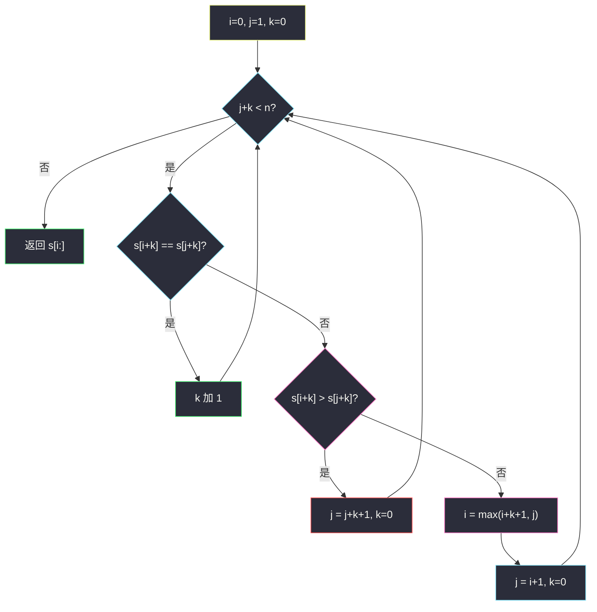
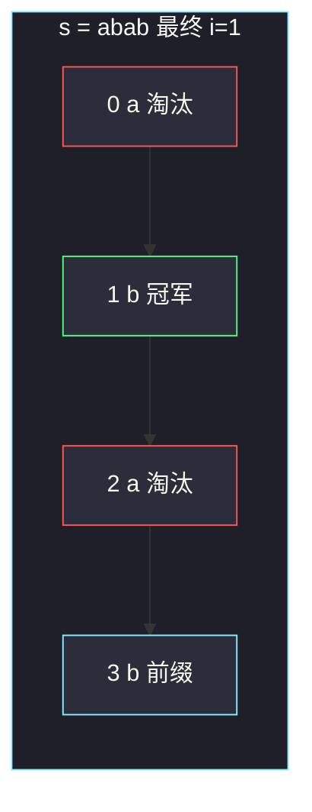

# 按字典序排在最后的子串（最大后缀 · 双指针）

## 一、问题描述

给定只含小写字母的字符串 `s`，返回它的**所有子串**里字典序最大的那一个。子串必须连续。

> 🔗 LeetCode 1163：https://leetcode.cn/problems/last-substring-in-lexicographical-order/
>
> 数据范围：`1 ≤ s.length ≤ 4·10⁵`。必须线性或近线性；暴力枚举所有后缀再两两比较是 `O(n²)`，过不了。
>
> 📚 灵茶题单：**八、后缀数组 / 后缀自动机**。后缀数组能排出所有后缀的字典序，本题只要**最大那一个后缀**，不必整表。Duval / 「最大后缀」双指针：`i` 当前最优起点，`j` 挑战者，`k` 已匹配长度。相等则 `k++`；`s[i+k] > s[j+k]` 则 `j += k+1`；否则 `i = max(i+k+1, j)`，`j = i+1`。答案是 `s[i:]`。同批 [#3403](https://leetcode.cn/problems/find-the-lexicographically-largest-string-from-the-box-i/) 在 `numFriends≥2` 时就是把这个最大后缀截断到长度 `n-k+1`。

**示例 1**

```
输入：s = "abab"
输出："bab"
解释：子串里 "bab"、"ab"、"b"、"abab" 等，字典序最大是 "bab"。
```

**示例 2**

```
输入：s = "leetcode"
输出："tcode"
解释：以 't' 开头的后缀 "tcode" 大于以 'l'、'e'、'c'、'o'、'd' 开头的所有后缀。
```

**直观理解**

「所有子串」看起来有 `n(n+1)/2` 个。若 A 是 B 的真前缀，字典序 `A < B`（短的更小）。所以最大子串一定不是任何真前缀，它必须「一直取到原串末尾」——也就是某个**后缀**。问题变成：在 n 个后缀里找字典序最大的，整段返回。

---

## 二、暴力解法

每个起点 `i` 对应后缀 `s[i:]`，两两比 max。

```python
class Solution:
    def lastSubstring(self, s: str) -> str:
        ans = s
        for i in range(1, len(s)):
            if s[i:] > ans:
                ans = s[i:]
        return ans
```

官方两例都能过。每次比较最多扫 `O(n)` 个字符，总 `O(n²)`。全是 `'a'` 时每次比到末尾；`n=4·10⁵` 超时。`max(s[i:] for i in range(n))` 同复杂度。

### 🔴 瓶颈在哪里

比较 `s[i:]` 和 `s[j:]` 时，若前 `k` 个字符相同再在第 `k` 位分出胜负，那么夹在中间的许多起点已经被这次比较「连带判决」了，不必再当候选。暴力每次只更新一个 max，把这些连带信息扔掉了。双指针把「一次比较淘汰一整段起点」写进循环。

---

## 三、优化探索（核心章节）

> 📚 本题在灵茶题单中属于 **八、后缀数组 / 后缀自动机**。SAM / SA 都能取出最大后缀，代码长、常数大。笔试默写用下面这套 Duval 风格双指针，严格 `O(n)`。

### 3.1 为什么答案一定是某个后缀

任意子串 `s[l:r]`（`r < n`）是 `s[l:n]` 的真前缀，于是 `s[l:r] < s[l:n]`。最大者必须取到 `n`，即某个 `s[i:]`。并列时更长的更大，不会在中途截断。

因此只要找到起点 `i*`，使得对所有 `j ≠ i*` 都有 `s[i*:] ≥ s[j:]`，返回 `s[i*:]`。

### 3.2 一次比较能淘汰谁

设当前最优起点 `i`，挑战起点 `j`（`i < j`），已经匹配了 `k` 个字符：

`s[i:i+k] == s[j:j+k]`，下一位 `s[i+k]` 与 `s[j+k]` 分叉（或某侧越界）。

**情况 A：`s[i+k] > s[j+k]`，现任赢。**

对每个偏移 `t = 0 .. k`：`s[i+t:i+k]` 等于 `s[j+t:j+k]`，然后 `s[i+k] > s[j+k]`，所以后缀 `s[j+t:]` 严格小于 `s[i+t:]`。`j, j+1, …, j+k` 这 `k+1` 个起点全部不可能是全局最大，一步跳到 `j = j+k+1`。

**情况 B：`s[i+k] < s[j+k]`，挑战者赢。**

同理 `i, i+1, …, i+k` 全部出局。新的最优起点至少要从 `i+k+1` 和旧的 `j` 里选更靠右的那个——因为 `j` 刚赢了 `i`，而 `i+1..i+k` 已死。令

`i = max(i+k+1, j)`，然后 `j = i+1`

`max` 的意义：若 `k` 很大、窗口重叠，`i+k+1` 可能已经越过旧 `j`，此时旧 `j` 自己也可能在被淘汰段里（它输给了更右边的 `j+t`），不能再当冠军。

**情况 C：一直相等直到 `j+k == n`。**

挑战后缀已经结束，且是现任后缀的前缀，现任更长因此更大。循环条件 `j+k < n` 失败，留下的 `i` 就是答案。不必再让 `j` 往右——右边的起点都落在已经比过的区间里，或是更短的真后缀。

### 3.3 不变式

循环开始前始终保持：

1. `i` 是 `[0, j)` 里后缀最大的起点（并列取最左，因为更长）。
2. `j` 是下一个还没被淘汰的挑战者，`j > i`。
3. `s[i:i+k] == s[j:j+k]`（`k` 是当前匹配长度）。

`j` 每次至少加 1，或 `i` 往右跳且 `j` 跟着变成 `i+1`。每个下标当 `i` 或 `j` 最多被跳过常数次，总步数 `O(n)`。



红节点是「现任赢，挑战段整体淘汰」；粉节点是「现任段整体淘汰，冠军换人」。

### 3.4 和最小表示法的差别

最小表示法比较的是**环形**串 `s+s` 上的旋转，`i+k`、`j+k` 要对 `n` 取模，找到的是循环最小起点。本题不环形：越界就结束比较，返回的是从 `i` 到 `n-1` 的整段后缀。比较方向也相反：本题留更大的，最小表示法留更小的。骨架都是 `i/j/k` 三指针。

后缀数组把所有后缀排序，最大后缀就是 SA 的最后一位；SAM 的「沿最大字母走到底」也能拼出最大后缀。`n=4e5` 能过，但默写长度远超双指针。

### 3.5 一句话核心

> **答案是字典序最大的后缀；i 守冠军、j 来踢馆，匹配 k 位后一次淘汰 k+1 个起点，返回 s[i:]。**

---

## 四、代码实现

### Python（主解）

```python
class Solution:
    def lastSubstring(self, s: str) -> str:
        n = len(s)
        i, j, k = 0, 1, 0
        while j + k < n:
            if s[i + k] == s[j + k]:
                k += 1
            elif s[i + k] > s[j + k]:
                j += k + 1
                k = 0
            else:
                i = max(i + k + 1, j)
                j = i + 1
                k = 0
        return s[i:]
```

### Java

```java
class Solution {
    public String lastSubstring(String s) {
        int n = s.length();
        int i = 0, j = 1, k = 0;
        while (j + k < n) {
            char a = s.charAt(i + k);
            char b = s.charAt(j + k);
            if (a == b) {
                k++;
            } else if (a > b) {
                j += k + 1;
                k = 0;
            } else {
                i = Math.max(i + k + 1, j);
                j = i + 1;
                k = 0;
            }
        }
        return s.substring(i);
    }
}
```

**变量含义**

| 写法 | 含义 |
|------|------|
| `i` | 当前最优后缀的起点 |
| `j` | 挑战后缀的起点，始终 `> i` |
| `k` | `s[i:]` 与 `s[j:]` 已经对上的长度 |
| `j += k+1` | 现任赢，丢掉 `j .. j+k` |
| `i = max(i+k+1, j)` | 挑战赢，丢掉 `i .. i+k`，冠军接到未淘汰位置 |

另一种等价写法是挑战赢时 `i, j = j, max(j+1, old_i+k+1)`（灵神常见变体）。对拍与本题书上的 `max(i+k+1,j)` 一致，中间状态不同、最终 `i` 相同。

---

## 五、具体例子演示

全程跟踪 `i / j / k`。比较的是 `s[i+k]` 与 `s[j+k]`。

### 5.1 官方示例 1：`s = "abab"`

```
下标  0 1 2 3
字符  a b a b
```

| 步 | i | j | k | 比较 | 动作 |
|----|---|---|---|------|------|
| 1 | 0 | 1 | 0 | `'a' < 'b'` | 挑战赢：`i=max(1,1)=1`，`j=2`，`k=0` |
| 2 | 1 | 2 | 0 | `'b' > 'a'` | 现任赢：`j=3`，`k=0` |
| 3 | 1 | 3 | 0 | `'b' == 'b'` | `k=1` |
| — | 1 | 3 | 1 | `j+k=4=n` | 停 |

返回 `s[1:] = "bab"`。对拍官方。

第 1 步把起点 0 淘汰：`"abab" < "bab"`。第 2 步把起点 2 淘汰：`"ab" < "bab"`。起点 3 的 `"b"` 是 `"bab"` 的前缀，更小，循环在匹配中自然结束。



### 5.2 官方示例 2：`s = "leetcode"`

```
下标  0 1 2 3 4 5 6 7
字符  l e e t c o d e
```

| 步 | i | j | k | 比较 | 动作 |
|----|---|---|---|------|------|
| 1 | 0 | 1 | 0 | `'l' > 'e'` | `j=2` |
| 2 | 0 | 2 | 0 | `'l' > 'e'` | `j=3` |
| 3 | 0 | 3 | 0 | `'l' < 't'` | `i=max(1,3)=3`，`j=4` |
| 4 | 3 | 4 | 0 | `'t' > 'c'` | `j=5` |
| 5 | 3 | 5 | 0 | `'t' > 'o'` | `j=6` |
| 6 | 3 | 6 | 0 | `'t' > 'd'` | `j=7` |
| 7 | 3 | 7 | 0 | `'t' > 'e'` | `j=8` |
| — | 3 | 8 | 0 | `j+k=8=n` | 停 |

返回 `s[3:] = "tcode"`。对拍官方。

第 3 步是换冠军：`'t'` 大于 `'l'`，起点 0 出局。因为 `k=0`，`max(0+1, 3)=3`，直接跳到 `'t'`，不必让 `i` 在 1、2 上停留——那两个 `'e'` 本来就小于 `'t'`，且在不变式里已经小于旧冠军 `'l'`，传递后也小于 `'t'`。

### 5.3 匹配一段再整段跳过：`s = "aaabaaaab"`

```
下标  0 1 2 3 4 5 6 7 8
字符  a a a b a a a a b
```

暴力最大后缀是 `s[3:] = "baaaab"`。

| 步 | i | j | k | 比较 | 动作 |
|----|---|---|---|------|------|
| 1 | 0 | 1 | 0 | `'a'=='a'` | `k=1` |
| 2 | 0 | 1 | 1 | `'a'=='a'` | `k=2` |
| 3 | 0 | 1 | 2 | `'a' < 'b'` | 挑战赢：`i=max(3,1)=3`，`j=4` |
| 4–7 | 3 | 4..7 | 0 | `'b' > 'a'` | `j` 依次变成 5,6,7,8 |
| 8 | 3 | 8 | 0 | `'b'=='b'` | `k=1`，`j+k=9=n` 停 |

返回 `"baaaab"`。

第 3 步最关键：已经对上 `k=2` 个 `'a'`，分叉在 `'a'` vs `'b'`。一次淘汰起点 **0、1、2**（它们分别输给 1、2、3）。若失配时只做 `i += 1` 而不是 `i += k+1`，会退化成暴力。`max(3,1)=3` 落到真正的 `'b'`。

为什么 1 和 2 也死：`s[0:3]="aaa"` 对 `s[1:4]="aab"`，偏移 1 的比较是 `s[1:]` vs `s[2:]` 在更短前缀后同样碰到 `'a'<'b'` 的分叉。

### 5.4 现任一直领先到末尾：`s = "cacac"`

```
下标  0 1 2 3 4
字符  c a c a c
```

| 步 | i | j | k | 比较 | 动作 |
|----|---|---|---|------|------|
| 1 | 0 | 1 | 0 | `'c' > 'a'` | `j=2` |
| 2 | 0 | 2 | 0 | `'c'=='c'` | `k=1` |
| 3 | 0 | 2 | 1 | `'a'=='a'` | `k=2` |
| 4 | 0 | 2 | 2 | `'c'=='c'` | `k=3`，`j+k=5=n` 停 |

返回整串 `"cacac"`。挑战后缀 `"cac"` 是现任的前缀，现任更长。若有人截成 `"c"` 当答案，那是真前缀，字典序更小。

### 5.5 `"baabaa"`：并列前缀取更长

两个 `'b'` 起点 0 和 3：`"baabaa"` 与 `"baa"`。匹配 `k=3` 直到串尾，现任更长，答案整串。循环不会把 `i` 改成 3。

### 5.6 单字符与全相同

`s="z"`：`j=1` 已越界，返回 `"z"`。`s="aaaa"`：`i=0,j=1` 一直 `k++` 到 `j+k=n`，返回整串。最大子串是它自己，不是某个短的 `"aaa"`。

### 5.7 挑战窗口与现任重叠：`s = "abcabca"`

```
下标  0 1 2 3 4 5 6
字符  a b c a b c a
```

| 步 | i | j | k | 比较 | 动作 |
|----|---|---|---|------|------|
| 1 | 0 | 1 | 0 | `'a' < 'b'` | `i=1`，`j=2` |
| 2 | 1 | 2 | 0 | `'b' < 'c'` | `i=2`，`j=3` |
| 3 | 2 | 3 | 0 | `'c' > 'a'` | `j=4` |
| 4 | 2 | 4 | 0 | `'c' > 'b'` | `j=5` |
| 5 | 2 | 5 | 0 | `'c'=='c'` | `k=1` |
| 6 | 2 | 5 | 1 | `'a'=='a'` | `k=2`，`j+k=7=n` 停 |

返回 `s[2:]="cabca"`。步骤 5–6 里挑战起点 5 落在现任后缀 `"cabca"` **内部**。匹配到串尾说明 `s[5:]="ca"` 是 `s[2:]` 的前缀，现任更长，冠军不动。若在相等时错误地 `j+=1` 提前结束匹配，会丢掉「挑战者其实只是前缀」这条信息，最坏退化。

对拍：`max("abcabca","bcabca","cabca","abca","bca","ca","a") = "cabca"`。

### 5.8 两种跳法中间状态不同、终点相同

5.3 的 `"aaabaaaab"` 在 `'a'<'b'` 分叉时：

- 任务书：`i = max(0+2+1, 1) = 3`，`j = 4`
- 灵神常见变体：`i, j = 1, max(2, 3) = 3`，下一轮 `'a'<'b'` 再把 `i` 收到 3

第一式一次跳到 `'b'`；第二式多比一轮，用旧挑战者 1 去踢 3，立刻认输。随机串对拍两种都对。默写锁死一种，本篇代码用任务书的 `max(i+k+1, j)`。

---

## 六、复杂度分析

| 方法 | 时间 | 空间 | 说明 |
|------|------|------|------|
| 枚举后缀暴力 max | `O(n²)` | `O(1)` 额外 | `4e5` 超时 |
| 后缀数组 / SAM | `O(n log n)` 或 `O(n)` | `O(n)` | 能过，代码长 |
| 双指针 Duval（主解） | `O(n)` | `O(1)` 额外 | `i`/`j` 只增，`k` 摊还 |

证明时间：`j` 单调增加；`i` 单调增加；`k` 增加的次数不超过 `n`，每次失配把 `k` 清零但 `j` 或 `i` 至少前进 `k+1`，所以 `k` 的增加总量也是 `O(n)`。空间只有三个整数，返回值是原串的一个切片 / substring。

---

## 七、对比总结

| 维度 | 暴力 | 后缀数组 | 双指针 |
|------|------|----------|--------|
| 找最大后缀 | 两两比 | 排序取末 | 一次扫描淘汰 |
| 最坏时间 | `O(n²)` | `O(n log n)` | `O(n)` |
| 默写 | 短但不实用 | 长 | 十行 |

**易错点**

1. **返回某个内部子串而不是后缀**：真前缀一定更小，必须 `s[i:]`。
2. **失配只 `j+=1` / `i+=1`**：丢掉 `k+1` 的跳跃，最坏回到 `O(n²)`。
3. **挑战赢时写成 `i=j` 而不 `max(i+k+1,j)`**：窗口重叠时旧 `j` 可能已死，见 5.3，`i` 应落到 3 而不是 1。
4. **失配后忘了 `k=0`**：下轮会用脏的匹配长度去比 `s[i+k]`。
5. **循环写成 `j < n` 却在相等时不把 `k` 计入越界**：用 `j+k < n` 最干净，相等与分叉同一套下标。
6. **和最小表示法混用取模**：本题不循环，`i+k`、`j+k` 不能 mod n，否则会把前缀接到后缀上，答案可能错成某段「环形串」。
7. **Python 每次 `s[i:] > ans` 物化后缀**：暴力版不仅 `O(n²)` 比较，还有 `O(n²)` 拷贝。

---

## 八、举一反三

| 题目 | 关系 |
|------|------|
| [3403. 从盒子中找出字典序最大的字符串 I](https://leetcode.cn/problems/find-the-lexicographically-largest-string-from-the-box-i/)（`find-the-lexicographically-largest-string-from-the-box-i.md`） | `k≥2` 时 = 本题答案截断到 `n-k+1`；`k=1` 必须返回整串 |
| [1754. 构造字典序最大的合并字符串](https://leetcode.cn/problems/largest-merge-of-two-strings/)（`largest-merge-of-two-strings.md`） | 每一步比较两个**剩余后缀**谁大，大的出头 |
| [1044. 最长重复子串](https://leetcode.cn/problems/longest-duplicate-substring/) | 真的需要后缀数组 / 后缀自动机 / 哈希二分 |
| [1923. 最长公共子路径](https://leetcode.cn/problems/longest-common-subpath/) | 多串 LCP，后缀数组经典应用 |
| [1392. 最长快乐前缀](https://leetcode.cn/problems/longest-happy-prefix/)（`longest-happy-prefix.md`） | 同批字符串：KMP 前缀的后缀，和最大后缀是两条线 |
| [28. 找出字符串中第一个匹配项的下标](https://leetcode.cn/problems/find-the-index-of-the-first-occurrence-in-a-string/)（`find-the-index-of-the-first-occurrence-in-a-string.md`） | next 失配跳跃 vs 本题分叉跳跃，都是「一次跳过一段」 |

**思想迁移**

- 子串字典序最大 → 先收缩成后缀，再线性淘汰起点。
- 口诀：**「i 守擂 j 踢馆，对上 k 位一次砍掉 k+1 个起点；答案永远是 s[i:] 这条后缀。」**
