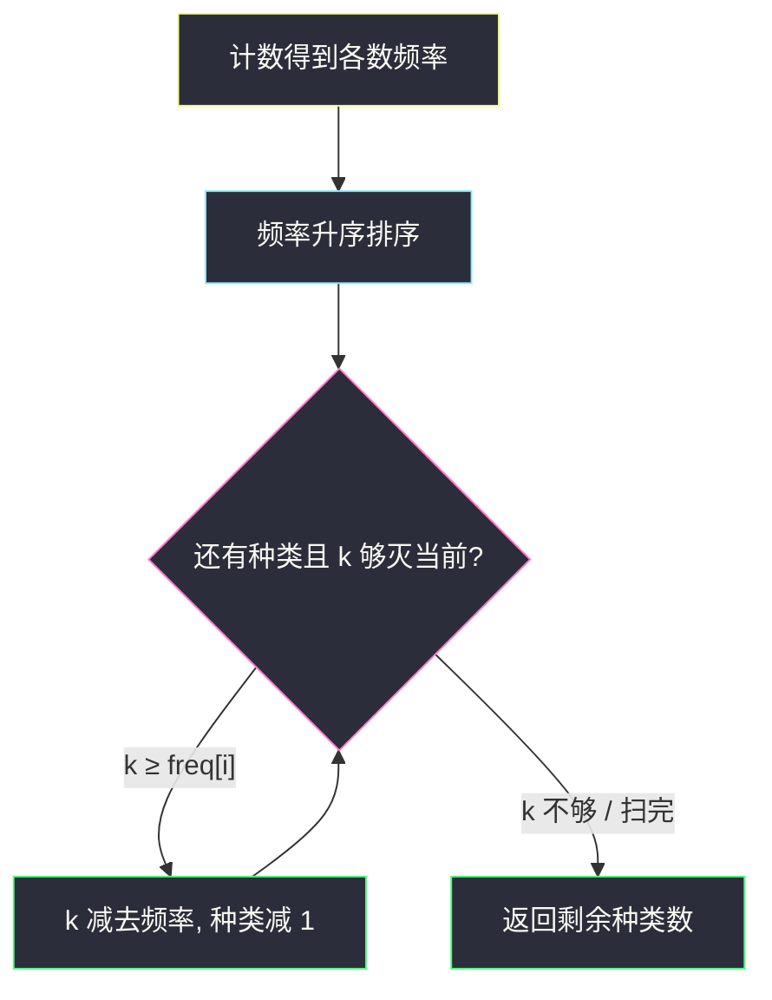
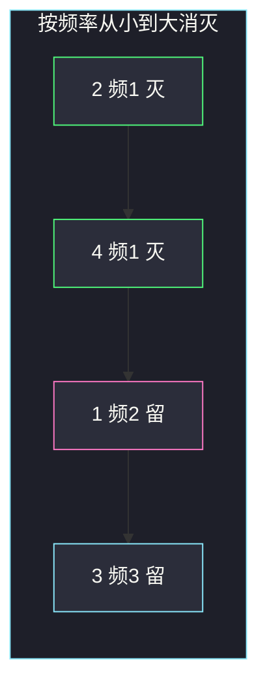

# 不同整数的最少数目（从最小频率开始贪心）

## 一、问题描述

给你整数数组 `arr` 和整数 `k`。你可以删掉数组里**至多 `k` 个**元素（少删也行）。求删完之后，剩下数组里**不同整数的最少数目**。

> 🔗 LeetCode 1481：https://leetcode.cn/problems/least-number-of-unique-integers-after-k-removals/
>
> 数据范围：`1 ≤ arr.length ≤ 10^5`，`0 ≤ k ≤ arr.length`，`1 ≤ arr[i] ≤ 10^9`。
>
> 📚 灵茶题单：**§1.1 从最小/最大开始贪心**（1284 分）。

**示例 1**

```
输入：arr = [5,5,4], k = 1
输出：1
解释：删掉一个 4，剩下 [5,5]，只有 1 种数。
```

**示例 2**

```
输入：arr = [4,3,1,1,3,3,2], k = 3
输出：2
解释：删掉 2、4 以及一个 1，剩下 [1,3,3,3]，两种数。
也可以删掉 2、4 以及一个 3，剩下 [1,1,3,3]，同样两种。
```

**直观理解**

「不同整数的数目」只在**某一种数被删光**时才会减 1。删一半留一半，种类一个不少。所以 `k` 次删除应该尽量用来**整种消灭**，而且优先消灭「出现次数少」的种类——消灭它更便宜。

---

## 二、暴力解法

先统计每种数的出现次数，再枚举「要消灭哪些种类」：对每种数决定「全删 / 全留」，检查总删除次数是否 ≤ `k`，在合法方案里取剩余种类最少的。

```python
from collections import Counter
from itertools import combinations

class Solution:
    def findLeastNumOfUniqueInts(self, arr: list[int], k: int) -> int:
        freq = list(Counter(arr).values())
        m = len(freq)
        best = m
        for t in range(m + 1):
            for combo in combinations(range(m), t):
                need = sum(freq[i] for i in combo)
                if need <= k:
                    best = min(best, m - t)
        return best
```

种类数 `m` 最坏等于 `n`，子集是 `2^m`。`n ≤ 10^5` 完全不可用。

### 🔴 瓶颈在哪里

不必枚举「删哪几种」。消灭一种数的代价就是它的频率，而目标只关心**消灭了几种**，不关心消灭的是谁。代价越小的种类，越应该优先拿 `k` 去换。局部决策变成：按频率从小到大，能灭一种就灭一种。

---

## 三、优化探索（核心章节）

> 📚 本题在灵茶题单中属于 **§1.1 从最小/最大开始贪心**。同节镜像题是「数组大小减半」：那边按频率**从大到小**删，这边按频率**从小到大**删。方向相反，都是「一次决策消灭一种数」。

### 3.1 先计数，再按频率排序

1. 用哈希表统计每种数出现几次，得到频率数组 `freq`。
2. 把 `freq` **升序**排序。
3. 从左往右：若 `k ≥ freq[i]`，就花掉这么多次删除，把这一种消灭，`k -= freq[i]`，剩余种类减 1；否则 `k` 不够灭光当前这种，后面更大的更灭不掉，停止。

剩下的种类数就是答案。`k` 有剩余也没关系：再删几个同一类的元素，种类不会再少。

### 3.2 为什么「先灭小的」最优

设两种数频率 `a < b`。同样花 `a` 次删除：

- 灭掉频率为 `a` 的那种：种类 `-1`，还剩 `k - a` 次额度。
- 只砍频率为 `b` 的那种 `a` 下：它还剩 `b - a > 0` 次，种类不变。

所以用同样的额度，灭小的一定不差于砍大的。若最优方案灭了一个大的、却留着一个更小的，把「灭大」换成「灭小」后，额度只会更宽裕，剩余种类不会变差。这就是交换论证。



### 3.3 桶计数：频率本身也可线性处理

频率值落在 `1..n`，不必比较排序。开一个桶 `cnt[f] = 有多少种数恰好出现 f 次`，从小到大扫 `f`：

- 能灭的种类数最多是 `k // f`，也最多是 `cnt[f]`。
- 灭掉 `take` 种后，`k -= take * f`，答案减去 `take`。

时间变成 `O(n)`。`n = 10^5` 时排序也过，桶是同节「计数后按桶贪心」的加强版。

### 3.4 一句话核心

> **种类只在被删光时才减少。按出现次数从少到多消灭；`k` 够灭一种就灭，不够就停。**

---

## 四、代码实现

### Python（主解：频率升序）

```python
from collections import Counter

class Solution:
    def findLeastNumOfUniqueInts(self, arr: list[int], k: int) -> int:
        freq = sorted(Counter(arr).values())
        remain = len(freq)
        for f in freq:
            if k < f:
                break
            k -= f
            remain -= 1
        return remain
```

**变量含义**

| 写法 | 含义 |
|------|------|
| `freq` | 每种数的出现次数，已升序 |
| `remain` | 还没被灭掉的种类数，初值是不同整数个数 |
| `k < f` | 额度不够灭当前这种，后面更大，直接停 |

### Python（桶计数 `O(n)`）

```python
from collections import Counter

class Solution:
    def findLeastNumOfUniqueInts(self, arr: list[int], k: int) -> int:
        freq = Counter(arr)
        n = len(arr)
        bucket = [0] * (n + 1)
        for f in freq.values():
            bucket[f] += 1
        remain = len(freq)
        for f in range(1, n + 1):
            if bucket[f] == 0:
                continue
            take = min(bucket[f], k // f)
            remain -= take
            k -= take * f
            if k < f:
                break
        return remain
```

### Java（最优解可选）

```java
class Solution {
    public int findLeastNumOfUniqueInts(int[] arr, int k) {
        Map<Integer, Integer> map = new HashMap<>();
        for (int x : arr) {
            map.merge(x, 1, Integer::sum);
        }
        int[] freq = new int[map.size()];
        int i = 0;
        for (int f : map.values()) {
            freq[i++] = f;
        }
        Arrays.sort(freq);
        int remain = freq.length;
        for (int f : freq) {
            if (k < f) {
                break;
            }
            k -= f;
            remain--;
        }
        return remain;
    }
}
```

不要写成「每次从堆里弹出最小频率」也行，但排序更短；小根堆同一复杂度，代码更长。

---

## 五、具体例子演示

**示例 2**：`arr = [4,3,1,1,3,3,2]`，`k = 3`。

先计数：

| 数 | 频率 |
|----|------|
| 1 | 2 |
| 2 | 1 |
| 3 | 3 |
| 4 | 1 |

频率升序：`[1, 1, 2, 3]`，对应种类 `2, 4, 1, 3`。`remain` 初值 4。

| 步 | 当前频率 | k 够不够 | 操作 | k | remain |
|----|----------|----------|------|---|--------|
| 1 | 1（数 2） | 3 ≥ 1 | 灭掉 2 | 2 | 3 |
| 2 | 1（数 4） | 2 ≥ 1 | 灭掉 4 | 1 | 2 |
| 3 | 2（数 1） | 1 < 2 | **停** | 1 | 2 |
| 4 | 3（数 3） | 不再看 | — | 1 | 2 |

剩余种类 2，对应数 `1` 和 `3`。多出来的 1 次额度可以再删一个 1 或一个 3，种类不变。



绿：被整种消灭。粉：额度卡在这里。

**示例 1**：`[5,5,4]`，`k = 1`。频率 `[1, 2]`。灭掉 4（代价 1），`remain = 1`。若先砍 5，花 1 次后 5 还剩一次，种类仍是 2，更差。

**边界**：`k` 大到能灭光所有种类 → 答案 0；`k = 0` → 答案等于原数组不同整数个数。

---

## 六、复杂度分析

| 方法 | 时间 | 空间 | 说明 |
|------|------|------|------|
| 枚举消灭子集 | `O(2^m · m)` | `O(m)` | `m` 为种类数 |
| 频率升序贪心（主解） | `O(n log n)` | `O(n)` | 哈希计数 + 排序 |
| 桶计数 | `O(n)` | `O(n)` | 频率桶下标最大为 `n` |

`n ≤ 10^5`，主解足够；桶计数去掉排序，面试可以提一句。

---

## 七、对比总结

| 维度 | 本题 1481 | 同节 1338 数组大小减半 |
|------|-----------|------------------------|
| 删除单位 | 元素（一种可以只删一部分） | 一旦选中某数，必须删光它的全部出现 |
| 优化目标 | 剩余**种类**尽量少 | 选中的**种类数**尽量少，且删掉的元素 ≥ `n/2` |
| 贪心方向 | 频率**升序**（灭小的便宜） | 频率**降序**（灭大的划算） |
| `k` / 额度 | 元素个数上限 | 元素个数下界 `⌈n/2⌉` |

**易错点**

1. **按数值大小排序而不是按频率**：`1` 和 `100` 谁先删取决于出现次数，与值无关。
2. **以为必须删满恰好 `k` 个才合法**：少删不影响种类；多出来的额度砍不灭一种就停。
3. **删到一半也把种类减 1**：种类只在频率被扣到 0 时减少。
4. **用最小堆反复弹出却忘记 `k` 不够时要 break**：堆顶大于 `k` 就不要再弹，否则会把种类减成负数。

---

## 八、举一反三

| 题目 | 关系 |
|------|------|
| [1338. 数组大小减半](https://leetcode.cn/problems/reduce-array-size-to-the-half/) | 同节镜像：按频率从大到小删整类 |
| [1647. 字符频次唯一的最小删除次数](https://leetcode.cn/problems/minimum-deletions-to-make-character-frequencies-unique/) | 也是拿删除额度换频率，贪心调整频次 |
| [347. 前 K 个高频元素](https://leetcode.cn/problems/top-k-frequent-elements/) | 同一套「计数 + 按频率选」 |
| [451. 根据字符出现频率排序](https://leetcode.cn/problems/sort-characters-by-frequency/) | 计数后按频率排序，不涉及删除额度 |
| [1636. 按照频率将数组升序排序](https://leetcode.cn/problems/sort-array-by-increasing-frequency/) | 频率升序的排序题，帮助记「按频不按值」 |

**思想迁移**

- 问「还剩几种」→ 额度用来**消灭种类**，先灭便宜的（频率小）。
- 问「选几种才能删掉足够多元素」→ 先灭贵的（频率大），见 1338。
- 口诀：**「计数排序频率，从小灭到大；额度不够就停。」**
