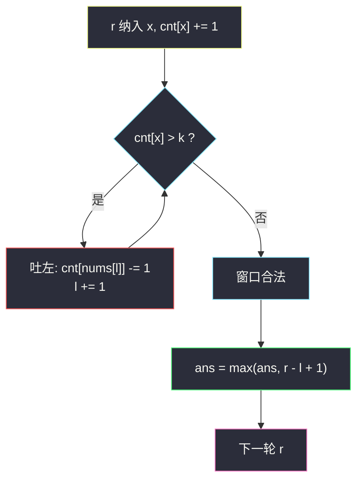
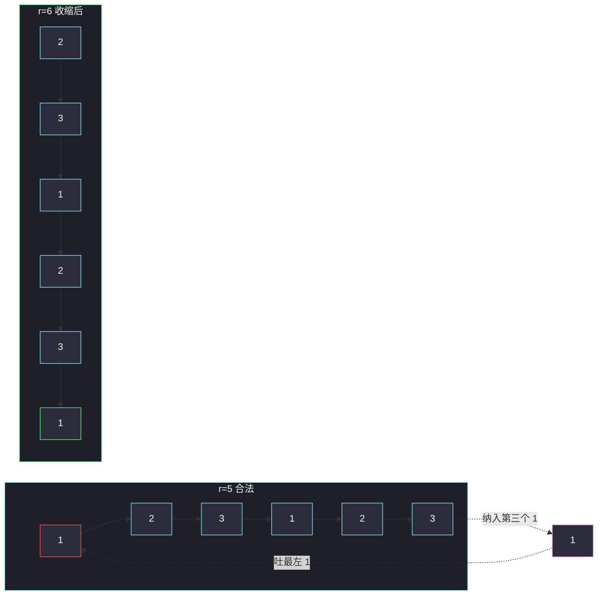

# 最多 K 个重复元素的最长子数组（变长滑窗 · 越短越合法）

## 一、问题描述

给你一个整数数组 `nums` 和一个整数 `k`。一个子数组如果其中**任意**元素的出现次数都不超过 `k`，就称它是合法的。返回合法子数组的**最大长度**。

> 🔗 LeetCode 2958：https://leetcode.cn/problems/length-of-longest-subarray-with-at-most-k-frequency/
>
> 数据范围：`1 <= nums.length <= 10^5`，`1 <= nums[i] <= 10^9`，`1 <= k <= nums.length`。

**示例 1**

```
输入：nums = [1,2,3,1,2,3,1,2], k = 2
输出：6
解释：[1,2,3,1,2,3] 中每个数都恰好出现 2 次；再往右加一个 1 就变成 3 次。
```

**示例 2**

```
输入：nums = [1,2,1,2,1,2,1,2], k = 1
输出：2
解释：k = 1 要求窗口内全互异，最长是相邻的 [1,2]。
```

**示例 3**

```
输入：nums = [5,5,5,5,5,5,5], k = 4
输出：4
解释：全是 5，窗口长度不能超过 4。
```

**直观理解**

「任意元素次数 ≤ k」对窗口长度单调：窗口越短，每个数的计数只减不增，更容易合法。要求最长，所以对每个右端保留「仍合法的最左的 `l`」，长度 `r-l+1` 取 max。这是灵神 **§2.1 越短越合法 / 求最长 / 最大**。同目录 [删除子数组的最大得分](https://leetcode.cn/problems/maximum-erasure-value/)（`maximum-erasure-value.md`）就是本题 `k = 1` 再把「长度」换成「正数和」。

---

## 二、暴力解法

枚举左右端，用哈希表数次数，一旦有计数超过 `k` 就 break：

```python
class Solution:
    def maxSubarrayLength(self, nums: List[int], k: int) -> int:
        n, ans = len(nums), 0
        for i in range(n):
            cnt = {}
            ok = True
            for j in range(i, n):
                cnt[nums[j]] = cnt.get(nums[j], 0) + 1
                if cnt[nums[j]] > k:
                    ok = False
                    break
                if ok:
                    ans = max(ans, j - i + 1)
        return ans
```

固定左端后右端第一次违规即可停，仍是平方级。

### 复杂度

- **时间**：`O(n²)`。`n = 10^5` 超时。
- **空间**：`O(n)` 哈希表。

### 🔴 瓶颈在哪里

左端右移一格，只需把 `nums[i]` 的计数减一，右边已经数过的不必重来。一个窗口：右扩 `cnt[x]++`，若 `cnt[x] > k` 则左缩，直到该计数回到 `≤ k`。

---

## 三、优化探索（核心章节）

> 📚 本题在灵茶题单中属于 **02-滑动窗口 · §2.1 越短越合法 / 求最长 / 最大**（1535 分）。非法条件从「有重复」变成「某个值出现超过 k 次」；求的是最长，故**窗口合法时**用 `r - l + 1` 更新 `ans`。

### 3.1 只需要盯刚纳入的那个数

纳入 `x` 之后，只有 `cnt[x]` 可能新突破 `k`，其它计数不变。因此 `while` 的条件写成 `cnt[x] > k` 即可，不必每次扫整张表。左缩时不管吐出的是不是 `x`：吐掉别的数，`cnt[x]` 仍超标，继续吐，直到吐到某个 `x`，计数回到 `k`。

这与「窗口内不同数字个数 ≤ k」不同——那题超标的是**种类数**，缩谁都可能有效；本题超标的是**某一个值的次数**，必须一直缩到把多余的那个值挤出去。

「只盯 `cnt[x]`」成立，是因为进入本轮之前窗口已经合法（§2.1 不变式）：其它值的计数本来就 ≤ k，纳入 `x` 只可能让 `cnt[x]` 越界。左缩时即使先吐掉别的数，也只是把 `l` 往右推，直到吐出一个 `x`，超额消失。

### 3.2 求最长：合法时更新

§2.1 求最长 / 最大的标准时机：收缩结束后窗口一定合法（空窗口也合法），立刻：

```
ans = max(ans, r - l + 1)
```

不要等到「即将非法」才记——那会漏掉最后一个合法位置。也不要在 `while` 里更新：那时窗口正非法。



### 3.3 与 k = 1、与「至多 k 种」的对照

| 问题 | 哈希维护 | 收缩条件 |
|------|----------|----------|
| 本题 | `cnt[值] → 次数` | `cnt[x] > k` |
| #1695 / #3 | 集合或 `cnt[x] > 1` | 出现重复 |
| #904 水果成篮 | `cnt` 的**键数量** | 种类 > 2 |
| #340 至多 k 个不同字符 | 键数量 | 种类 > k |

同一套 `l/r` 骨架，换「非法」的定义。

### 3.4 一句话核心

> **纳入后若某个计数 > k，就往左吐，直到该计数回到 k；每次合法窗口用长度更新最长。**

---

## 四、代码实现

### Python（主解：变长滑窗 + 计数）

```python
class Solution:
    def maxSubarrayLength(self, nums: List[int], k: int) -> int:
        cnt = {}
        l = ans = 0
        for r, x in enumerate(nums):
            cnt[x] = cnt.get(x, 0) + 1          # 纳入
            while cnt[x] > k:                   # 刚纳入的 x 超标
                cnt[nums[l]] -= 1
                l += 1
            ans = max(ans, r - l + 1)           # 合法，求最长
        return ans
```

用 `collections.defaultdict(int)` 也可以，写法等价。`nums[i]` 到 `10^9`，不能开数组当计数盒，必须哈希。

**变量含义**

| 变量 | 含义 |
|------|------|
| `cnt[x]` | 窗口 `[l, r]` 里 `x` 的出现次数 |
| `l`, `r` | 窗口左 / 右端 |
| `ans` | 历史最大合法长度 |

**循环不变式**：更新 `ans` 时，窗口内任意值次数 ≤ `k`，且 `l` 是满足该条件的最小下标（再往左会让某个计数 > `k`）。

### Java（最优解同款）

```java
class Solution {
    public int maxSubarrayLength(int[] nums, int k) {
        Map<Integer, Integer> cnt = new HashMap<>();
        int l = 0, ans = 0;
        for (int r = 0; r < nums.length; r++) {
            int x = nums[r];
            cnt.merge(x, 1, Integer::sum);
            while (cnt.get(x) > k) {
                int y = nums[l++];
                cnt.merge(y, -1, Integer::sum);
            }
            ans = Math.max(ans, r - l + 1);
        }
        return ans;
    }
}
```

---

## 五、具体例子演示

以示例 1 `nums = [1,2,3,1,2,3,1,2]`，`k = 2`。逐步跟踪每轮 `l / r`、窗口、是否收缩：

| r | x | 纳入后 cnt[x] | 收缩？ | l | 窗口 | 长度 | ans |
|---|---|---------------|--------|---|------|------|-----|
| 0 | 1 | 1 | 否 | 0 | `[1]` | 1 | 1 |
| 1 | 2 | 1 | 否 | 0 | `[1,2]` | 2 | 2 |
| 2 | 3 | 1 | 否 | 0 | `[1,2,3]` | 3 | 3 |
| 3 | 1 | 2 | 否 | 0 | `[1,2,3,1]` | 4 | 4 |
| 4 | 2 | 2 | 否 | 0 | `[1,2,3,1,2]` | 5 | 5 |
| 5 | 3 | 2 | 否 | 0 | `[1,2,3,1,2,3]` | 6 | **6** |
| 6 | 1 | **3** | **是**：吐 `nums[0]=1`，cnt[1]=2，`l=1` | 1 | `[2,3,1,2,3,1]` | 6 | 6 |
| 7 | 2 | **3** | **是**：吐 `nums[1]=2`，cnt[2]=2，`l=2` | 2 | `[3,1,2,3,1,2]` | 6 | 6 |

`r = 6`：第三个 1 进来，必须丢掉最左的 1，窗口平移一格，长度仍是 6。答案 6 ✓。

示例 3 全 5、`k = 4`：`r = 0..3` 不缩，长度 4；`r = 4` 时 `cnt[5]=5 > 4`，吐左端，窗口永远钉死在长度 4。

示例 2 `k = 1` 就是「无重复最长子数组」：每个数第二次出现时立刻吐到只剩当前这个。

再看 `nums = [1,1,1,3]`，`k = 2`：前两个 1 合法长度 2；第三个 1 使 `cnt[1]=3`，必须吐掉最左的 1，窗口变成 `[1,1]`；纳入 3 后是 `[1,1,3]`，长度 3。答案 3，不是「全是 1 的那段」的错觉长度 4。

`k = n` 时 `while` 永不触发，答案就是 `n`——约束保证 `k ≥ 1`，空数组不会出现。`k = 1` 且数组全相同，答案是 1。



---

## 六、复杂度分析

| 方法 | 时间 | 空间 | 说明 |
|------|------|------|------|
| 枚举左端 + 内层 break | `O(n²)` | `O(n)` | 超时 |
| 变长滑窗 + 哈希计数（主解） | `O(n)` | `O(n)` | 每个元素对应一次 `++` 与至多一次 `--` |

哈希表最多装下窗口内不同值的个数，最坏 `O(n)`（例如全互异且 `k ≥ 1`）。`l` 只增不减，均摊线性。不要每次用 `max(cnt.values())` 检查合法性，那会把每轮变成 `O(种类数)`。

---

## 七、对比总结

| 维度 | 本题 | #1695 最大得分 | #3 最长无重复 |
|------|------|----------------|---------------|
| k | 任意 | 等价 k = 1 | 等价 k = 1（字符） |
| 更新 | 长度 | 正数和 | 长度 |
| 计数结构 | `dict`（值域 1e9） | 集合即可 | 字符表 / 集合 |

**易错点**

1. **收缩条件写错成「整表有人 > k」**：功能对，但每次 `min(cnt.values())` 会退化。盯 `cnt[x]` 就够。
2. **超标时更新答案**：`while` 期间窗口非法，更新会偏大。先缩完再 `max`。
3. **`k = 1` 漏测**：退化为无重复；示例 2 专门覆盖。
4. **吐左后不要 `del` 零计数**（可选）：留着 0 不影响 `cnt[x] > k`，删不删都行。
5. 与「至多 k **种**不同元素」搞混：那是 `len(cnt) > k`，本题是单值次数。
6. **哈希键是值不是下标**：`cnt[x] += 1` 的 `x` 是 `nums[r]`。写成 `cnt[r]` 会把每个位置当成不同键，窗口永不收缩。

约束里 `1 <= k <= n`，不必处理 `k = 0`；若面试变体允许 `k = 0`，合法窗口只能是空，答案 0。

**模板（§2.1 越短越合法，求最长）**

```python
cnt, l, ans = {}, 0, 0
for r, x in enumerate(nums):
    cnt[x] = cnt.get(x, 0) + 1
    while cnt[x] > k:
        cnt[nums[l]] -= 1
        l += 1
    ans = max(ans, r - l + 1)
```

---

## 八、举一反三

| 题目 | 关系 |
|------|------|
| [1695. 删除子数组的最大得分](https://leetcode.cn/problems/maximum-erasure-value/) | 同批姊妹篇（`maximum-erasure-value.md`）：k = 1 + 更新窗口和 |
| [3. 无重复字符的最长子串](https://leetcode.cn/problems/longest-substring-without-repeating-characters/) | 同一骨架，字符版 k = 1 |
| [904. 水果成篮](https://leetcode.cn/problems/fruit-into-baskets/) | 非法改成「种类 > 2」 |
| [1004. 最大连续 1 的个数 III](https://leetcode.cn/problems/max-consecutive-ones-iii/) | 窗口内 0 的个数 ≤ k，求最长 |
| [2024. 考试的最大困扰度](https://leetcode.cn/problems/maximize-the-confusion-of-an-exam/) | 至多改 k 次，等价「窗口内少数派 ≤ k」 |
| [424. 替换后的最长重复字符](https://leetcode.cn/problems/longest-repeating-character-replacement/) | 窗口内「非众数」个数 ≤ k |

**思想迁移**

- 合法条件能写成「窗口的某个统计量对缩短单调」，就套 §2.1：纳入 → `while` 非法吐左 → 用长度（或和）更新。
- 统计量是「单值次数」还是「种类数」还是「零的个数」，只改 `while` 条件。
- 口诀：**「次数超 k 就吐左，合法再记最长。」**
