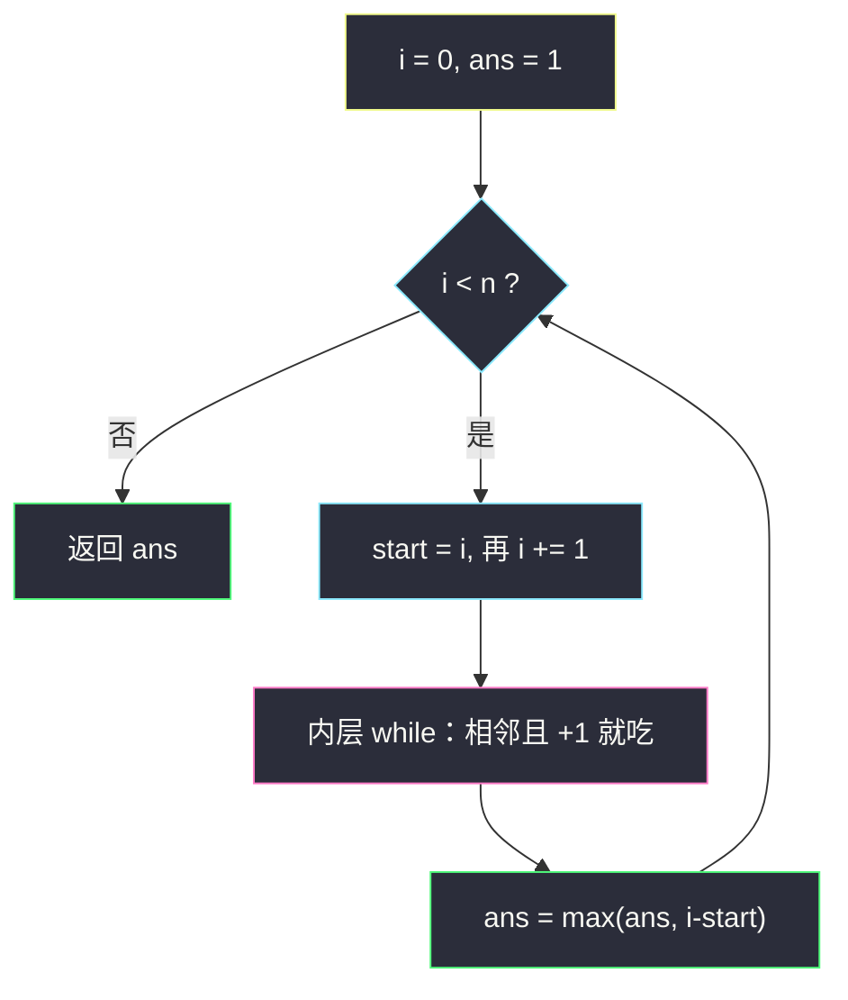
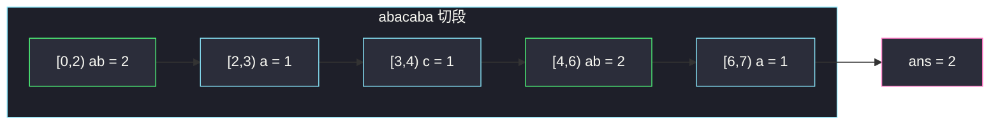

# 最长的字母序连续子字符串的长度（分组循环 · 连续递增段）

## 一、问题描述

字母序连续子字符串：相邻字符在字母表中相邻，且满足 `s[i] + 1 == s[i+1]`（例如 `"abc"`、`"xyz"`，不含 `"acb"`、`"aaa"`，也不绕回 `"za"`）。给定只含小写字母的 `s`，返回其中最长的字母序连续子字符串的长度。

> 🔗 LeetCode 2414：https://leetcode.cn/problems/length-of-the-longest-alphabetical-continuous-substring/
>
> 数据范围：`1 <= s.length <= 10^5`，`s` 只含小写英文字母。

**示例 1**

```
输入：s = "abacaba"
输出：2
解释：字母序连续的子串有 "a"、"b"、"ab" 等，最长为 2（"ab" 出现两次）。
```

**示例 2**

```
输入：s = "abcde"
输出：5
解释：整串就是一条字母序连续段。
```

**直观理解**

把 `s` 按「后一个刚好是前一个的下一个字母」切成若干极大递增段，答案就是这些段里的最大长度。这是灵神 **六、分组循环** 的「连续递增」变体：#830 的组内条件是 `s[i] == s[start]`，本题改成 `ord(s[i]) == ord(s[i-1]) + 1`。

---

## 二、暴力解法

枚举每个起点 `i`，向右尽量延伸，直到不再满足「后一个 = 前一个 + 1」，用延伸长度更新答案。每个起点独立扫描，最坏 `O(n²)`（例如 `"abcde..."` 整串递增）。`n` 到 `10^5` 会超时。

```python
class Solution:
    def longestContinuousSubstring(self, s: str) -> int:
        n, ans = len(s), 1
        for i in range(n):
            j = i
            while j + 1 < n and ord(s[j + 1]) == ord(s[j]) + 1:
                j += 1
            ans = max(ans, j - i + 1)
        return ans
```

单字符也算长度 1，所以 `ans` 初值至少为 1（题目 `n >= 1`）。

### 复杂度

- **时间**：`O(n²)`，同一段被每个前缀起点各扫一遍。
- **空间**：`O(1)`。

### 🔴 瓶颈在哪里

一条极大递增段 `abcde` 里，从 `a`、`b`、`c`… 分别延伸得到的长度是 5、4、3…，最大值一定在**段起点**取到。因此不必每个 `i` 都当起点重扫——用分组循环把整段一次吃完，`max(段长)` 就是答案。

---

## 三、优化探索（核心章节）

> 📚 本题在灵茶题单中属于 **六、分组循环**（滑窗① A 路）：外层 `while i < n` 锁定段起点，内层按「字母表相邻且严格 +1」把连续递增段吃完，再用 `i - start` 更新全局最大长度。组间互不影响。

### 3.1 观察特征

| 特征 | 说明 |
|------|------|
| 极大段覆盖全集 | 每个下标恰好属于一条字母序连续极大段 |
| 最优落在段起点 | 段内任何真后缀都更短，只需看极大段长 |
| `z` 后面不能接 `a` | `ord('z')+1` 不是字母，内层条件自然截断 |
| 相同字母必断 | `'a'+1 != 'a'`，`"aaa"` 被切成三个长度 1 |

### 3.2 分组循环：连续递增

和 #830 同一骨架，只换内层条件：

```text
while i < n:
    start = i
    i += 1
    while i < n and ord(s[i]) == ord(s[i-1]) + 1:
        i += 1
    ans = max(ans, i - start)
```

用 `s[i-1]` 而不是 `s[start]` 做参照：本组要求的是**相邻两格**差 1，不是「都等于起点的某种函数」。`abc` 里 `c` 相对 `a` 差 2，相对 `b` 才差 1。



### 3.3 正确性

任意字母序连续子串都落在某条极大段内部（再往外扩一格就会破坏 +1），故最长者必是某条极大段本身。分组循环枚举了全部极大段，`max` 即全局最优。指针 `i` 单调，每格恰好结束一次内层判断。

为什么不必看段内真子串：设极大段 `[L, R)` 长度为 `k`。其中任意子串 `[p, q)` 满足 `q - p ≤ k`，等号只在 `p = L` 且 `q = R` 时成立。所以段内扫描全是更短的候选，暴力法里那些从段中部出发的延伸全部是冗余。

### 3.4 和滑窗的边界

本题相邻约束是**局部且不可修复**的：一旦 `s[i]` 接不上 `s[i-1]`，左端再怎么缩也拼不回一条跨断点的合法串。因此不需要滑窗那套「扩右、不合法再缩左」，分组循环一次切断即可。若改成「允许段内缺一个字母」，那才需要别的结构。

### 3.5 一句话核心

> **按「后一格 = 前一格的下一个字母」切段，答案等于最长那一段的长度。**

---

## 四、代码实现

### Python（主解：分组循环）

```python
class Solution:
    def longestContinuousSubstring(self, s: str) -> int:
        n, ans, i = len(s), 1, 0
        while i < n:
            start = i
            i += 1
            while i < n and ord(s[i]) == ord(s[i - 1]) + 1:
                i += 1
            ans = max(ans, i - start)          # [start, i) 的长度
        return ans
```

Python 里字符可以直接比：`s[i] == chr(ord(s[i-1]) + 1)` 或利用 `ord` 差。`'b' == 'a' + 1` 在 Python 不成立（str 不能和 int 加），所以用 `ord` 或预先 `ord(s[i-1]) + 1 == ord(s[i])`。

也可以写成线性 DP 视角：`cur` 为「以当前位置结尾的连续长度」，`s[i] == s[i-1]+1` 则 `cur += 1` 否则 `cur = 1`。和分组循环等价，只是不停段、逐格结算：

```python
class Solution:
    def longestContinuousSubstring(self, s: str) -> int:
        ans = cur = 1
        for i in range(1, len(s)):
            if ord(s[i]) == ord(s[i - 1]) + 1:
                cur += 1
                ans = max(ans, cur)
            else:
                cur = 1
        return ans
```

主解仍用分组循环，和题单模板对齐，例子里按 `[start, i)` 汇报。

### Java（最优解）

```java
class Solution {
    public int longestContinuousSubstring(String s) {
        int n = s.length(), ans = 1, i = 0;
        while (i < n) {
            int start = i;
            i++;
            while (i < n && s.charAt(i) == s.charAt(i - 1) + 1) {
                i++;
            }
            ans = Math.max(ans, i - start);
        }
        return ans;
    }
}
```

Java 的 `char` 是数值类型，`s.charAt(i) == s.charAt(i-1) + 1` 直接成立。

**变量含义**

| 变量 | 含义 |
|------|------|
| `start` | 当前极大递增段左端 |
| `i` | 内层结束后是本段半开右端 |
| `ans` | 已见过的最大段长 |

**循环不变式**：外层每轮开始时，`s[0..i)` 各段都已用段长更新过 `ans`。

---

## 五、具体例子演示

以示例 1 `s = "abacaba"` 按分组循环逐段结算。

下标：`0:a  1:b  2:a  3:c  4:a  5:b  6:a`

| 段 | `[start, i)` | 内容 | 断因 | 长度 | ans |
|----|----------------|------|------|------|-----|
| 1 | [0, 2) | ab | `a` 不是 `b+1` | 2 | 2 |
| 2 | [2, 3) | a | `c` 不是 `a+1` | 1 | 2 |
| 3 | [3, 4) | c | `a` 不是 `c+1` | 1 | 2 |
| 4 | [4, 6) | ab | `a` 不是 `b+1` | 2 | 2 |
| 5 | [6, 7) | a | 到末尾 | 1 | 2 |

返回 **2** ✓。

**示例 2** `"abcde"` 只有一段：

| 步 | i | 内层判断 | 动作 |
|----|---|----------|------|
| 起步 | start=0, i=1 | `'b'=='a'+1` | 吃，i=2 |
| | 2 | `'c'=='b'+1` | 吃，i=3 |
| | 3 | `'d'=='c'+1` | 吃，i=4 |
| | 4 | `'e'=='d'+1` | 吃，i=5 |
| | 5 | `i==n` 停 | `[0,5)` 长度 5 |

再看易错串 `"zabc"`：

| 段 | `[start, i)` | 内容 | 长度 | ans |
|----|----------------|------|------|-----|
| 1 | [0, 1) | z | 1 | 1 |
| 2 | [1, 4) | abc | 3 | 3 |

`'z'` 后面的 `'a'` 不满足 `ord('a') == ord('z')+1`，不会绕回。



---

## 六、复杂度分析

| 方法 | 时间 | 空间 | 说明 |
|------|------|------|------|
| 每起点重延伸 | `O(n²)` | `O(1)` | `n = 10^5` 超时 |
| 分组循环 / 等价逐格 | `O(n)` | `O(1)` | 每个下标进出内层一次 |

---

## 七、对比总结

| 维度 | #830 较大分组 | 本题 | #674 最长连续递增序列 |
|------|---------------|------|------------------------|
| 组内条件 | 字符相等 | 字母表相邻 +1 | 数值严格递增（差任意正数） |
| 结算 | 长度 ≥ 3 则记区间 | `max(段长)` | `max(段长)` |
| 值域绕回 | 无 | `z` 不接 `a` | 无字母表 |

**易错点**

1. **拿 `s[i]` 和 `s[start]` 比差**：`"ace"` 里 `e` 相对 `a` 差 4，但相邻并不连续；必须和**前一格**比。
2. 把 `"aaa"` 当成连续——字母序连续要求 **+1**，相等反而要断开。
3. 认为 `"za"` 或 `"yzab"` 可以跨过 `z` 接到 `a`。ASCII 上 `'z'+1` 不是 `'a'`。
4. `ans` 初值写成 `0`：题目保证 `n ≥ 1`，最短也是 1；写成 0 在单字符时会错（若还用 `if` 才更新）。分组循环里第一段至少长度 1，`ans=0` 也能被 `max` 抬上来，但初值写 1 更符合题意。

**模板（连续递增分组）**

```python
i = 0
while i < n:
    start = i
    i += 1
    while i < n and ord(s[i]) == ord(s[i - 1]) + 1:
        i += 1
    ans = max(ans, i - start)
```

---

## 八、举一反三

| 题目 | 关系 |
|------|------|
| [830. 较大分组的位置](https://leetcode.cn/problems/positions-of-large-groups/) | 同批模板题：组内条件从「相等」换成「字母 +1」就是本题 |
| [1446. 连续字符](https://leetcode.cn/problems/consecutive-characters/) | 组内改回相等，结算同样是 `max(段长)` |
| [674. 最长连续递增序列](https://leetcode.cn/problems/longest-continuous-increasing-subsequence/) | 数组版：条件改成 `nums[i] > nums[i-1]` |
| [978. 最长湍流子数组](https://leetcode.cn/problems/longest-turbulent-subarray/) | 组内条件变成「相邻比较符交替」，仍是分段 |
| [1839. 所有元音按顺序排布的最长子字符串](https://leetcode.cn/problems/longest-substring-of-all-vowels-in-order/) | 必须按 `aeiou` 顺序，分组 + 状态 |
| [1869. 哪种连续子字符串更长](https://leetcode.cn/problems/longer-contiguous-segments-of-ones-than-zeros/) | 0/1 各自最长连续段再比较 |

**思想迁移**

- 「最长满足相邻局部条件的子串」优先想分组循环：局部条件只依赖 `s[i-1]` 与 `s[i]` 时，极大段一次吃完即可。
- 口诀：**「后一格是不是前一格的下一个字母？是就继续吃，不是就切段更新 max。」**
