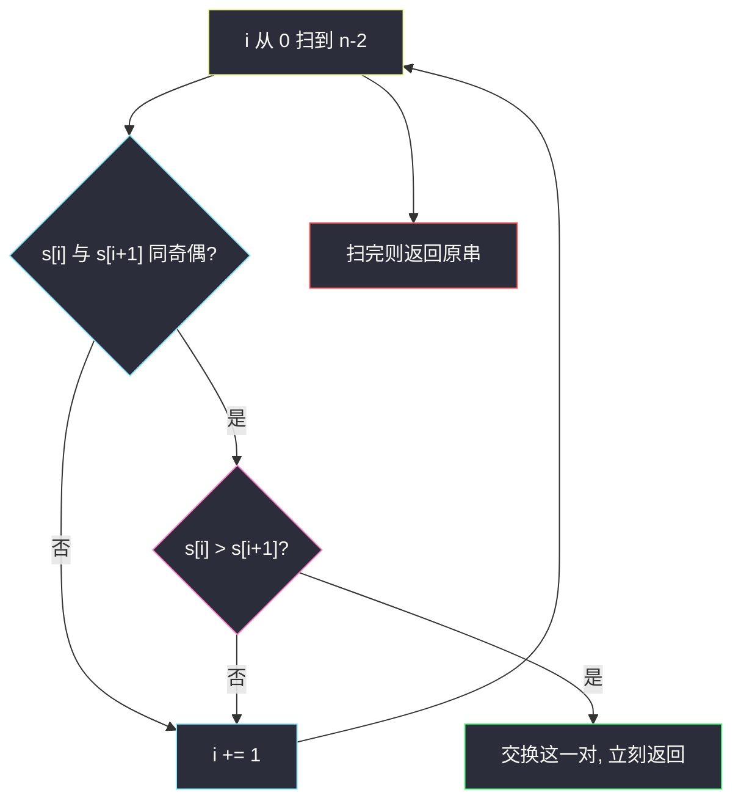
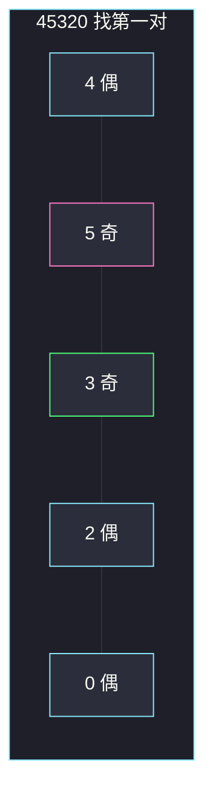

# 交换后字典序最小的字符串（字典序贪心 · 最早改善）

## 一、问题描述

给你一个只含数字的字符串 `s`。最多交换**一次**相邻且**奇偶性相同**的两位（两个都奇，或两个都偶），返回能得到的字典序最小字符串。

同奇偶例子：`5` 和 `9`、`2` 和 `4` 可以换；`6` 和 `9` 不能换。

> 🔗 LeetCode 3216：https://leetcode.cn/problems/lexicographically-smallest-string-after-a-swap/
>
> 数据范围：`2 ≤ s.length ≤ 100`，`s` 仅由数字组成。
>
> 📚 灵茶题单：**§3.1 字典序最小/最大**（1243 分）。

**示例 1**

```
输入：s = "45320"
输出："43520"
解释：交换相邻的 5 和 3（都是奇数），得到 "43520"。
```

**示例 2**

```
输入：s = "001"
输出："001"
解释：已经是能得到的最小串，一次都不必换。
```

**直观理解**

字典序比大小看的是**最靠左的第一处不同**。只能换一次、还只能换相邻同奇偶，所以要找「最靠左的、一换就能变小」的位置。更右边的交换动不到这个高位，一定更差。

---

## 二、暴力解法

枚举每一对相邻位置，若奇偶相同就交换一次，在所有候选（含不换）里取字典序最小。

```python
class Solution:
    def getSmallestString(self, s: str) -> str:
        best = s
        n = len(s)
        for i in range(n - 1):
            a, b = int(s[i]), int(s[i + 1])
            if a % 2 == b % 2:
                t = s[:i] + s[i + 1] + s[i] + s[i + 2 :]
                if t < best:
                    best = t
        return best
```

`n ≤ 100`，暴力也能过。真正的问题不是超时，而是没抓住「左边的改善压过右边」。

### 🔴 瓶颈在哪里

所有可交换对里，只要存在「左 > 右」的同奇偶相邻对，**最左边那一对**交换后，会在最早的下标处把大数字换成小数字。后面那些对即使也合法，改的是更低位，字典序一定更大。不必生成全部候选再 `min`。

---

## 三、优化探索（核心章节）

> 📚 本题在灵茶题单中属于 **§3.1 字典序最小/最大**。求最小 ⇒ 高位尽量小；高位定了再看次高位。本题「最多一次相邻同奇偶交换」，高位能改善就立刻动手。

### 3.1 同奇偶判定

数字 `a`、`b` 同奇偶 ⟺ `a % 2 == b % 2`，也等价于 `(a + b) % 2 == 0`。字符 `'0'..'9'` 的 ASCII 与数值同奇偶，所以对 `ord(ch)` 取模也对。

### 3.2 第一次「左大右小」就是答案

从左到右看相邻对 `(s[i], s[i+1])`：

- 奇偶不同：不能换，跳过。
- 同奇偶且 `s[i] ≤ s[i+1]`：换了不会变小（相等则浪费唯一一次机会），跳过。
- 同奇偶且 `s[i] > s[i+1]`：**这是最靠左的改善**。交换后立刻返回。

若整趟都没有这样的对，原串已经最小。

### 3.3 为什么更靠左一定更优

设第一次可改善的位置是 `i`。任何 `j > i` 处的交换都保持前缀 `s[0..i]` 不变，结果在下标 `i` 仍是较大的 `s[i]`；贪心结果在下标 `i` 已经变成较小的 `s[i+1]`。字典序在第一处不同就分出胜负。



### 3.4 一句话核心

> **从左找第一对「相邻、同奇偶、左大于右」的，换完就停；没有就原样返回。**

---

## 四、代码实现

### Python（主解：最早改善）

```python
class Solution:
    def getSmallestString(self, s: str) -> str:
        cs = list(s)
        for i in range(len(cs) - 1):
            a, b = int(cs[i]), int(cs[i + 1])
            if a % 2 == b % 2 and a > b:
                cs[i], cs[i + 1] = cs[i + 1], cs[i]
                return "".join(cs)
        return s
```

**变量含义**

| 写法 | 含义 |
|------|------|
| `cs` | 可变字符列表，方便换两位 |
| `a % 2 == b % 2` | 同奇偶才允许换 |
| `a > b` | 这一换能让当前高位变小 |
| 找到就 `return` | 只用一次交换，后面不必看 |

字符串不可变，改两位需要列表或切片拼接；`n ≤ 100`，哪种都一样。

---

## 五、具体例子演示

**示例 1**：`s = "45320"`，从左检查每一对。

| 步 | 相邻对 | 下标 | 同奇偶? | 左 > 右? | 动作 |
|----|--------|------|---------|----------|------|
| 1 | 4, 5 | 0-1 | 偶/奇，否 | — | 跳过 |
| 2 | 5, 3 | 1-2 | 都奇，是 | 5 > 3 | **交换，返回 `"43520"`** |
| — | 2, 0 | 3-4 | 都偶，且 2 > 0 | 不再看 | 更靠右，字典序更差 |

后面若去换 `2` 和 `0` 会得到 `"45302"`，在下标 1 仍是 `5`，比 `"43520"` 的 `3` 大。



粉格 `5` 与绿格 `3` 是第一次可改善对，换完得到 `43520`。

**示例 2**：`s = "001"`。

| 步 | 相邻对 | 同奇偶? | 左 > 右? | 动作 |
|----|--------|---------|----------|------|
| 1 | 0, 0 | 都偶 | 0 = 0，不大于 | 跳过 |
| 2 | 0, 1 | 偶/奇 | — | 跳过 |

没有可改善对，返回 `"001"`。

---

## 六、复杂度分析

| 方法 | 时间 | 空间 | 说明 |
|------|------|------|------|
| 枚举全部可交换对 | `O(n²)` 造串 / `O(n)` 次比较 | `O(n)` | 每个候选复制整串 |
| 最早改善（主解） | `O(n)` | `O(n)` | 最坏扫一遍；找到就停 |

---

## 七、对比总结

| 维度 | 本题 | #1323 最大 69 数 | #670 最大交换 |
|------|------|------------------|---------------|
| 目标 | 字典序最小 | 数值最大 | 数值最大 |
| 操作 | 相邻 + 同奇偶，最多一次 | 一个 6 变 9 | 任意两位换一次 |
| 贪心落点 | 最左的「左 > 右」 | 最高位的 6 | 最左可换成更大数字的位 |

**易错点**

1. **奇偶不同也换**：题目禁止。`4` 和 `5` 不能换。
2. **把所有可换对都试完再比**：正确但多余；更靠左的改善一定更优。
3. **左等于右也换**：字符串不变，却用掉唯一一次机会，后面真正该换的没法换。
4. **以为可以换很多次**：最多一次。不要做成冒泡排序。

---

## 八、举一反三

| 题目 | 关系 |
|------|------|
| [1323. 6 和 9 组成的最大数字](https://leetcode.cn/problems/maximum-69-number/) | 同节 §3.1：高位优先，只改第一次出现的 6 |
| [670. 最大交换](https://leetcode.cn/problems/maximum-swap/) | 任意两位换一次使数值最大，要预记录每位后面的最大数字 |
| [2697. 字典序最小回文串](https://leetcode.cn/problems/lexicographically-smallest-palindrome/) | 也是「高位尽量小」，但操作为改字符而不是交换 |
| [2948. 交换得到字典序最小的数组](https://leetcode.cn/problems/make-lexicographically-smallest-array-by-swapping-elements/) | 差值限制下的连通块内可任意换，组内排序 |

**思想迁移**

- 字典序最小 = 从左到右，第一处能变小就变小。
- 「最多一次操作」时，先定位**最早产生影响的那一次**，不必枚举全部方案。
- 口诀：**「同奇偶才换；左大右小，越左越先换。」**
