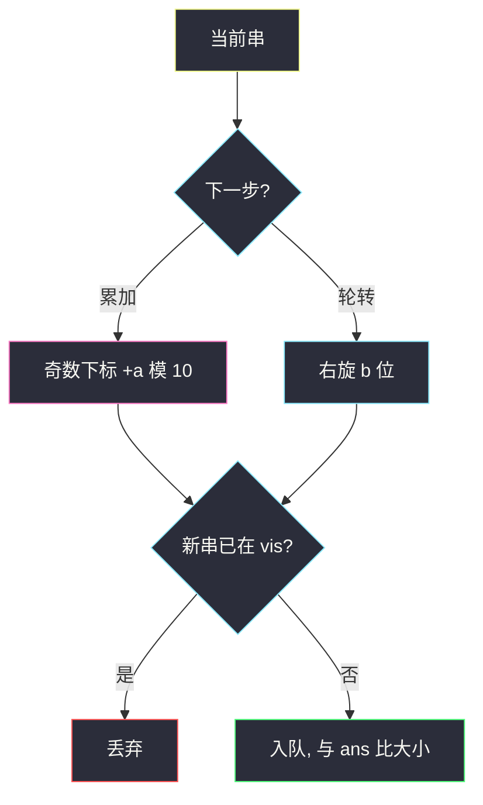

# 执行操作后字典序最小的字符串（轮转 + 累加的可达闭包）

## 一、问题描述

偶数长度的数字串 `s`，以及整数 `a`、`b`。可任意次、任意顺序执行：

1. **累加**：所有**奇数下标**（从 0 计）的数字 `+a`，超过 9 则模 10。例如 `"3456"`、`a = 5` → `"3951"`。
2. **轮转**：向右轮转 `b` 位。例如 `"3456"`、`b = 1` → `"6345"`。

返回能得到的**字典序最小**字符串。

> 🔗 LeetCode 1625：https://leetcode.cn/problems/lexicographically-smallest-string-after-applying-operations/
>
> 数据范围：`2 ≤ s.length ≤ 100` 且为偶数，`s` 只含数字，`1 ≤ a ≤ 9`，`1 ≤ b ≤ n-1`。
>
> 📚 灵茶题单：**§5 最小表示法**。纯轮转取最小可以用最小表示法；本题多了「奇数位累加」，本质是 **BFS/DFS 枚举可达闭包**，在闭包里取 min。状态上限约 `n × 10 × 10`，不必套最小表示法公式。

**示例 1**

```
输入：s = "5525", a = 9, b = 2
输出："2050"
解释：官方一条路径：5525 → 轮转 2555 → 累加 2454 → … → 2151 → 累加 2050。没有更小的。
```

**示例 2**

```
输入：s = "74", a = 5, b = 1
输出："24"
解释：74 → 轮转 47 → 累加 42 → 轮转 24。
```

**示例 3**

```
输入：s = "0011", a = 4, b = 2
输出："0011"
解释：所有可达串里它已经最小。
```

**直观理解**

两种操作可来回做，串又短（≤100），把「能变成的所有串」搜出来再取最小即可。真正要盯的是：轮转会不会把偶数下标转到奇数位上——转得到，偶数位才能被加；转不到，偶数位永远原样。

---

## 二、暴力解法

从 `s` 出发，每次生成「累加一次」和「轮转一次」两个后继，队列 BFS，`vis` 去重，过程中维护最小值。这已经是正解规模，没有更朴素还跑得动的「枚举操作序列长度」——操作次数没有上界，必须靠 vis 把无限路径收成有限状态。

```python
from collections import deque

class Solution:
    def findLexSmallestString(self, s: str, a: int, b: int) -> str:
        vis = {s}
        q = deque([s])
        ans = s
        n = len(s)
        while q:
            cur = q.popleft()
            if cur < ans:
                ans = cur
            chars = list(cur)
            for i in range(1, n, 2):
                chars[i] = str((int(chars[i]) + a) % 10)
            nxt_add = "".join(chars)
            nxt_rot = cur[-b:] + cur[:-b]
            for nxt in (nxt_add, nxt_rot):
                if nxt not in vis:
                    vis.add(nxt)
                    q.append(nxt)
        return ans
```

`n ≤ 100` 时这就是要交的代码。下一章只把「为什么状态少、奇偶下标何时能变」讲透，不是再换算法。

### 🔴 瓶颈在哪里

若不 vis，操作序列无限，死循环。若每次把字符串当「没见过」却用列表存 vis，查找会慢。集合去重之后，真正的复杂度由**可达串数量**决定——官方提示至多 `10 × 10 × n`。

---

## 三、优化探索（核心章节）

> 📚 本题在灵茶题单中属于 **§5 最小表示法**。最小表示法解决的是「循环同构里字典序最小的起点」。这里循环同构之外还有累加，先画可达闭包，再在闭包上取 min。

### 3.1 两个操作怎么改变串

- 累加：只动下标 `1, 3, 5, …`，每个奇数位同步 `+a (mod 10)`。一次操作不能单独改某一个奇数位。
- 轮转右 `b`：新串 `s[-b:] + s[:-b]`。做 `k` 次后，原下标 `i` 的字符跑到 `(i + k b) mod n`。

累加看的是**当前**奇数下标，所以「先转后加」和「先加后转」一般不可交换——必须两种都当边，在图上走。

### 3.2 b 的奇偶：谁加得到

`n` 是偶数。

- **b 为偶数**：轮转后，偶数下标还在偶数位置，奇数还在奇数。累加永远打在「奇数槽」上，**偶数位的数字永远变不了**（只能在偶数槽之间被轮转置换）。`a` 只能改奇数位，改动种类是 `+k a mod 10`，最多 10 种。
- **b 为奇数**：一次轮转会交换奇偶槽。原先的偶数位可以转到奇数槽再被加。此时每一位都可能变；奇槽、偶槽可以在不同朝向下分别累加，状态大约 `10 × 10` 种数位组合，再乘上至多 `n` 种轮转。

示例 1：`n = 4`，`b = 2` 偶数。原串 `"5525"` 偶数位是 `5` 和 `2`，可达串的偶数位只能是 `"52"` 或 `"25"` 的排列；奇数位两个原先都是 `5`，一起加 9，变成 `0,9,8,…`。最小值 `"2050"`：偶数位 `2,5`，奇数位 `0,0`。

示例 2：`b = 1` 奇数，两位都能变，可达 8 个串，最小 `"24"`。



### 3.3 和最小表示法的关系

若删掉累加、只保留轮转，答案就是 `s` 的 `n` 个轮转里最小的那个，可用最小表示法 `O(n)` 找起点。加上累加后，候选不再是「同一条项链的 n 个切口」，而是「项链 × 数位可达」。`n ≤ 100`，BFS 枚举闭包更直接，也更不容易写错。

### 3.4 一句话核心

> **两种操作生成有限闭包（≤ 10×10×n 个串），vis 去重后取字典序最小；b 为偶数时偶数下标加不到。**

---

## 四、代码实现

### Python（主解：BFS 闭包）

```python
from collections import deque

class Solution:
    def findLexSmallestString(self, s: str, a: int, b: int) -> str:
        n = len(s)
        vis = {s}
        q = deque([s])
        ans = s
        while q:
            cur = q.popleft()
            if cur < ans:
                ans = cur
            arr = list(cur)
            for i in range(1, n, 2):
                arr[i] = str((int(arr[i]) + a) % 10)
            nxt_add = "".join(arr)
            nxt_rot = cur[-b:] + cur[:-b]
            for nxt in (nxt_add, nxt_rot):
                if nxt not in vis:
                    vis.add(nxt)
                    q.append(nxt)
        return ans
```

DFS 同样正确：用栈或递归把后继搜完，最后 `min(vis)`。递归深度最坏等于状态数，Python 默认递归上限 1000，本题状态可能上千，**更稳的是显式栈 / BFS 队列**。

**变量含义**

| 写法 | 含义 |
|------|------|
| `vis` | 已出现过的完整串，既是去重也是闭包 |
| `nxt_add` | 当前朝向下，所有奇数位 +a |
| `nxt_rot` | 右旋 b；`b` 已保证 `< n`，不必再模 |
| `ans` | 目前见过的字典序最小串 |

---

## 五、具体例子演示

**示例 2**（状态少，把闭包画完）：`s = "74"`，`a = 5`，`b = 1`。`b` 奇数，两位都能被加到。

| 出队 | 累加后 | 右旋 1 位 | 新入 vis |
|------|--------|-----------|----------|
| 74 | 79 | 47 | 79, 47 |
| 79 | 74（已见） | 97 | 97 |
| 47 | 42 | 74（已见） | 42 |
| 97 | 92 | 79（已见） | 92 |
| 42 | 47（已见） | 24 | **24** |
| 92 | 97（已见） | 29 | 29 |
| 24 | 29（将见） | 42（已见） | — |
| 29 | 24（已见） | 92（已见） | — |

`vis = {74, 79, 47, 97, 42, 92, 24, 29}`，最小 `"24"`。对拍官方。


官方路径正是黄 → 青 → 粉 → 绿。加与旋交错，不是「先把所有加做完再转」。

**示例 1**：`s = "5525"`，`a = 9`，`b = 2`。对拍可知可达 20 个状态，最小 `"2050"`。偶数位只能在 `5` 与 `2` 之间轮换；奇数位同步 +9，从 `5` 走到 `0` 时得到 `"2050"` / `"2500"` 等，前者更小。官方逐步：

```text
5525  --旋--> 2555 --加--> 2454 --加--> 2353
      --旋--> 5323 --加--> 5222 --加--> 5121
      --旋--> 2151 --加--> 2050
```

**示例 3**：`s = "0011"`，`a = 4`，`b = 2` 偶数。偶数位 `0,1` 加不到，轮转得到 `"1100"` 已经比 `"0011"` 大；奇数位 +4 得到 `"0415"` 等也更大。闭包最小就是原串。对拍官方 `"0011"`。

**边界**：`n = 2` 是最小偶数长度；`a = 5` 时奇数位在两个剩余类里跳（偶数字 / 奇数字）。`b = n-1` 等价于每次左旋 1 位，照样 vis。

---

## 六、复杂度分析

| 方法 | 时间 | 空间 | 说明 |
|------|------|------|------|
| 不 vis 的无限搜索 | 不终止 | — | 操作次数无上界 |
| BFS/DFS + vis（主解） | `O(n² · |闭包|)` 量级 | `O(n · |闭包|)` | 每个状态复制/比较串 `O(n)` |
| 闭包大小 | ≤ `10 × 10 × n` | 同左 | 两种累加次数 × 轮转种数 |

`n ≤ 100` 时 `|闭包| ≤ 10^4`，总时间非常宽裕。不要为了「最小表示法」去手写 Duval，收益为零、还容易漏累加。

---

## 七、对比总结

| 维度 | 只轮转 | 轮转 + 奇数位累加 |
|------|--------|-------------------|
| 候选 | n 个切口 | 闭包，约 `n × 10` 或 `n × 100` |
| 工具 | 最小表示法 / 枚举起点 | BFS + vis |
| b 偶数 | 切口仍是 n 个 | 偶数位冻结 |

**易错点**

1. **累加写成给每一位 +a**：题目只加奇数下标。
2. **轮转方向反了**：向右 `b` 位是 `s[-b:] + s[:-b]`，不是 `s[b:] + s[:b]`。
3. **忘记 vis**：死循环。
4. **b 为偶数时仍去枚举偶数位的加**：那些状态不可达，答案可能碰巧对（若最优解没用到），也可能错。
5. **把当前串和原串的下标搞混**：奇数下标始终指**当前**串的位置。

---

## 八、举一反三

| 题目 | 关系 |
|------|------|
| [899. 有序队列](https://leetcode.cn/problems/orderly-queue/) | 纯轮转（或任意重排）求字典序最小，才真正用到「最小轮转」 |
| [854. 相似度为 K 的字符串](https://leetcode.cn/problems/k-similar-strings/) | 字符串上 BFS，状态用 vis 去重 |
| [433. 最小基因变化](https://leetcode.cn/problems/minimum-genetic-mutation/) | 字母表极小的串 BFS |
| [2734. 执行子串操作后的字典序最小字符串](https://leetcode.cn/problems/lexicographically-smallest-string-after-substring-operation/) | 也是「操作后字典序最小」，操作换成连续段减一 |
| [3216. 交换后字典序最小的字符串](https://leetcode.cn/problems/lexicographically-smallest-string-after-a-swap/) | 一次相邻交换，贪心即可，不必闭包 |

**思想迁移**

- 操作可逆、可重复、状态短 →  vis 闭包；先问「谁根本动不了」（本题的偶数位）。
- 口诀：**「加与旋转成图，vis 收口取 min；b 奇两位都能变，b 偶偶数位冻住。」**
