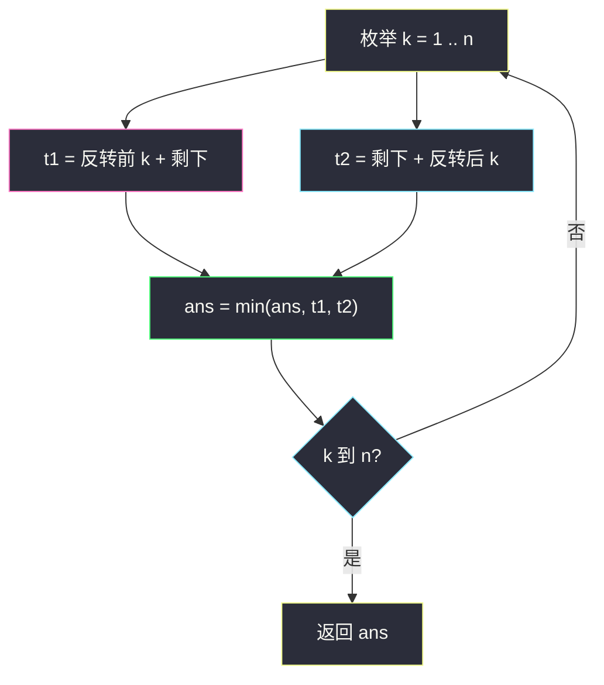
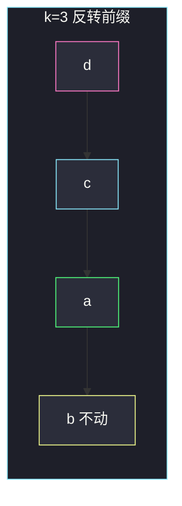

# 反转后字典序最小的字符串（枚举一次反转）

## 一、问题描述

给定小写字符串 `s`，长度 `n`。必须**恰好做一次**操作：选一个 `k ∈ [1, n]`，然后二选一：

- 反转**前** `k` 个字符；或
- 反转**后** `k` 个字符。

返回能得到的字典序最小字符串。

> 🔗 LeetCode 3722：https://leetcode.cn/problems/lexicographically-smallest-string-after-reverse/
>
> 数据范围：`1 ≤ n == s.length ≤ 1000`，只含小写字母。`O(n²)` 可过。
>
> 📚 灵茶题单：**四、字符串哈希**。哈希能让「比较两个生成串」变成 `O(1)`，但本题 `n ≤ 1000`，直接构造 `t1`、`t2` 再 `min` 已经是 `O(n²)`，没必要硬上哈希。`k = n` 时整串反转会被前缀、后缀各算一次，取 min 无妨。函数名是 `lexSmallest`，不是 `lexicographicallySmallest`。

**示例 1**

```
输入：s = "dcab"
输出："acdb"
解释：k=3 反转前 3 个，"dca" → "acd"，得到 "acdb"。
```

**示例 2**

```
输入：s = "abba"
输出："aabb"
解释：k=3 反转后 3 个，"a" + reverse("bba") = "aabb"。
```

**示例 3**

```
输入：s = "zxy"
输出："xzy"
解释：k=2 反转前 2 个，"zx" → "xz"，得到 "xzy"。
```

**直观理解**

只能动一次，而且动的是「从某一端 dig 进去的一整段」。想把后面某个小字符翻到前面，就反转一段前缀；想把尾巴理顺、前缀不动，就反转一段后缀。两种都要试遍所有长度。

---

## 二、暴力解法

`k` 从 1 到 `n`，构造两种结果，全局取 min。这已经是本题的正确算法，也是主解——数据范围允许把每种结果都真的造出来。

```python
class Solution:
    def lexSmallest(self, s: str) -> str:
        n = len(s)
        ans = s
        for k in range(1, n + 1):
            t1 = s[:k][::-1] + s[k:]
            t2 = s[: n - k] + s[n - k :][::-1]
            ans = min(ans, t1, t2)
        return ans
```

官方三例都能过。每种构造 `O(n)`，共 `2n` 种，总 `O(n²)`。`n=1000` 约 `10⁶` 量级。

### 🔴 瓶颈在哪里

没有算法瓶颈，只有「想优化比较」时的幻觉：若用哈希 / 双指针比两个候选谁更小，常数更好，但 `n=1000` 不需要。下面把两种操作的形状讲清楚，避免漏 `k` 或写错切片。

---

## 三、优化探索（核心章节）

> 📚 本题在灵茶题单中属于 **四、字符串哈希**。哈希预处理前缀哈希后，可以 `O(1)` 问「反转后某段」和另一候选的字典序，整体仍要枚举 `k`。教学上先把生成串写对。

### 3.1 两种操作长什么样

设 `s` 下标 `0 .. n-1`。

- 反转前 `k` 个：`t1 = reverse(s[0:k]) + s[k:n]`。新串首位是原来的 `s[k-1]`。
- 反转后 `k` 个：`t2 = s[0:n-k] + reverse(s[n-k:n])`。
  - `k < n` 时左边 `s[0:n-k]` 非空，**首位仍是 `s[0]`**，只把尾巴倒过来。
  - `k = n` 时左边为空，整串反转，首位变成 `s[n-1]`。

所以：想换掉第一位，只能「反转某段前缀」或「整串反转」。反转一段真后缀（`k<n`）改不了 `s[0]`。这解释了示例 1 为什么要动前缀：`"dcab"` 的 `d` 偏大，把前 3 个翻过来让 `a` 到队头。

`k=1`：反转一个字符等于没动，原串一定是候选。答案不会比 `s` 更差到「不存在操作」——操作是强制的，但 `k=1` 给了原串。

`k=n`：前缀反转和后缀反转是同一个串 `s[::-1]`，循环里会出现两次，`min` 消化掉。



### 3.2 哈希怎么比，为什么不必写

把 `s` 和 `s[::-1]` 都做前缀哈希。`t1` 是「反转串的某一后缀 + 原串某一后缀」，`t2` 是「原串某一前缀 + 反转串某一前缀」。按位二分 + 哈希可以 `O(log n)` 比较两个候选，总时间 `O(n log n)`。实现明显长于直接 `min(s1, s2)`，而 `n=1000` 的字符串比较本身已经很快。

哈希真正有价值的是 `n` 到 `10⁵`、又不能把每个 `t` 都物化的时候。本题约束写明 1000，主解物化即可。

### 3.3 一句话核心

> **枚举 k，构造「翻前缀」和「翻后缀」两个串，全部取 min；整串翻转重复一次无妨。**

---

## 四、代码实现

### Python（主解：枚举构造）

```python
class Solution:
    def lexSmallest(self, s: str) -> str:
        n = len(s)
        ans = s
        for k in range(1, n + 1):
            t1 = s[:k][::-1] + s[k:]
            t2 = s[: n - k] + s[n - k :][::-1]
            ans = min(ans, t1, t2)
        return ans
```

**变量含义**

| 写法 | 含义 |
|------|------|
| `k` | 反转长度，含端点 `1` 和 `n` |
| `t1` | 反转前缀 `s[0:k]` |
| `t2` | 反转后缀 `s[n-k:n]` |
| `s[:n-k]` | 后缀反转时不动的前缀；`k=n` 时为空 |

`ans` 初始化成 `s` 与 `k=1` 的结果相同，写不写都行。

---

## 五、具体例子演示

### 5.1 官方示例 1：`s = "dcab"`

| k | t1 翻前缀 | t2 翻后缀 |
|---|-----------|-----------|
| 1 | `d`+`cab` = `dcab` | `dca`+`b` = `dcab` |
| 2 | `cd`+`ab` = `cdab` | `dc`+`ba` = `dcba` |
| 3 | `acd`+`b` = **`acdb`** | `d`+`bac` = `dbac` |
| 4 | `bacd` | `bacd`（整串反转） |

`min` 为 `"acdb"`。逐步看 k=3 前缀：

```
原串    d c a b
前 3    d c a      反转 → a c d
拼回    a c d b
```

首位从 `d` 变成 `a`，已经小于所有仍以 `d` 开头的后缀反转（k<4）。整串反转 `"bacd"` 以 `b` 开头，也大于 `"acdb"`。



粉、青、绿是被翻转的前 3 位，绿 `a` 翻到队头；黄是未动的最后一位。

### 5.2 官方示例 2：`s = "abba"`

| k | t1 | t2 |
|---|----|----|
| 1 | `abba` | `abba` |
| 2 | `baba` | `abab` |
| 3 | `bbaa` | **`aabb`** |
| 4 | `abba` | `abba` |

k=3 后缀：`s[:1]="a"` 不动，`s[1:]="bba"` 反转成 `"abb"`，拼成 `"aabb"`。

这里翻前缀变不出以两个 `a` 开头的串：前缀反转要把某个 `a` 翻到位置 0，`s[0]` 已经是 `a`，再翻前 4 位仍是 `"abba"`。真正变好的是**把尾巴的 `a` 挪到更靠前的位置**，同时保留原来的首位 `a`——这正是「翻后缀、k<n」的用武之地。

### 5.3 官方示例 3：`s = "zxy"`

| k | t1 | t2 |
|---|----|----|
| 1 | `zxy` | `zxy` |
| 2 | **`xzy`** | `zyx` |
| 3 | `yxz` | `yxz` |

`min` 为 `"xzy"`。翻前 2：`"zx"`→`"xz"`，再接 `"y"`。若只贪心「把最小字符 `x` 翻到最前」，还要确认后面是 `"zy"` 还是别的；枚举保证不会漏掉 `"yxz"` 等竞争者，最后比出来仍是 `"xzy"`。

### 5.4 `n=1` 与整串反转重复

`s="a"`：k 只能 1，两种操作都是 `"a"`。`s="ab"`：

- k=1：`"ab"` / `"ab"`
- k=2：`"ba"` / `"ba"`

答案 `"ab"`。原串已经最小时，操作不会被迫变差——因为存在「等于没动」的 k=1。

### 5.5 只靠后缀才能更优：再拆 `"abba"`

想让第二位也变成 `a`。翻前缀：

- k=2：`"ba"|"ba"` → `"baba"`，第一位反而变 `b`
- k=3：`"bba"|"a"` → `"bbaa"`，同样变差

翻后缀 k=3：左边留下 `"a"`，右边 `"bba"` 倒成 `"abb"`，第二位得到尾巴翻过来的 `a`。这就是「首位已经最小时，用后缀反转整理后面」。枚举不会漏；若贪心「找到一个 `a` 翻到最前就停」，在 `"abba"` 上会停在原串。

### 5.6 两种操作抢同一首位

`s="cba"`：最小字符是 `a`，在最后。

- 翻前缀 k=3：整串反转 `"abc"`
- 翻后缀 k=3：同样 `"abc"`
- 翻前缀 k=2：`"bc"|"a"` = `"bca"`，首位 `b` 更大

答案 `"abc"`。这里「把最后的 `a` 翻到最前」只能靠 **k=n**。k<n 的后缀反转动不了 `'c'`。

---

## 六、复杂度分析

| 方法 | 时间 | 空间 | 说明 |
|------|------|------|------|
| 枚举 k 并构造（主解） | `O(n²)` | `O(n)` | `2n` 个串，每个 `O(n)` 构造与比较 |
| 哈希 + 二分比较 | `O(n log n)` | `O(n)` | 题单手法，本题不必 |

比较两个长度为 n 的串最坏 `O(n)`，总时间上界 `O(n²)`。Python 字符串不可变，每次切片 + 反转都分配新串，空间按答案 `O(n)` 计（不计语言层临时对象）。

---

## 七、对比总结

| 维度 | 枚举构造 | 哈希加速比较 |
|------|----------|--------------|
| 实现 | 切片三行 | 前缀哈希 + 反转串哈希 + 二分 |
| `n=1000` | 足够 | 杀鸡 |
| `k=n` 重复 | 无影响 | 同样无影响 |

**易错点**

1. **函数名写成 `lexicographicallySmallest`**：提交接口是 `lexSmallest`。
2. **`k` 从 0 或到 `n-1`**：`k=n` 是合法操作（整串反转）；`k=0` 不是「一次反转」。
3. **后缀切片写成 `s[-k:][::-1]` 却忘了前面是 `s[:-k]`**：`k=n` 时 `s[:-n]` 为空，恰好正确；写成 `s[:k]` 就错了。
4. **以为翻后缀也能换首位**：只有 `k=n` 可以。示例 1 必须走前缀。
5. **只翻前缀或只翻后缀**：示例 2 的最优在后缀，示例 1 在前缀，两边都要。
6. **贪心「最小字符翻到最前就停」**：第一位最小之后，后面仍可能被另一种 `k` 做得更小，必须全局 `min`。

---

## 八、举一反三

| 题目 | 关系 |
|------|------|
| [2000. 反转单词前缀](https://leetcode.cn/problems/reverse-prefix-of-word/) | 只反转某一个前缀，题意更窄 |
| [541. 反转字符串 II](https://leetcode.cn/problems/reverse-string-ii/) | 按 2k 分段，每段只翻前 k |
| [1625. 执行操作后字典序最小的字符串](https://leetcode.cn/problems/lexicographically-smallest-string-after-applying-operations/)（`lexicographically-smallest-string-after-applying-operations.md`） | 可多次轮转 / 累加，BFS 或枚举等价类 |
| [2734. 执行子串操作后的字典序最小字符串](https://leetcode.cn/problems/lexicographically-smallest-string-after-substring-operation/) | 只能把一段连续非 a 减一，贪心定位 |
| [2697. 字典序最小回文串](https://leetcode.cn/problems/lexicographically-smallest-palindrome/) | 对称位置取较小字符 |
| [1163. 按字典序排在最后的子串](https://leetcode.cn/problems/last-substring-in-lexicographical-order/)（`last-substring-in-lexicographical-order.md`） | 同批「字典序最值」，那边是最大后缀 |

**思想迁移**

- 操作次数被卡成「恰好一次」、种类很少时，枚举操作比设计贪心更稳。
- 口诀：**「前 k 翻、后 k 翻，k 从 1 到 n 全造出来取 min。」**
