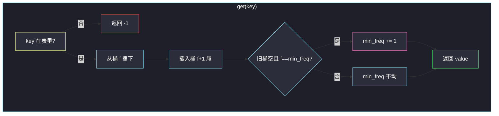
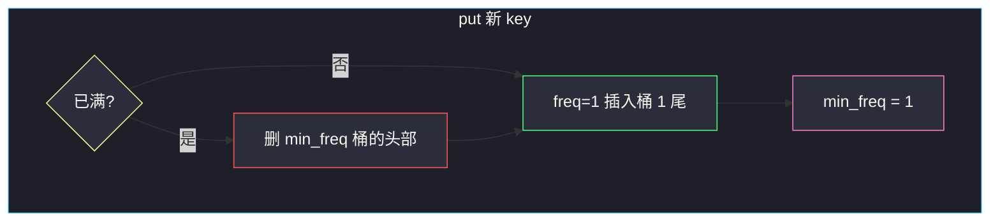
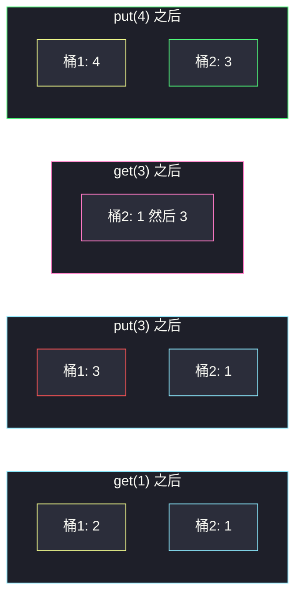

# LFU 缓存（哈希 + 每频次一条双向链表）

## 一、问题描述

实现 LFU（Least Frequently Used）缓存：

- `LFUCache(int capacity)`：容量为 `capacity`（正整数）。
- `int get(int key)`：若 `key` 存在，返回对应 `value`，并把它的使用频次 `+1`；否则返回 `-1`。
- `void put(int key, int value)`：插入或更新。已存在则更新值，频次 `+1`（与一次 `get` 相同）。不存在则插入，频次为 1。若此时已满，必须先淘汰**频次最低**的键；若最低频次有多个，淘汰其中**最久未使用**的那个（LRU）。

`get`、`put` 都必须是平均 **`O(1)`**。

> 🔗 LeetCode 460：https://leetcode.cn/problems/lfu-cache/
>
> 数据范围：`1 ≤ capacity ≤ 10^4`；键值在 `[0, 10^5]`；`get`/`put` 合计最多 `10^5` 次。
>
> 📚 灵茶题单：**数据结构 · §1.10 综合应用**。先会 [146. LRU 缓存](https://leetcode.cn/problems/lru-cache/)（哈希 + 一条双向链表），本题在每个频次上再挂一条 LRU 链，并维护全局 `min_freq`。

**示例（官方，容量 2）**

```
LFUCache lfu = LFUCache(2)
lfu.put(1, 1)   # cache=[1,_]，cnt(1)=1
lfu.put(2, 2)   # cache=[2,1]，cnt(2)=1，cnt(1)=1
lfu.get(1)      # 返回 1；cnt(1)=2；同频次里 2 更旧
lfu.put(3, 3)   # 淘汰频次 1 的 2；写入 3，cnt(3)=1
lfu.get(2)      # 返回 -1
lfu.get(3)      # 返回 3，cnt(3)=2
lfu.put(4, 4)   # 1 和 3 都是频次 2，1 更久未用，淘汰 1；写入 4
lfu.get(1)      # -1
lfu.get(3)      # 3
lfu.get(4)      # 4
```

**直观理解**

LRU 只看「谁最近被碰过」：一条链表，表头最新、表尾最旧。LFU 先看「谁被碰的次数少」，次数相同再看时间。所以需要：

- 每个 key 知道自己的 `(value, freq)`
- 每个 `freq` 有一个**自己的** LRU 队列
- 永远知道当前最小的 `freq` 是多少，淘汰时只看这个桶的队尾

---

## 二、暴力解法

用哈希表存 `key → (value, freq, last_time)`，另用一个全局时钟。`get`/`put` 时扫全体键找「freq 最小，freq 相同则 time 最小」的淘汰对象。每次 `O(n)`。

```python
class LFUCache:
    def __init__(self, capacity: int):
        self.cap = capacity
        self.tick = 0
        self.data = {}  # key -> [val, freq, time]

    def get(self, key: int) -> int:
        if key not in self.data:
            return -1
        self.tick += 1
        self.data[key][1] += 1
        self.data[key][2] = self.tick
        return self.data[key][0]

    def put(self, key: int, value: int) -> None:
        if self.cap == 0:
            return
        self.tick += 1
        if key in self.data:
            self.data[key][0] = value
            self.data[key][1] += 1
            self.data[key][2] = self.tick
            return
        if len(self.data) == self.cap:
            victim = min(
                self.data,
                key=lambda k: (self.data[k][1], self.data[k][2]),
            )
            del self.data[victim]
        self.data[key] = [value, 1, self.tick]
```

`n` 到 `10^4`、操作 `10^5`，`O(n)` 淘汰会超时。

### 复杂度

- **时间**：`get` `O(1)`，`put` 满容时 `O(n)`。
- **空间**：`O(capacity)`。

### 🔴 瓶颈在哪里

淘汰需要「最小频次里最久未用」——若能 `O(1)` 找到这个键，其余都是哈希查找。做法：频次分桶 + 桶内链表维护 LRU 顺序 + 一个 `min_freq` 变量。

---

## 三、优化探索（核心章节）

> 📚 本题在灵茶题单中属于 **§1.10 综合应用**。146 是单桶 LRU；本题是「频次当桶号，桶内仍是 LRU」。

### 3.1 三件套

1. **`key_map`**：`key → Node(key, val, freq)`，`get`/`put` 定位节点 `O(1)`。
2. **`freq_map`**：`freq →` 该频次的双向链表（或 Python `OrderedDict`）。链表**尾部是最近使用**，**头部是最久未用**。同一频次淘汰只删头。
3. **`min_freq`**：当前所有还在缓存里的 key 的最小频次。淘汰时直接拿 `freq_map[min_freq]` 的头节点。

### 3.2 O(1) 不变量（必须守住）

记「频次为 `f` 的链表」为桶 `f`。

| 不变量 | 含义 | 谁负责维护 |
|--------|------|------------|
| I1 | `key_map` 与各桶合起来是同一批 key，不重不漏 | 每次搬迁先从旧桶摘掉，再插入新桶 |
| I2 | 节点的 `freq` 等于它所在桶的编号 | 搬迁时 `freq += 1` 再插入 `freq` 桶 |
| I3 | 桶内从头部到尾部是该频次下的 LRU → MRU | 每次访问：从旧位置删除，插到新桶尾 |
| I4 | `min_freq` 等于当前仍存在的最小 `freq`；该桶非空 | 见下节四种更新 |

破坏任意一条，`get`/`put` 就会在错误的桶里删节点，或 `min_freq` 指向空桶导致淘汰空指针。

### 3.3 get：升频搬迁

`key` 不在 → `-1`。否则：

1. 从桶 `f` 摘掉该节点。
2. `f += 1`，插入桶 `f+1` 的尾部（现在是该频次下最新）。
3. 若旧桶 `f` 变空 **且** `f == min_freq`，则 `min_freq += 1`。

为什么 `min_freq += 1` 一定对：这次被访问的节点原来就是最小频次之一，它升到 `f+1` 后，若旧桶空了，说明没有人还停在 `f`。新桶 `f+1` 至少包含刚搬过去的这个节点，所以新的最小频次恰好是 `f+1`，不会出现空档（不会从 1 直接跳到 5——因为这个节点自己就在 2）。

若旧桶还有别人，`min_freq` 不变。

### 3.4 put：更新 vs 新键

**已有 key**：改 `value`，然后走与 `get` 完全相同的升频。容量不变，不淘汰。

**新 key**：

1. 若 `size == capacity`：淘汰 `freq_map[min_freq]` 的**头部**（该最小频次里最久未用），并从 `key_map` 删除。
2. 新节点 `freq = 1`，插入桶 1 的尾部。
3. **`min_freq = 1`**（新来的一定是全局最低频次）。

容量为 0 时 `put` 直接忽略（题目允许）。

满容淘汰后再插入：旧的 `min_freq` 桶可能被删空，但马上 `min_freq = 1` 且桶 1 有新节点，I4 恢复。





### 3.5 Python 用 OrderedDict 模拟链表

每个频次一个 `OrderedDict`：插入顺序 = LRU 顺序。`popitem(last=False)` 弹出最旧；`d[key] = ...` 放在最新一端。删除中间节点 `del d[key]` 是 `O(1)`（CPython 有序字典）。这与手写双向链表同一套不变量，代码更短，适合当主解。

### 3.6 一句话核心

> **key 找节点；freq 找那条 LRU 链；min_freq 指向非空的最低桶。访问就从旧桶挪到 freq+1 的链尾。**

---

## 四、代码实现

### Python（主解：哈希 + 每频次 OrderedDict）

```python
from collections import defaultdict, OrderedDict


class LFUCache:
    def __init__(self, capacity: int):
        self.cap = capacity
        self.min_freq = 0
        self.key_map = {}  # key -> [val, freq]
        self.freq_map = defaultdict(OrderedDict)  # freq -> key 的 LRU

    def _touch(self, key: int) -> None:
        val, freq = self.key_map[key]
        del self.freq_map[freq][key]
        if not self.freq_map[freq] and freq == self.min_freq:
            self.min_freq += 1
        new_freq = freq + 1
        self.freq_map[new_freq][key] = None
        self.key_map[key] = [val, new_freq]

    def get(self, key: int) -> int:
        if key not in self.key_map:
            return -1
        self._touch(key)
        return self.key_map[key][0]

    def put(self, key: int, value: int) -> None:
        if self.cap == 0:
            return
        if key in self.key_map:
            self.key_map[key][0] = value
            self._touch(key)
            return
        if len(self.key_map) == self.cap:
            old_key, _ = self.freq_map[self.min_freq].popitem(last=False)
            del self.key_map[old_key]
        self.key_map[key] = [value, 1]
        self.freq_map[1][key] = None
        self.min_freq = 1
```

**变量含义**

| 名字 | 含义 |
|------|------|
| `key_map[key]` | `[val, freq]`，定位与改值 |
| `freq_map[f]` | 频次 `f` 的有序字典，左旧右新 |
| `min_freq` | 当前最低频次，淘汰只看这个桶 |
| `_touch` | 升频搬迁，维护 I1–I4 |

`OrderedDict` 的值不用存 Node，占位 `None` 即可，真正的值在 `key_map`。

### Java（最优解：哈希 + 每频次双向链表）

```java
class LFUCache {
    static class Node {
        int key, val, freq;
        Node prev, next;
        Node(int k, int v) {
            key = k;
            val = v;
            freq = 1;
        }
    }

    static class DLList {
        Node head, tail;
        int size;
        DLList() {
            head = new Node(0, 0);
            tail = new Node(0, 0);
            head.next = tail;
            tail.prev = head;
        }
        void addLast(Node x) {
            x.prev = tail.prev;
            x.next = tail;
            tail.prev.next = x;
            tail.prev = x;
            size++;
        }
        void remove(Node x) {
            x.prev.next = x.next;
            x.next.prev = x.prev;
            size--;
        }
        Node removeFirst() {
            if (size == 0) {
                return null;
            }
            Node x = head.next;
            remove(x);
            return x;
        }
    }

    private final int cap;
    private int minFreq;
    private final Map<Integer, Node> keyMap = new HashMap<>();
    private final Map<Integer, DLList> freqMap = new HashMap<>();

    public LFUCache(int capacity) {
        cap = capacity;
    }

    private void touch(Node x) {
        DLList old = freqMap.get(x.freq);
        old.remove(x);
        if (old.size == 0 && x.freq == minFreq) {
            minFreq++;
        }
        x.freq++;
        freqMap.computeIfAbsent(x.freq, k -> new DLList()).addLast(x);
    }

    public int get(int key) {
        Node x = keyMap.get(key);
        if (x == null) {
            return -1;
        }
        touch(x);
        return x.val;
    }

    public void put(int key, int value) {
        if (cap == 0) {
            return;
        }
        Node x = keyMap.get(key);
        if (x != null) {
            x.val = value;
            touch(x);
            return;
        }
        if (keyMap.size() == cap) {
            Node victim = freqMap.get(minFreq).removeFirst();
            keyMap.remove(victim.key);
        }
        Node y = new Node(key, value);
        keyMap.put(key, y);
        freqMap.computeIfAbsent(1, k -> new DLList()).addLast(y);
        minFreq = 1;
    }
}
```

哨兵头尾避免空指针；`addLast` = MRU，`removeFirst` = 淘汰 LFU+LRU。

---

## 五、具体例子演示

容量 `2`，官方操作。桶写成「头（旧）→ … → 尾（新）」。

| 操作 | 返回 | key_map | 桶 1 | 桶 2 | 桶 3 | min_freq |
|------|------|---------|------|------|------|----------|
| 初始 | | {} | 空 | 空 | 空 | 0 |
| put(1,1) | | 1:(1,1) | 1 | | | 1 |
| put(2,2) | | 1:(1,1) 2:(2,1) | 1 → 2 | | | 1 |
| get(1) | 1 | 1:(1,2) 2:(2,1) | 2 | 1 | | 1 |
| put(3,3) | | 1:(1,2) 3:(3,1) | 3 | 1 | | 1 |
| get(2) | -1 | 同上 | 3 | 1 | | 1 |
| get(3) | 3 | 1:(1,2) 3:(3,2) | 空 | 1 → 3 | | **2** |
| put(4,4) | | 3:(3,2) 4:(4,1) | 4 | 3 | | **1** |
| get(1) | -1 | | 4 | 3 | | 1 |
| get(3) | 3 | 3:(3,3) 4:(4,1) | 4 | 空 | 3 | 1 |
| get(4) | 4 | 3:(3,3) 4:(4,2) | 空 | 4 | 3 | **2** |

逐步说明：

1. **put(1)、put(2)**：两个新键都进桶 1。链表顺序 `1 → 2`，1 更旧。
2. **get(1)**：1 从桶 1 摘到桶 2。桶 1 还剩 2，`min_freq` 仍为 1。
3. **put(3,3)**：满了，删桶 1 的头 = 2。3 以 freq=1 进桶 1，`min_freq=1`。1 仍在桶 2。
4. **get(3)**：3 从桶 1 升到桶 2。桶 1 空且 `min_freq` 正是 1 → `min_freq=2`。桶 2 现为 `1 → 3`（1 比 3 旧）。
5. **put(4,4)**：满了，最低频次是 2，桶 2 的头是 1，淘汰 1。4 进桶 1，`min_freq=1`。
6. **get(3)**：3 升到桶 3。桶 2 空，但 `min_freq` 是 1（4 还在），**不要**加 `min_freq`。这是 I4 里「只有旧桶空 **且** 等于 min_freq 才 +1」的反例：空的是桶 2，不是最小桶。
7. **get(4)**：4 升到桶 2，桶 1 空且是 min_freq → `min_freq=2`。



红桶 1 在 put(3) 时刚被写入淘汰替换后的新键；粉桶表示两个 freq=2 的键按 LRU 排列，随后 put(4) 删的是 1 不是 3。

---

## 六、复杂度分析

| 方法 | 时间 | 空间 | 说明 |
|------|------|------|------|
| 扫全表找最小 freq | `put` 最坏 `O(n)` | `O(n)` | `n = capacity`，超时 |
| 哈希 + 频次链表 / OrderedDict（主解） | `get`/`put` 均 `O(1)` | `O(n)` | 摘节点、插尾、弹头都是 O(1) |
| 堆按 (freq, time) | `O(log n)` 带懒删除 | `O(n)` | 能过，但不是题目要的 O(1) |

---

## 七、对比总结

| 维度 | 146 LRU | 本题 LFU |
|------|---------|---------|
| 淘汰键 | 全局最久未用 | 最低频次里最久未用 |
| 链表条数 | 1 | 每个出现过的 freq 一条 |
| 额外变量 | 无 | `min_freq` |
| 访问时 | 节点挪到全局链尾 | 从桶 f 挪到桶 f+1 链尾 |

**易错点**

1. **`min_freq` 在旧桶非空时仍 +1**：同频次还有别人，最小频次没变。
2. **`min_freq` 在「空的不是最小桶」时 +1**：`get(3)` 让桶 2 变空、桶 1 还有 4，最小仍是 1。
3. **新 key 忘记 `min_freq = 1`**：淘汰一个高频键后插入 freq=1，最小一定回到 1。
4. **更新已有 key 还去淘汰**：已有 key 不增加容量。
5. **桶内顺序插反**：淘汰应删最久未用 = 头部 / `popitem(last=False)`。
6. **`capacity = 0`**：`put` 不能写进去。
7. 升频后旧桶空了不删也行（下次不用这条空链），但 `min_freq` 必须更新，否则淘汰会拿到空桶。

---

## 八、举一反三

| 题目 | 关系 |
|------|------|
| [146. LRU 缓存](https://leetcode.cn/problems/lru-cache/) | 单桶版，见 `solutions/base/lru-cache.md`；本题每个 freq 复制一桶 |
| [895. 最大频率栈](https://leetcode.cn/problems/maximum-frequency-stack/) | 也按频次分桶，弹的是**最高**频次的栈顶，和 LFU 方向相反 |
| [432. 全 O(1) 的数据结构](https://leetcode.cn/problems/all-oone-data-structure/) | 字符串计数 + 桶链表，要同时支持最小和最大 key |
| [460 的简化面试](https://leetcode.cn/problems/lru-cache/) | 先默写 146，再加 `freq` 与 `min_freq` 就升到本题 |

**思想迁移**

- 多关键字淘汰 = 分层：第一关键字分桶，桶内用链表维护第二关键字。
- 口诀：**「哈希定位；升频换桶；空了且是 min 则 min++；新键 freq=1。」**
