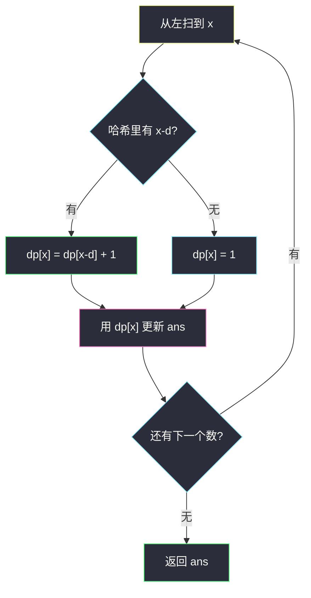
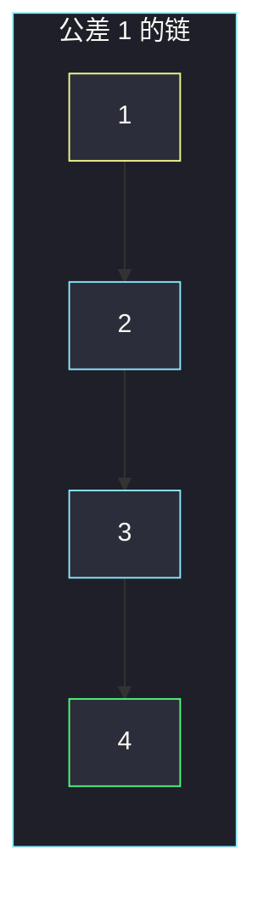

# 最长定差子序列（哈希 DP：前驱唯一）

## 一、问题描述

给你整数数组 `arr` 和整数 `difference`。请找出 `arr` 中最长的**等差子序列**，使得相邻两项（在子序列里相邻，原数组里不必相邻）的差恰好等于 `difference`，返回这个子序列的长度。

子序列要保持原相对顺序，可以删元素。差固定，所以一旦定了结尾值 `x`，前一项只能是 `x - difference`。

> 🔗 LeetCode 1218：https://leetcode.cn/problems/longest-arithmetic-subsequence-of-given-difference/
>
> 数据范围：`1 ≤ n ≤ 10^5`，`-10^4 ≤ arr[i], difference ≤ 10^4`。
>
> 📚 灵茶题单：**§7.4 合法子序列 DP**。合法前驱只有一个值 `x - d`，不能 `O(n²)` 枚举下标。从左往右扫，哈希表记 `dp[x]`。

方法名 `longestSubsequence`。

**示例 1**

```
输入：arr = [1,2,3,4], difference = 1
输出：4
解释：整段 [1,2,3,4] 就是公差 1 的等差子序列。
```

**示例 2**

```
输入：arr = [1,3,5,7], difference = 1
输出：1
解释：任意两项差都是 2，没有差为 1 的衔接。每个数只能单独成列。
```

**示例 3**

```
输入：arr = [1,5,7,8,5,3,4,2,1], difference = -2
输出：4
解释：其中一条是 [7,5,3,1]。
```

**直观理解**

普通 LIS / 最长等差（1027）每个位置前面有很多候选。本题公差钉死，**前驱值唯一**：看 `x` 时，只问「左边有没有以 `x-d` 结尾的链」。有就接上 `+1`，没有就从 1 开始。用哈希表按**值**存最长链，从左扫一遍即可。

---

## 二、暴力解法

枚举每个位置当结尾，再往左找所有 `arr[j] == arr[i] - difference`，取最长的 `dp[j] + 1`。

```python
class Solution:
    def longestSubsequence(self, arr: list[int], difference: int) -> int:
        n = len(arr)
        dp = [1] * n
        for i in range(n):
            for j in range(i):
                if arr[i] - arr[j] == difference:
                    dp[i] = max(dp[i], dp[j] + 1)
        return max(dp)
```

官方三例都能过。时间 `O(n²)`，`n=10^5` 超时。

### 🔴 瓶颈在哪里

内层在扫「所有下标」，但真正有用的只有值等于 `arr[i] - difference` 的那些，而且只需要其中 **dp 最大**的一个。同一个值在左边出现多次时，后面那次的 `dp` 不会更差（见 3.3），所以用哈希记下「该值当前最长链」就够了。

---

## 三、优化探索（核心章节）

> 📚 本题在灵茶题单中属于 **§7.4 合法子序列 DP**。模板：`dp[x] = dp[x - d] + 1`，按原数组从左到右更新。和「先排序再 DP」的方波 / 整除子集不同：**这里必须保序**，不能按值排序。

### 3.1 状态

`dp[x]` = **从左扫到当前位置为止**，以值 `x` 结尾的、公差为 `difference` 的最长子序列长度。

扫到一个数 `x`：

```
dp[x] = dp.get(x - difference, 0) + 1
```

没有前驱就当成 0，再 `+1` 表示只选自己。答案是过程中所有 `dp[x]` 的最大值。

### 3.2 为什么从左往右、按出现顺序更新

子序列不能回头。处理 `arr[i]` 时，哈希里已经是 `i` 左边的结果，正好当前驱。

若先按值排序再 DP，会破坏下标顺序。反例：`arr = [3, 1, 2]`，`difference = 1`。正确是 `[1,2]` 长度 2。按值从小到大会先处理 3，再接到错误的链。



### 3.3 同一值出现两次会不会把 dp 改短

`d ≠ 0` 时，两次写 `dp[x]` 用的前驱都是同一个键 `x-d`。中间这段里 `dp[x-d]` 只增不减，所以第二次写入 `≥` 第一次。`d = 0` 时公式变成 `dp[x] = dp[x] + 1`，就是相同数全收进一条链，也正确。

因此直接覆盖、不必 `max(旧 dp[x], 新值)`。

### 3.4 一句话核心

> **从左扫；`dp[x] = dp[x-d]+1`；前驱唯一，哈希就够，不要 O(n²)。**

---

## 四、代码实现

### Python（主解：哈希 DP）

```python
class Solution:
    def longestSubsequence(self, arr: list[int], difference: int) -> int:
        # dp[x] = 以值 x 结尾的最长定差子序列长度
        dp = {}
        ans = 0
        for x in arr:
            dp[x] = dp.get(x - difference, 0) + 1
            ans = max(ans, dp[x])
        return ans
```

也可以 `return max(dp.values())`，因为覆盖不会变短。扫的时候维护 `ans` 更直观。

**变量含义**

| 写法 | 含义 |
|------|------|
| `dp[x]` | 当前以 `x` 结尾的最长定差链 |
| `x - difference` | 唯一合法前驱 |
| `get(..., 0)` | 没有前驱就从单元素开始 |

### Java（最优解）

```java
class Solution {
    public int longestSubsequence(int[] arr, int difference) {
        Map<Integer, Integer> dp = new HashMap<>();
        int ans = 0;
        for (int x : arr) {
            int len = dp.getOrDefault(x - difference, 0) + 1;
            dp.put(x, len);
            ans = Math.max(ans, len);
        }
        return ans;
    }
}
```

值域只有 `2·10^4` 量级，也可用偏移数组代替哈希；哈希更短，平均 `O(1)`。

---

## 五、具体例子演示

### 5.1 官方示例 1：公差 1，整段接上

`arr = [1,2,3,4]`，`difference = 1`。逐步跟踪 `dp[x]`：

| 扫到 x | 前驱 x-d | dp[前驱] | dp[x] | ans |
|--------|----------|----------|-------|-----|
| 1 | 0 无 | 0 | 1 | 1 |
| 2 | 1 | 1 | 2 | 2 |
| 3 | 2 | 2 | 3 | 3 |
| 4 | 3 | 3 | 4 | 4 |

答案 4，对拍官方。



### 5.2 官方示例 2：接不上

`arr = [1,3,5,7]`，`difference = 1`。每个 `x-1` 都不在已扫过的哈希里，`dp` 全是 1，答案 1。对拍官方。

### 5.3 官方示例 3：公差 -2，同一值更新两次

`arr = [1,5,7,8,5,3,4,2,1]`，`difference = -2`，前驱是 `x - (-2) = x+2`。

| 扫到 x | 前驱 | 动作 | 关键 dp | ans |
|--------|------|------|---------|-----|
| 1 | 3 无 | 1 | dp[1]=1 | 1 |
| 5 | 7 无 | 1 | dp[5]=1 | 1 |
| 7 | 9 无 | 1 | dp[7]=1 | 1 |
| 8 | 10 无 | 1 | dp[8]=1 | 1 |
| 5 | 7 | 1+1=2 | dp[5] 从 1 改成 2 | 2 |
| 3 | 5 | 2+1=3 | dp[3]=3 | 3 |
| 4 | 6 无 | 1 | dp[4]=1 | 3 |
| 2 | 4 | 1+1=2 | dp[2]=2 | 3 |
| 1 | 3 | 3+1=4 | dp[1] 从 1 改成 4 | 4 |

第二次扫到 5 时，左边已经有 7，于是 `7→5` 接上；再 `5→3→1`，得到 `[7,5,3,1]`。对拍官方。

注意：第一个 1 当时没有前驱 3；最后一个 1 时 3 已经在表里，链长变成 4。这就是「按出现顺序更新」而不是「按值排序」的原因。

---

## 六、复杂度分析

| 方法 | 时间 | 空间 | 说明 |
|------|------|------|------|
| 枚举下标前驱 | `O(n²)` | `O(n)` | `n=10^5` 超时 |
| 哈希 DP（主解） | `O(n)` 平均 | `O(n)` | 每个元素一次转移 |

最坏哈希退化少见；值域小时可改偏移数组，时间仍 `O(n)`，空间 `O(值域)`。

---

## 七、对比总结

| 维度 | 300 LIS | 2501 方波 | 本题 |
|------|---------|-----------|------|
| 前驱 | 所有更小的数 | 至多一个平方根 | 恰好一个 `x-d` |
| 是否保序 | 要 | 选出后可排序 | **要** |
| 转移 | `O(n)` 或二分 | `O(1)` | `O(1)` |

**易错点**

1. **`O(n²)` 套 LIS 模板**：前驱值唯一，必须哈希。
2. **按值排序再 DP**：破坏子序列顺序。
3. **`difference = 0`**：公式仍成立，答案是某个数的出现次数。
4. **只看相邻元素**：子序列可跳着选，示例 3 的 7 和 5 中间隔着 8。
5. **用 `dp[i]` 按下标却去哈希查「任意历史最大值」时忘了从左扫**：必须按原数组顺序吃进去。

---

## 八、举一反三

| 题目 | 关系 |
|------|------|
| [2501. 数组中最长的方波](https://leetcode.cn/problems/longest-square-streak-in-an-array/) | 同目录 `longest-square-streak-in-an-array.md`，§7.4 前驱唯一，但本题要保序 |
| [1048. 最长字符串链](https://leetcode.cn/problems/longest-string-chain/) | §7.4：前驱是删一个字符后的词 |
| [1027. 最长等差数列](https://leetcode.cn/problems/longest-arithmetic-subsequence/) | 公差不固定，要 `dp[i][d]` 或哈希套哈希 |
| [873. 最长的斐波那契子序列的长度](https://leetcode.cn/problems/length-of-longest-fibonacci-subsequence/) | 前驱由两数之和决定 |
| [300. 最长递增子序列](https://leetcode.cn/problems/longest-increasing-subsequence/) | 前驱不唯一；同目录可对照 `solutions/base/longest-increasing-subsequence.md` |
| [3147. 从魔法师身上吸取的最大能量](https://leetcode.cn/problems/taking-maximum-energy-from-the-mystic-dungeon/) | 同目录：下标链 `i→i+k`，不是值链 |

**思想迁移**

- 合法后继 / 前驱只有一个值时，哈希 `dp[x] = dp[pred]+1`，从左扫保序。
- 口诀：**「定差前驱唯一；哈希从左扫，dp[x]=dp[x-d]+1。」**
