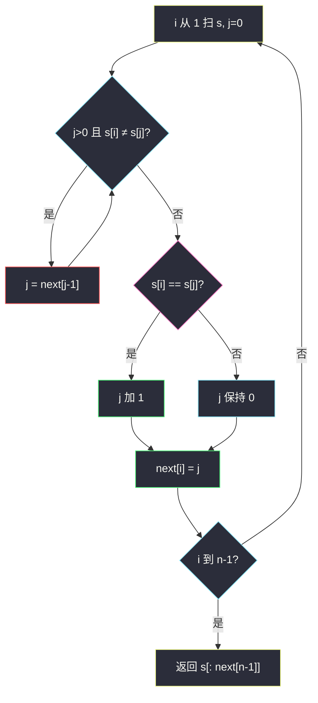
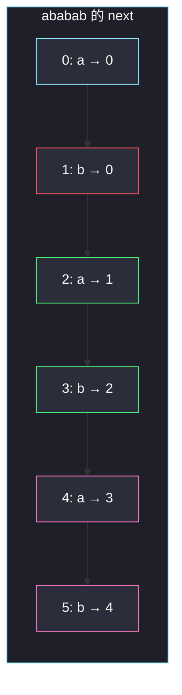

# 最长快乐前缀（KMP next 的末位）

## 一、问题描述

「快乐前缀」：既是 `s` 的**前缀**、又是 `s` 的**后缀**，且**不能等于整个 `s` 本身**。返回满足条件的**最长**字符串；不存在则返回空串 `""`。

> 🔗 LeetCode 1392：https://leetcode.cn/problems/longest-happy-prefix/
>
> 数据范围：`1 ≤ s.length ≤ 10⁵`，只含小写字母。必须线性；每次切片检查 `s[:k]==s[-k:]` 是 `O(n²)`，过不了。
>
> 📚 灵茶题单：**一、KMP（前缀的后缀）**。这就是 next / π 数组的定义本身：`next[i]` = `s[0..i]` 的最长**真**前后缀长度。整串的答案长度就是 `next[n-1]`，字符串是 `s[:next[n-1]]`。必须手搓 next，与 [#28](https://leetcode.cn/problems/find-the-index-of-the-first-occurrence-in-a-string/)（`find-the-index-of-the-first-occurrence-in-a-string.md`）同构；不要用 Python 切片暴力。也可以在 `s+'#'+s` 上跑 Z / KMP，主解用 next。

**示例 1**

```
输入：s = "level"
输出："l"
解释："l" 是前缀也是后缀；"le" 对不上末尾 "el"。不能取整个 "level"。
```

**示例 2**

```
输入：s = "ababab"
输出："abab"
解释："abab" 既是开头四位也是结尾四位；"ab" 也行，但不是最长。"ababab" 本身不算。
```

**直观理解**

把纸条头尾叠在一起，找最长的一段「开头长什么样，结尾就长什么样」，但不允许整张纸对叠（那永远相等、没有信息）。KMP 预处理恰好在算这件事。

---

## 二、暴力解法

从长到短试真前缀长度 `k = n-1 .. 1`，第一个 `s[:k]==s[n-k:]` 就是答案。

```python
class Solution:
    def longestPrefix(self, s: str) -> str:
        n = len(s)
        for k in range(n - 1, 0, -1):
            if s[:k] == s[n - k :]:
                return s[:k]
        return ""
```

官方两例都能过。每次比较 `O(k)`，总 `O(n²)`。`s = "aaaa…ab"` 这种几乎全程相等、只在最后失配的串，会把 `k=n-1, n-2, …` 都比一遍，`n=10⁵` 超时。

### 🔴 瓶颈在哪里

试 `k` 失败时，次长的候选不是 `k-1` 瞎猜，而是「当前这段自己的最长边界」。next 数组把所有长度的最长真前后缀一次算完，最后一格就是整串要的答案，不必再从 `n-1` 往下扫。

---

## 三、优化探索（核心章节）

> 📚 本题在灵茶题单中属于 **一、KMP（前缀的后缀）**。28 题用 next 在主串上匹配；本题**只建 next、不用去匹配别的串**。读法对齐 28 的模板：`next[0]=0`，失配 `j = next[j-1]`。

### 3.1 next[i] 是什么

`next[i]`：子串 `s[0..i]`（长度 `i+1`）的最长 **真** 前缀，同时也是它的后缀，这个前缀有多长。真 = 不能取整段自己，所以 `next[i] < i+1`，`next[0]=0`。

整串 `s[0..n-1]` 的最长真前后缀长度就是 `next[n-1]`。快乐前缀按题意不能是 `s` 本身，与「真」一字不差。没有真前后缀时 `next[n-1]=0`，返回 `""`。

例：`s = "abab"`

| i | s[0..i] | 最长真前后缀 | next[i] |
|---|---------|--------------|---------|
| 0 | a | （无） | 0 |
| 1 | ab | 无 | 0 |
| 2 | aba | a | 1 |
| 3 | abab | ab | 2 |

`next[n-1]=2`，快乐前缀 `"ab"`。若问 `s="ababab"`，会一直涨到 4，见第五章。

### 3.2 线性求出 next（与 #28 同一骨架）

`i` 从 1 扫到 `n-1`，`j` 表示「当前候选前后缀长度」，也是「下一个要和 `s[i]` 比较的前缀位置」。

```
j = 0
对 i = 1 .. n-1:
    当 j>0 且 s[i] != s[j]:
        j = next[j-1]          # 前缀缩到次长边界
    若 s[i] == s[j]:
        j += 1
    next[i] = j
```

`j = next[j-1]` 仍然正确：`s[0..j-1]` 已经是 `s[0..i-1]` 的后缀；它自己的最长边界 `next[j-1]` 给出更短但仍相等的前后缀。一层层缩短，不会漏。

具体说：已经知道 `s[0..j-1] == s[i-j..i-1]`。若 `s[i] != s[j]`，长度为 `j` 的边界作废。令 `j2 = next[j-1]`，则 `s[0..j2-1]` 既是 `s[0..j-1]` 的前缀也是它的后缀，因而也是 `s[i-j..i-1]` 的后缀，也就是 `s[i-j2..i-1]`。下一步拿 `s[j2]` 对 `s[i]`，相当于试次长边界。while 最多把 `j` 降到 0。

这和 28 题「模式串自己匹配自己」完全一样。本题模式串就是 `s`，匹配完直接读最后一位。



红节点是失配回跳。没有这一步，`"aabaaa"` 这类串会把次长边界算丢。

### 3.3 为什么不能返回整个 s

`next` 的定义已经禁止长度为 `n` 的边界。即便有人把 `next[0]` 设成 -1 另一套约定，末尾也不会得到 `n`。特判 `n=1`：`next=[0]`，`s[:0]=""`，单字符没有真前缀，符合题意。

### 3.4 另一条路：s+'#'+s 上的 Z / next

拼 `t = s + '#' + s`（`#` 保证不会跨过中点匹配）。对 `t` 求 next，最后一位是「`s` 作为 `t` 的后缀」与 `t` 前缀的最长公共部分；因为 `#` 切断，这个长度不会超过 `n`，且等于 `s` 的最长真前后缀——实际上会得到 `n`（第二份 `s` 整段对上第一份），不能直接当答案。

更干净的是对 `t` 求 Z 函数：`z[i]` = `t[i:]` 与 `t` 的 LCP。看第二份 `s` 里哪些 `z[n+1+k]` 一直覆盖到 `t` 的末尾，等价于 `s[k:] == s[:n-k]`，最长的真的那个仍是 `next[n-1]`。绕一圈还是 next。主解不绕。

字符串哈希二分最长 `k` 使 `s[:k]==s[-k:]` 也是 `O(n log n)`，能过，但不是本课。

### 3.5 一句话核心

> **快乐前缀就是整串的最长真前后缀；建 next，答案是 s[:next[n-1]]。**

---

## 四、代码实现

### Python（主解：手搓 next）

```python
class Solution:
    def longestPrefix(self, s: str) -> str:
        n = len(s)
        nxt = [0] * n
        j = 0
        for i in range(1, n):
            while j > 0 and s[i] != s[j]:
                j = nxt[j - 1]
            if s[i] == s[j]:
                j += 1
            nxt[i] = j
        return s[: nxt[n - 1]]
```

对照（不作为主解）：`for k in range(n-1,0,-1): ...` 的切片暴力。

### Java

```java
class Solution {
    public String longestPrefix(String s) {
        int n = s.length();
        int[] nxt = new int[n];
        int j = 0;
        for (int i = 1; i < n; i++) {
            while (j > 0 && s.charAt(i) != s.charAt(j)) {
                j = nxt[j - 1];
            }
            if (s.charAt(i) == s.charAt(j)) {
                j++;
            }
            nxt[i] = j;
        }
        return s.substring(0, nxt[n - 1]);
    }
}
```

**变量含义**

| 写法 | 含义 |
|------|------|
| `nxt[i]` | `s[0..i]` 的最长真前后缀长度 |
| 构建时的 `j` | 当前候选边界长度 |
| `j = nxt[j-1]` | 失配，滑到次长边界 |
| `s[:nxt[n-1]]` | 整串的快乐前缀；长度为 0 时得到 `""` |

构建代码与 28 题前半段逐字符相同，只是模式串换成 `s`，没有第二段「在 haystack 上匹配」。

`n=1` 时 for 循环不进入，`nxt[0]` 保持 0，`substring(0,0)` / `s[:0]` 得到空串，不必特判。

---

## 五、具体例子演示

### 5.1 官方示例 1：`s = "level"` 逐步建 next

```
下标  0 1 2 3 4
字符  l e v e l
```

初始 `nxt[0]=0`，`j=0`。

| i | s[i] | j（比之前） | 动作 | 新 j | nxt[i] |
|---|------|-------------|------|------|--------|
| 1 | e | 0 | `'e'≠'l'`，j 已是 0 | 0 | 0 |
| 2 | v | 0 | `'v'≠'l'` | 0 | 0 |
| 3 | e | 0 | `'e'≠'l'` | 0 | 0 |
| 4 | l | 0 | `'l'=='l'`，j+1 | 1 | 1 |

`nxt = [0, 0, 0, 0, 1]`。`nxt[4]=1`，返回 `s[:1]="l"`。对拍官方。

没有发生回跳：前缀 `'l'` 在中间从未再出现到「可以延长边界」的位置，直到最后一个 `'l'` 对上 `s[0]`。

### 5.2 官方示例 2：`s = "ababab"` 边界一路加长

```
下标  0 1 2 3 4 5
字符  a b a b a b
```

| i | s[i] | j 前 | 动作 | 新 j | nxt[i] |
|---|------|------|------|------|--------|
| 1 | b | 0 | `'b'≠'a'` | 0 | 0 |
| 2 | a | 0 | `'a'=='a'` | 1 | 1 |
| 3 | b | 1 | `'b'=='b'` | 2 | 2 |
| 4 | a | 2 | `'a'=='a'` | 3 | 3 |
| 5 | b | 3 | `'b'=='b'` | 4 | 4 |

`nxt = [0, 0, 1, 2, 3, 4]`。返回 `s[:4]="abab"`。对拍官方。

读法：已经看到 `s[0..5]="ababab"`，长度为 4 的前缀 `"abab"` 等于长度为 4 的后缀 `"abab"`。长度为 6 的整串被「真」排除。长度为 2 的 `"ab"` 也是快乐前缀，但不是最长——next 直接给出最长，不必再从 4 往下试。



绿是边界第一次出现；粉是边界被周期拉长。红是对不上 `s[0]`、边界清零。

### 5.3 回跳不能写成 `j=0`：`s = "aabaaac"` 对照 28 题

28 题用过这根串当模式。本题若输入就是它，答案是 `s[:nxt[6]]`。逐步：

| i | s[i] | j 前 | 动作 | 新 j | nxt[i] |
|---|------|------|------|------|--------|
| 1 | a | 0 | `'a'=='a'` | 1 | 1 |
| 2 | b | 1 | `'b'≠'a'`，`j=nxt[0]=0`；`'b'≠'a'` | 0 | 0 |
| 3 | a | 0 | `'a'=='a'` | 1 | 1 |
| 4 | a | 1 | `'a'=='a'` | 2 | 2 |
| 5 | a | 2 | `'a'≠'b'`，`j=nxt[1]=1`；`'a'=='a'` | 2 | 2 |
| 6 | c | 2 | `'c'≠'b'`，`j=1`；`'c'≠'a'`，`j=0`；`'c'≠'a'` | 0 | 0 |

`nxt = [0, 1, 0, 1, 2, 2, 0]`。`nxt[6]=0`，快乐前缀是 `""`：整串以 `c` 结尾、以 `a` 开头，没有任何正长度真前后缀。

**第 i=5 行**必须回跳到 `nxt[1]=1` 而不是直接 `j=0`：已经有边界 `"aa"`，下一位该对 `'b'`，实际是 `'a'`。退到长度 1 的 `"a"` 再接这个 `'a'`，新边界仍是 `"aa"`，`nxt[5]=2`。若写成 `j=0`，会得到 `nxt[5]=1`，后面若还有字符会把更长边界算错。本题最后一位是 `c`，碰巧答案仍是空，但 next 表本身已经错了——作为模板不能留这个坑。

### 5.4 `"leetcodeleet"`：整段周期叠在尾巴

```
l e e t c o d e l e e t
0 1 2 3 4 5 6 7 8 9 10 11
```

前 8 位与 `s[0]` 对不上（除位置 0），`nxt[0..7]` 全 0。从 i=8 起：

| i | 字符 | j 前 | 动作 | nxt[i] |
|---|------|------|------|--------|
| 8 | l | 0 | == `'l'` | 1 |
| 9 | e | 1 | == `'e'` | 2 |
| 10 | e | 2 | == `'e'` | 3 |
| 11 | t | 3 | == `'t'` | 4 |

返回 `s[:4]="leet"`。这是「把前缀原样接到后缀」的典型快乐前缀，next 不会跳到 8（那会等于整串）。

### 5.5 单字符、两个相同、全相同

- `"a"`：`nxt=[0]`，`s[:0]=""`。
- `"aa"`：i=1 时 `'a'=='a'`，`nxt=[0,1]`，返回 `"a"`（不能返回 `"aa"`）。
- `"aaaa"`：`nxt=[0,1,2,3]`，返回 `"aaa"`，即去掉 1 个字符后的最长重叠。周期串的快乐前缀长度是 `n-1`。

### 5.6 没有快乐前缀：`"abc"`

`nxt=[0,0,0]`，返回 `""`。三个字符互不相同，头尾对不上。

### 5.7 和 459 的衔接：`s = "ababab"` 再读一次

`nxt[5]=4`，`n - nxt[n-1] = 2`。`n % 2 == 0` 且末位 > 0，说明整串由 `"ab"` 重复 3 次得到——这是 [459. 重复的子字符串](https://leetcode.cn/problems/repeated-substring-pattern/) 的判定。快乐前缀 `"abab"` 恰好是「去掉最后一个周期」。不是所有快乐前缀都能整除：`"level"` 的 `1` 不能整除 `5`，串不是周期重复，但快乐前缀仍然合法。

### 5.8 从 next 反推串：`s = "aaaaa"`

| i | 比较 | nxt[i] |
|---|------|--------|
| 1 | `'a'=='a'` | 1 |
| 2 | `'a'=='a'`（j 已是 1） | 2 |
| 3 | 继续 +1 | 3 |
| 4 | 继续 +1 | 4 |

返回 `"aaaa"`。每个新字符都刚好接在当前边界后面，`j` 从不回跳。长度为 `n-1` 的快乐前缀只在「整串同一字符」或更一般的「`s[1:]=s[:-1]`」时出现，也就是周期 1。

把 `nxt` 画成「失配时跳到哪」：`aaaaa` 上 `nxt[i]=i`（对 i≥1 是 i，对 i=0 是 0）。若后面突然来一个 `'b'`，会从 `j=4` 沿 `nxt[3]→3, nxt[2]→2, …` 一直跳到 0 仍配不上，末位 next 变成 0——快乐前缀消失。这就是「差一个字符，整串重叠作废」。

---

## 六、复杂度分析

| 方法 | 时间 | 空间 | 说明 |
|------|------|------|------|
| 从长到短切片 | `O(n²)` | `O(1)` 额外 | `1e5` 超时 |
| 哈希 + 二分最长 k | `O(n log n)` | `O(n)` | 能过，不是本课 |
| KMP next（主解） | `O(n)` | `O(n)` | 建 next；答案切片 `O(n)` |
| `s+'#'+s` 再 Z | `O(n)` | `O(n)` | 绕路，结果相同 |

`i` 只增；`j` 每次要么 +1 要么沿 next 严格变小，摊还 `O(1)`。空间是长度为 `n` 的 `nxt`。Java `substring` / Python 切片会拷贝答案，输出占用 `O(next[n-1])`。

---

## 七、对比总结

| 维度 | 暴力试 k | 手搓 next |
|------|----------|-----------|
| 问整串最长真前后缀 | 从 `n-1` 往下比 | 读 `next[n-1]` |
| 失配后下一步 | k-1，重头比 | 跳到次长边界 |
| 最坏 | `O(n²)` | `O(n)` |

**易错点**

1. **返回整个 s**：`n=1` 或全相同串最容易写错。next 定义已经是真前后缀，`s[:nxt[n-1]]` 长度严格小于 n。
2. **`next[0]` 写成 -1**：那是另一套「失配数组」下标。本模板与 28 题一致，全 0-based，回跳 `next[j-1]`。
3. **构建从 i=0 开始**：自己和自己比会把 `next[0]` 搞成 1。`i` 必须从 1 起。
4. **失配写成 `j=0`**：错过次长边界，见 5.3 的 `nxt[5]`。
5. **用 `s.startswith` / 切片当主解**：能过小数据，过不了 `1e5`，也学不到 next。
6. **把 next 定义成 π[i] 对 `s[0..i-1]`**：差一位，抄题解时 `s[:pi[n]]` 和 `s[:next[n-1]]` 不要混。
7. **在 `s+'#'+s` 上取 next 末尾当答案**：末尾会是 `n`（第二份整串匹配），要再跳一次 `while len==n` 才对；直接 `next[n-1]` 更简单。

---

## 八、举一反三

| 题目 | 关系 |
|------|------|
| [28. 找出字符串中第一个匹配项的下标](https://leetcode.cn/problems/find-the-index-of-the-first-occurrence-in-a-string/)（`find-the-index-of-the-first-occurrence-in-a-string.md`） | 同一套 next；本题只建表，28 还要拿表去匹配 |
| [459. 重复的子字符串](https://leetcode.cn/problems/repeated-substring-pattern/) | `n % (n - next[n-1]) == 0` 且 `next[n-1] > 0` |
| [214. 最短回文串](https://leetcode.cn/problems/shortest-palindrome/) | 对 `s + '#' + reverse(s)` 求 next，末尾是已是回文的最长前缀 |
| [686. 重复叠加字符串匹配](https://leetcode.cn/problems/repeated-string-match/)（`repeated-string-match.md`） | 叠加后做 KMP |
| [3388. 统计数组中的美丽分割](https://leetcode.cn/problems/count-beautiful-splits-in-an-array/)（`count-beautiful-splits-in-an-array.md`） | 同批：Z / LCP 是「后缀的前缀」，本题是「前缀的后缀」 |
| [1163. 按字典序排在最后的子串](https://leetcode.cn/problems/last-substring-in-lexicographical-order/)（`last-substring-in-lexicographical-order.md`） | 最大后缀；和前后缀边界是两条线 |

**思想迁移**

- 凡是「既是开头又是结尾、还不能是自己」，直接读 `next[n-1]`。
- 口诀：**「快乐前缀 = next 最后一格；失配 j 跳 next[j-1]，i 从头走到尾。」**
