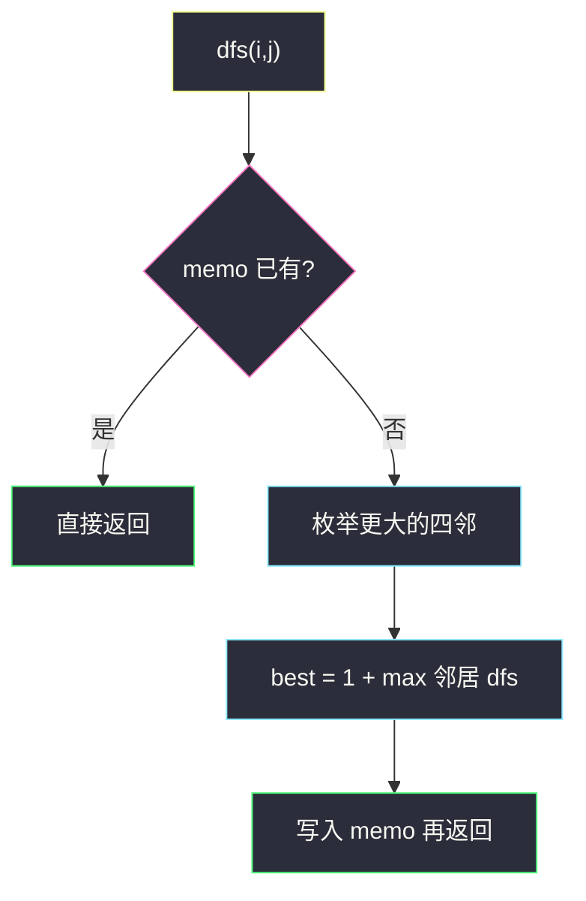
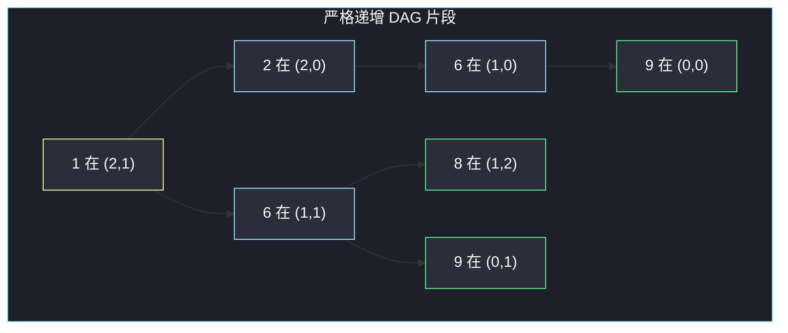

# 矩阵中的最长递增路径（记忆化 DFS · DAG）

## 一、问题描述

`m × n` 整数矩阵。从任意格子出发，每次走到四连通邻居，且邻居值**严格更大**。路径长度计格子数。求全局最长递增路径有多长。

可以走四向，不要求只右/下。相等不能走，所以图里没有环。

> 🔗 LeetCode 329：https://leetcode.cn/problems/longest-increasing-path-in-a-matrix/
>
> 数据范围：`1 ≤ m, n ≤ 200`，`m * n ≤ 4e4`，元素 `|matrix[i][j]| ≤ 1e9`。
>
> 📚 灵茶题单：**五、综合应用**。Hard。

**示例 1**

```
输入：matrix = [[9,9,4],[6,6,8],[2,1,1]]
输出：4

9 9 4
6 6 8
2 1 1
```

一条最长：`1 → 2 → 6 → 9`（例如 `(2,1) → (2,0) → (1,0) → (0,0)`）。

**示例 2**

```
输入：matrix = [[3,4,5],[3,2,6],[2,2,1]]
输出：4

3 4 5
3 2 6
2 2 1
```

`3 → 4 → 5 → 6`。

**示例 3**：`[[1]]` → `1`。单格路径长度 1。

**直观理解**

每个格子看出一个点，向「值更大的邻居」连有向边。严格递增 ⇒ 不可能走回已经过的值 ⇒ **DAG**。要的是 DAG 上的最长路。从每个点出发的最长路会大量重叠，必须记忆化，不能每个起点暴力搜一遍无记忆。

---

## 二、暴力解法

每个格子当起点，DFS 走向更大的邻居，走到底更新全局答案。不用 memo。

```python
from typing import List

class Solution:
    def longestIncreasingPath(self, matrix: List[List[int]]) -> int:
        m, n = len(matrix), len(matrix[0])
        DIRS = ((0, 1), (0, -1), (1, 0), (-1, 0))
        ans = 1

        def dfs(i: int, j: int, length: int) -> None:
            nonlocal ans
            ans = max(ans, length)
            for di, dj in DIRS:
                x, y = i + di, j + dj
                if 0 <= x < m and 0 <= y < n and matrix[x][y] > matrix[i][j]:
                    dfs(x, y, length + 1)

        for i in range(m):
            for j in range(n):
                dfs(i, j, 1)
        return ans
```

同一段递增链会被不同起点反复走完。最坏接近指数（例如蛇形严格递增仍会在分叉处爆炸）。`200 × 200` 不可用。

有人加 `visited` 数组防止走回头：DAG 上本来就不会回头， vis 反而容易把「从别的入口还要用的格子」标死。这题**不要** vis 状态机，要的是「从这个格出发的最长路」缓存。

### 🔴 瓶颈在哪里

子问题高度重叠：`dfs(i,j)` = 从 `(i,j)` 出发的最长递增路径长度，只取决于比它大的邻居的答案。每个格子算一次，总状态 `mn` 个。

---

## 三、优化探索（核心章节）

> 📚 本题在灵茶题单中属于 **五、综合应用**。网格 DFS + 记忆化；因为是 DAG，记忆化就是 DAG 最长路 DP。

### 3.1 状态

`dfs(i, j)`：从格子 `(i,j)` 出发，能走出的最长递增路径格子数。

转移：

- 没有更大的邻居：`dfs(i,j) = 1`（自己这一格）。
- 否则：`dfs(i,j) = 1 + max { dfs(x,y) | (x,y) 是四邻且 matrix[x][y] > matrix[i][j] }`。

用 `memo[i][j]` 存结果，`0` 表示还没算（路径长度至少是 1，算完不会是 0）。

### 3.2 为什么不用「搜索中」三色标记

环检测那套 vis（未访问 / 搜索中 / 已完成）是给**可能有环**的图准备的。这里边只指向更大的值，序列严格上升，走不回去。重叠靠 memo 消掉即可：算过直接返回，没算过再递归邻居。



### 3.3 重叠从哪来

没有 memo 时，两条不同的「下山」路线会在同一个高点汇合，高点以上的链被算两遍。示例 1 里 `(2,0)=2` 和 `(1,1)=6` 都能走到 `(0,0)=9`：无记忆会把「9 出发长度为 1」算两次。memo 之后第二次直接返回 1。

格子越多，汇合点越多，指数爆炸就是这样来的。记忆化把「从该格出发」收成一个数，每个格子只展开一次四邻。

### 3.4 与拓扑 DP 是同一件事

边指向值更大的格子，所以可以按值**从大到小**递推：大的先变成 1（或已带上它自己的更长链），小的读邻居。记忆化 DFS 是按依赖自动递归，拓扑是排序后循环，复杂度同为 `O(mn)`（若额外排序则多 `log`）。面试默写记忆化更短。

若改成**非严格**递增（`≥`），等高能走回来，图有环，最长路无定义（或无穷），本题解法立刻失效。严格 `<` 是无环的前提，不是随手写的。

### 3.5 一句话核心

> **`dfs(i,j)` = 1 + 更大邻居的 dfs 的 max；DAG 无环，memo 每个格子只算一次。**

---

## 四、代码实现

### Python（主解：记忆化 DFS）

```python
from typing import List

class Solution:
    def longestIncreasingPath(self, matrix: List[List[int]]) -> int:
        m, n = len(matrix), len(matrix[0])
        memo = [[0] * n for _ in range(m)]
        DIRS = ((0, 1), (0, -1), (1, 0), (-1, 0))

        def dfs(i: int, j: int) -> int:
            if memo[i][j]:
                return memo[i][j]
            best = 1
            for di, dj in DIRS:
                x, y = i + di, j + dj
                if 0 <= x < m and 0 <= y < n and matrix[x][y] > matrix[i][j]:
                    best = max(best, dfs(x, y) + 1)
            memo[i][j] = best
            return best

        return max(dfs(i, j) for i in range(m) for j in range(n))
```

先查 memo，再枚举更大邻居，最后写入。答案是所有起点 `dfs` 的最大值。

可选：按值从大到小拓扑递推，和上面同一个 DP，只是把递归改成循环。

```python
def longestIncreasingPath(self, matrix: List[List[int]]) -> int:
    m, n = len(matrix), len(matrix[0])
    cells = [(matrix[i][j], i, j) for i in range(m) for j in range(n)]
    cells.sort(reverse=True)
    dp = [[1] * n for _ in range(m)]
    DIRS = ((0, 1), (0, -1), (1, 0), (-1, 0))
    for val, i, j in cells:
        for di, dj in DIRS:
            x, y = i + di, j + dj
            if 0 <= x < m and 0 <= y < n and matrix[x][y] > val:
                dp[i][j] = max(dp[i][j], dp[x][y] + 1)
    return max(max(row) for row in dp)
```

值大的先入 `dp`，读邻居时邻居已经是最终值。主解仍用记忆化，少一次排序、好讲。

### Java

```java
class Solution {
    private static final int[][] DIRS = {{0, 1}, {0, -1}, {1, 0}, {-1, 0}};
    private int[][] matrix, memo;
    private int m, n;

    public int longestIncreasingPath(int[][] matrix) {
        this.matrix = matrix;
        m = matrix.length;
        n = matrix[0].length;
        memo = new int[m][n];
        int ans = 0;
        for (int i = 0; i < m; i++) {
            for (int j = 0; j < n; j++) {
                ans = Math.max(ans, dfs(i, j));
            }
        }
        return ans;
    }

    private int dfs(int i, int j) {
        if (memo[i][j] != 0) {
            return memo[i][j];
        }
        int best = 1;
        for (int[] d : DIRS) {
            int x = i + d[0], y = j + d[1];
            if (x >= 0 && x < m && y >= 0 && y < n && matrix[x][y] > matrix[i][j]) {
                best = Math.max(best, dfs(x, y) + 1);
            }
        }
        memo[i][j] = best;
        return best;
    }
}
```

---

## 五、具体例子演示

示例 1 矩阵与从 `(2,1)=1` 出发的递归（这格是最长路的起点）：

```
值               下标
9 9 4           (0,0) (0,1) (0,2)
6 6 8           (1,0) (1,1) (1,2)
2 1 1           (2,0) (2,1) (2,2)
```

**逐步填 memo（0 表示未算）**

1. `dfs(2,1)` 值 1。更大邻居：`(2,0)=2`、`(1,1)=6`（右边 `(2,2)=1` 不严格更大）。
2. `dfs(2,0)` 值 2。更大邻居只有 `(1,0)=6`。
3. `dfs(1,0)` 值 6。更大邻居 `(0,0)=9`。
4. `dfs(0,0)` 值 9。四邻 `9、6` 都不更大 → 写入 `memo[0][0] = 1`，返回 1。
5. 回溯：`memo[1][0] = 1+1 = 2`，`memo[2][0] = 1+2 = 3`。
6. 另一支 `dfs(1,1)` 值 6。更大邻居 `(1,2)=8`、`(0,1)=9`。
7. `dfs(1,2)` 值 8，没有更大邻居 → `memo[1][2] = 1`。
8. `dfs(0,1)` 值 9 → `memo[0][1] = 1`。
9. `memo[1][1] = 1 + max(1, 1) = 2`。
10. `memo[2][1] = 1 + max(3, 2) = 4`。路径 `1→2→6→9` 长度 4。

再对其余格子补全（已算的直接命中 memo）：

| 调用 | 行为 | 写入 |
|------|------|------|
| `dfs(0,2)` 值 4 | 邻居 9、8 都更大，memo 已是 1 | `memo[0][2] = 2` |
| `dfs(2,2)` 值 1 | 只有 8 更大 | `memo[2][2] = 2` |

完整 memo（每个数 = 从该格出发的最长路）：

```
1 1 2
2 2 1
3 4 2
```

全局 max = 4，与官方一致。注意 `(1,2)=8` 的 memo 是 1：它比周围都大，是局部终点，不是全局最长路的起点。

对其余格子调用时全部命中 memo，不再递归下去。端到端：从左上扫到右下求 max，真正费时间的只有第一次填表。

**示例 2 填 memo**

```
3 4 5
3 2 6
2 2 1
```

从 `(0,0)=3` 出发：`4(0,1) → 5(0,2) → 6(1,2)`。

| 格子 | 更大邻居 | memo |
|------|----------|------|
| `(1,2)=6` | 无 | 1 |
| `(0,2)=5` | 6 | 2 |
| `(0,1)=4` | 5 | 3 |
| `(0,0)=3` | 4 | 4 |
| `(1,0)=3` | 4 | 4（接到同一条） |
| `(2,2)=1` | 2 或 6 | 2 |
| 其余 2 | 接到 3/4/6 | ≤ 3 |

全局仍是 4。`(1,1)=2` 可以 `2→6` 长度 2，短于从左上出发的那条，memo 不会互相覆盖——每个格子存的是「从自己出发」，不是全局答案。



黄色 1 出发，沿绿边走到黄绿终点；最长链 4 格。

---

## 六、复杂度分析

| 方法 | 时间 | 空间 | 说明 |
|------|------|------|------|
| 每格暴力 DFS 无记忆 | 指数 | `O(mn)` 栈 | 重叠子问题重复走 |
| 记忆化 DFS（主解） | `O(mn)` | `O(mn)` memo + 栈 | 每格进入 dfs 体真正计算一次，每次枚举 4 邻 |
| 按值拓扑 DP | `O(mn log(mn))` 若排序 | `O(mn)` | 与 memo 等价，多一次排序 |

时间为什么是 `O(mn)`：`memo[i][j]` 从 0 变成正数之后再调用直接返回。计算入口一共 `mn` 次，每次看 4 个邻居。边数 `≤ 4mn`。

递归深度最坏是路径长度，蛇形严格递增时可达 `mn`（`200×200=4e4`）。LeetCode Java 栈够用；Python 若本地爆栈可改成上面的拓扑循环版提交。

---

## 七、对比总结

| 维度 | 无记忆 DFS | 记忆化 DFS | 带 vis 的 DFS |
|------|------------|------------|---------------|
| 正确性 | 对，但太慢 | 对 | 容易把别的起点要用的格标死 |
| 环 | 严格递增无环 | 同 | 不必防环 |
| 状态 | 路径本身 | 格子 | 格子 + 搜索阶段 |

**易错点**

1. **每个起点无记忆再搜一遍**：小样例能过，大矩阵超时。
2. **比较写成 `≥`**：相等不是严格递增，还会人为制造环。
3. **memo 用 `-1` 初始化却写成 `if memo: return`**：Python 里 `-1` 为真，会把未算当成已算。用 `0` 当未算更省事。
4. **答案忘了 +1**：转移是「自己这一格 + 邻居最长」，邻居返回值不要漏加。
5. **只从左上角出发**：任意格都可以当路径起点，要对每个格子 `dfs` 取 max。
6. **四向漏了某个方向**：最长路可能往左、往上走，和「只右下」的路径题不同。
7. **把 memo 设成路径本身**：状态是长度这个整数，不要把整条路径列表存进表里，又慢又占空间。
8. **起点固定成 `(0,0)`**：示例 1 的最长路从右下角的 1 出发，不是从 9 出发。

模板（网格 DAG 记忆化）：

```text
dfs(i, j):
    若 memo[i][j] 已算完: 返回
    best = 1
    对每个合法邻居 (x,y) 且 matrix[x][y] > matrix[i][j]:
        best = max(best, dfs(x,y) + 1)
    memo[i][j] = best
    返回 best
答案 = max 所有 dfs(i,j)
```

面试可以补一句：这就是 DAG 最长路，边权全 1，所以「长度」等于格点数。若边权不是 1，转移改成 `w + dfs(邻居)`，仍然 memo。

---

## 八、举一反三

| 题目 | 关系 |
|------|------|
| [2328. 网格图中递增路径的数目](https://leetcode.cn/problems/number-of-increasing-paths-in-a-grid/) | 同一张 DAG，把 max 改成求和 |
| [62. 不同路径](https://leetcode.cn/problems/unique-paths/) | 网格 DAG 计数，只能右/下 |
| [64. 最小路径和](https://leetcode.cn/problems/minimum-path-sum/) | 网格 DAG 最短路（权在格子上） |
| [124. 二叉树中的最大路径和](https://leetcode.cn/problems/binary-tree-maximum-path-sum/) | 也是树/DAG 上「从某点出发」的记忆化 |

**思想迁移**

- 网格 + 严格单调 ⇒ DAG ⇒ 记忆化 DFS 就是 DP，不必拓扑排序也能 `O(mn)`。
- 「从该格出发的最优值」作状态，邻居只能走向「更优方向」（更大 / 更小），就能无环。
- 口诀：**「严格递增无环；memo 记出发最长；1 + 更大邻居的 max。」**
