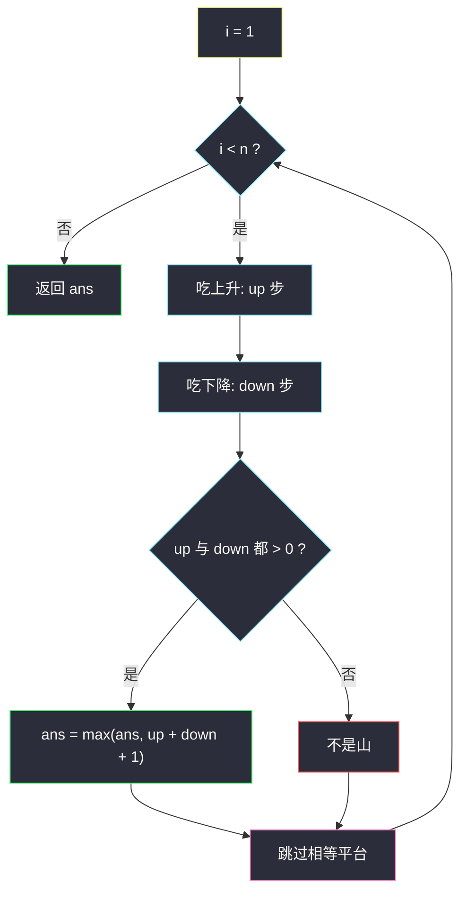
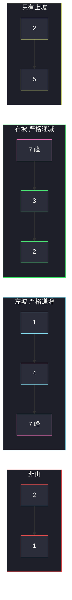

# 数组中的最长山脉（分组循环 · 找峰扩坡）

## 一、问题描述

把数组 `arr` 看成一条折线。**山脉**是一段连续子数组，长度至少为 3，且存在下标 `i`（峰）满足：

- 左边严格递增：`arr[left] < … < arr[i-1] < arr[i]`
- 右边严格递减：`arr[i] > arr[i+1] > … > arr[right]`

返回最长山脉的长度；不存在则返回 0。

> 🔗 LeetCode 845：https://leetcode.cn/problems/longest-mountain-in-array/
>
> 数据范围：`1 <= arr.length <= 10^4`，`0 <= arr[i] <= 10^4`。

**示例 1**

```
输入：arr = [2,1,4,7,3,2,5]
输出：5
解释：最长山脉是 [1,4,7,3,2]，峰在 7。
```

**示例 2**

```
输入：arr = [2,2,2]
输出：0
解释：没有严格升降，构不成山脉。
```

**直观理解**

山脉 = 一段上坡 + 一个峰 + 一段下坡。平台（相邻相等）既不能当坡也不能当峰。分组循环的做法是：从左到右把「上升段」吃完，再把「下降段」吃完；两边都非空才是一座山，长度 = 上坡步数 + 下坡步数 + 1（峰）。

> 📚 灵茶题单 **六、分组循环**：外层 `while i < n`，内层依次吃上升、下降，再跳过相等。

---

## 二、暴力解法

枚举每个位置当峰，向左扩严格递增、向右扩严格递减，长度 ≥ 3 时更新答案。

```python
class Solution:
    def longestMountain(self, arr: List[int]) -> int:
        n, ans = len(arr), 0
        for p in range(1, n - 1):
            if not (arr[p - 1] < arr[p] > arr[p + 1]):
                continue                          # 不是峰
            L, R = p, p
            while L > 0 and arr[L - 1] < arr[L]:
                L -= 1
            while R + 1 < n and arr[R] > arr[R + 1]:
                R += 1
            ans = max(ans, R - L + 1)
        return ans
```

### 复杂度

- **时间**：每个峰向两边扩，最坏 `O(n²)`（例如严格递增再严格递减的大山被每个点重复走）。
- **空间**：`O(1)`。

### 🔴 瓶颈在哪里

相邻的峰共享坡，重复扫描。一次从左到右：先吃完一段上升，再吃完一段下降，这座山只结算一次。

---

## 三、优化探索（核心章节）

> 📚 本题在灵茶题单中属于 **六、分组循环**：连续关系有三种——上升、下降、相等。内层按这个顺序把当前形态吃完。

### 3.1 观察特征

| 特征 | 说明 |
|------|------|
| 峰必须两边都有坡 | 单独上升或单独下降不是山 |
| 相等是硬缝 | `arr[i] == arr[i-1]` 既不能上也不能下 |
| 山与山至多共一个点 | 下坡终点可能成为下一座上坡起点（如 `…3,2,5,6,4…`） |

### 3.2 一遍分组

下标 `i` 从 1 开始（比较 `arr[i]` 与 `arr[i-1]`）：

1. 统计上升步数 `up`：`while arr[i] > arr[i-1]`
2. 统计下降步数 `down`：`while arr[i] < arr[i-1]`
3. 若 `up > 0` 且 `down > 0`，山脉长度 = `up + down + 1`
4. 跳过平台：`while arr[i] == arr[i-1]`

`i` 只增不减，线性。



### 3.3 正确性

任意山脉的峰左侧是极大上升段、右侧是极大下降段（再往外要么出界要么不再严格升/降）。分组循环恰好切出每一对「上升+下降」；缺一边的被丢掉。平台被显式跳过，不会把相等算进坡。

两座山相邻时，第一座下坡吃完后 `i` 停在下坡终点的下一个位置，那里开始新的上升——不会漏掉第二座。

### 3.4 一句话核心

> **先吃上坡再吃下坡，两边都有才是山；平台直接跳过。长度 = 上坡步 + 下坡步 + 1。**

---

## 四、代码实现

### Python（主解：分组循环）

```python
class Solution:
    def longestMountain(self, arr: List[int]) -> int:
        n, ans, i = len(arr), 0, 1
        while i < n:
            up = down = 0
            while i < n and arr[i] > arr[i - 1]:
                up += 1
                i += 1                          # 吃左坡
            while i < n and arr[i] < arr[i - 1]:
                down += 1
                i += 1                          # 吃右坡
            if up and down:
                ans = max(ans, up + down + 1)
            while i < n and arr[i] == arr[i - 1]:
                i += 1                          # 跳过平台
        return ans
```

**变量含义**

| 变量 | 含义 |
|------|------|
| `up` | 峰左侧严格上升的边数（点数 = `up+1` 含峰） |
| `down` | 峰右侧严格下降的边数 |
| `up + down + 1` | 山脉点数（左端 + 峰 + 右端） |

**循环不变式**：每次外层迭代处理完当前从 `i-1` 出发的「升段 + 降段」（可能缺一边），`i` 指向下一段的起点或平台之后。

注意：若开头就是下降（`up = 0`），下降段仍被吃掉，避免死循环；随后若遇到上升会在下一轮处理。

### Java（可选）

```java
class Solution {
    public int longestMountain(int[] arr) {
        int n = arr.length, ans = 0, i = 1;
        while (i < n) {
            int up = 0, down = 0;
            while (i < n && arr[i] > arr[i - 1]) { up++; i++; }
            while (i < n && arr[i] < arr[i - 1]) { down++; i++; }
            if (up > 0 && down > 0) ans = Math.max(ans, up + down + 1);
            while (i < n && arr[i] == arr[i - 1]) i++;
        }
        return ans;
    }
}
```

---

## 五、具体例子演示

以示例 1 `arr = [2,1,4,7,3,2,5]`。峰在 7，左坡 `1 < 4 < 7`，右坡 `7 > 3 > 2`。

```
下标:  0   1   2   3   4   5   6
值:    2   1   4   7   3   2   5
           \  / \  |  / \     /
            \/   \ | /   \   /
           谷     峰      不是山
```

**分组逐步跟踪（`i` 从 1 起）**

| 轮 | 开始 i | 上升 | 下降 | 山? | 长度 | 之后 i |
|----|--------|------|------|-----|------|--------|
| 1 | 1 | `2>1`？否，up=0 | `1<2`，down=1，i=2 | 否 | — | 2 |
| 2 | 2 | `4>1`、`7>4`，up=2，i=4 | `3<7`、`2<3`，down=2，i=6 | 是 | 2+2+1=5 | 6 |
| 3 | 6 | `5>2`，up=1，i=7 | 结束，down=0 | 否 | — | 7 |

`ans = 5` ✓。山脉下标 `[1,5]`，即 `[1,4,7,3,2]`。末尾 `2→5` 只有上坡。

**平台反例** `[1,2,2,1]`：`up=1` 吃掉 `1<2` 后遇到相等，`down=0`，不是山；随后跳过平台，剩下 `2>1` 只有下降。返回 0。相等把峰「削平」了。

**两座山** `[1,3,1,4,2]`：第一轮 `up=1, down=1`，长度 3（`[1,3,1]`）；`i` 停在 4，第二轮 `up=1, down=1`，长度 3（`[1,4,2]`）。谷底 `1` 被两座山共用，分组会拆成两段，不会漏。

示例 2 全相等：每轮 `up=down=0`，内层第三个 while 把平台一次跳完，返回 0。



---

## 六、复杂度分析

| 方法 | 时间 | 空间 | 说明 |
|------|------|------|------|
| 枚举峰向两边扩 | `O(n²)` | `O(1)` | 坡被重复扫描 |
| 分组循环（主解） | `O(n)` | `O(1)` | `i` 单调，每个相邻对看一次 |

---

## 七、对比总结

| 维度 | 枚举峰 | 分组循环 |
|------|--------|----------|
| 扫描 | 每个峰独立扩 | 升段、降段、平台各吃一次 |
| 缺边 | 左右扩自然得 0 | `up==0` 或 `down==0` 丢弃 |

**易错点**

1. **长度至少 3**：`up`、`down` 必须都 ≥ 1，否则 `up+down+1` 可能是 2。
2. **平台不是坡**：`[1,2,2,1]` 在第二个 2 处断开，不是山。
3. **只降不升 / 只升不降** 都不是山，但下降段仍要吃掉，否则 `i` 卡死。
4. **`i` 从 1 起**：用 `arr[i]` 与 `arr[i-1]` 比较，不要写成从 0 起却漏边界。
5. **两座山共用谷底**是合法的，分组会自然拆成两段。

**模板（升-降-跳平台，Python）**

```python
i = 1
while i < n:
    up = down = 0
    while i < n and arr[i] > arr[i - 1]:
        up += 1; i += 1
    while i < n and arr[i] < arr[i - 1]:
        down += 1; i += 1
    if up and down:
        ans = max(ans, up + down + 1)
    while i < n and arr[i] == arr[i - 1]:
        i += 1
```

---

## 八、举一反三

| 题目 | 关系 |
|------|------|
| [941. 有效的山脉数组](https://leetcode.cn/problems/valid-mountain-array/) | 判定整段是不是恰好一座山 |
| [852. 山脉数组的峰顶索引](https://leetcode.cn/problems/peak-index-in-a-mountain-array/) | 已知是山，找峰（可二分） |
| [1671. 得到山形数组的最少删除次数](https://leetcode.cn/problems/minimum-number-of-removals-to-make-mountain-array/) | 最长山形子序列，LIS 思想 |
| [2210. 统计数组中峰和谷的数量](https://leetcode.cn/problems/count-hills-and-valleys-in-an-array/) | 同样找峰/谷，平台要压缩 |
| [162. 寻找峰值](https://leetcode.cn/problems/find-peak-element/) | 只需任意峰，二分 |
| [1095. 山脉数组中查找目标值](https://leetcode.cn/problems/find-in-mountain-array/) | 先找峰再两侧二分 |

**思想迁移**

- 折线形态题：把相邻关系分成升 / 降 / 平三类，分组循环按形态切段。
- 口诀：**「先吃上坡再吃下坡，两边都有才算山；平台一刀切开。」**
