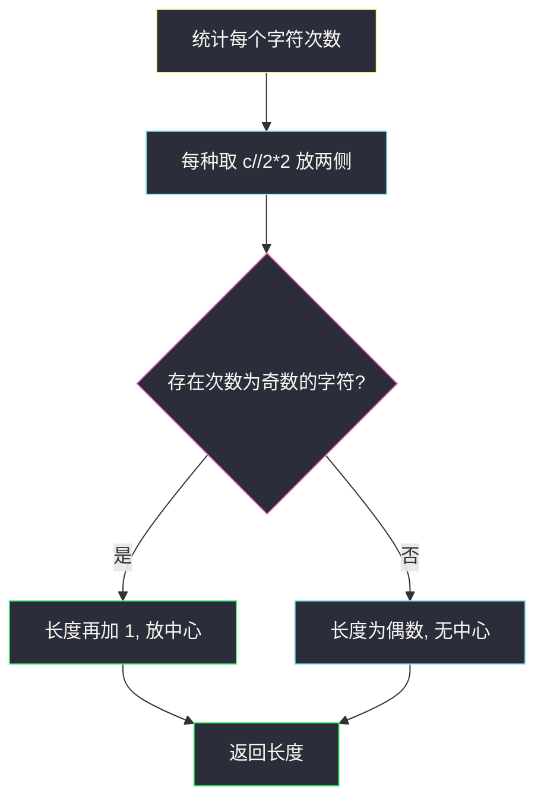
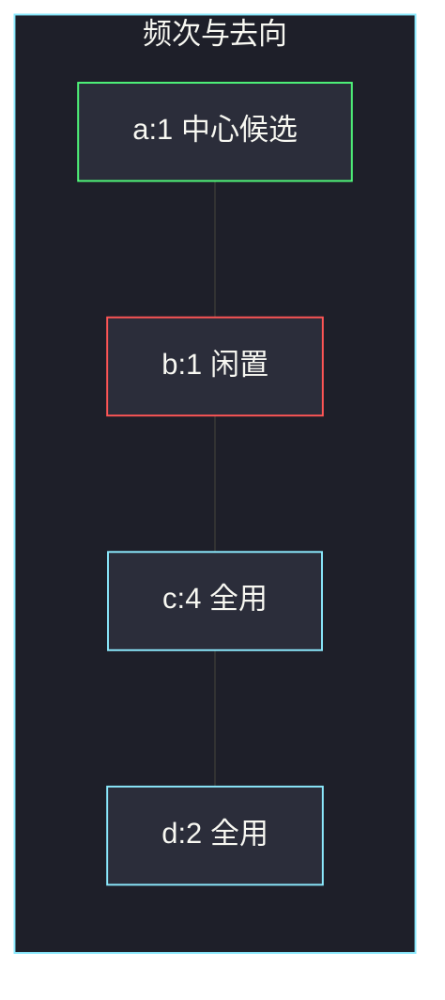

# 最长回文串（回文贪心 · 成对取满）

## 一、问题描述

给定由大小写字母组成的字符串 `s`，用其中的字符（每种字母的使用次数不超过它出现的次数）拼出一个回文串，返回能拼出的**最长长度**。不必真的构造串。大小写敏感：`'A'` 和 `'a'` 是不同字符。

> 🔗 LeetCode 409：https://leetcode.cn/problems/longest-palindrome/
>
> 数据范围：`1 ≤ s.length ≤ 2000`，`s` 只含大小写英文字母。
>
> 📚 灵茶题单：**§3.2 回文串贪心**（1250 分）。

**示例 1**

```
输入：s = "abccccdd"
输出：7
解释：可以拼出 "dccaccd"（或 "dccbccd" 等），长度 7。
```

**示例 2**

```
输入：s = "a"
输出：1
解释：单字符就是回文。
```

**直观理解**

回文左右对称，除了正中间最多一个字符外，其余字符都必须成对出现。所以：每种字母能拿出的偶数个全部用上；如果还有剩的单张，最多挑一张放中间。

---

## 二、暴力解法

按字母频次枚举「每种字母用几个」，要求除至多一种字母为奇数次外都是偶数，再取使用总数的最大值。字母最多 52 种，但每种次数到 2000，组合爆炸。

```python
from collections import Counter
from itertools import product

class Solution:
    def longestPalindrome(self, s: str) -> int:
        cnt = list(Counter(s).values())
        best = 0
        for uses in product(*[range(c + 1) for c in cnt]):
            odd = sum(u % 2 for u in uses)
            if odd <= 1:
                best = max(best, sum(uses))
        return best
```

`s = "abccccdd"` 这种短串能出 7，但频次稍大就不可用。

### 🔴 瓶颈在哪里

对每种字母，用满它的「成对部分」`⌊c/2⌋ * 2` 一定不亏：长度只增不减，也不破坏回文结构。没必要枚举「少用一对」。优化只剩一件事：奇次字母的那一张怎么处理。

---

## 三、优化探索（核心章节）

> 📚 本题在灵茶题单中属于 **§3.2 回文串贪心**。构造回文 = 两侧成对填 + 至多一个中心。本题只要长度，连左右填什么都不用排。

### 3.1 偶数次数全部能用

字符 `c` 出现 `cnt` 次。两侧对称各放 `⌊cnt/2⌋` 个，贡献 `cnt // 2 * 2`。这一部分无论放哪一侧，对长度的贡献是固定的。

### 3.2 奇数次数：抽掉 1 个后，偶数部分照样用

`cnt = 2k+1` 时，先用 `2k` 个成对，剩下 1 个暂时闲置。所有字母都这么做之后，总长度是所有 `cnt // 2 * 2` 之和，此时一定是偶数，已经是合法回文（没有中心也可以）。

若至少一种字母有闲置的 1 个，就再往中心放 1 个，长度再加 1。多放会破坏「最多一个奇数」。

公式：

```
ans = sum(c // 2 * 2 for c in cnt) + (1 if 存在奇数次数 else 0)
```



### 3.3 一句话核心

> **偶数次全用；奇数次用掉偶数部分，全局最多再留一个放中间。**

---

## 四、代码实现

### Python（主解：频次贪心）

```python
from collections import Counter

class Solution:
    def longestPalindrome(self, s: str) -> int:
        cnt = Counter(s)
        ans = sum(c // 2 * 2 for c in cnt.values())
        if any(c % 2 for c in cnt.values()):
            ans += 1
        return ans
```

**变量含义**

| 写法 | 含义 |
|------|------|
| `cnt` | 每个字符出现次数（大小写分开计） |
| `c // 2 * 2` | 该字符能放进两侧的个数 |
| `any(c % 2 ...)` | 是否还有一张可以放中心 |

不用 `Counter` 也可以：`cnts = [0] * 128`，按 `ord` 下标累加，字母表就这点大。

---

## 五、具体例子演示

**示例 1**：`s = "abccccdd"`，先画频次表。

| 字符 | 次数 | `c // 2 * 2` | 余 1? |
|------|------|---------------|-------|
| a | 1 | 0 | 是 |
| b | 1 | 0 | 是 |
| c | 4 | 4 | 否 |
| d | 2 | 2 | 否 |

成对部分合计 `0+0+4+2 = 6`。存在奇数，中心再加 1，答案 `7`。一种具体拼法：`dccaccd`（中心用 `a`，`b` 用不上）。



绿是选进中心的那张奇数；红格 `b` 同样是奇数，但中心只能留一个，丢掉。`c`、`d` 成对部分全部进两侧。

**示例 2**：`s = "a"`。`a` 出现 1 次，成对部分 0，有奇数，答案 `0+1 = 1`。

**大小写**：`s = "Aa"`。`A` 一次、`a` 一次，当成两种字符。成对部分 0，中心只能放 1 个，答案 `1`，不能拼 `"Aa"`。

**全偶数**：`s = "abba"` 的多重集。若输入恰好 `"cccc"`，`c` 四次，答案 4，不必加中心。

---

## 六、复杂度分析

| 方法 | 时间 | 空间 | 说明 |
|------|------|------|------|
| 枚举每种字母用几个 | 指数级 | `O(Σ)` | `Σ ≤ 52` 种但次数乘积爆炸 |
| 频次贪心（主解） | `O(n)` | `O(Σ)` | `Σ ≤ 52`，可看成 `O(1)` 额外空间 |

---

## 七、对比总结

| 维度 | 本题 | #2384 最大回文数字 | #5 最长回文子串 |
|------|------|--------------------|------------------|
| 能否重排 | 可以任意重排 | 可以重排数字 | 必须是原串连续子串 |
| 输出 | 只要长度 | 要具体数字串 | 要具体子串 |
| 额外约束 | 大小写敏感 | 前导零 | 无 |

**易错点**

1. **把 `'A'` 和 `'a'` 合并**：题目大小写敏感，`"Aa"` 答案是 1 不是 2。
2. **每个奇数都加 1**：多个奇数只能选一个放中心，其余奇数的那一张必须丢掉。
3. **做成「最长回文子串」**：那是 #5，不能重排。本题是重排后的最长回文。
4. **`c // 2 * 2` 写成 `c // 2`**：那是对数，不是字符个数。

---

## 八、举一反三

| 题目 | 关系 |
|------|------|
| [266. 回文排列](https://leetcode.cn/problems/palindrome-permutation/) | 判定能否拼成回文：奇数次数的字母至多一种 |
| [2131. 连接两字母单词得到的最长回文串](https://leetcode.cn/problems/longest-palindrome-by-concatenating-two-letter-words/) | 单词当「字符」成对匹配，`"aa"` 可放中心 |
| [2384. 最大回文数字](https://leetcode.cn/problems/largest-palindromic-number/) | 同节 §3.2：不仅要长度，还要按数字从大到小构造，并处理前导零 |
| [5. 最长回文子串](https://leetcode.cn/problems/longest-palindromic-substring/) | 名字像，但不能重排，算法完全不同 |

**思想迁移**

- 回文贪心先看频次：成对部分无脑取满，奇数全局只留一个。
- 只要长度时不用真的排出左右半边。
- 口诀：**「成对全拿走，奇数只留一张放中间。」**
