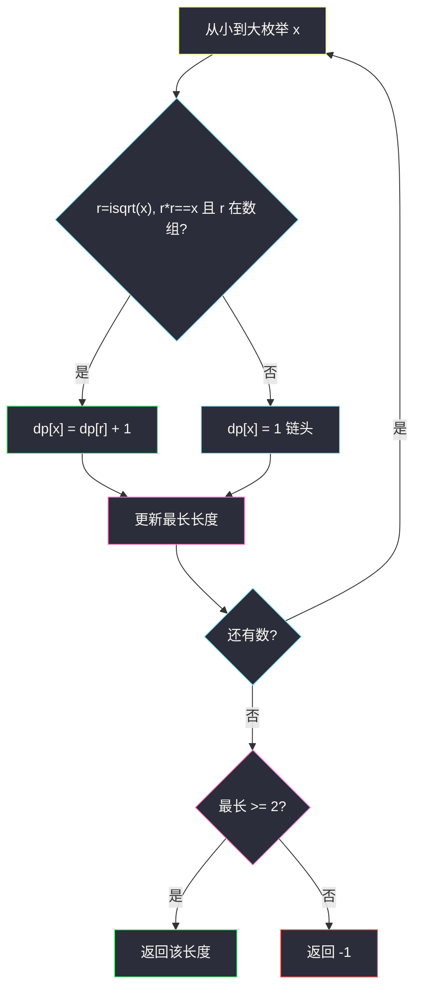
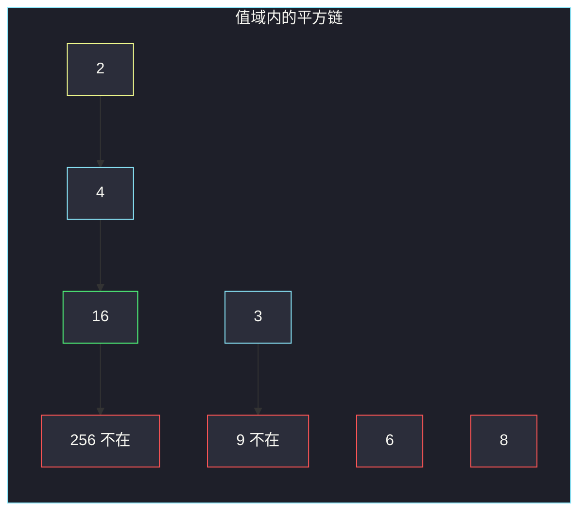

# 数组中最长的方波（合法子序列 DP）

## 一、问题描述

给你整数数组 `nums`。一个子序列叫做**方波**，当且仅当：

- 长度至少为 2；
- **从小到大排序之后**，除第一项外，每一项都是前一项的平方。

返回最长方波的长度；若不存在长度 ≥ 2 的方波，返回 `-1`。

子序列可以删元素、保持相对顺序；但方波定义是「选出后排序再检查」，所以**原数组顺序不影响**能否组成方波，本质是子集。

> 🔗 LeetCode 2501：https://leetcode.cn/problems/longest-square-streak-in-an-array/
>
> 数据范围：`2 ≤ n ≤ 10^5`，`2 ≤ nums[i] ≤ 10^5`。官方**没有**保证元素互不相同；重复值对方波没有帮助（排序后相邻相等，不可能是平方关系），放入 set 即可。
>
> 📚 灵茶题单：**§7.4 合法子序列 DP**。合法转移只有一种：`y = x²` 且 `y` 也在数组里。值域 `10^5` 内平方链极短（最长 5）。

函数名 `longestSquareStreak`。

**示例 1**

```
输入：nums = [4,3,6,16,8,2]
输出：3
解释：选出 [4,16,2]，排序后 [2,4,16]，4=2²，16=4²。
```

**示例 2**

```
输入：nums = [2,3,5,6,7]
输出：-1
解释：没有「平方后仍在数组里」的数对。
```

**直观理解**

方波是一条链：`x, x², x⁴, x⁸, …`（指数是 2 的幂）。例如 `2 → 4 → 16 → 256 → 65536`，再平方 `2^32` 远超 `10^5`。所以从每个「链头」平方下去，长度不会超过 5。也可以从小到大 DP：若 `√x` 是整数且在数组里，则 `dp[x] = dp[√x] + 1`。

---

## 二、暴力解法

枚举起点，反复平方，看是否还在数组里。

```python
class Solution:
    def longestSquareStreak(self, nums: list[int]) -> int:
        s = set(nums)
        ans = 0
        for x in s:
            length, cur = 1, x
            while cur * cur in s:
                cur *= cur
                length += 1
            ans = max(ans, length)
        return ans if ans >= 2 else -1
```

官方两例都能过。每个起点沿链走，链长 ≤ 5，看起来像 `O(n)`。问题是很多起点其实在别人的链中间：从 4 走 `4→16`，从 2 走 `2→4→16`，重复劳动仍可接受（常数 5）。真正要小心的是：若对每个起点在数组里线性查找而不是 set，会变成 `O(n²)`。

### 🔴 瓶颈在哪里

`n=10^5` 必须 `O(n)` 或 `O(n log n)`。set 查找 `O(1)` 平均后，上面这版已经够用。DP 版把「从中间起走」改成「只从小数接到大数」，每个值填一次，同样线性。

---

## 三、优化探索（核心章节）

> 📚 本题在灵茶题单中属于 **§7.4 合法子序列 DP**。先排序（或按值从小到大），`dp[x]` = 以 `x` 结尾的最长合法链。本题前驱至多一个：整数平方根。

### 3.1 状态与转移

把出现过的数放进 set / 哈希表。对每个 `x`（从小到大）：

- 令 `r = ⌊√x⌋`。若 `r * r == x` 且 `r` 在数组里，则 `dp[x] = dp[r] + 1`；
- 否则 `x` 是链头，`dp[x] = 1`。

答案 `max(dp)`，若 `< 2` 返回 `-1`。

必须从小到大：算 `dp[16]` 时 `dp[4]` 已经好了。用 `math.isqrt`，不要 `int(x**0.5)` 去碰浮点（本题值域小，碰巧安全）。



### 3.2 只从链头平方（同一复杂度）

若 `√x` 已在数组里，`x` 不是链头，跳过。否则从 `x` 一路 `cur = cur * cur`，直到不在 set 或超过 `10^5`。每条链的节点只会被某个链头走到，总步数仍 `O(n)`。

值域内完整最长链只有：

`2 → 4 → 16 → 256 → 65536`（长度 5）

`3 → 9 → 81 → 6561`（长度 4）

官方提示也写了：最长可能是 5。

### 3.3 一句话核心

> **数放进 set；从小到大，若平方根也在则接在后面 +1。最长不足 2 就返回 -1。**

---

## 四、代码实现

### Python（主解：从小到大 DP）

```python
from math import isqrt

class Solution:
    def longestSquareStreak(self, nums: list[int]) -> int:
        s = set(nums)
        dp = {}
        ans = 1
        for x in sorted(s):
            r = isqrt(x)
            if r * r == x and r in dp:
                dp[x] = dp[r] + 1
            else:
                dp[x] = 1
            ans = max(ans, dp[x])
        return ans if ans >= 2 else -1
```

`r in dp` 等价于 `r in s`（更小的数已经填过）。`sorted(s)` 去重后又按值递增。

**变量含义**

| 写法 | 含义 |
|------|------|
| `s` | 出现过的值，查前驱 `O(1)` |
| `dp[x]` | 以 `x` 结尾的方波长度 |
| `isqrt(x)` | 整数平方根，再验证 `r*r==x` |
| `ans < 2` | 按题意改成 -1 |

### 等价：只从链头向外平方

```python
from math import isqrt

class Solution:
    def longestSquareStreak(self, nums: list[int]) -> int:
        s = set(nums)
        ans = 0
        for x in s:
            r = isqrt(x)
            if r * r == x and r in s:
                continue
            length, cur = 0, x
            while cur in s:
                length += 1
                cur = cur * cur
            ans = max(ans, length)
        return ans if ans >= 2 else -1
```

`cur * cur` 在 Python 里任意精度；一旦不在 set（含超出值域）循环结束。每个值至多被一条链扫到。

### Java（最优解，平方用 long）

```java
class Solution {
    public int longestSquareStreak(int[] nums) {
        java.util.HashSet<Integer> set = new java.util.HashSet<>();
        for (int x : nums) {
            set.add(x);
        }
        int[] arr = new int[set.size()];
        int m = 0;
        for (int x : set) {
            arr[m++] = x;
        }
        java.util.Arrays.sort(arr);
        java.util.HashMap<Integer, Integer> dp = new java.util.HashMap<>();
        int ans = 1;
        for (int x : arr) {
            int r = (int) Math.sqrt(x);
            int len = 1;
            if ((long) r * r == x && dp.containsKey(r)) {
                len = dp.get(r) + 1;
            }
            dp.put(x, len);
            ans = Math.max(ans, len);
        }
        return ans >= 2 ? ans : -1;
    }
}
```

Java 里若自己平方往上走，`65536 * 65536` 会撑爆 `int`，要用 `long` 判断是否还在 `10^5` 内。

---

## 五、具体例子演示

### 5.1 官方示例 1：方波链长度

`nums = [4,3,6,16,8,2]`，set = `{2,3,4,6,8,16}`。从小到大填 `dp`。

| x | √x 整数且在表? | dp[x] |
|---|----------------|-------|
| 2 | 1 不在 | 1 |
| 3 | 否 | 1 |
| 4 | 2 在，dp[2]+1 | 2 |
| 6 | 否 | 1 |
| 8 | 否 | 1 |
| 16 | 4 在，dp[4]+1 | 3 |

最长 3，对应链 `2 → 4 → 16`。原数组里这三项可以是 `[4,16,2]` 这种顺序，排序后仍是方波。对拍官方输出 3。



绿是答案末端；红是平方后不在数组、链断掉。`8` 的平方 64 不在，自己长度 1 不计方波。

链头走法：`2` 没有平方根在 set 里，一路 `2→4→16` 停（256 不在），长度 3；`3、6、8` 一步都走不出去。`4` 因平方根 `2` 在 set 被跳过，避免重复。

### 5.2 官方示例 2

`[2,3,5,6,7]`：每个数的平方（4,9,25,36,49）都不在 set。`dp` 全是 1，返回 -1。对拍官方。

### 5.3 缺链头、只剩后半

`[4,16,256]`：`4` 的平方根 2 不在，作为链头 `4→16→256`，长度 3。DP：`dp[4]=1`，`dp[16]=2`，`dp[256]=3`。不必真有 2。

### 5.4 值域最长链

若数组含 `2,4,16,256,65536`：`dp` 依次 1,2,3,4,5，答案 5。再平方超出 `10^5`，不会更长。

---

## 六、复杂度分析

| 方法 | 时间 | 空间 | 说明 |
|------|------|------|------|
| 无 set 的双层查找 | `O(n²)` | `O(1)` | 超时 |
| 从小到大 DP（主解） | `O(n log n)` | `O(n)` | 排序去重；转移 `O(1)` |
| 链头平方 | `O(n)` | `O(n)` | 每条链长度 ≤ 5 |

哈希平均 `O(1)`。排序那一版多一个 `log n`，`n=10^5` 无压力。

---

## 七、对比总结

| 维度 | LIS / 368 整除子集 | 本题 |
|------|---------------------|------|
| 前驱 | 可能很多 | 至多一个平方根 |
| 是否要原相对序 | LIS 要 | 本题排序后再检验，用 set 即可 |
| 链长 | 可达 `n` | `10^5` 内 ≤ 5 |

**易错点**

1. **最长为 1 时返回 1**：题意不足 2 一律 `-1`。
2. **要求原数组已经按平方顺序出现**：示例 1 的 `[4,16,2]` 说明选出后排序即可。
3. **用浮点 `sqrt` 判完全平方**：大整数可能误差；本题虽小，习惯写 `isqrt` 再反乘。
4. **Java `int` 连乘**：链头上探 `65536²` 溢出，用 `long`。
5. **把「子序列」理解成不能排序**：读题是「选出后排序」，DP 按值不按下标。
6. **没去重**：重复元素不形成平方关系，set 掉更干净。

---

## 八、举一反三

| 题目 | 关系 |
|------|------|
| [1048. 最长字符串链](https://leetcode.cn/problems/longest-string-chain/) | §7.4：删一个字符接到更短词，从小串 DP |
| [1218. 最长定差子序列](https://leetcode.cn/problems/longest-arithmetic-subsequence-of-given-difference/) | §7.4：前驱 `x-d` 唯一，哈希 DP |
| [368. 最大整除子集](https://leetcode.cn/problems/largest-divisible-subset/) | 排序后 `dp[j] + 1`（j 整除 i） |
| [128. 最长连续序列](https://leetcode.cn/problems/longest-consecutive-sequence/) | set + 只从链头往外走 |
| [300. 最长递增子序列](https://leetcode.cn/problems/longest-increasing-subsequence/) | 前驱不唯一，要二分 / `O(n²)` |
| [3147. 从魔法师身上吸取的最大能量](https://leetcode.cn/problems/taking-maximum-energy-from-the-mystic-dungeon/) | 同批一维 DP，但是下标链不是值链 |

**思想迁移**

- 合法转移只有「一个明确前驱」时，哈希 `dp[x] = dp[pred]+1`。
- 口诀：**「放进 set，小数接到平方根后面；最长不够 2 就 -1。」**
