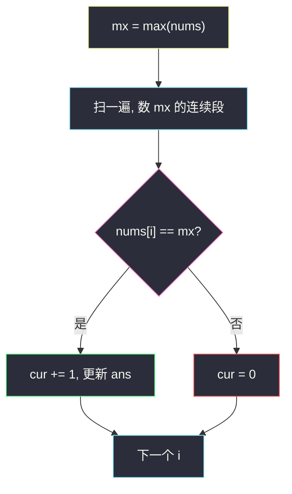
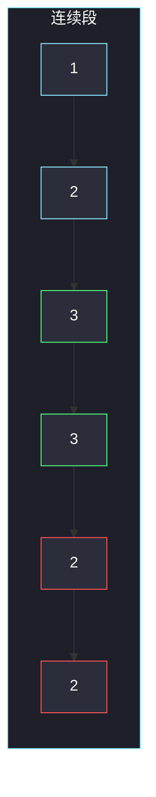

# 按位与最大的最长子数组（AND 只减不增 · 最大值连续段）

## 一、问题描述

给你一个长度为 `n` 的正整数数组 `nums`。对每个非空子数组计算按位与（AND），在所有子数组里找出 **AND 值最大** 的那些；若有多段，取**最长**的一段，返回它的长度。

> 🔗 LeetCode 2419：https://leetcode.cn/problems/longest-subarray-with-maximum-bitwise-and/
>
> 数据范围：`1 ≤ n ≤ 10^5`，`1 ≤ nums[i] ≤ 10^6`。
>
> 📚 灵茶题单：**三、与或（AND/OR）的性质**（1496 分）。核心就一句：**AND 只减不增**，所以全局最大 AND 只能是数组最大值本身。

**示例 1**

```
输入：nums = [1,2,3,3,2,2]
输出：2
解释：子数组 [3,3] 的 AND = 3，是所有子数组里最大的；长度为 2。
     [3] 的 AND 也是 3，但更短。
```

**示例 2**

```
输入：nums = [1,2,3,4]
输出：1
解释：最大值 4 只出现一次，任何更长的段 AND 都会变小。
```

**直观理解**

`x AND y` 永远 ≤ `x` 且 ≤ `y`（非负整数）。一段里只要混进一个比最大值小的数，整段 AND 就盖不过那个小数，更盖不过全局最大值。所以「AND 最大」的子数组只能由**最大值 `mx` 自己**拼成；要最长，就是 `mx` 的最长连续段。

---

## 二、暴力解法

枚举所有子数组，一边算 AND 一边维护「最大 AND」和对应最长长度。

```python
class Solution:
    def longestSubarray(self, nums: list[int]) -> int:
        n = len(nums)
        best_and = -1
        best_len = 0
        for i in range(n):
            cur = nums[i]
            for j in range(i, n):
                cur &= nums[j]
                if cur > best_and or (cur == best_and and j - i + 1 > best_len):
                    best_and = cur
                    best_len = j - i + 1
        return best_len
```

`n ≤ 10^5`，`O(n²)` 超时。有人会改成「滑动窗口维持 AND ≥ 某值」——窗口扩张时 AND 只减，但**目标值本身就是未知的最大值**，窗口思路对不上；见第三节。

### 🔴 瓶颈在哪里

不必枚举子数组。因为 AND 只减不增，任何长度 ≥ 2 且含非最大值的段，其 AND 严格小于 `mx`。唯一能取到 `mx` 的段，是全由 `mx` 组成的连续段。问题退化成：**数组最大值的最长连续出现次数**。

---

## 三、优化探索（核心章节）

> 📚 本题在灵茶题单中属于 **三、与或（AND/OR）的性质**。AND 的单调性：往子数组里加一个数，结果只会变小或不变，**绝不变大**。OR 则相反（只增不减）。

### 3.1 全局最大 AND 等于数组最大值

设 `mx = max(nums)`。

- 单元素子数组 `[mx]` 的 AND 就是 `mx`，所以答案对应的 AND **至少**是 `mx`。
- 任意子数组的 AND ≤ 该段里的每一个元素 ≤ `mx`。

两头一夹，最大 AND **恰好**是 `mx`。不可能出现「某一段 AND 比 `mx` 还大」——AND 变不出新的 1。

用二进制看更直观。AND 的每一位：两个操作数都是 1 才得到 1，否则变 0。往子数组里塞进一个新数，某一位一旦变成 0，后面再也回不来。所以子数组越长，AND 越小或持平，**单调不增**。

例如 `3 = 11`，`2 = 10`：`3 AND 2 = 10 = 2`，已经从 3 掉到 2。再 AND 任何数都 ≤ 2。

### 3.2 哪些子数组的 AND 能等于 `mx`

要 `AND(段) = mx`，段里每个数 `x` 都必须满足 `x AND mx = mx`，即 `x` 包含 `mx` 的全部 1 位。于是 `x = mx | extra`，故 `x ≥ mx`。但 `mx` 已是数组最大，所以 `x = mx`。

结论：段必须是若干个 `mx` 的连续块。单个 `mx` 也可以，长度 1。不相邻的两个 `mx` 中间夹了别的数，拼不成一个子数组；硬拼的 AND 会小于 `mx`。

### 3.3 不要写成滑动窗口求任意 AND

「最长子数组满足 AND == k」这类题，窗口右扩 AND 变小、左缩 AND **不能**简单地变大（丢掉的位回不来，除非重算）。本题更特殊：`k` 就是 `mx`，合法窗口内部全是 `mx`，左缩右扩都退化成数连续段。硬套窗口只会把简单题写复杂，还容易写错。



### 3.4 和 OR 版的对照

最长子数组使 OR 最大：OR 只增不减，全局最大 OR 是**整个数组**的 OR，答案往往是整段 `n`（只要没有强制最短）。2411「最大 OR 的最短子数组」才需要从每位 1 的来源去推右端点。不要把 AND 题和 OR 题的单调性搞反。

另一个常见误判：看到 `nums[i] ≤ 10^6`、`n ≤ 10^5` 就去写线段树维护区间 AND。区间 AND 能求，但「AND 最大」已经被 `mx` 钉死，线段树是杀鸡用牛刀，还会把「最长」写成别的查询。

### 3.5 一句话核心

> **AND 只减不增 ⇒ 最大 AND 就是数组最大值 `mx` ⇒ 答案是 `mx` 的最长连续段。**

---

## 四、代码实现

### Python（主解：一遍扫描）

```python
class Solution:
    def longestSubarray(self, nums: list[int]) -> int:
        mx = max(nums)
        ans = cur = 0
        for x in nums:
            if x == mx:
                cur += 1
                if cur > ans:
                    ans = cur
            else:
                cur = 0
        return ans
```

**变量含义**

| 写法 | 含义 |
|------|------|
| `mx` | 数组最大值 = 所有子数组 AND 的最大值 |
| `cur` | 当前这一段连续 `mx` 的长度 |
| `ans` | 历史上最长的连续 `mx` 段 |

可以两遍（先求 `mx` 再扫），也可以一遍维护当前最大值：若遇到更大的数，说明之前的连续段作废，`ans`、`cur` 重置为 1。两种等价。

```python
class Solution:
    def longestSubarray(self, nums: list[int]) -> int:
        mx = ans = cur = 0
        for x in nums:
            if x > mx:
                mx, ans, cur = x, 1, 1
            elif x == mx:
                cur += 1
                ans = max(ans, cur)
            else:
                cur = 0
        return ans
```

---

## 五、具体例子演示

**示例 1**：`nums = [1, 2, 3, 3, 2, 2]`。`mx = 3`。

先看若干子数组的 AND，确认最大值只能是 3：

| 子数组 | AND | 说明 |
|--------|-----|------|
| `[1]` | 1 | |
| `[2]` | 2 | |
| `[3]` | 3 | 当前最大 |
| `[3,3]` | 3 | AND 不变，更长 |
| `[3,3,2]` | 2 | 混进 2，立刻变小 |
| `[1,2,3,3,2,2]` | 0 | 整段最小 |



绿的两个 `3` 是唯一能贡献最大 AND 的连续段，长度 2。

逐步扫描：

| i | nums[i] | == mx? | cur | ans |
|---|---------|--------|-----|-----|
| 0 | 1 | 否 | 0 | 0 |
| 1 | 2 | 否 | 0 | 0 |
| 2 | 3 | 是 | 1 | 1 |
| 3 | 3 | 是 | 2 | **2** |
| 4 | 2 | 否 | 0 | 2 |
| 5 | 2 | 否 | 0 | 2 |

答案 2，与官方一致。

**示例 2**：`nums = [1, 2, 3, 4]`。`mx = 4`，只在末尾出现一次。

| i | nums[i] | cur | ans |
|---|---------|-----|-----|
| 0 | 1 | 0 | 0 |
| 1 | 2 | 0 | 0 |
| 2 | 3 | 0 | 0 |
| 3 | 4 | 1 | 1 |

答案 1。注意 `[3,4]` 的 AND = 0，比 4 小得多——「挨着最大值」并不能沾光。

**再补一段**：`[5, 5, 1, 5, 5, 5]`。`mx = 5`，两段连续 5，长度 2 和 3，答案 3。断开的 `5` 不能拼在一起：子数组必须连续，中间的 `1` 会把 AND 拉到 1。

一遍写法遇到更大值会重置：若数组是 `[3, 3, 4]`，扫到 `4` 时 `mx` 从 3 变成 4，原先长度为 2 的连续 3 作废，`ans` 变成 1。这和「先求全局 max 再数」结果一样。

**边界**：`n = 1` → 1；全体相等 → `n`；最大值出现多次但不相邻 → 1。

不要对「任意 AND 值」开窗口。右指针纳入新数后 AND 变小；左指针丢掉旧数时，丢掉的 1 **不会自动回来**，除非从当前右端重算。本题目标又恰好是 `mx`，合法段内部全是同一个数，窗口左右指针没有独立含义。官方两例对拍：`[1,2,3,3,2,2] → 2`，`[1,2,3,4] → 1`。

---

## 六、复杂度分析

| 方法 | 时间 | 空间 | 说明 |
|------|------|------|------|
| 枚举全部子数组 | `O(n²)` | `O(1)` | `n = 10^5` 超时 |
| 先求 mx 再数连续段（主解） | `O(n)` | `O(1)` | 两遍线性扫描 |
| 一遍维护当前最大值 | `O(n)` | `O(1)` | 少一次 `max()` |

空间都是几个计数器，没有哈希、没有额外数组。输出只是一个长度，不必把那一段切出来。

---

## 七、对比总结

| 维度 | 本题 AND 最长 | 898 子数组 OR | 201 范围 AND |
|------|---------------|---------------|--------------|
| 单调性 | 加元素 AND 不增 | 加元素 OR 不减 | 区间变长 AND 不增 |
| 全局最值 | 数组 `max` | 整个数组的 OR | 左右端公共前缀 |
| 答案形态 | `mx` 的最长连续段 | 常是很多不同 OR 值 | 一个数 |
| 慎用窗口 | 合法段全是 `mx`，窗口多余 | 要用集合去重 OR | 不适用 |

**易错点**

1. **以为最大 AND 是整段 AND**：整段往往很小，甚至是 0。
2. **把不相邻的 `mx` 长度加起来**：必须是子数组，不能跳。
3. **写成「AND 最大的最短子数组」**：题要最长。最短永远是 1（单个 `mx`）。
4. **对 AND 开滑动窗口 / 双指针求任意目标**：丢掉的位回不来，且本题根本不需要。
5. **和 2411（最大 OR 的最短子数组）套模板**：OR 与 AND 单调方向相反，端点含义也不同。
6. **把 `mx` 理解成「出现次数最多的数」**：要的是数值最大，不是众数。`[9, 1, 1, 1]` 的答案是 1 不是 3。
7. **返回 AND 值而不是长度**：示例 1 会交 3，但题目要 2。

---

## 八、举一反三

| 题目 | 关系 |
|------|------|
| [201. 数字范围按位与](https://leetcode.cn/problems/bitwise-and-of-numbers-range/) | AND 只减不增：连续整数的公共高位 |
| [2411. 按位或最大的最小子数组长度](https://leetcode.cn/problems/smallest-subarrays-with-maximum-bitwise-or/) | 对偶：OR 只增不减，求最短 |
| [898. 子数组按位或操作](https://leetcode.cn/problems/bitwise-ors-of-subarrays/) | 利用 OR 单调，去重所有子数组 OR |
| [2871. 将数组分割成最多数目的子数组](https://leetcode.cn/problems/split-array-into-maximum-number-of-subarrays/) | 子数组 AND，能切就切 |
| [1318. 或运算的最小翻转次数](https://leetcode.cn/problems/minimum-flips-to-make-a-or-b-equal-to-c/) | 同节：OR 按位独立 |

**思想迁移**

- 见到子数组 AND / OR，先问单调性：AND 往里加数只会丢 1，最大值一定落在「最大元素自己」。
- 口诀：**「最大 AND = 数组 max；答案 = max 的最长连续段。」**
- 写完先用官方两例对拍，再随手造一个「max 断开出现」的数组，确认没有把两段长度加起来。
- 和 1318 同一节：那题用 OR 按位独立，本题用 AND 只减不增，别混。
