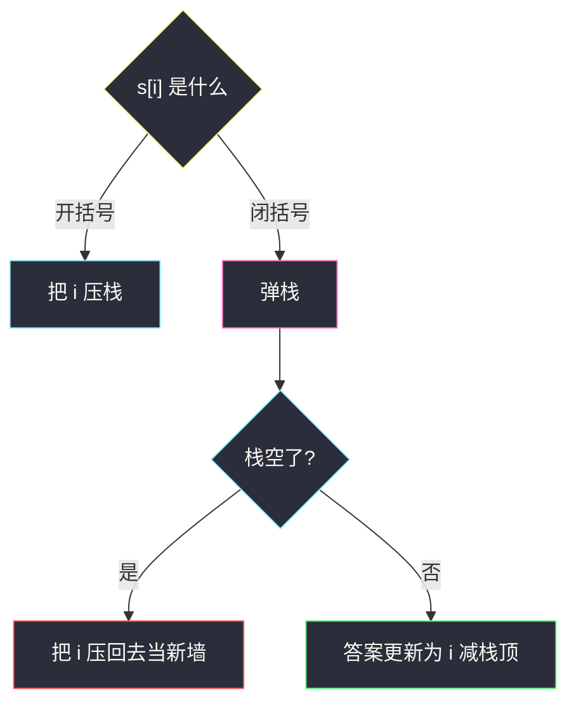
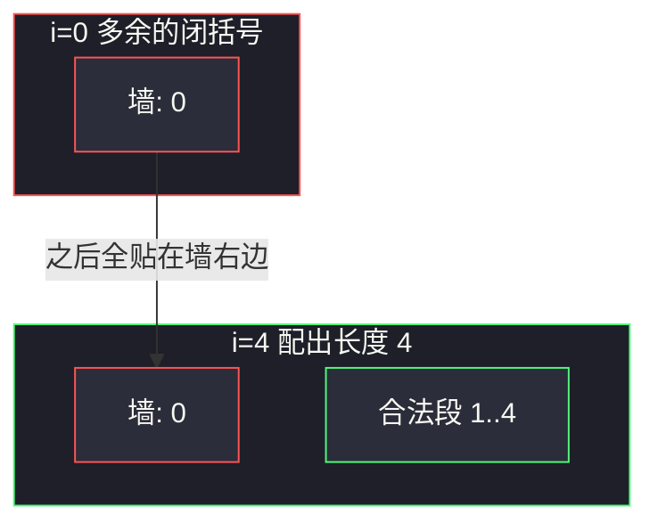

# 最长有效括号（下标栈 + 哨兵）

## 一、问题描述

给你一个只含 `'('` 和 `')'` 的字符串 `s`，找出最长**有效（格式正确且连续）括号子串**的长度。

有效括号串：空串，或 `A`、`B` 都有效则 `AB` 有效，或 `A` 有效则 `(A)` 有效。本题要的是**子串**（下标连续），不是子序列。

> 🔗 LeetCode 32：https://leetcode.cn/problems/longest-valid-parentheses/
>
> 数据范围：`0 <= s.length <= 3·10^4`，`s[i]` 为 `'('` 或 `')'`。
>
> 📚 灵茶题单：**栈 · §3.4 合法括号字符串（RBS）**。

**示例 1**

```
输入：s = "(()"
输出：2
解释：最长有效子串是 "()"。
```

**示例 2**

```
输入：s = ")()())"
输出：4
解释：最长有效子串是 "()()"。
```

**示例 3**

```
输入：s = ""
输出：0
```

**直观理解**

有效括号可以嵌套、可以左右拼接，但必须是一段**连续**下标。`"()(()"` 里有两段长度为 2 的 `()`，中间多一个没配上的 `'('`，不能拼成 4。所以算法既要会「配对」，还要记住**上一个配不上的位置**——那是当前合法段的左边界。

同类括号栈可对照 [1190. 反转每对括号间的子串](https://leetcode.cn/problems/reverse-substrings-between-each-pair-of-parentheses/) 的题解 `reverse-substrings-between-each-pair-of-parentheses.md`：那边栈里存的是「上一层字符串 / 长度」，本题栈里存的是**下标**，用来算连续合法段有多长。

---

## 二、暴力解法

枚举每个左端点 `l`，向右扫，用计数器 `bal`：遇 `'('` 加一，遇 `')'` 减一。`bal < 0` 则这段再也合法不了，换下一个 `l`；`bal == 0` 时用 `r-l+1` 更新答案。

```python
class Solution:
    def longestValidParentheses(self, s: str) -> int:
        n, ans = len(s), 0
        for l in range(n):
            bal = 0
            for r in range(l, n):
                bal += 1 if s[r] == "(" else -1
                if bal < 0:
                    break
                if bal == 0:
                    ans = max(ans, r - l + 1)
        return ans
```

### 复杂度

- **时间**：`O(n²)`。`n = 3·10^4` 会超时。
- **空间**：`O(1)`。

### 🔴 瓶颈在哪里

每个左端都重新数一遍平衡。其实从左扫到右时，**上一次配不平的位置**已经决定了「当前合法段从哪开始」。把未匹配下标压进栈，配对成功就用 `i - 栈顶` 得到长度，一遍 `O(n)`。

---

## 三、优化探索（核心章节）

> 📚 本题在灵茶题单中属于 **§3.4 合法括号字符串（RBS）**。合法括号的栈模板通常存字符；这里要的是**最长连续合法段的长度**，所以栈必须存下标。

### 3.1 为什么栈里是下标，不是括号字符

只存 `'('` 的个数，能判断「到目前为止配没配平」，算不出**这一段合法括号有多长**。

反例：`s = "()(()"`。

```
下标  0 1 2 3 4
字符  ( ) ( ( )
```

若只维护「未匹配的 `'('` 个数」：扫到末尾 `()` 配上了，计数变 1（中间那个 `'('` 还在）。你知道「还剩一个没配」，但不知道它卡在下标 2，于是可能误把整串当成 4。正确最长是 2。

下标栈能回答：当前这个 `')'` 配上之后，**左边界是「栈里还剩的那个下标」**。长度 = `i - 栈顶`。栈顶就是「最后一个还没配对的位置」，合法段紧贴在它右边。

### 3.2 哨兵 `-1` 是干什么的

合法段的左边界有两种：

1. 从字符串开头一直合法：左边没有「配不上的括号」。这时需要一个**虚拟左边界**，约定在下标 `-1`（第一个字符的左边）。长度 = `i - (-1) = i+1`，正好是前缀长度。
2. 中间出现过配不上的 `')'`：它本身成为新的左边界。栈空了就把当前 `i` 压回去，作用和当初的 `-1` 一样。

所以一开始先压入 `-1`。它不是字符串里的字符，只是「开头之前那堵墙」。

### 3.3 扫描规则（必须写死）

栈底始终是「当前这一段的左墙」。墙上面是还没配上的 `'('` 的下标。

| 读到 | 动作 |
|------|------|
| `'('` | 把下标 `i` 压栈（多了一座可能的右括号匹配点） |
| `')'` | 先弹栈（配掉一个 `'('`，或配掉墙） |
| 弹出后栈**非空** | 这段是合法的，长度 `i - stack[-1]`，更新答案 |
| 弹出后栈**空** | 这个 `')'` 多出来了，它成为新墙：把 `i` 压回去 |

弹完栈空，说明墙上的那个哨兵也被这个 `')'` 吃掉了——这个 `')'` 没有任何 `'('` 可配，整段作废，从它右边重新开始。



### 3.4 不变式

扫完位置 `i` 之后：

- 栈底是当前合法段不能越过的左墙（初始 `-1`，或某个配不上的 `')'` 下标）。
- 栈底之上全是尚未匹配的 `'('` 下标，从底到顶从左到右。
- 若刚配成功，`i` 与栈顶之间（不含栈顶）是一段合法括号，长度 `i - 栈顶`。更长的合法段可能在更早的墙之间，已经记在 `ans` 里。

### 3.5 DP 另一视角（以 `i` 结尾）

`dp[i]` = 以 `s[i]` **结尾**的最长合法括号长度。`s[i] == '('` 时一定是 0。

`s[i] == ')'` 时分两种形状：

1. `…()`：`s[i-1] == '('`，则 `dp[i] = dp[i-2] + 2`（再拼上更早以 `i-2` 结尾的合法段）。
2. `…))`：里面已经有一段以 `i-1` 结尾、长度为 `dp[i-1]` 的合法串。能配上当前 `')'` 的那个 `'('` 应在

   `j = i - dp[i-1] - 1`

   若 `j ≥ 0` 且 `s[j] == '('`，则 `dp[i] = dp[i-1] + 2 + dp[j-1]`（`j-1` 再往左可能还有贴着的合法段）。

答案是所有 `dp[i]` 的最大值。和栈是同一件事：`j` 就是「与当前 `')'` 配对的 `'('`」，`dp[j-1]` 相当于栈方案里「墙更靠左时已经记下的长度」。

栈版更短，面试优先栈；DP 帮助理解「为什么长度可以越过一层 `()` 再加左边」。

### 3.6 一句话核心

> **栈里留下标：`'('` 压入，`')'` 弹出后用 `i - 栈顶` 当长度；栈空说明这只 `')'` 是新墙。开头的 `-1` 是字符串左边那堵虚拟墙。**

---

## 四、代码实现

### Python（主解：下标栈 + 哨兵）

```python
class Solution:
    def longestValidParentheses(self, s: str) -> int:
        stack = [-1]          # 哨兵：下标 0 左边的墙
        ans = 0
        for i, c in enumerate(s):
            if c == "(":
                stack.append(i)
            else:
                stack.pop()
                if not stack:
                    stack.append(i)          # 多余的 ) 成为新墙
                else:
                    ans = max(ans, i - stack[-1])
        return ans
```

**变量含义**

| 变量 | 含义 |
|------|------|
| `stack` | 底为左墙，其上是未匹配 `'('` 的下标 |
| `i - stack[-1]` | 当前 `')'` 配成功后，紧贴墙右侧的合法段长度 |
| `ans` | 全局最长 |

### Python（DP 版，对照用）

```python
class Solution:
    def longestValidParentheses(self, s: str) -> int:
        n = len(s)
        dp = [0] * n
        ans = 0
        for i in range(1, n):
            if s[i] != ")":
                continue
            if s[i - 1] == "(":
                dp[i] = (dp[i - 2] if i >= 2 else 0) + 2
            else:
                j = i - dp[i - 1] - 1
                if j >= 0 and s[j] == "(":
                    left = dp[j - 1] if j >= 1 else 0
                    dp[i] = dp[i - 1] + 2 + left
            ans = max(ans, dp[i])
        return ans
```

`i-2`、`j-1` 越界时当成 0：左边没有可贴的合法段。

### Java（最优解同款：下标栈）

```java
class Solution {
    public int longestValidParentheses(String s) {
        Deque<Integer> stack = new ArrayDeque<>();
        stack.push(-1);
        int ans = 0;
        for (int i = 0; i < s.length(); i++) {
            if (s.charAt(i) == '(') {
                stack.push(i);
            } else {
                stack.pop();
                if (stack.isEmpty()) {
                    stack.push(i);
                } else {
                    ans = Math.max(ans, i - stack.peek());
                }
            }
        }
        return ans;
    }
}
```

---

## 五、具体例子演示

### 5.1 官方示例 `")()())"` —— 多余的 `')'` 换墙

`s = ")()())"`，下标 `0..5`。每一步后的栈（左是栈底）。

| i | 字符 | 动作 | 栈 | 本步长度 | ans |
|---|------|------|----|----------|-----|
| 开始 | | 压入哨兵 | `[-1]` | | 0 |
| 0 | `)` | 弹出 `-1`，栈空，压 0 当新墙 | `[0]` | — | 0 |
| 1 | `(` | 压 1 | `[0, 1]` | | 0 |
| 2 | `)` | 弹出 1，栈非空，`2-0=2` | `[0]` | 2 | 2 |
| 3 | `(` | 压 3 | `[0, 3]` | | 2 |
| 4 | `)` | 弹出 3，`4-0=4` | `[0]` | 4 | 4 |
| 5 | `)` | 弹出 0，栈空，压 5 当新墙 | `[5]` | — | 4 |

下标 0 的 `)` 把初始哨兵吃掉，自己变成墙。之后 `()()` 都贴在这堵墙右边，最长 4。最后多一个 `)` 再换墙，右边已经没字符了。



### 5.2 `"(()"` —— 哨兵算出前缀合法段

| i | 字符 | 动作 | 栈 | 长度 | ans |
|---|------|------|----|------|-----|
| 开始 | | 哨兵 | `[-1]` | | 0 |
| 0 | `(` | 压 0 | `[-1, 0]` | | 0 |
| 1 | `(` | 压 1 | `[-1, 0, 1]` | | 0 |
| 2 | `)` | 弹出 1，`2-0=2` | `[-1, 0]` | 2 | 2 |

栈顶剩下 0，是那个没配上的 `'('`。合法段是下标 `1..2` 的 `()`，长度 `2-0=2`。若没有哨兵、栈空时没法算「从开头算起」的情况；这里哨兵一直在，但真正限制长度的是下标 0 那个 `'('`。

### 5.3 `"()(()"` —— 为什么不能只数个数（必看）

| i | 字符 | 动作 | 栈 | 长度 | ans |
|---|------|------|----|------|-----|
| 开始 | | 哨兵 | `[-1]` | | 0 |
| 0 | `(` | 压 0 | `[-1, 0]` | | 0 |
| 1 | `)` | 弹出 0，`1-(-1)=2` | `[-1]` | 2 | 2 |
| 2 | `(` | 压 2 | `[-1, 2]` | | 2 |
| 3 | `(` | 压 3 | `[-1, 2, 3]` | | 2 |
| 4 | `)` | 弹出 3，`4-2=2` | `[-1, 2]` | 2 | 2 |

关键在 `i = 4`：配上的是下标 3 的 `'('`，**栈顶变成 2**。长度用 `4-2=2`，不会误用 `4-(-1)=5`。下标 2 那个 `'('` 是夹在两段 `()` 中间的墙，把合法子串劈开。这就是「必须留下标」的全部理由。

### 5.4 DP 对照 `"(()())"`

`s = "(()())"`，期望 6。

| i | s[i] | 分支 | 计算 | dp[i] |
|---|------|------|------|-------|
| 0 | `(` | | | 0 |
| 1 | `(` | | | 0 |
| 2 | `)` | `s[1]=='('` | `0+2` | 2 |
| 3 | `(` | | | 0 |
| 4 | `)` | `s[3]=='('` | `dp[2]+2=4` | 4 |
| 5 | `)` | `s[4]==')'` | `j=5-4-1=0`，`s[0]=='('`，`4+2+dp[-1]=6` | 6 |

最后那个 `)` 配的是下标 0 的 `(`，把整串 `( … )` 包起来，再没有更左的段。栈版同步跟踪：

| i | 栈 | 长度 |
|---|-----|------|
| 开始 | `[-1]` | |
| 0 `(` | `[-1, 0]` | |
| 1 `(` | `[-1, 0, 1]` | |
| 2 `)` | `[-1, 0]` | `2-0=2` |
| 3 `(` | `[-1, 0, 3]` | |
| 4 `)` | `[-1, 0]` | `4-0=4` |
| 5 `)` | `[-1]` | `5-(-1)=6` |

`i = 5` 弹出 0 之后栈顶回到哨兵 `-1`，长度 6。两种写法看到的是同一堵墙。

---

## 六、复杂度分析

| 方法 | 时间 | 空间 | 说明 |
|------|------|------|------|
| 枚举左端 + 平衡计数 | `O(n²)` | `O(1)` | `n = 3·10^4` 超时 |
| 下标栈 + 哨兵（主解） | `O(n)` | `O(n)` | 最坏全是 `'('`，栈长 `n` |
| 以 i 结尾的 DP | `O(n)` | `O(n)` | 每个位置常数转移 |

---

## 七、对比总结

| 维度 | 平衡计数暴力 | 下标栈 | DP |
|------|--------------|--------|----|
| 左边界 | 每个 `l` 重扫 | 栈底的墙 | `j = i-dp[i-1]-1` |
| 子串 vs 子序列 | 连续扫描保证子串 | `i-栈顶` 保证连续 | 只定义「以 i 结尾」 |
| 代码量 | 短但慢 | 最短 | 分支多、下标易越界 |

**易错点**

1. **栈里存字符而不是下标**：配得平不知道有多长，`"()(()"` 会错。
2. **忘记初始 `-1`**：合法前缀 `"()"` 在弹出后栈空，若不把 `-1` 当墙，会把本该记 2 的情况当成「多余 `)`」。
3. **`')'` 弹出后栈空却不压当前 `i`**：后面的合法段会错误地连到更早的位置，把断开的两段拼起来。
4. **先压后弹写反**：必须「先弹再看空不空」。空了说明弹出的是墙，当前 `)` 配不上。
5. **DP 漏 `dp[j-1]`**：`(()())` 最后一步若只加 `dp[i-1]+2` 会得到 6……这题碰巧对，但 `"()(())"` 以最后 `)` 结尾应是 6，漏掉左边的 `()` 会得到 4。
6. **求的是子串不是子序列**：`"(())"` 可以 4；`"()(()"` 只能 2。

**模板（§3.4 最长合法括号子串）**

```python
stack = [-1]
# '(' → 压 i
# ')' → 弹；空则压 i 当墙，否则 ans = max(ans, i - stack[-1])
```

与 [1190](https://leetcode.cn/problems/reverse-substrings-between-each-pair-of-parentheses/) 对比：1190 保证整串是 RBS，栈用来分层加工；本题串可以不合法，栈用来**找最长合法连续段**，多出来的括号改写成墙。

---

## 八、举一反三

| 题目 | 关系 |
|------|------|
| [20. 有效的括号](https://leetcode.cn/problems/valid-parentheses/) | 只判断整串是否 RBS，栈存字符即可 |
| [22. 括号生成](https://leetcode.cn/problems/generate-parentheses/) | 生成全部 RBS |
| [921. 使括号有效的最少添加](https://leetcode.cn/problems/minimum-add-to-make-parentheses-valid/) | 统计配不上的左、右括号 |
| [1190. 反转每对括号间的子串](https://leetcode.cn/problems/reverse-substrings-between-each-pair-of-parentheses/) | 同属 §3.4，栈分层；见本目录 `reverse-substrings-between-each-pair-of-parentheses.md` |
| [301. 删除无效的括号](https://leetcode.cn/problems/remove-invalid-parentheses/) | 在「删最少」的前提下枚举全部合法串 |
| [678. 有效的括号字符串](https://leetcode.cn/problems/valid-parenthesis-string/) | `*` 可当左、右或空，平衡范围代替栈 |

**思想迁移**

- 见到「括号 + 最长连续」，先问左边界是谁：配不上的位置就是墙；墙用栈底（或 DP 里的 `j`）表示。
- 口诀：**「栈留下标，先弹后看；空了当新墙，非空 `i` 减栈顶。」**
