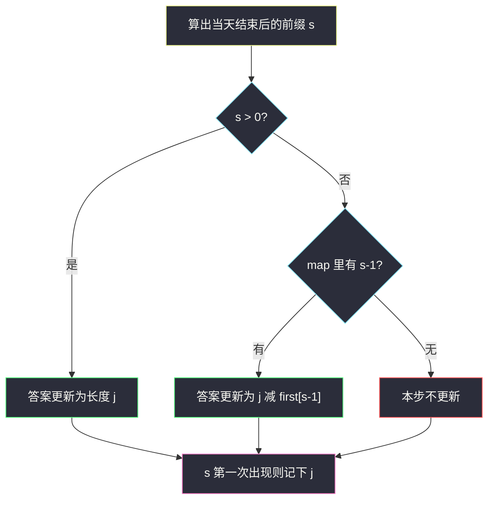
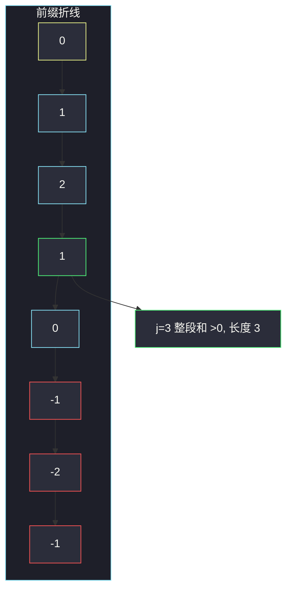

# 表现良好的最长时间段（+1/−1 前缀 + 最早更小值）

## 一、问题描述

给你一份工时表 `hours`。一天工时 **大于 8** 称为劳累日。一段连续日子是「表现良好」当且仅当这段里**劳累天数严格大于不劳累天数**。返回表现良好时间段的**最大长度**；不存在则返回 0。

> 🔗 LeetCode 1124：https://leetcode.cn/problems/longest-well-performing-interval/
>
> 数据范围：`1 <= hours.length <= 10^4`，`0 <= hours[i] <= 16`。
>
> 📚 灵茶题单：**单调栈 · §1.2 进阶**。把「劳累 / 不劳累」映射成 `+1 / -1` 之后，就是求**和严格大于 0 的最长子数组**；用前缀和 +「每个前缀值第一次出现的位置」，或单调递减栈 + 二分。

**示例 1**

```
输入：hours = [9,9,6,0,6,6,9]
输出：3
解释：最长表现良好段是 [9,9,6]（2 个劳累日 > 1 个不劳累日）。
```

注意：整段 7 天是 3 劳累 + 4 不劳累，和为 -1，**不是**表现良好。对拍力扣官方样例得 3，不是 7。

**示例 2**

```
输入：hours = [6,6,6]
输出：0
解释：全是不劳累日，任何非空段劳累数都是 0。
```

**示例 3**

```
输入：hours = [6,6,9]
输出：1
解释：只有最后一天单独成段。前缀和 0,-1,-2,-1，没有长度 >1 且和 >0 的子数组。
```

**直观理解**

劳累记 `+1`、不劳累记 `-1` 之后，子数组「劳累 > 不劳累」等价于元素和 `> 0`。前缀和 `pre[j] - pre[i] > 0` 即 `pre[i] < pre[j]`。对每个右端 `j`，找**最早**的 `i` 使得 `pre[i] < pre[j]`，长度 `j - i` 尽量大。`pre[0] = 0` 表示「第 0 天之前」那根虚空前缀。

---

## 二、暴力解法

枚举左右端点，数劳累 / 不劳累天数。

```python
class Solution:
    def longestWPI(self, hours: list[int]) -> int:
        n, ans = len(hours), 0
        for l in range(n):
            tire = 0
            for r in range(l, n):
                tire += 1 if hours[r] > 8 else 0
                rest = r - l + 1 - tire
                if tire > rest:
                    ans = max(ans, r - l + 1)
        return ans
```

### 复杂度

- **时间**：`O(n²)`。`n = 10^4` 勉强边缘，更好的做法是 `O(n)`。
- **空间**：`O(1)`。

### 🔴 瓶颈在哪里

每个右端都把所有左端重数一遍。前缀和算好后，只剩「`pre[i] < pre[j]` 的最小 `i`」。因为相邻前缀只差 `±1`，这个最早 `i` 可以用「第一次出现的 `pre[j] - 1`」直接查表，不必扫所有 `i`。

---

## 三、优化探索（核心章节）

> 📚 本题在灵茶题单中属于 **§1.2 进阶**（前缀和遇上单调栈 / 哈希）。同类「前缀 + 单调结构」还有和为 0、和至少 k 的最长子数组；这里因为步长是 `±1`，哈希表一版更短。

### 3.1 映射与前缀

令 `a[i] = 1 if hours[i] > 8 else -1`。`pre[0] = 0`，`pre[k] = a[0] + … + a[k-1]`（前 `k` 天的和）。天数下标 `0..n-1` 对应前缀下标 `1..n`。

子数组 `hours[i..j-1]`（长度 `j-i`）表现良好 ⟺ `pre[j] - pre[i] > 0` ⟺ `pre[i] ≤ pre[j] - 1`。

### 3.2 哈希：第一次出现的每个前缀

从左到右算 `pre[j]`（下面用 `s` 表示）：

1. 若 `s > 0`：从开头到第 `j` 天的和已经为正，长度就是 `j`（左端取 `pre[0] = 0`）。
2. 否则查 `s - 1` 第一次出现的位置 `i`。因为前缀每次只变 1，**第一次降到 `s-1` 的位置，就是所有 `< s` 的前缀里最早的那个**——更小的 `s-2, s-3, …` 必然更晚才第一次出现（要从 0 走到更低，必先经过 `s-1`）。
3. 只在 `s` 从未出现过时写入哈希，保证记的是**最早**下标。

查询必须在写入之前：当前 `j` 不能当自己的左端。



### 3.3 单调栈 + 二分（同一件事）

要找最早的 `i` 满足 `pre[i] < pre[j]`。从左往右，只有「创下新低」的下标才可能成为答案左端——更靠右、前缀更大的点，被左边那个更小的前缀全面支配。于是栈里留下标，保证 `pre[栈底] > pre[…] > pre[栈顶]`（严格递减）。

对每个 `j`（从右往左也行）：在栈里二分最左的 `pre[i] < pre[j]`。从右往左扫时还可以直接弹栈：若 `i` 已经和某个更大的 `j` 配过，更小的 `j'` 即使得长度也用这个 `i`，也短于 `j - i`，`i` 可以丢弃。弹之前先丢掉 `≥ j` 的下标，避免长度为负。

哈希版更短，作为主解；栈版帮助理解「最早的更小前缀」。

### 3.4 不变式

扫完第 `j` 天（前缀下标 `j`）之后：

- `first[v]` 是 `pre` 第一次等于 `v` 的下标，且该下标 `< j`（若本步刚写入则等于 `j`，但查询已结束）
- `ans` 是所有右端 `≤ j` 的最长正和子数组长度
- `pre[0] = 0` 永远在表里，对应「从第 1 天开始」

### 3.5 一句话核心

> **劳累 +1、否则 -1；前缀和 > 0 就从开头算长度，否则查第一次出现的 `pre-1`。记得 `pre[0] = 0`。**

---

## 四、代码实现

### Python（主解：前缀第一次出现）

```python
class Solution:
    def longestWPI(self, hours: list[int]) -> int:
        first = {0: 0}          # 前缀值 -> 最早下标；虚空前缀 0 在位置 0
        s = 0
        ans = 0
        for j, h in enumerate(hours, 1):   # j 是前缀下标 1..n
            s += 1 if h > 8 else -1
            if s > 0:
                ans = max(ans, j)
            elif s - 1 in first:
                ans = max(ans, j - first[s - 1])
            if s not in first:
                first[s] = j
        return ans
```

**变量含义**

| 变量 | 含义 |
|------|------|
| `s` | `pre[j]`，前 `j` 天的 +1/−1 和 |
| `first` | 每个前缀值第一次出现的下标 |
| `j` | 当前右端（天数个数） |
| `j - first[s-1]` | 左端取「第一次变成 s-1」时的最长候选 |

### Python（单调递减栈，对照用）

```python
class Solution:
    def longestWPI(self, hours: list[int]) -> int:
        n = len(hours)
        pre = [0] * (n + 1)
        for i, h in enumerate(hours):
            pre[i + 1] = pre[i] + (1 if h > 8 else -1)
        st = []
        for i, v in enumerate(pre):
            if not st or pre[st[-1]] > v:   # 只留新低
                st.append(i)
        ans = 0
        for j in range(n, 0, -1):
            while st and st[-1] >= j:       # 左端必须 < j
                st.pop()
            while st and pre[st[-1]] < pre[j]:
                ans = max(ans, j - st.pop())
        return ans
```

从右往左：一旦 `pre[i] < pre[j]`，这个 `i` 配当前（更大的）`j` 已经最长，后面更小的右端用它只会更短，可以弹出。

---

## 五、具体例子演示

### 5.1 官方示例 `[9,9,6,0,6,6,9]` → 3

映射：`+1,+1,-1,-1,-1,-1,+1`。前缀（含 `pre[0]=0`）：

```
下标 j     0   1   2   3   4   5   6   7
hours         9   9   6   0   6   6   9
a            +1  +1  -1  -1  -1  -1  +1
pre        0   1   2   1   0  -1  -2  -1
```

| j | s | 分支 | 查表 | 长度 | first（本步后） | ans |
|---|---|------|------|------|-----------------|-----|
| 1 | 1 | `s>0` | — | 1 | `{0:0, 1:1}` | 1 |
| 2 | 2 | `s>0` | — | 2 | 加上 `2:2` | 2 |
| 3 | 1 | `s>0` | — | 3 | 1 已存在不改 | **3** |
| 4 | 0 | 查 `-1` | 无 | — | 0 已存在 | 3 |
| 5 | -1 | 查 `-2` | 无 | — | 加上 `-1:5` | 3 |
| 6 | -2 | 查 `-3` | 无 | — | 加上 `-2:6` | 3 |
| 7 | -1 | 查 `-2` | 6 | 1 | `-1` 已存在 | 3 |

`j = 3` 时前三天和为 1，整段 `[9,9,6]` 长度 3。后面前缀掉到负数，查 `s-1` 只能配到很近的新低，补不出更长段。整段 7 天和是 `-1`，不是答案——这是任务书里「→7」和官方不一致的地方，以对拍为准。



### 5.2 `[6,6,9]` → 1（栈弹压同步）

前缀 `0, -1, -2, -1`。哈希：

| j | s | 动作 | ans |
|---|---|------|-----|
| 1 | -1 | 查 -2 无，记下 -1 在 1 | 0 |
| 2 | -2 | 查 -3 无，记下 -2 在 2 | 0 |
| 3 | -1 | 查 -2 命中 2，长度 1 | 1 |

单调栈构建（只压新低）：`pre[0]=0` 入；`-1 < 0` 压 1；`-2 < -1` 压 2；最后 `-1` 不压（不是新低）。栈 `[0, 1, 2]`。

从右 `j=3`：`pre[3]=-1`，栈顶 2 的前缀 `-2 < -1`，弹出，长度 `3-2=1`。其余栈顶 `pre[1]=-1` 不小于 `-1`。答案 1。

### 5.3 `[6,6,6]` → 0

前缀一路 `0,-1,-2,-3`。从未 `s>0`，查 `s-1` 时那个值还没出现过（总是「明天才会创的新低」）。答案 0。

### 5.4 为什么只查 `s-1` 就够

从 `pre[0]=0` 出发，第一次到达 `-3` 之前一定已经到过 `-1` 和 `-2`，且第一次 `-1` 早于第一次 `-2` 早于第一次 `-3`。所以所有 `< s` 的历史里，**最早**的就是第一次 `s-1`。查 `s-2` 只会得到更靠右的 `i`，长度更差。

---

## 六、复杂度分析

| 方法 | 时间 | 空间 | 说明 |
|------|------|------|------|
| 枚举左右端 | `O(n²)` | `O(1)` | `n = 10^4` 可过但不稳 |
| 前缀哈希（主解） | `O(n)` | `O(n)` | 每个前缀值至多记一次 |
| 单调递减栈 + 从右弹 | `O(n)` | `O(n)` | 每个下标进栈出栈一次 |

---

## 七、对比总结

| 维度 | 暴力 | 哈希 `first[s-1]` | 单调栈 |
|------|------|-------------------|--------|
| 找最早 `pre[i] < pre[j]` | 扫所有 i | 步长 ±1 故只查 s-1 | 新低下标 + 弹栈 |
| `s>0` 的特判 | 自然包含 | 必须写：左端是 0 | 栈底的 0 会被弹出配对 |
| 代码量 | 短而慢 | 最短 | 要处理 `st[-1] >= j` |

**易错点**

1. **忘记 `pre[0] = 0`**：从第 1 天开始的正前缀对不上虚空左端。
2. **劳累条件写成 `≥ 8`**：题目是**大于 8**。
3. **把整段 `[9,9,6,0,6,6,9]` 当成 7**：3 劳累 < 4 不劳累，官方答案是 3。
4. **先写入再查询**：当前 `j` 会查到自己，长度变成 0。
5. **哈希记下的不是第一次**：同一前缀更靠右的 `i` 只会让区间变短，必须 `if s not in first`。
6. **栈版不弹掉 `≥ j` 的下标**：可能算出负长度。

**模板（§1.2 和 >0 的最长子数组，步长 ±1）**

```python
first = {0: 0}
s = 0
# s += ±1
# s>0 → 长度 j；否则查 first[s-1]
# 第一次出现才写入
```

---

## 八、举一反三

| 题目 | 关系 |
|------|------|
| [525. 连续数组](https://leetcode.cn/problems/contiguous-array/) | 0/1 映射成 ±1 后求**和为 0** 的最长段，哈希查 `s` 本身 |
| [325. 和等于 k 的最长子数组长度](https://leetcode.cn/problems/maximum-size-subarray-sum-equals-k/) | 前缀哈希查 `s-k`（会员题） |
| [962. 最大宽度坡](https://leetcode.cn/problems/maximum-width-ramp/) | `A[i] ≤ A[j]` 的最大 `j-i`，单调递减栈 + 从右扫 |
| [84. 柱状图中最大的矩形](https://leetcode.cn/problems/largest-rectangle-in-histogram/) | 同属单调栈，那边弹栈结算宽度 |
| [1121. 将数组分成几个递增序列](https://leetcode.cn/problems/divide-array-into-increasing-sequences/) | 同场周赛另一题，无关本题思路 |

**思想迁移**

- 见到「一类元素个数严格多于另一类」，先映射 `+1 / -1`，再问前缀谁更小。
- 口诀：**「大于 8 记 +1；前缀为正取从头，否则查第一次的 s-1。」**
