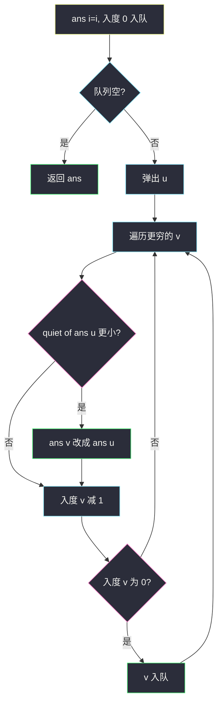
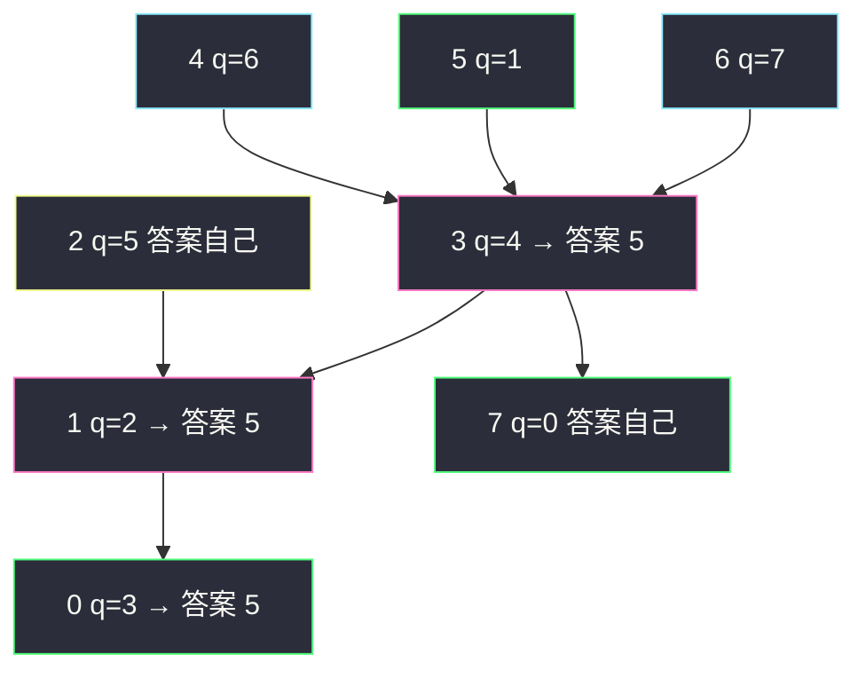

# 喧闹和富有（拓扑序 DP / 记忆化 DFS）

## 一、问题描述

`n` 个人，`quiet[i]` 是 `i` 的安静值（越小越安静，**互不相同**）。`richer[j] = [a, b]` 表示 `a` 比 `b` **更有钱**。对每个人 `x`，在「比 `x` 更有钱，或者就是 `x` 自己」这一群人里，找出安静值最小的那个人的**编号**。

> 🔗 LeetCode 851：https://leetcode.cn/problems/loud-and-rich/
>
> 数据范围：`n ≤ 500`，`richer` 描述的是偏序（可以当成 DAG：有钱指向没钱，无环）。`quiet` 两两不同。
>
> 📚 灵茶题单：**§2.2 在拓扑序上 DP**（从入度为 0 的「最有钱」往更穷的人推答案）。

**示例 1**

```
输入：richer = [[1,0],[2,1],[3,1],[3,7],[4,3],[5,3],[6,3]], quiet = [3,2,5,4,6,1,7,0]
输出：[5,5,2,5,4,5,6,7]
```

人 0 的「有钱集合」含 0 以及所有能走到 0 的更有钱者，其中 `quiet[5]=1` 最小，答案下标 5。人 7 自己 `quiet=0` 已经最安静，答案 7。

**示例 2**

```
输入：richer = [], quiet = [0]
输出：[0]
```

只有自己。

**直观理解**

「比 x 更有钱」是 x 在财富偏序上的祖先。把边建成 **`a → b`（有钱指向没钱）**：最有钱的人入度为 0。一个人的答案，要么是自己，要么来自某个更有钱的人的答案（那个人已经包含了更更有钱的人）。沿拓扑序从富推到穷，就是 DAG 上的 DP。

也可以反向边（穷指向富）再记忆化 DFS：`dfs(x)` 递归所有更有钱的人，取 `quiet` 最小者。两种同一张 DAG。

---

## 二、暴力解法

对每个 `x`，从 `x` 沿「指向更有钱」的边 DFS，收集祖先并加上自己，再扫一遍 `quiet`。最坏每个点都扫整图，`O(n(n+m))`。`n=500` 能过，但重复访问同一祖先。

```python
from typing import List

class Solution:
    def loudAndRich(self, richer: List[List[int]], quiet: List[int]) -> List[int]:
        n = len(quiet)
        up = [[] for _ in range(n)]  # b -> a：穷指向富
        for a, b in richer:
            up[b].append(a)
        ans = [-1] * n

        def collect(x: int, vis: list) -> None:
            vis[x] = True
            for p in up[x]:
                if not vis[p]:
                    collect(p, vis)

        for x in range(n):
            vis = [False] * n
            collect(x, vis)
            vis[x] = True
            best = x
            for i in range(n):
                if vis[i] and quiet[i] < quiet[best]:
                    best = i
            ans[x] = best
        return ans
```

每人一份 vis，祖先重叠时重复劳动。主解改成每个点算一次，沿拓扑往下传。

### 🔴 瓶颈在哪里

`ans[x]` 依赖所有更有钱者的 `ans`。先算入度为 0 的人（没人比他有钱，`ans=自己`），再松弛更穷的邻居：用已经算完的富人去更新穷人。这就是拓扑 DP，和课程表、DAG 最长路同一骨架。

---

## 三、优化探索（核心章节）

> 📚 本题在灵茶题单中属于 **§2.2 在拓扑序上 DP**。偏序 DAG 上从源头推最优代表。

### 3.1 建图与入度

```python
g[a].append(b)   # 有钱 → 没钱
indeg[b] += 1
```

`quiet` 唯一，比较用 `<` 即可。`ans[i]` 初值是 `i`（至少可以选自己）。

### 3.2 拓扑序转移

队列里先放 `indeg = 0` 的人。弹出 `u` 时，`ans[u]` 已经是「u 及所有比 u 有钱的人」里最安静的编号（归纳：更有钱的人都在前面处理完并传下来了）。对每个更穷的 `v`：

```text
若 quiet[ans[u]] < quiet[ans[v]]：
    ans[v] = ans[u]
indeg[v] -= 1，减到 0 则入队
```

`v` 入队时，所有直接更有钱的前驱都传过一遍，`ans[v]` 已含全部祖先信息。



记忆化 DFS 等价：`g` 改成穷→富，`dfs(x)` 返回 x 与所有祖先里 quiet 最小者的编号，结果缓存。拓扑版更贴本节「序上 DP」。

这不是最短路，不用堆（对比 [network-delay-time.md](./network-delay-time.md)）。边不带权，只有偏序。

### 3.3 一句话核心

> **有钱指向没钱；拓扑从最富往下传；穷人的答案用更安静的富人编号覆盖。**

---

## 四、代码实现

### Python（主解：拓扑序 DP）

```python
from collections import deque
from typing import List

class Solution:
    def loudAndRich(self, richer: List[List[int]], quiet: List[int]) -> List[int]:
        n = len(quiet)
        g = [[] for _ in range(n)]
        indeg = [0] * n
        for a, b in richer:
            g[a].append(b)
            indeg[b] += 1
        ans = list(range(n))
        q = deque(i for i in range(n) if indeg[i] == 0)
        while q:
            u = q.popleft()
            for v in g[u]:
                if quiet[ans[u]] < quiet[ans[v]]:
                    ans[v] = ans[u]
                indeg[v] -= 1
                if indeg[v] == 0:
                    q.append(v)
        return ans
```

可选记忆化 DFS（边反过来）：

```python
def loudAndRich_dfs(self, richer, quiet):
    n = len(quiet)
    up = [[] for _ in range(n)]
    for a, b in richer:
        up[b].append(a)
    ans = [-1] * n

    def dfs(x: int) -> int:
        if ans[x] >= 0:
            return ans[x]
        ans[x] = x
        for p in up[x]:
            y = dfs(p)
            if quiet[y] < quiet[ans[x]]:
                ans[x] = y
        return ans[x]

    for i in range(n):
        dfs(i)
    return ans
```

提交任选一版。默写拓扑时别把 `a、b` 建反：`[a,b]` 是 a 更有钱，箭头 `a→b`。

---

## 五、具体例子演示

示例 1。边（有钱→没钱）：`1→0, 2→1, 3→1, 3→7, 4→3, 5→3, 6→3`。`quiet = [3,2,5,4,6,1,7,0]`。

入度：`0←1` 为 1；`1←2,3` 为 2；`3←4,5,6` 为 3；`7←3` 为 1；`2,4,5,6` 为 0。`ans` 初值 `[0,1,2,3,4,5,6,7]`。队列按编号从小到大先放 `2,4,5,6`。

| 弹出 | 入度变化 | quiet 比较 | ans |
|------|----------|------------|-----|
| 2 | `indeg[1]: 2→1` | `quiet[2]=5` 不优于 `quiet[1]=2` | 不变 |
| 4 | `indeg[3]: 3→2` | `6` 不优于 `4` | 不变 |
| 5 | `indeg[3]: 2→1` | `1 < 4` | **ans[3]=5** |
| 6 | `indeg[3]: 1→0`，3 入队 | `7` 不优于已有的 1 | ans[3] 仍 5 |
| 3 | `indeg[1]: 1→0` 入队 1；`indeg[7]: 1→0` 入队 7 | 对 1：`1 < 2` → **ans[1]=5**；对 7：`1 > 0` 不改 | ans[7]=7 |
| 1 | `indeg[0]: 1→0` 入队 0 | `1 < 3` | **ans[0]=5** |
| 7、0 | 无出边 | | 结束 |

2 先碰 1 时改不动；等 3 把「整棵更有钱子树的代表 5」带来，才覆盖 1 和 0。必须等入度清零再弹出，否则会漏前驱。

最终 `[5,5,2,5,4,5,6,7]`。



人 7 比 3、4、5、6 穷，但自己 quiet=0 最小，覆盖失败，答案仍是 7。这是「选编号不是选更有钱的人」：比的是 quiet，不是财富。

`richer = []`：所有入度 0，队列弹出后没有出边，`ans` 保持 `0..n-1`。

---

## 六、复杂度分析

| 方法 | 时间 | 空间 | 说明 |
|------|------|------|------|
| 每人单独 DFS | `O(n(n+m))` | `O(n+m)` | `n=500` 能过 |
| 拓扑 DP（主解） | `O(n+m)` | `O(n+m)` | 每点每边一次 |
| 记忆化 DFS | `O(n+m)` | `O(n+m)` 递归栈 | 与拓扑等价 |

---

## 七、对比总结

| 维度 | 最短路 Dijkstra | 本题拓扑 DP |
|------|-----------------|-------------|
| 边权 | 正权距离 | 无距离，只有偏序 |
| 队列 | 小根堆 | 入度为 0 的普通队列 |
| 转移 | `d+w < dist` | `quiet[ans[u]]` 更小则覆盖 |
| 答案 | 距离 / 时间 | **人的编号** |

和二分图无关；若误做成染色，见 [is-graph-bipartite.md](./is-graph-bipartite.md)——那是另一类约束。

**易错点**

1. **边反了**：`[a,b]` 建成 `b→a`，拓扑源头变成最穷，答案全错。
2. **比较财富而不是 quiet**：应用 `quiet[ans[u]]`。
3. **存 quiet 值当答案**：题目要的是**下标**。
4. **入度未减完就用 ans[v]**：必须等所有更有钱前驱都更新过。
5. **漏掉 ans 初值=自己**：没人比他有钱时要返回自己。

拓扑队列和课程表一样，但转移不是「能上课」，而是「把更安静的代表编号传给穷人」。别把 `ans` 初始化成 quiet 值。边权出现时才换 [network-delay-time.md](./network-delay-time.md) 的堆。

---

## 八、举一反三

| 题目 | 关系 |
|------|------|
| [210. 课程表 II](https://leetcode.cn/problems/course-schedule-ii/) | 同一套入度队列，只输出序不 DP |
| [329. 矩阵中的最长递增路径](https://leetcode.cn/problems/longest-increasing-path-in-a-matrix/) | 网格 DAG 上拓扑 / 记忆化 DFS |
| [802. 找到最终的安全状态](https://leetcode.cn/problems/find-eventual-safe-states/) | 反图拓扑，从出度 0 往回推 |
| [851 本题](https://leetcode.cn/problems/loud-and-rich/) | 偏序上「祖先最值」模板 |
| [743. 网络延迟时间](https://leetcode.cn/problems/network-delay-time/) | 有边权才 Dijkstra，站内 [network-delay-time.md](./network-delay-time.md) |

**思想迁移**

- DAG 上每个点依赖所有前驱 → 拓扑序 DP 或记忆化 DFS，不要当最短路。
- 「集合里的最优代表」可以只存一个编号往下传，不必每次收集整集。
- 口诀：**「有钱指向没钱；入度 0 开推；quiet 更小就覆盖编号。」**
