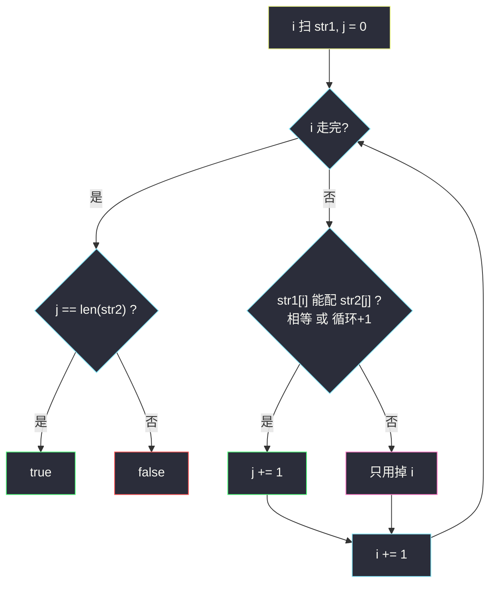
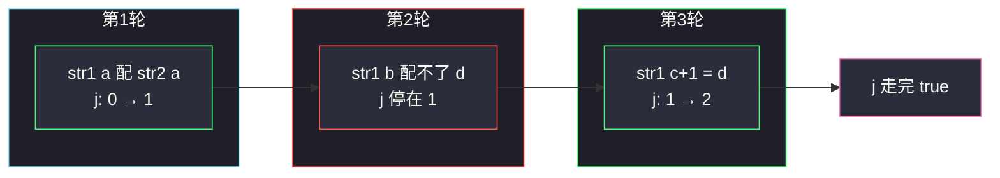

# 循环增长使字符串成为子序列（§4.2 判断子序列）

## 一、问题描述

给你两个字符串 `str1` 和 `str2`。可以对 `str1` 的**每个下标至多做一次**操作：把该位置字符循环加 1（`'z'` 变成 `'a'`）。

问能否通过若干次操作，使得 `str2` 成为 `str1` 的**子序列**（不必连续，但相对顺序不变）。

> 🔗 LeetCode 2825：https://leetcode.cn/problems/make-string-a-subsequence-using-cyclic-increments/
>
> 数据范围：`1 <= str1.length, str2.length <= 10^5`，仅含小写字母。

**示例 1**

```
输入：str1 = "abc", str2 = "ad"
输出：true
解释：把 str1[2] 的 'c' 循环 +1 变成 'd'，得到 "abd"，其中 "ad" 是子序列。
```

**示例 2**

```
输入：str1 = "zc", str2 = "ad"
输出：true
解释：'z' → 'a'，'c' → 'd'，得到 "ad"。
```

**示例 3**

```
输入：str1 = "ab", str2 = "d"
输出：false
解释：'a' 只能保持或变 'b'，'b' 只能保持或变 'c'，凑不出 'd'。
```

**直观理解**

每个 `str1[i]` 的「可用字符集」只有两个：原字符，或它的下一位（循环）。问题退化成：用这些受限字符，按顺序能不能拼出 `str2`。这就是经典「判断子序列」，只是匹配条件从「相等」放宽成「相等或循环 +1」。

> 📚 灵茶题单 **§4.2 判断子序列**：双指针扫 `str1`，能配就让 `str2` 的指针前进。

---

## 二、暴力解法

每个位置独立即/不 +1，共 `2^n` 种改写结果，再对每种跑标准子序列判断。

```python
class Solution:
    def canMakeSubsequence(self, str1: str, str2: str) -> bool:
        n = len(str1)
        for mask in range(1 << n):              # 枚举哪些下标 +1
            s = []
            for i, c in enumerate(str1):
                if mask >> i & 1:
                    s.append(chr((ord(c) - 97 + 1) % 26 + 97))
                else:
                    s.append(c)
            j = 0
            for ch in s:
                if j < len(str2) and ch == str2[j]:
                    j += 1
            if j == len(str2):
                return True
        return False
```

### 复杂度

- **时间**：`O(2^n * n)`。`n = 10^5` 完全不可用，仅作对照。
- **空间**：`O(n)` 构造改写串。

### 🔴 瓶颈在哪里

是否 +1 **不必提前全局选定**。匹配 `str2[j]` 时，当前字符够用就用，不够就跳过——和普通子序列一样，贪心从左往右取最早能配上的位置即可。

---

## 三、优化探索（核心章节）

> 📚 本题在灵茶题单中属于 **§4.2 判断子序列**：`str1` 指针 `i` 单调前进，`str2` 指针 `j` 仅在匹配成功时 +1；匹配条件是「相等，或循环增长一位」。

### 3.1 观察特征

| 特征 | 说明 |
|------|------|
| 每个下标至多 +1 一次 | 不能 +2，`'a'` 变不成 `'c'` |
| 循环只在 `'z'→'a'` | 其它字母就是码点 +1 |
| 子序列相对顺序 | 只能从左到右消耗 `str1` |

### 3.2 何时能配上 `str2[j]`

设 `a = str1[i]`，`b = str2[j]`。`a` 能匹配 `b` 当且仅当：

- `a == b`（不操作），或
- `(a 的下一位) == b`，即 `(ord(a) - 97 + 1) % 26 + 97` 对应的字符等于 `b`。

等价：把字母映射到 `0..25`，`(a - b) % 26` 属于 `{0, 25}`（差 0 或差 -1 模 26）。

### 3.3 贪心：能配就配

扫描 `str1`。若当前字符能匹配 `str2[j]`，立刻让 `j += 1`。若 `j` 走到 `len(str2)` 则成功。

**为什么不能跳过这次匹配去等后面？** 标准子序列交换论证：当前这次能配，后面再配只会更晚；`str1` 更靠后的字符同样能留给 `str2` 后面的字符。跳过只会让 `j` 更难走完。



### 3.4 一句话核心

> **双指针扫 str1：当前字母等于目标、或循环下一位等于目标，就吃掉 str2 的一个字符；j 走完就成。**

---

## 四、代码实现

### Python（主解：双指针）

```python
class Solution:
    def canMakeSubsequence(self, str1: str, str2: str) -> bool:
        j, m = 0, len(str2)
        for c in str1:
            if j < m:
                # 保持 或 循环 +1
                nxt = chr((ord(c) - 97 + 1) % 26 + 97)
                if c == str2[j] or nxt == str2[j]:
                    j += 1
        return j == m
```

**更省字符转换的写法**

```python
class Solution:
    def canMakeSubsequence(self, str1: str, str2: str) -> bool:
        j, m = 0, len(str2)
        for c in str1:
            if j == m:
                break
            a, b = ord(c), ord(str2[j])
            if a == b or (a - 97 + 1) % 26 == b - 97:
                j += 1
        return j == m
```

**变量含义**

| 变量 | 含义 |
|------|------|
| `j` | `str2` 已匹配前缀长度，下一个要配 `str2[j]` |
| `c` / `i` | 正在考察的 `str1` 字符 |

**循环不变式**：扫描完 `str1[:i]` 后，`j` 是在循环 +1 规则下能匹配到的 `str2` 最长前缀。

### Java（可选）

```java
class Solution {
    public boolean canMakeSubsequence(String str1, String str2) {
        int j = 0, m = str2.length();
        for (int i = 0; i < str1.length() && j < m; i++) {
            char c = str1.charAt(i), t = str2.charAt(j);
            if (c == t || (c - 'a' + 1) % 26 + 'a' == t) j++;
        }
        return j == m;
    }
}
```

---

## 五、具体例子演示

以示例 1 `str1 = "abc"`，`str2 = "ad"` 跟踪两指针。

| 轮 | i / str1[i] | j / 目标 | 能否配（保持或 +1） | 决策后 j |
|----|-------------|----------|---------------------|----------|
| 1 | 0 `'a'` | 0 `'a'` | `'a'=='a'` | 1 |
| 2 | 1 `'b'` | 1 `'d'` | `'b'`/`'c'` 都不是 `'d'` | 1 |
| 3 | 2 `'c'` | 1 `'d'` | `'c'+1 == 'd'` | 2 |

`j == 2`，返回 **true** ✓。本轮 `str1` 的 `'b'` 被跳过，这是子序列允许的；`'c'` 用掉仅有的一次 +1 去配 `'d'`。

**示例 2** `str1 = "zc"`，`str2 = "ad"`（专门考 `'z'→'a'`）：

| 轮 | i / str1[i] | j / 目标 | 保持 | 循环+1 | 决策后 j |
|----|-------------|----------|------|--------|----------|
| 1 | 0 `'z'` | 0 `'a'` | `'z'` | `'a'` | 1（用循环） |
| 2 | 1 `'c'` | 1 `'d'` | `'c'` | `'d'` | 2（用循环） |

两指针都走到头，**true**。若忘记模 26，`'z'+1` 越界，这组样例会直接判错。

**示例 3** `"ab"` vs `"d"`：

| 轮 | str1[i] | 目标 `'d'` | 候选 |
|----|---------|------------|------|
| 1 | `'a'` | 配不上 | `'a'`/`'b'` |
| 2 | `'b'` | 配不上 | `'b'`/`'c'` |

`j` 始终 0，**false**。差 2 及以上（含反向，如 `'b'` 想配 `'a'`）都不行：操作不能减 1，也不能连加两次。



---

## 六、复杂度分析

| 方法 | 时间 | 空间 | 说明 |
|------|------|------|------|
| 枚举 +1 掩码 | `O(2^n * n)` | `O(n)` | 仅作对照 |
| 双指针（主解） | `O(n)` | `O(1)` | 各扫一遍，`n = \|str1\|` |

---

## 七、对比总结

| 维度 | 普通 #392 判断子序列 | 本题 |
|------|----------------------|------|
| 匹配条件 | `s[i] == t[j]` | 相等 **或** 循环 +1 |
| 指针运动 | 完全相同：能配就 `j++` | 相同 |
| 每个位置操作次数 | 无 | **至多一次**，不能连加 |

**易错点**

1. **只能 +1 不能 +2**：`'a'` 配 `'c'` 是 false。
2. **`'z'` 要模 26**：写成 `c + 1` 而不处理 `'z'` 会越界。
3. **`j` 越界**：匹配前先判断 `j < m`。
4. **不是子串**：不必连续，跳过 `str1` 中间字符是允许的。
5. **不能改 `str2`**：操作只作用在 `str1` 上。

**模板（§4.2 判断子序列，Python）**

```python
j = 0
for c in s:
    if j < len(t) and 能匹配(c, t[j]):
        j += 1
return j == len(t)
```

本题的 `能匹配` = 相等或循环下一位。

---

## 八、举一反三

| 题目 | 关系 |
|------|------|
| [392. 判断子序列](https://leetcode.cn/problems/is-subsequence/) | 本节原型，匹配条件改回相等即可 |
| [2486. 追加字符以获得子序列](https://leetcode.cn/problems/append-characters-to-string-to-make-subsequence/) | 同样双指针，答案是 `t` 没配上的后缀长度 |
| [792. 匹配子序列的单词数](https://leetcode.cn/problems/number-of-matching-subsequences/) | 多模式子序列，指针思想相同 |
| [524. 通过删除字母匹配到字典里最长单词](https://leetcode.cn/problems/longest-word-in-dictionary-through-deleting/) | 对每个词跑一遍判断子序列 |
| [1023. 驼峰式匹配](https://leetcode.cn/problems/camelcase-matching/) | 子序列 + 大小写约束 |
| [925. 长按键入](https://leetcode.cn/problems/long-pressed-name/) | 双指针匹配，允许源串连续重复 |

**思想迁移**

- 「源串每个位置提供一个小候选集，问能否按序拼出目标」——先写普通子序列，再把 `==` 换成「候选集包含」。
- 口诀：**「i 扫源串，能配就推 j；循环只加一位，j 走完就成。」**
