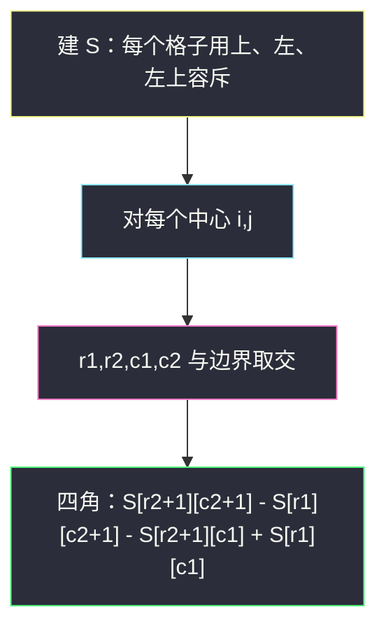
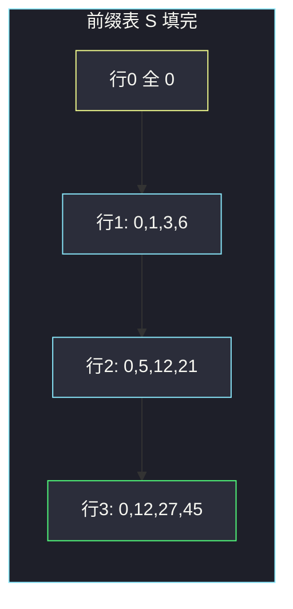

# 矩阵区域和（二维前缀和）

## 一、问题描述

给你一个 `m × n` 的矩阵 `mat` 和一个整数 `k`。请构造同尺寸矩阵 `answer`，其中：

`answer[i][j]` 等于以 `(i, j)` 为中心、把行和列各向两边扩展 `k` 格所得到的**矩形**与原矩阵求交之后，矩形内所有元素的和。

也就是：对所有满足 `i-k ≤ r ≤ i+k`、`j-k ≤ c ≤ j+k` 且 `r, c` 落在矩阵内的格子，把 `mat[r][c]` 加起来。

> 🔗 LeetCode 1314：https://leetcode.cn/problems/matrix-block-sum/
>
> 数据范围：`1 <= m, n, k <= 100`，`1 <= mat[i][j] <= 100`。暴力对每个格子扫 `(2k+1)²` 也能过，但本题要练的是二维前缀和模板。

**示例 1**

```
输入：mat = [[1,2,3],[4,5,6],[7,8,9]], k = 1
输出：[[12,21,16],[27,45,33],[24,39,28]]
解释：answer[0][0] 覆盖 [0..1]×[0..1]，即 1+2+4+5=12。
```

**示例 2**

```
输入：mat 同上，k = 2
输出：[[45,45,45],[45,45,45],[45,45,45]]
解释：k 够大，每个格子都覆盖整张矩阵，总和 45。
```

**直观理解**

每个 `answer[i][j]` 都是「某个子矩阵的和」。子矩阵左上、右下可由 `i,j,k` 再和边界取 min/max 得到。二维前缀和能把任意子矩阵和变成 4 次查表。

注意：题名里的 block 是**切比雪夫距离** ≤ k 的正方形（行差、列差各自 ≤ k），不是曼哈顿菱形。

---

## 二、暴力解法

对每个中心再扫矩形：

```python
class Solution:
    def matrixBlockSum(self, mat: List[List[int]], k: int) -> List[List[int]]:
        m, n = len(mat), len(mat[0])
        ans = [[0] * n for _ in range(m)]
        for i in range(m):
            for j in range(n):
                s = 0
                for r in range(max(0, i - k), min(m, i + k + 1)):
                    for c in range(max(0, j - k), min(n, j + k + 1)):
                        s += mat[r][c]
                ans[i][j] = s
        return ans
```

### 复杂度

- **时间**：`O(m · n · k²)`。`m=n=k=100` 约 `10^8`，勉强能过，不是模板解。
- **空间**：`O(1)` 额外。

### 🔴 瓶颈在哪里

大量矩形重叠，同一块被加很多次。先花 `O(mn)` 建前缀表，之后每个中心 `O(1)` 查询。

---

## 三、优化探索（核心章节）

> 📚 本题在灵茶题单中属于 **前缀和 · §1.6 二维前缀和**。一维是 `pre[R+1]-pre[L]`；二维多一次容斥：大矩形减上面、减左边，加回左上（减了两次）。

### 3.1 前缀表定义

`S[i+1][j+1]` = 子矩阵 `mat[0..i][0..j]`（闭区间）的元素和。多一行一列 0 作为哨兵，避免 `i=0` / `j=0` 特判。

递推（格子 `(i,j)` 0-based）：

```
S[i+1][j+1] = S[i][j+1] + S[i+1][j] - S[i][j] + mat[i][j]
```

- `S[i][j+1]`：上方一块（不含当前行）
- `S[i+1][j]`：左方一块（不含当前列）
- 左上角 `S[i][j]` 被加了两次，减去一次
- 再加当前格

### 3.2 查询任意子矩阵

要 `mat[r1..r2][c1..c2]`（闭、0-based）的和：

```
S[r2+1][c2+1] - S[r1][c2+1] - S[r2+1][c1] + S[r1][c1]
```

四个角对应「右下前缀 − 上一行前缀 − 左一列前缀 + 左上角」（左上被减两次，加回来）。

### 3.3 中心 (i,j)、半径 k 的边界

```
r1 = max(0, i - k)
r2 = min(m - 1, i + k)
c1 = max(0, j - k)
c2 = min(n - 1, j + k)
```

必须 clamp，否则前缀下标越界，或把矩阵外当成 0 时用错公式。哨兵行/列已经是 0，但 `r2+1` 最大只能是 `m`，所以右下仍要先把 `r2` 卡在 `m-1`。



### 3.4 一句话核心

> **S 多一圈 0；格子用上+左−左上+自己；查询用右下−上−左+左上；中心半径先 clamp 再查。**

---

## 四、代码实现

### Python（主解）

```python
class Solution:
    def matrixBlockSum(self, mat: List[List[int]], k: int) -> List[List[int]]:
        m, n = len(mat), len(mat[0])
        S = [[0] * (n + 1) for _ in range(m + 1)]
        for i in range(m):
            for j in range(n):
                S[i + 1][j + 1] = (
                    S[i][j + 1] + S[i + 1][j] - S[i][j] + mat[i][j]
                )

        def query(r1: int, c1: int, r2: int, c2: int) -> int:
            return (
                S[r2 + 1][c2 + 1]
                - S[r1][c2 + 1]
                - S[r2 + 1][c1]
                + S[r1][c1]
            )

        ans = [[0] * n for _ in range(m)]
        for i in range(m):
            for j in range(n):
                r1, r2 = max(0, i - k), min(m - 1, i + k)
                c1, c2 = max(0, j - k), min(n - 1, j + k)
                ans[i][j] = query(r1, c1, r2, c2)
        return ans
```

**变量含义**

| 变量 | 含义 |
|------|------|
| `S[i][j]` | `mat[0..i-1][0..j-1]` 的和；第 0 行、第 0 列为 0 |
| `r1,c1,r2,c2` | 与矩阵求交后的闭区间角点（仍是 `mat` 下标） |

### Java（最优解同款）

```java
class Solution {
    public int[][] matrixBlockSum(int[][] mat, int k) {
        int m = mat.length, n = mat[0].length;
        int[][] S = new int[m + 1][n + 1];
        for (int i = 0; i < m; i++) {
            for (int j = 0; j < n; j++) {
                S[i + 1][j + 1] = S[i][j + 1] + S[i + 1][j] - S[i][j] + mat[i][j];
            }
        }
        int[][] ans = new int[m][n];
        for (int i = 0; i < m; i++) {
            for (int j = 0; j < n; j++) {
                int r1 = Math.max(0, i - k), r2 = Math.min(m - 1, i + k);
                int c1 = Math.max(0, j - k), c2 = Math.min(n - 1, j + k);
                ans[i][j] = S[r2 + 1][c2 + 1] - S[r1][c2 + 1] - S[r2 + 1][c1] + S[r1][c1];
            }
        }
        return ans;
    }
}
```

---

## 五、具体例子演示

矩阵：

```
1 2 3
4 5 6
7 8 9
```

### 5.1 逐步填 S（大小 4×4）

初始全 0。按行优先填 `S[i+1][j+1]`。

**第一行 i=0**

| 格 | 公式 | 值 |
|----|------|-----|
| (0,0) | `0+0-0+1` | S[1][1]=1 |
| (0,1) | `0+1-0+2` | S[1][2]=3 |
| (0,2) | `0+3-0+3` | S[1][3]=6 |

**第二行 i=1**

| 格 | 公式 | 值 |
|----|------|-----|
| (1,0) | `1+0-0+4` | S[2][1]=5 |
| (1,1) | `3+5-1+5` | S[2][2]=12 |
| (1,2) | `6+12-3+6` | S[2][3]=21 |

核对：`S[2][2]` 应是左上 2×2：`1+2+4+5=12`。

**第三行 i=2**

| 格 | 公式 | 值 |
|----|------|-----|
| (2,0) | `5+0-0+7` | S[3][1]=12 |
| (2,1) | `12+12-5+8` | S[3][2]=27 |
| (2,2) | `21+27-12+9` | S[3][3]=45 |

填完：

```
S =
  0   0   0   0
  0   1   3   6
  0   5  12  21
  0  12  27  45
```



### 5.2 查询一块：k=1，中心 (0,0)

`r1=max(0,-1)=0`，`r2=min(2,1)=1`，`c1=0`，`c2=1`。要的是 `[0..1]×[0..1]`：

```
S[2][2] - S[0][2] - S[2][0] + S[0][0]
= 12 - 0 - 0 + 0
= 12
```

格子：1+2+4+5=12。✓

### 5.3 再查中心 (1,1)，k=1

矩形是整表 `[0..2]×[0..2]`：`S[3][3]-S[0][3]-S[3][0]+S[0][0]=45`。✓

中心 (0,2)，k=1：`r1=0,r2=1,c1=1,c2=2` → `S[2][3]-S[0][3]-S[2][1]+S[0][1]=21-0-5+0=16`，即 2+3+5+6=16。与示例输出 `answer[0][2]=16` 一致。

---

## 六、复杂度分析

| 方法 | 时间 | 空间 | 说明 |
|------|------|------|------|
| 四重循环 | `O(mn k²)` | `O(1)` | 100⁴ 边缘 |
| 二维前缀和（主解） | `O(mn)` | `O(mn)` | 建表、查询都线性于格子数 |

k 再大也不会更慢：每个中心只 clamp 一次再查四角。

---

## 七、对比总结

| 维度 | 暴力 | 二维前缀 |
|------|------|----------|
| 子矩阵和 | 现场累加 | 四角容斥 |
| 越界 | 循环上下限 | 先 clamp 再代入公式 |
| 和一维前缀 | — | 多减一个左上（容斥） |

**易错点**

1. **忘减左上或忘加回左上**：查询四个项缺一不可。
2. **S 与 mat 共用下标且无哨兵**：第一行/列要一堆 `if`。
3. **clamp 成半开区间**：`r2 = min(m, i+k)` 若再当闭区间用会越界；右下是 `min(m-1, i+k)`。
4. **把距离理解成曼哈顿**：本题是正方形（切比雪夫），行、列独立扩 k。
5. **建表时减错 `S[i][j]`**：必须是左上角那块，不是 `S[i+1][j+1]` 自己。

**模板（§1.6 二维前缀和）**

```python
S[i+1][j+1] = S[i][j+1] + S[i+1][j] - S[i][j] + mat[i][j]
# 闭区间 [r1,r2] × [c1,c2]
s = S[r2+1][c2+1] - S[r1][c2+1] - S[r2+1][c1] + S[r1][c1]
```

---

## 八、举一反三

| 题目 | 关系 |
|------|------|
| [304. 二维区域和检索 - 矩阵不可变](https://leetcode.cn/problems/range-sum-query-2d-immutable/) | 同一张 S，查询接口化 |
| [1310. 子数组异或查询](https://leetcode.cn/problems/xor-queries-of-a-subarray/) | 一维前缀家族；加法换成异或、容斥换成再异或 |
| [1074. 元素和为目标值的子矩阵数量](https://leetcode.cn/problems/number-of-submatrices-that-sum-to-target/) | 二维前缀 + 枚举上下界后走一维哈希 |
| [1504. 统计全 1 子矩形](https://leetcode.cn/problems/count-submatrices-with-all-ones/) | 也是子矩阵统计，常用高度栈 |
| [221. 最大正方形](https://leetcode.cn/problems/maximal-square/) | 正方形区域，DP 与前缀思想相邻 |
| [2536. 子矩阵元素加 1](https://leetcode.cn/problems/increment-submatrices-by-one/) | 二维差分是前缀和的逆操作 |

**思想迁移**

- 多次询问「子矩形和」→ 建 S，四角容斥。
- 口诀：**「多一圈 0；上加左减左上加自己；查询右下减上减左加左上。」**
