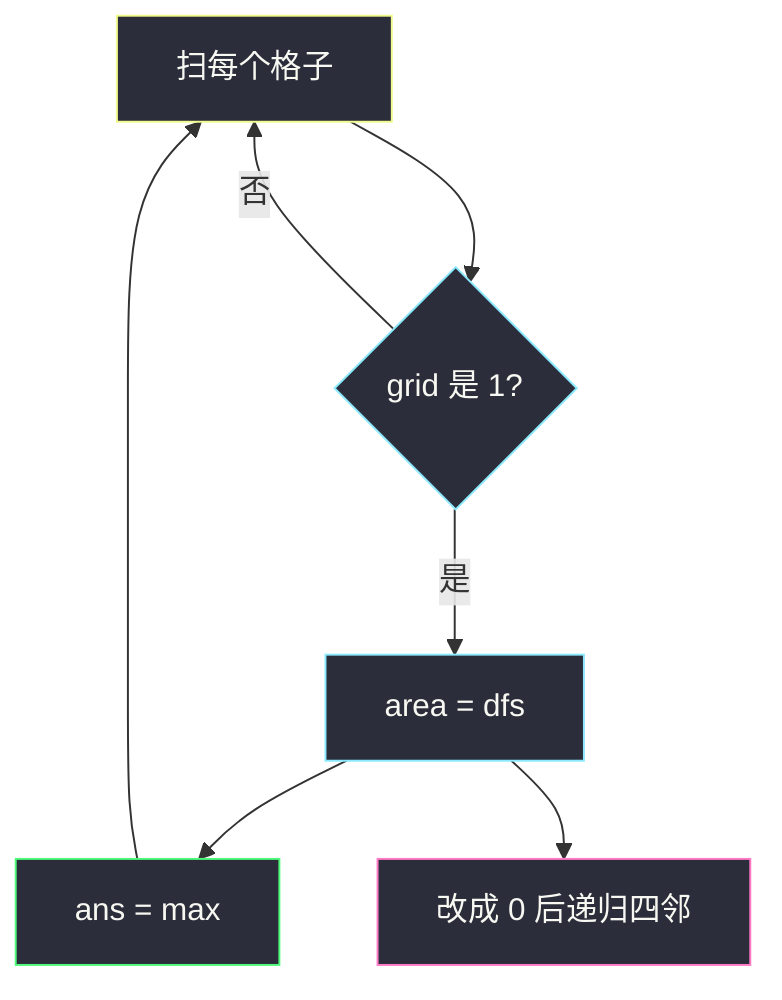
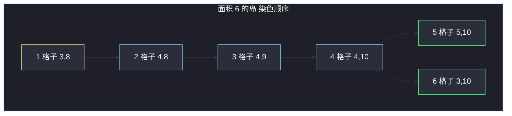

# 岛屿的最大面积（四连通块大小）

## 一、问题描述

`m × n` 的 0/1 网格。岛屿是四连通（上下左右）的 `1` 组成的块。返回最大岛屿的格子数。没有岛屿则返回 0。网格四边视为水。

> 🔗 LeetCode 695：https://leetcode.cn/problems/max-area-of-island/
>
> 数据范围：`1 ≤ m, n ≤ 50`，`grid[i][j] ∈ {0, 1}`。
>
> 📚 灵茶题单：**一、网格图 DFS**。

**示例 1**

```
输入：grid =
[[0,0,1,0,0,0,0,1,0,0,0,0,0],
 [0,0,0,0,0,0,0,1,1,1,0,0,0],
 [0,1,1,0,1,0,0,0,0,0,0,0,0],
 [0,1,0,0,1,1,0,0,1,0,1,0,0],
 [0,1,0,0,1,1,0,0,1,1,1,0,0],
 [0,0,0,0,0,0,0,0,0,0,1,0,0],
 [0,0,0,0,0,0,0,1,1,1,0,0,0],
 [0,0,0,0,0,0,0,1,1,0,0,0,0]]
输出：6

最大岛在图的右侧中部 6 格，四连通。
不要把右下角靠对角贴着的另一座岛算进来——那会变成 11，题目明确排除。
```

**示例 2**

```
输入：grid = [[0,0,0,0,0,0,0,0]]
输出：0
```

**直观理解**

#200 数有几座岛；本题数**最大那座有多大**。还是 Flood Fill：踩到一个 1，把整块染掉并累加格子数，全程取 max。

---

## 二、暴力解法

每碰到一个 1 就开一次 BFS，但 vis 只用局部集合、不在网格上标记。下一座岛的起点若曾属于上一座，会把同一块反复数。

更直白的平方做法：对每个 1，复制一份网格再灌一次，只为算这一块的面积。

```python
from collections import deque

class Solution:
    def maxAreaOfIsland(self, grid: List[List[int]]) -> int:
        m, n = len(grid), len(grid[0])
        DIRS = ((0, 1), (0, -1), (1, 0), (-1, 0))
        ans = 0
        for si in range(m):
            for sj in range(n):
                if grid[si][sj] == 0:
                    continue
                q = deque([(si, sj)])
                seen = {(si, sj)}
                area = 0
                while q:
                    i, j = q.popleft()
                    area += 1
                    for di, dj in DIRS:
                        ni, nj = i + di, j + dj
                        if 0 <= ni < m and 0 <= nj < n and grid[ni][nj] == 1 and (ni, nj) not in seen:
                            seen.add((ni, nj))
                            q.append((ni, nj))
                ans = max(ans, area)
        return ans
```

每个 1 都把所在岛完整走一遍，一座面积为 `k` 的岛被算 `k` 次，最坏 `O((mn)²)`。

### 🔴 瓶颈在哪里

全局标记（改成 0 或 `visited`）让每座岛只数一次。DFS 返回面积，外层取 max，一遍 `O(mn)`。

---

## 三、优化探索（核心章节）

> 📚 本题在灵茶题单中属于 **一、网格图 DFS**。与 `flood-fill.md` 同一套方向数组；返回值从「void 染色」变成「这块的格子数」。

### 3.1 DFS 返回面积

```
dfs(i, j):
    越界或是 0 → 返回 0
    把当前格改成 0          # 标记
    返回 1 + 四邻 dfs 之和
```

改成 0 与另开 `visited` 等价，少一张表。题目允许改输入。

### 3.2 外层扫描

每个格子若仍是 1，说明是新岛起点，`ans = max(ans, dfs(i, j))`。全 0 则 `ans` 保持 0。



### 3.3 一句话核心

> **碰到 1 就 DFS 把整岛改成 0 并返回面积；全程记录最大值。**

---

## 四、代码实现

### Python（主解：DFS 返回面积）

```python
from typing import List

class Solution:
    def maxAreaOfIsland(self, grid: List[List[int]]) -> int:
        m, n = len(grid), len(grid[0])
        DIRS = ((0, 1), (0, -1), (1, 0), (-1, 0))

        def dfs(i: int, j: int) -> int:
            if not (0 <= i < m and 0 <= j < n) or grid[i][j] == 0:
                return 0
            grid[i][j] = 0
            area = 1
            for di, dj in DIRS:
                area += dfs(i + di, j + dj)
            return area

        ans = 0
        for i in range(m):
            for j in range(n):
                if grid[i][j] == 1:
                    ans = max(ans, dfs(i, j))
        return ans
```

先改成 0 再递归，避免把当前格加两次，也切断回头路。

BFS 同样可以：碰到 1 时用 `deque` 把整岛改 0，出队一次面积 +1。默写优先递归，因为和 `flood-fill.md` 同一骨架，只多一个返回值。

**变量含义**

| 写法 | 含义 |
|------|------|
| `grid[i][j] = 0` | 已计入面积，禁止再走 |
| `area = 1 + 四邻` | 当前格贡献 1，子连通块加回来 |
| 外层 `max` | 只保留最大一座，不累加所有岛 |

### Java（可选）

```java
class Solution {
    private static final int[][] DIRS = {{0, 1}, {0, -1}, {1, 0}, {-1, 0}};

    public int maxAreaOfIsland(int[][] grid) {
        int m = grid.length, n = grid[0].length, ans = 0;
        for (int i = 0; i < m; i++) {
            for (int j = 0; j < n; j++) {
                if (grid[i][j] == 1) ans = Math.max(ans, dfs(grid, i, j));
            }
        }
        return ans;
    }

    private int dfs(int[][] grid, int i, int j) {
        int m = grid.length, n = grid[0].length;
        if (i < 0 || i >= m || j < 0 || j >= n || grid[i][j] == 0) return 0;
        grid[i][j] = 0;
        int area = 1;
        for (int[] d : DIRS) area += dfs(grid, i + d[0], j + d[1]);
        return area;
    }
}
```

---

## 五、具体例子演示

官方例 1 按行扫描、每座岛只数一次，面积分别是 1、4、4、5、**6**、5，max=6。右中那座 6 格如下（对拍自中文站输入；第 5 行是 `...,1,1,1,...`，有的转载把 `(4,9)` 写成 0，最大面积会错成 5）：

```
行/列  8  9  10
  3    1  0  1
  4    1  1  1
  5    0  0  1
```

从扫描到的第一个格 `(3,8)` 开始，`DIRS` 右、左、下、上，染色顺序：

| 步 | 格子 | 说明 |
|----|------|------|
| 1 | (3,8) | 起点，改 0。右、左、上都是 0 |
| 2 | (4,8) | 往下 |
| 3 | (4,9) | 从 (4,8) 往右 |
| 4 | (4,10) | 从 (4,9) 往右 |
| 5 | (5,10) | 从 (4,10) 往下 |
| 6 | (3,10) | 从 (4,10) 往上 |

`dfs` 返回 6。其右下方 `(6,7)` 那座是另一座 5 格岛，`(6,9)` 与 `(5,10)` **只对角相邻**，不算连通——这就是「答案不是 11」的来源。

小网格逐步跟踪（便于默写）：

```
0 1 1
1 1 0
0 1 0
```

从 (0,1) 出发：`(0,1) → (0,2) → (1,1) → (1,0) → (2,1)`，面积 5。右下没有第二座岛。



---

## 六、复杂度分析

| 方法 | 时间 | 空间 | 说明 |
|------|------|------|------|
| 每个 1 单独数所在岛 | `O((mn)²)` | `O(mn)` | 同一岛数多次 |
| DFS 改 0（主解） | `O(mn)` | `O(mn)` 最坏栈深 | 每格进出一次；`m, n ≤ 50` |

---

## 七、对比总结

| 维度 | #200 岛屿数量 | 本题最大面积 | #733 图像渲染 |
|------|--------------|--------------|----------------|
| 连通块 | 数有几块 | 块的大小取 max | 改颜色 |
| 标记 | 1→0 | 1→0 | orig→color |
| 空图 | 返回 0 | 返回 0 | 原图 |

并查集也能做：每个 1 与四邻 1 合并，维护分量大小。代码更长，网格 DFS 更贴题单。

**易错点**

1. **不算改 0**：回头走进已访问格，无限递归或面积算爆。
2. **八连通**：对角不算。官方例 1 专门用「不是 11」提醒。
3. **先加面积后改 0**：可能把当前格通过回头边再加一次。
4. **没有岛却返回别的**：初始 `ans = 0`。
5. **只 DFS 一次就结束**：必须扫完全图；第一座岛不一定最大。

主解会改输入。若面试要求保留原网格，另开 `visited`，或先 `deepcopy` 再灌。

---

## 八、举一反三

| 题目 | 关系 |
|------|------|
| [200. 岛屿数量](https://leetcode.cn/problems/number-of-islands/) | 同 DFS，计数改为 `ans += 1` |
| [733. 图像渲染](https://leetcode.cn/problems/flood-fill/) | 同方向数组，见 `flood-fill.md` |
| [1020. 飞地的数量](https://leetcode.cn/problems/number-of-enclaves/) | 先按 `surrounded-regions.md` 淹掉贴边陆地，再数面积 |
| [827. 最大人工岛](https://leetcode.cn/problems/making-a-large-island/) | 先给每座岛编号和面积，再试把一个 0 填成 1 |
| [463. 岛屿的周长](https://leetcode.cn/problems/island-perimeter/) | 仍是四连通；周长用「陆地边 - 邻接」 |

**思想迁移**

- 网格里「一块 1」几乎总是：方向数组 + 越界/水域返回 + 标记后累加。
- 数岛、染岛、量岛是同一套 DFS，只换返回值：void / +1 座 / 返回面积。
- 口诀：**「踩 1 改 0；面积 = 1 + 四邻；全程取 max。」**
