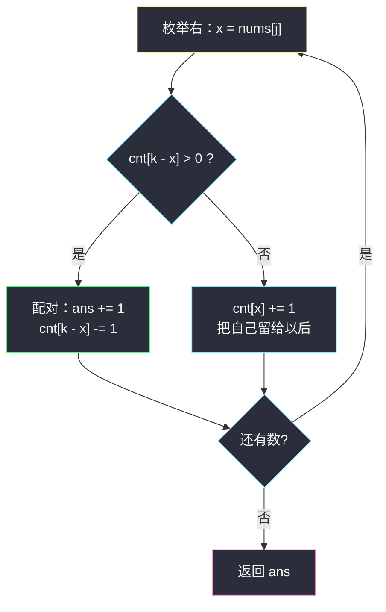
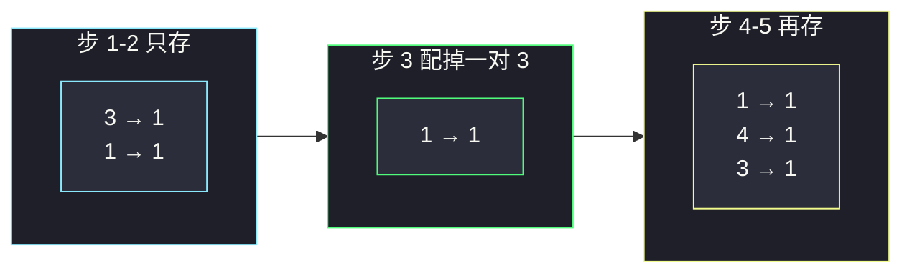

# K 和数对的最大数目（枚举右，维护左：能配就立刻配）

## 一、问题描述

给你一个整数数组 `nums` 和一个整数 `k`。一次操作：选出两个下标（互不相同），若两数之和等于 `k`，就把它们从数组里删掉。请返回最多能进行多少次这样的操作。

每个数最多用一次；不同操作之间选出的四个下标两两不同。问的是**配对数的最大值**。

> 🔗 LeetCode 1679：https://leetcode.cn/problems/max-number-of-k-sum-pairs/
>
> 数据范围：`1 <= nums.length <= 10^5`，`1 <= nums[i], k <= 10^9`。
>
> 📚 本题出自灵茶题单 **§0.1 枚举右，维护左**。同节姊妹题 [#2342 数位和相等数对的最大和](https://leetcode.cn/problems/max-sum-of-a-pair-with-equal-sum-of-digits/)（`max-sum-of-a-pair-with-equal-sum-of-digits.md`）同样枚举右：那边表里存最大值冲「和」，这边表里存剩余个数冲「对数」。

**示例 1**

```
输入：nums = [1,2,3,4], k = 5
输出：2
解释：(1,4) 与 (2,3) 各一次，数组清空。
```

**示例 2**

```
输入：nums = [3,1,3,4,3], k = 6
输出：1
解释：只能配掉一对 3+3；剩下 [1,4,3]，没有和为 6 的对。
```

**示例 3**

```
输入：nums = [4,4,1,3,1,3,2,2,5,5,1,5,2,1,2,3,5,4], k = 2
输出：2
解释：k=2 只能 1+1；数组里四个 1，配两对。
```

**直观理解**

每个数 `x` 的搭档是死的：必须是 `k-x`（`x` 与 `k-x` 可以相等，那就是两个相同的数配成一对）。从左到右扫，遇到 `x` 时左边若还剩一个没用过的 `k-x`，立刻配对（贪心：留着只会占坑，不会让总数变多）；否则把 `x` 存进「等待被配」的计数表。

---

## 二、暴力解法

每次在剩余数组里找一对数和为 `k` 就删，直到找不到：

```python
class Solution:
    def maxOperations(self, nums: List[int], k: int) -> int:
        ans = 0
        used = [False] * len(nums)
        for i in range(len(nums)):
            if used[i]:
                continue
            for j in range(i + 1, len(nums)):
                if not used[j] and nums[i] + nums[j] == k:
                    used[i] = used[j] = True
                    ans += 1
                    break
        return ans
```

### 复杂度

- **时间**：`O(n²)`。`n = 10^5` 超时。
- **空间**：`O(n)`。

### 🔴 瓶颈在哪里

内层在线性搜「有没有一个还没用的 `k-x`」。把「还没用的值的个数」放进哈希表，查找从 `O(n)` 变成 `O(1)`。配对没有后悔的必要：`x` 能配的对象值唯一，早配晚配次数一样。

---

## 三、优化探索（核心章节）

> 📚 灵茶题单 **§0.1 枚举右，维护左**。固定右端点上的值 `x`，问左边还剩几个 `k-x`。表里维护的是**剩余计数**，不是下标列表。

### 3.1 贪心：能配立刻配

假设当前是 `x`，左边有 `t` 个闲置的 `k-x`：

- 若 `t > 0`：拿一个来配，`ans += 1`，`t -= 1`。若把 `x` 留下等后面，后面那个 `k-x` 本来也可以和现在这个 `x` 配，总数不变；若后面再也没有 `k-x`，现在不配就浪费。所以立刻配不亏。
- 若 `t = 0`：`x` 只能等以后的 `k-x`，于是 `cnt[x] += 1`。

这就是「先查后写」：查的是搭档 `k-x` 的计数，写的是自己 `x` 的计数。不要先 `cnt[x] += 1` 再查——当 `2x = k` 时会把自己配给自己。

### 3.2 与两数之和的差别

[#1 两数之和](https://leetcode.cn/problems/two-sum/) 只要一对下标；本题要**尽可能多对**，且每个元素用完即删。哈希表从「存一个下标」升级成「存剩余个数」，每配一次就把对应计数减一。



### 3.3 可选：排序双指针

升序后左右指针。`nums[l] + nums[r] == k` 则配一对、两边内缩；和偏小则 `l += 1`；和偏大则 `r -= 1`。时间 `O(n log n)`，空间 `O(1)` 额外（不计排序）。主解按题单走哈希枚举右，`O(n)`。

### 3.4 一句话核心

> **枚举右端 x：左边还剩 `k-x` 就立刻配对并减一，否则把 x 的计数加一。先查搭档、再写自己。**

---

## 四、代码实现

### Python（主解：枚举右 + 哈希计数）

```python
from collections import defaultdict

class Solution:
    def maxOperations(self, nums: List[int], k: int) -> int:
        cnt = defaultdict(int)                  # 左边还未配对的值 → 个数
        ans = 0
        for x in nums:                          # 枚举右
            t = k - x
            if cnt[t] > 0:                      # 左边有搭档
                ans += 1
                cnt[t] -= 1
            else:
                cnt[x] += 1                     # 等待被配
        return ans
```

用普通 `dict` 时写成 `if cnt.get(t, 0) > 0` 再 `cnt[t] -= 1`，避免 `defaultdict` 对缺失键插入 0。两种写法答案相同。

当 `2x = k` 时，搭档就是自己这种值：表里必须已经有**另一个** `x` 才能配。先查后写保证「当前这个 x」不会被当成已经在左边的那个。

**变量含义**

| 变量 | 含义 |
|------|------|
| `x` | 当前右端元素 |
| `t = k - x` | `x` 唯一可能的搭档值 |
| `cnt[v]` | 左边值为 `v` 且尚未配对的个数 |
| `ans` | 已配成的对数 |

### Java（最优解同款）

```java
class Solution {
    public int maxOperations(int[] nums, int k) {
        Map<Integer, Integer> cnt = new HashMap<>();
        int ans = 0;
        for (int x : nums) {
            int t = k - x;
            int c = cnt.getOrDefault(t, 0);
            if (c > 0) {
                ans++;
                cnt.put(t, c - 1);
            } else {
                cnt.put(x, cnt.getOrDefault(x, 0) + 1);
            }
        }
        return ans;
    }
}
```

### 可选：排序双指针

```python
class Solution:
    def maxOperations(self, nums: List[int], k: int) -> int:
        nums.sort()
        l, r, ans = 0, len(nums) - 1, 0
        while l < r:
            s = nums[l] + nums[r]
            if s == k:
                ans += 1
                l += 1
                r -= 1
            elif s < k:
                l += 1
            else:
                r -= 1
        return ans
```

---

## 五、具体例子演示

以示例 2：`nums = [3,1,3,4,3]`，`k = 6`。逐步跟踪哈希表（只列出非 0 项）。

| 步 | x | 搭档 t=6-x | cnt[t] | 动作 | 表（之后） | ans |
|----|---|------------|--------|------|------------|-----|
| 1 | 3 | 3 | 0 | 无法配，`cnt[3]++` | `{3: 1}` | 0 |
| 2 | 1 | 5 | 0 | 无法配，`cnt[1]++` | `{3: 1, 1: 1}` | 0 |
| 3 | 3 | 3 | 1 | 配对，`cnt[3]--` | `{3: 0, 1: 1}` | 1 |
| 4 | 4 | 2 | 0 | 无法配，`cnt[4]++` | `{1: 1, 4: 1}` | 1 |
| 5 | 3 | 3 | 0 | 无法配，`cnt[3]++` | `{1: 1, 4: 1, 3: 1}` | 1 |

返回 **1** ✓。第 3 步用掉了第 1 步存下的 3；后面再来的 3 已经没有搭档。

示例 1 `[1,2,3,4]`，`k=5`：

| 步 | x | t | 表（之前） | 动作 | ans |
|----|---|---|------------|------|-----|
| 1 | 1 | 4 | `{}` | `cnt[1]=1` | 0 |
| 2 | 2 | 3 | `{1:1}` | `cnt[2]=1` | 0 |
| 3 | 3 | 2 | `{1:1, 2:1}` | 配掉 2 | 1 |
| 4 | 4 | 1 | `{1:1}` | 配掉 1 | 2 |

**边界速查**

| 输入 | k | 答案 | 说明 |
|------|---|------|------|
| `[1,1,1]` | 2 | 1 | `2x=k`，三个 1 只能配一对 |
| `[1,2,3]` | 9 | 0 | 没有任何搭档 |
| `[3,1,3,3]` | 6 | 1 | 三个 3 配一对，1 没有搭档 |
| `[4,4,4,4]` | 8 | 2 | 四个相同值，配两对 |



---

## 六、复杂度分析

| 方法 | 时间 | 空间 | 说明 |
|------|------|------|------|
| 双重循环找对 | `O(n²)` | `O(n)` | 超时 |
| 枚举右 + 哈希计数（主解） | `O(n)` | `O(n)` | 最坏所有值互异 |
| 排序 + 双指针 | `O(n log n)` | `O(1)` 额外 | 不需要哈希 |

---

## 七、对比总结

| 维度 | 2342 最大对数和 | 本题最大配对数 |
|------|-----------------|----------------|
| 分组键 | 数位和 | 值本身，搭档是 `k-x` |
| 表里存什么 | 组内最大值 | 剩余个数 |
| 更新时机 | 先冲 ans 再 `max` 进表 | 能配则减一，否则自己 +1 |
| 先查后写 | 查同组最大值 | 查 `k-x` 的个数 |

**易错点**

1. **`2x = k` 时先 `cnt[x]++` 再查**：一个 3 会和自己配成「一对」，下标却是同一个。必须先查再写。
2. **配对后忘了减计数**：同一个闲置搭档会被反复使用。
3. **用 `cnt[t]` 判断却用了 `defaultdict` 的副作用之后又 `cnt[x] += 1`**：若 `t` 不存在，`if cnt[t]` 会插入 0，一般无害，但别把插入的 0 误当成「有过这个键」。
4. **以为要输出具体下标**：本题只问次数。
5. **双指针版本 `l < r` 写成 `l <= r`**：中间一个元素不能和自己配。
6. **`k - x` 溢出**：Python 无忧；Java 里 `nums[i]` 与 `k` 都在 `int` 内，差也在 `int` 内（`1..10^9`），不必开 `long`。

`2x = k` 的逐步：`nums = [3,3,3]`，`k = 6`。第一个 3 入表 `{3:1}`；第二个 3 查到搭档，配对，表清空；第三个 3 再入表。答案 1，不会把三个 3 配成 1.5 对，也不会自配。

**模板（§0.1 枚举右 · 配对减计数）**

```python
cnt = defaultdict(int)
ans = 0
for x in nums:
    if cnt[k - x] > 0:
        ans += 1
        cnt[k - x] -= 1
    else:
        cnt[x] += 1
return ans
```

---

## 八、举一反三

| 题目 | 关系 |
|------|------|
| [2342. 数位和相等数对的最大和](https://leetcode.cn/problems/max-sum-of-a-pair-with-equal-sum-of-digits/) | 同批 §0.1，见 `max-sum-of-a-pair-with-equal-sum-of-digits.md`：表存最大值而非个数 |
| [1. 两数之和](https://leetcode.cn/problems/two-sum/) | 只要一对；表存下标 |
| [1512. 好数对的数目](https://leetcode.cn/problems/number-of-good-pairs/) | 枚举右，答案累加 `cnt[x]`（相等才配） |
| [15. 三数之和](https://leetcode.cn/problems/3sum/) | 排序 + 双指针推广到三元组 |
| [1497. 检查数组对是否可以被 k 整除](https://leetcode.cn/problems/check-if-array-pairs-are-divisible-by-k/) | 按模 `k` 余数配对，余 0 / 余 `k/2` 要偶数个 |
| [532. 数组中的 k-diff 数对](https://leetcode.cn/problems/k-diff-pairs-in-an-array/) | 差为 k 的去重对数，仍是哈希 / 双指针 |

**思想迁移**

- 「最多配多少对、每个元素用一次」→ 枚举右，表记剩余；能配就配，配不了就等待。
- 搭档关系是「和为 k / 差为 k / 模 k 互补」时，骨架相同，只换查表的键。
- 口诀：**「看见 x 先问左边还有没有 k-x；有就牵手减一，没有就把 x 挂到墙上等。」**
