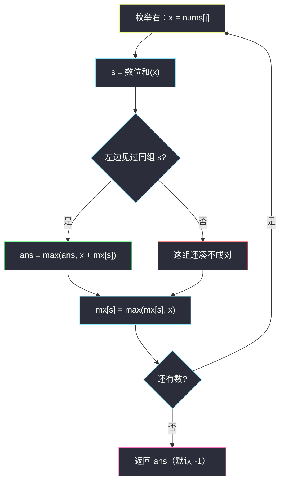
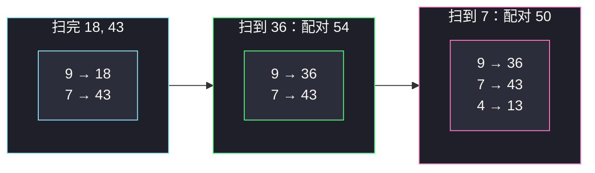

# 数位和相等数对的最大和（枚举右，维护左：每组只记最大值）

## 一、问题描述

给你一个下标从 0 开始的正整数数组 `nums`。请选出两个**不同下标** `i`、`j`，满足 `nums[i]` 与 `nums[j]` 的**数位和相等**，返回 `nums[i] + nums[j]` 的最大值。若不存在这样的数对，返回 `-1`。

数位和：把十进制各位加起来，例如 `18 → 1+8 = 9`，`43 → 4+3 = 7`。

> 🔗 LeetCode 2342：https://leetcode.cn/problems/max-sum-of-a-pair-with-equal-sum-of-digits/
>
> 数据范围：`1 <= nums.length <= 10^5`，`1 <= nums[i] <= 10^9`。
>
> 📚 本题出自灵茶题单 **§0.1 枚举右，维护左**。同节姊妹题 [#1679 K 和数对的最大数目](https://leetcode.cn/problems/max-number-of-k-sum-pairs/)（`max-number-of-k-sum-pairs.md`）也是枚举右：那边哈希表记**个数**用来配对，这边哈希表记**最大值**用来冲答案。

**示例 1**

```
输入：nums = [18,43,36,13,7]
输出：54
解释：18 与 36 数位和都是 9，和为 54；43 与 7 数位和都是 7，和为 50。最大 54。
```

**示例 2**

```
输入：nums = [10,12,19,14]
输出：-1
解释：四个数的数位和分别是 1、3、10、5，两两不同，没有合法对。
```

**示例 3**

```
输入：nums = [51,71,17,42]
输出：93
解释：51 与 42 数位和都是 6，和 93；71 与 17 数位和都是 8，和 88。最大 93。
```

**直观理解**

先按「数位和」把数字分到最多 82 个桶里（`nums[i] ≤ 10^9`，最多 10 位；最大数位和是 `999999999 → 81`）。每个桶里最大的两个数相加，再在所有桶之间取最大。不必真的把每个桶存成列表——从左到右扫，枚举右端这个数时，左边同桶只要记得「目前最大的那个」就够冲答案。

---

## 二、暴力解法

两层循环枚举所有下标对，数位和相等则更新答案：

```python
class Solution:
    def maximumSum(self, nums: List[int]) -> int:
        def digit_sum(x: int) -> int:
            s = 0
            while x:
                s += x % 10
                x //= 10
            return s

        n, ans = len(nums), -1
        for i in range(n):
            for j in range(i + 1, n):
                if digit_sum(nums[i]) == digit_sum(nums[j]):
                    ans = max(ans, nums[i] + nums[j])
        return ans
```

### 复杂度

- **时间**：`O(n² · d)`，`d` 是十进制位数（≤ 10）。`n = 10^5` 超时。
- **空间**：`O(1)`。

### 🔴 瓶颈在哪里

内层在重复问：「左边有没有数位和等于 `digit_sum(nums[j])` 的数？其中最大的是谁？」把这个问题的答案用哈希表（或长 82 的数组）记下来，内层就变成 `O(d)` 的一次查表。

---

## 三、优化探索（核心章节）

> 📚 灵茶题单 **§0.1 枚举右，维护左**。固定右端点 `j`，左边信息用哈希表维护；本题维护的不是计数、不是下标，而是**每个数位和对应的最大元素值**。

### 3.1 只关心同组最大的两个

合法对必须数位和相同。对固定数位和 `s`，该组里任选两个，和最大 ⟺ 选该组**最大的两个**。全局答案再取各组「最大两数之和」的最大者。

于是不必存整组：扫到 `x`、数位和为 `s` 时，若左边已经见过同组的最大值 `mx[s]`，则候选和是 `x + mx[s]`；然后把 `mx[s]` 更新为 `max(mx[s], x)`。

为什么先更新答案、再写表？因为一对必须是**不同下标**。若先把 `x` 写进表再查，会拿自己和自己相加。先查后写是 §0.1 的标准顺序。

### 3.2 数位和当键

`nums[i] ≤ 10^9`，最多 10 位，数位和落在 `1..81`。键域极小，哈希表或长度 82 的数组都行。主解用哈希表，和同节其它题同一张嘴。

组内有三个以上时也不用存第二大：当前 `x` 要么成为新的最大（此时与旧最大配对，正是「最大两个」），要么比历史最大小（此时与历史最大配对是它能拿到的最好结果，而最终「最大两个」会在历史最大被更新的那一步已经结算过）。所以表里**只留一个最大值**。



### 3.3 不变式

处理完 `nums[0..j]` 之后：

- `mx[s]` = `nums[0..j]` 中数位和为 `s` 的最大值（该组为空则键不存在）；
- `ans` = 仅用 `nums[0..j]` 能构成的合法对的最大和（没有则为 -1）。

右端点再往右走一步，只可能与左边同组最大值配对（比它小的同组数只会使和更小），所以看一眼 `mx[s]` 就够。

### 3.4 一句话核心

> **枚举右端数字 x，用哈希表查同数位和的历史最大值来冲 ans，再把 x 写进该组最大值——先查后写。**

---

## 四、代码实现

### Python（主解：枚举右 + 哈希表记组内最大值）

```python
class Solution:
    def maximumSum(self, nums: List[int]) -> int:
        def digit_sum(x: int) -> int:
            s = 0
            while x:
                s += x % 10
                x //= 10
            return s

        mx = {}                                 # 数位和 → 该组目前最大值
        ans = -1
        for x in nums:                          # 枚举右
            s = digit_sum(x)
            if s in mx:
                ans = max(ans, x + mx[s])       # 与左边最大者配对
            mx[s] = max(mx.get(s, 0), x)        # 再维护左
        return ans
```

`mx.get(s, 0)` 安全：`x` 是正整数，0 不会盖过真实值；键不存在时上一行也不会走进 `if`。

同一组里两个相等的数（如两个 `99`）也是合法对，和为 `198`。哈希表只记最大值，两个相同值先后到来时：第一次写入 99，第二次 `ans = 99+99`，表仍是 99。不要误判「值相同就不能配对」——约束是下标不同，不是值不同。

**变量含义**

| 变量 | 含义 |
|------|------|
| `s` | 当前数的数位和，分组键 |
| `mx[s]` | 左边同组已出现过的最大值 |
| `ans` | 全局最大对数和，初始 -1 |

数位和循环最多 10 次；不要写成字符串 `sum(map(int, str(x)))` 也行，只是多一次分配。对拍：暴力枚举所有下标对，与哈希版在随机数组上核对 `ans`。

### Java（最优解：数组下标当键）

```java
class Solution {
    public int maximumSum(int[] nums) {
        int[] mx = new int[82];                 // 数位和 0..81
        int ans = -1;
        for (int x : nums) {
            int s = 0, t = x;
            while (t > 0) { s += t % 10; t /= 10; }
            if (mx[s] > 0) ans = Math.max(ans, x + mx[s]);
            mx[s] = Math.max(mx[s], x);
        }
        return ans;
    }
}
```

---

## 五、具体例子演示

以示例 1：`nums = [18, 43, 36, 13, 7]`。逐步画出哈希表 `mx`（键是数位和）。

| 步 | x | 数位和 s | 查表 mx[s] | 更新 ans | 写表后 mx |
|----|---|----------|------------|----------|-----------|
| 1 | 18 | 9 | （无） | -1 | `{9: 18}` |
| 2 | 43 | 7 | （无） | -1 | `{9: 18, 7: 43}` |
| 3 | 36 | 9 | 18 | `max(-1, 36+18)=54` | `{9: 36, 7: 43}` |
| 4 | 13 | 4 | （无） | 54 | `{9: 36, 7: 43, 4: 13}` |
| 5 | 7 | 7 | 43 | `max(54, 7+43)=54` | `{9: 36, 7: 43, 4: 13}` |

返回 **54** ✓。注意第 3 步写表时 `36 > 18`，组 9 的最大值被换成 36——若后面再来一个数位和 9 的数，会跟 36 配对而不是跟 18。

示例 2 四个键全不同，`if s in mx` 从未成立，返回 -1。

同组三个数：`[18, 36, 27]` 数位和都是 9。扫 18 写入 18；扫 36 得 `54`、表改成 36；扫 27 得 `27+36=63`、表仍是 36。答案 63，等于最大的两个 `36+27`，中间那个 18 被正确地丢掉。

**边界速查**

| 输入 | 结果 | 原因 |
|------|------|------|
| 单元素 `[10]` | -1 | 构不成对 |
| 全不同数位和 | -1 | 每组至多 1 个 |
| `[99, 99]` | 198 | 同组两个相同值也合法（下标不同） |
| `[10, 100]` | 110 | 数位和都是 1 |



---

## 六、复杂度分析

| 方法 | 时间 | 空间 | 说明 |
|------|------|------|------|
| 双重循环 | `O(n² · d)` | `O(1)` | `n=10^5` 超时 |
| 枚举右 + 哈希表（主解） | `O(n · d)` | `O(1)` | 键不超过 82 个；`d ≤ 10` |
| 枚举右 + 长 82 数组 | `O(n · d)` | `O(1)` | 省哈希开销 |

`d` 是十进制位数，对 `10^9` 可视作常数，即 `O(n)`。

---

## 七、对比总结

| 维度 | 暴力枚举对 | 枚举右维护左 |
|------|------------|--------------|
| 同组信息 | 每次重算 | 哈希表里的最大值 |
| 一对只看最大？ | 所有对都算一遍 | 右端只跟历史最大加 |
| 先查后写 | 无此问题 | 必须：否则自己配自己 |

**易错点**

1. **先写后查**：`mx[s] = x` 再 `ans = x + mx[s]` 得到 `2x`，非法。
2. **表里存个数而不是值**：本题要的是和的最大，不是对数；1679 才存个数。
3. **只保留一个数却在组内有三个以上**：因为答案只需要最大两个，扫的过程中「历史最大 + 当前」已经覆盖了「最终最大两个」——当前若是新的最大，它会跟旧最大配对；当前若不是最大，它只可能跟历史最大配对，而历史最大在最终的「最大两个」里。
4. **数位和写成 `x % 9`**：那是数位根，`18` 与 `27` 数位根都是 9，但数位和是 9 与 9……碰巧有时对，`19`（10）与 `28`（10）对，但 `10`（1）与 `100`（1）也对；`9` 与 `18` 数位根同为 9 数位和却不同。必须用真数位和。
5. **初始 `ans = 0`**：没有合法对时应返回 `-1`。

**模板（§0.1 枚举右 · 维护组内最大值）**

```python
mx = {}
ans = -1
for x in nums:
    s = key(x)
    if s in mx:
        ans = max(ans, x + mx[s])
    mx[s] = max(mx.get(s, 0), x)
return ans
```

---

## 八、举一反三

| 题目 | 关系 |
|------|------|
| [1679. K 和数对的最大数目](https://leetcode.cn/problems/max-number-of-k-sum-pairs/) | 同批 §0.1，见 `max-number-of-k-sum-pairs.md`：哈希表从「最大值」换成「剩余个数」 |
| [1. 两数之和](https://leetcode.cn/problems/two-sum/) | 枚举右查 `k-x` 的下标，先查后写 |
| [1512. 好数对的数目](https://leetcode.cn/problems/number-of-good-pairs/) | §0.1 入门：表里记个数，答案累加 `cnt[x]` |
| [2815. 数组中的最大数对和](https://leetcode.cn/problems/max-pair-sum-in-an-array/) | 分组键改成「各位数字的最大值」，骨架一字不改 |
| [2364. 统计坏数对的数目](https://leetcode.cn/problems/count-number-of-bad-pairs/) | 枚举右，键改成 `nums[i]-i` |
| [1807. 替换字符串中的括号内容](https://leetcode.cn/problems/evaluate-the-bracket-pairs-of-a-string/) | 哈希表查值，不是枚举右，但同属「键上存一份信息」 |

**思想迁移**

- 「按某个特征分组，组内选两个最优」→ 枚举右，表里只存该组当前最优，先查后写。
- 分组键可以是数位和、最大数位、`x % k`、`nums[i]-i`……骨架不变。
- 要「最大和」就存最大值；要「配对数」就存个数（见 1679）——表里放什么由问题决定，枚举顺序不变。
- 口诀：**「枚举右边这个数，拿它跟同组历史最大相加；先更新答案，再比谁更大进表。」**
