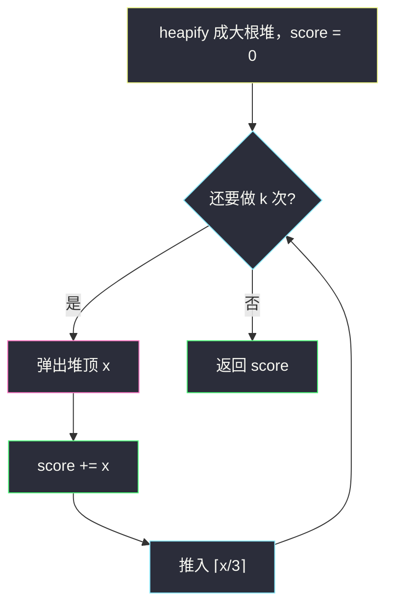
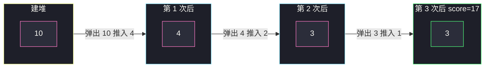

# 执行 K 次操作后的最大分数（大根堆）

## 一、问题描述

给你下标从 0 开始的整数数组 `nums` 和整数 `k`。初始分数为 0。必须**恰好**做 `k` 次操作，每次：

1. 选一个下标 `i`；
2. 把 `nums[i]` **加进分数**；
3. 把 `nums[i]` 替换成 `⌈nums[i] / 3⌉`（上取整）。

同一位置可以反复选。返回这 `k` 次操作能得到的**最大**分数。

> 🔗 LeetCode 2530：https://leetcode.cn/problems/maximal-score-after-applying-k-operations/
>
> 数据范围：`1 <= nums.length, k <= 10^5`，`1 <= nums[i] <= 10^9`。

**示例 1**

```
输入：nums = [10,10,10,10,10], k = 5
输出：50
解释：五个 10 各用一次，分数 10+10+10+10+10=50。
```

**示例 2**

```
输入：nums = [1,10,3,3,3], k = 3
输出：17
解释：
  选 10 → 分数 10，该位置变成 ⌈10/3⌉=4
  再选 4 → 分数 14，变成 ⌈4/3⌉=2
  再选任意一个 3 → 分数 17
```

**直观理解**

每次加进分数的是「当前数组里的某个值」。要总和最大，每一次都应该选**当前最大的那个数**——贪心成立：大的先吃，缩小成 `⌈x/3⌉` 再跟别人比。用大根堆反复「取堆顶、加分、把缩小后的值推回去」。

---

## 二、暴力解法

每次扫描数组找最大值。

```python
class Solution:
    def maxKelements(self, nums: List[int], k: int) -> int:
        ans = 0
        for _ in range(k):
            i = max(range(len(nums)), key=lambda j: nums[j])
            ans += nums[i]
            nums[i] = (nums[i] + 2) // 3
        return ans
```

`⌈x/3⌉` 用整数写法 `(x + 2) // 3`：`x=10 → 4`，`x=9 → 3`，`x=8 → 3`。不要写 `math.ceil(x / 3)` 当教学默认——大整数用浮除有精度风险，整数除法更稳。

### 复杂度

- **时间**：`O(k · n)`。`k` 和 `n` 都达 `10^5`，`10^10` 不可接受。
- **空间**：`O(1)` 额外。

### 🔴 瓶颈在哪里

找最大是瓶颈。堆把「取最大 + 插入新值」降到 `O(log n)`。必须做到 `O(k log n)`（外加一次 `heapify` 的 `O(n)`）。

---

## 三、优化探索（核心章节）

> 📚 本题在灵茶题单中属于 **堆 · §5.1 基础**：heapify 建堆，然后反复取最值、修改、推回。

### 3.1 贪心

第 `t` 次操作加入的值是当时数组的最大值。若某次故意选次大，分数立刻少一块，而选大的之后那个位置变成约 `x/3`，以后仍可再选——把大的留到以后，它还是那么大，不会变大，先拿更优。

### 3.2 大根堆模拟

Python `heapq` 是小根堆，存 **`-x`** 模拟大根堆。

循环 `k` 次：

1. `x = -heappop(h)` —— 当前最大；
2. `ans += x`；
3. `heappush(h, -⌈x/3⌉)`。



### 3.3 上取整公式

```
⌈x / 3⌉ = (x + 2) // 3
```

正整数时：`x = 3q` → `q`；`x = 3q+1` → `q+1`；`x = 3q+2` → `q+1`。与 `(x+2)//3` 一致。

### 3.4 分数用宽整数

每次最多加 `10^9`，`k` 次最多 `10^14`。Python `int` 无上限；Java 必须用 `long` 累加。

### 3.5 一句话核心

> **每次选当前最大加入分数，再把该数变成 ⌈x/3⌉ 放回；大根堆（Python 取负）循环 k 次。**

---

## 四、代码实现

### Python（主解）

```python
class Solution:
    def maxKelements(self, nums: List[int], k: int) -> int:
        h = [-x for x in nums]
        heapq.heapify(h)                 # O(n) 建堆，不要循环 heappush
        ans = 0
        for _ in range(k):
            x = -heapq.heappop(h)
            ans += x
            heapq.heappush(h, -((x + 2) // 3))
        return ans
```

**变量含义**

| 变量 | 含义 |
|------|------|
| `h` | 元素取负后的小根堆，堆顶对应原数组最大值 |
| `x` | 本轮选中的正数 |
| `ans` | 累计分数 |

`heapify` 是 §5.1 的基本功：`n` 次 `heappush` 是 `O(n log n)`，一次 `heapify` 是 `O(n)`。

### Java（最优解同款）

```java
class Solution {
    public long maxKelements(int[] nums, int k) {
        PriorityQueue<Integer> pq = new PriorityQueue<>(Comparator.reverseOrder());
        for (int x : nums) pq.offer(x);
        long ans = 0;
        while (k-- > 0) {
            int x = pq.poll();
            ans += x;
            pq.offer((x + 2) / 3);
        }
        return ans;
    }
}
```

不要写比较器 `(a, b) -> b - a`：本题值非负，减法刚好不溢出，但换题就容易炸，用 `reverseOrder()` 或 `Integer.compare(b, a)`。

---

## 五、具体例子演示

堆内容按**逻辑从大到小**列出（堆顶 = 最左）。Python 内部是负数，表里写正数方便读。

### 5.1 `nums = [1, 10, 3, 3, 3]`，`k = 3`

| 步 | 动作 | 堆顶 | 弹出 | 推入 | 堆（逻辑） | score |
|----|------|------|------|------|------------|-------|
| 建堆 | heapify | 10 | — | — | `[10, 3, 3, 3, 1]` | 0 |
| 1 | 选最大 | 10 | 10 | ⌈10/3⌉=4 | `[4, 3, 3, 3, 1]` | 10 |
| 2 | 选最大 | 4 | 4 | ⌈4/3⌉=2 | `[3, 3, 3, 2, 1]` | 14 |
| 3 | 选最大 | 3 | 3 | ⌈3/3⌉=1 | `[3, 3, 2, 1, 1]` | **17** |

对应题面：先打 10 再打变成的 4，再打一个 3。

Python 真实堆（负数）每步大致为：`[-10,-3,-3,-3,-1]` → 弹 10 推 -4 → `[-4,-3,-1,-3,-3]` → 弹 4 推 -2 → `[-3,-3,-1,-3,-2]` → 弹 3 推 -1。



### 5.2 `nums = [10, 10, 10, 10, 10]`，`k = 5`

| 步 | 弹出 | 推入 | 堆（逻辑） | score |
|----|------|------|------|------------|-------|
| 1 | 10 | 4 | `[10,10,10,10,4]` | 10 |
| 2 | 10 | 4 | `[10,10,10,4,4]` | 20 |
| 3 | 10 | 4 | `[10,10,4,4,4]` | 30 |
| 4 | 10 | 4 | `[10,4,4,4,4]` | 40 |
| 5 | 10 | 4 | `[4,4,4,4,4]` | **50** |

五个 10 都比任何 4 大，所以最优就是五个原值各吃一次。

### 5.3 单元素 `nums = [5]`，`k = 2`

堆 `[5]` → 弹 5 推 ⌈5/3⌉=2，score=5，堆 `[2]` → 弹 2 推 1，score=**7**。

---

## 六、复杂度分析

| 方法 | 时间 | 空间 | 说明 |
|------|------|------|------|
| 每次扫 max | `O(k n)` | `O(1)` | n、k 均为 1e5，超时 |
| 大根堆（主解） | `O(n + k log n)` | `O(n)` | heapify `O(n)`，k 次弹/推 `O(log n)` |

这是本题必须达到的复杂度。分数累加 `O(1)`。

---

## 七、对比总结

| 维度 | 扫描最大值 | 堆 |
|------|------------|-----|
| 取最大 | `O(n)` | `O(log n)` |
| 改完放回 | 原地改一格 | `heappush` |
| 建初始结构 | 无 | `heapify` `O(n)` |

**易错点**

1. **Python 忘了取负**：`heapq` 弹出的是最小值，分数会变成最小而不是最大。
2. **`⌈x/3⌉` 写成 `x//3`**：`10//3=3` 少加，答案偏小。
3. **Java `int` 累加分数**：`k · 10^9` 溢出，用 `long`。
4. **循环 `heappush` 建堆**：能过但慢一截，面试应写 `heapify`。
5. **`k` 次操作理解成最多 k 次**：题面是恰好 k 次，即使堆顶已经很小也要继续加。

**模板（§5.1 反复取最大并改回）**

```python
h = [-x for x in nums]
heapq.heapify(h)
for _ in range(k):
    x = -heapq.heappop(h)
    # 使用 x
    heapq.heappush(h, -((x + 2) // 3))
```

对称的「反复取最小再合并」见 `minimum-operations-to-exceed-threshold-value-ii.md`。

---

## 八、举一反三

| 题目 | 关系 |
|------|------|
| [3066. 超过阈值的最少操作数 II](https://leetcode.cn/problems/minimum-operations-to-exceed-threshold-value-ii/) | 同目录 `minimum-operations-to-exceed-threshold-value-ii.md`：小根堆弹两个、推回一个 |
| [1962. 移除石子使总数最小](https://leetcode.cn/problems/remove-stones-to-minimize-the-total/) | 每次把最大堆减半，同样大根堆 k 次 |
| [2208. 将数组和减半的最少操作次数](https://leetcode.cn/problems/minimum-operations-to-halve-array-sum/) | 大根堆，直到和减半 |
| [2558. 从数量最多的堆取走礼物](https://leetcode.cn/problems/take-gifts-from-the-richest-pile/) | 最大换成 `⌊√x⌋` |
| [2233. K 次增加后的最大乘积](https://leetcode.cn/problems/maximum-product-after-k-increments/) | 小根堆每次 +1，对偶贪心 |
| [2336. 无限集中的最小数字](https://leetcode.cn/problems/smallest-number-in-infinite-set/) | 同目录 `smallest-number-in-infinite-set.md`：§5.1 设计题 |

**思想迁移**

- 「每次改当前最大 / 最小」→ 堆；Python 大根堆 = 存负数。
- 口诀：**「要最大分就每次啃堆顶；加完变成 ⌈x/3⌉ 再扔回去。」**
