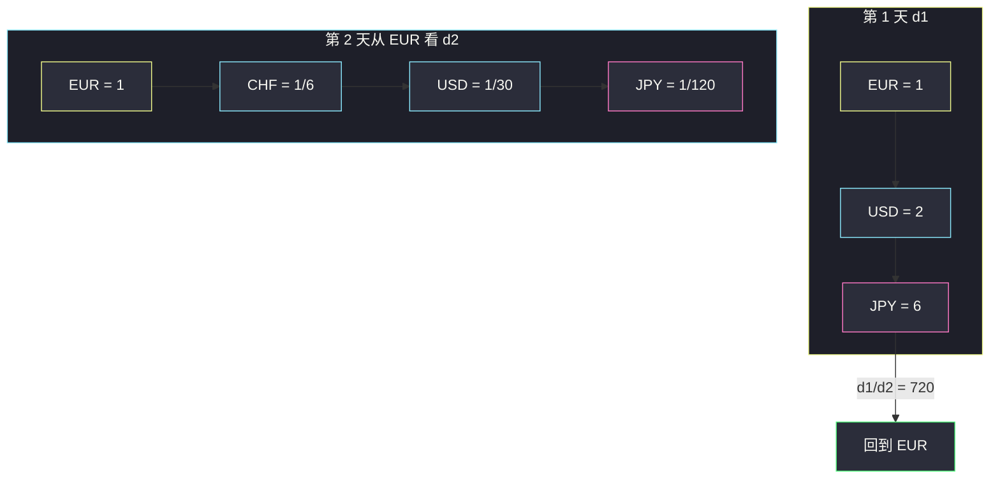
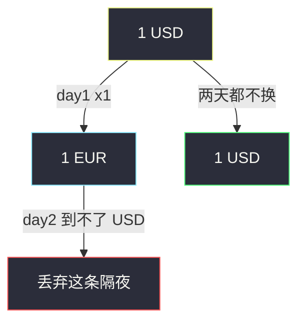

# 两天自由外汇交易后的最大货币数（汇率乘积 DFS）

## 一、问题描述

一开始持有 `1.0` 单位的 `initialCurrency`。`pairs1/rates1` 是第 1 天的兑换（`A → B` 汇率 `r`，同时 `B → A` 为 `1/r`）；`pairs2/rates2` 是第 2 天，规则相同、**图独立**。每天可兑换任意次（含 0 次）。两天结束后，最大化手里的 **`initialCurrency`** 数量。

保证每天汇率无矛盾、无套利环；答案最大 `5e10`。

> 🔗 LeetCode 3387：https://leetcode.cn/problems/maximize-amount-after-two-days-of-conversions/
>
> 数据范围：每天最多 10 对，货币名长度 `≤ 3`。
>
> 📚 灵茶题单：**图论 · §1.1 DFS**（1788 分）。

**示例 1**

```
输入：initialCurrency = "EUR"
pairs1 = [["EUR","USD"],["USD","JPY"]], rates1 = [2.0, 3.0]
pairs2 = [["JPY","USD"],["USD","CHF"],["CHF","EUR"]], rates2 = [4.0, 5.0, 6.0]
输出：720.00000
第 1 天：EUR → USD → JPY，1 EUR 变成 6 JPY。
第 2 天：JPY → USD → CHF → EUR，6 JPY 变成 720 EUR。
```

**示例 2**

```
输入：initialCurrency = "NGN"
pairs1 = [["NGN","EUR"]], rates1 = [9.0]
pairs2 = [["NGN","EUR"]], rates2 = [6.0]
输出：1.50000
第 1 天换成 9 EUR；第 2 天按 1/6 换回，9/6 = 1.5 NGN。
```

**示例 3**

```
输入：initialCurrency = "USD"
pairs1 = [["USD","EUR"]], rates1 = [1.0]
pairs2 = [["EUR","JPY"]], rates2 = [10.0]
输出：1.00000
第 2 天 USD 不在图里，EUR 换不回 USD。两天都不换，答案 1。
```

**直观理解**

货币是点，汇率是边权（走边就**乘**）。第 1 天把本币换成某种中间货币 `c`，第 2 天再从 `c` 换回本币。选一个 `c`，使「去程乘积 × 回程乘积」最大。

---

## 二、暴力解法

每天边极少，理论上可枚举第 1 天所有可达货币，再从该货币在第 2 天图上 DFS 回 `initial`。点不到 20，暴力也过。写成「对每个中间货币做一次 Day2 DFS」重复走同一张图。

```python
# 伪代码：对 Day1 每个可达 c，从 c 在 Day2 图 DFS 乘回 initial
# 正确，但 Day2 被调用了 |C| 次
```

### 复杂度

- **时间**：点数 `k ≤ 21`，`O(k²)` 可过，常数难看。
- **空间**：邻接表 `O(k)`。

### 🔴 瓶颈在哪里

Day2 图固定。从本币出发算一遍「1 本币能换成多少 `c`」，回程倍率就是倒数——只 DFS 两次。

---

## 三、优化探索（核心章节）

> 📚 本题在灵茶题单中属于 **§1.1 DFS**。货币当点、汇率当乘性边权；无套利所以路径乘积唯一，visit 一次即可。

### 3.1 建双向图

对每对 `(A,B,r)` 加边 `A → B` 权 `r`，`B → A` 权 `1/r`。两天两张图，不要混边。

### 3.2 两次 DFS

`d1[c]`：第 1 天从 `1.0` 本币出发，能得到的 `c` 的数量。  
`d2[c]`：第 2 天从 `1.0` 本币出发，能得到的 `c` 的数量。

无套利 + 双向 ⇒ 第 2 天把 `1.0` 单位 `c` 换回本币的倍率是 `1 / d2[c]`。

于是若第 1 天换成 `d1[c]` 单位 `c`，第 2 天换回本币：

`d1[c] * (1 / d2[c]) = d1[c] / d2[c]`

只对**两天都能从本币到达**的 `c` 取 max（含 `c = initial`，比值恒为 1）。Day2 到不了的货币换不回来，直接跳过——这就是示例 3。



JPY：`6 / (1/120) = 720`。USD：`2 / (1/30) = 60`。本币：`1`。取 720。

### 3.3 为什么不用最短路

边权是乘数且保证无矛盾，任意简单路径乘积相同，DFS/BFS 标记访问即可，不必 Dijkstra。

### 3.4 一句话核心

> **Day1、Day2 各从本币 DFS 一遍；答案是同时可达货币上 `d1[c] / d2[c]` 的最大值。**

---

## 四、代码实现

### Python（主解：两次 DFS）

```python
from collections import defaultdict

class Solution:
    def maxAmount(
        self,
        initialCurrency: str,
        pairs1: list[list[str]],
        rates1: list[float],
        pairs2: list[list[str]],
        rates2: list[float],
    ) -> float:
        def build(pairs, rates):
            g = defaultdict(list)
            for (a, b), r in zip(pairs, rates):
                g[a].append((b, r))
                g[b].append((a, 1.0 / r))
            return g

        def dfs(g, start):
            amt = {}

            def go(u, val):
                amt[u] = val
                for v, r in g[u]:
                    if v not in amt:
                        go(v, val * r)

            go(start, 1.0)
            return amt

        d1 = dfs(build(pairs1, rates1), initialCurrency)
        d2 = dfs(build(pairs2, rates2), initialCurrency)
        ans = 0.0
        for c, a in d1.items():
            if c in d2:
                ans = max(ans, a / d2[c])
        return ans
```

**变量含义**

| 变量 | 含义 |
|------|------|
| `g[u]` | `(v, rate)`：持有 1 单位 `u` 可换成 `rate` 单位 `v` |
| `amt[c]` | 从 1.0 起点货币出发能得到的 `c` 数量 |
| `d1 / d2` | 两天各自的 `amt` |

`defaultdict` 让本币不出现在任何 pair 时仍能 `go(start, 1.0)`，得到「什么都不换」。

对拍三个官方样例（相对误差）均为精确值 `720`、`1.5`、`1`。

### Java（可选）

```java
class Solution {
    public double maxAmount(String initial, List<List<String>> pairs1,
            double[] rates1, List<List<String>> pairs2, double[] rates2) {
        Map<String, Double> d1 = reach(pairs1, rates1, initial);
        Map<String, Double> d2 = reach(pairs2, rates2, initial);
        double ans = 0;
        for (String c : d1.keySet()) {
            if (d2.containsKey(c)) ans = Math.max(ans, d1.get(c) / d2.get(c));
        }
        return ans;
    }

    Map<String, Double> reach(List<List<String>> pairs, double[] rates, String start) {
        Map<String, List<AbstractMap.SimpleEntry<String, Double>>> g = new HashMap<>();
        for (int i = 0; i < pairs.size(); i++) {
            String a = pairs.get(i).get(0), b = pairs.get(i).get(1);
            g.computeIfAbsent(a, k -> new ArrayList<>())
                    .add(new AbstractMap.SimpleEntry<>(b, rates[i]));
            g.computeIfAbsent(b, k -> new ArrayList<>())
                    .add(new AbstractMap.SimpleEntry<>(a, 1.0 / rates[i]));
        }
        Map<String, Double> amt = new HashMap<>();
        go(start, 1.0, g, amt);
        return amt;
    }

    void go(String u, double val,
            Map<String, List<AbstractMap.SimpleEntry<String, Double>>> g,
            Map<String, Double> amt) {
        amt.put(u, val);
        for (var e : g.getOrDefault(u, List.of())) {
            if (!amt.containsKey(e.getKey())) go(e.getKey(), val * e.getValue(), g, amt);
        }
    }
}
```

---

## 五、具体例子演示

### 示例 1：两天路径

Day1 边：EUR—USD `×2`，USD—JPY `×3`。

| 点 | 到达乘积 d1 |
|----|-------------|
| EUR | 1 |
| USD | 2 |
| JPY | 6 |

Day2 边：JPY→USD `×4`，USD→CHF `×5`，CHF→EUR `×6`。从 EUR 反着走：

| 点 | d2（1 EUR 能换到多少） |
|----|------------------------|
| EUR | 1 |
| CHF | `1/6` |
| USD | `1/30` |
| JPY | `1/120` |

比值：EUR `1`，USD `60`，JPY `720`。选 JPY 当隔夜货币。

逐步持仓：`1 EUR → 2 USD → 6 JPY`（day1 结束）→ `24 USD → 120 CHF → 720 EUR`。

### 示例 2

`d1[EUR]=9`，`d2[EUR]=6`，`9/6=1.5`。本币比值 1，取 1.5。

### 示例 3（换不回来）

Day2 只有 EUR—JPY，从 USD 出发 `d2` 只有 USD 自己。`d1` 里的 EUR 不在 `d2` 中，跳过。答案 1。



---

## 六、复杂度分析

| 方法 | 时间 | 空间 | 说明 |
|------|------|------|------|
| 每个中间货币做 Day2 DFS | `O(k²)` | `O(k)` | k 为货币种数 |
| 两次 DFS（主解） | `O(k)` | `O(k)` | 每张图每个点进一次 |

`k ≤ 1 + 2×10`，常数可忽略。答案用浮点，题目保证无矛盾，不必担心环上无限放大。

---

## 七、对比总结

| 维度 | 从中间货币回本币 | 两次正向 DFS |
|------|------------------|--------------|
| DFS 次数 | `1 + \|C\|` | 2 |
| 公式 | 回程乘积直接乘 | `d1[c] / d2[c]` |
| 默写 | 稍长 | 建图函数复用 |

**易错点**

1. **忘了反向边 `1/r`**：只加题面给出的方向，Day2 走不回去。
2. **两天共用一张图**：汇率相互独立，必须建两份邻接表。
3. **用 `d2[c]` 当回程却去乘而不是除**：回程是 `1/d2[c]`。
4. **中间货币 Day2 不可达仍参与 max**：会除到缺失键，应跳过。
5. **本币不在 pairs 里没放进 amt**：`go(start,1.0)` 必须先写起点。
6. 把加法最短路套过来：这里是**乘积**，不是边权和。

---

## 八、举一反三

| 题目 | 关系 |
|------|------|
| [399. 除法求值](https://leetcode.cn/problems/evaluate-division/) | 同样「变量当点、比值当边」，查询一条路径乘积 |
| [743. 网络延迟时间](https://leetcode.cn/problems/network-delay-time/) | 边权改成加法，用 Dijkstra |
| [1514. 概率最大的路径](https://leetcode.cn/problems/path-with-maximum-probability/) | 乘性边权求最大，无环保证时可 DFS |
| [787. K 站中转内最便宜的航班](https://leetcode.cn/problems/cheapest-flights-within-k-stops/) | 限制边数的最短路 |

数字当点的 BFS 见同目录 [打开转盘锁](open-the-lock.md)。染色约束见 [判断二分图](is-graph-bipartite.md)。

**思想迁移**

- 汇率、概率、比例：边权用乘法；无套利 ⇒ 连通块内比值唯一。
- 口诀：**「两天两张图，本币各 DFS 一遍；隔夜货币取 `d1/d2` 最大。」**
