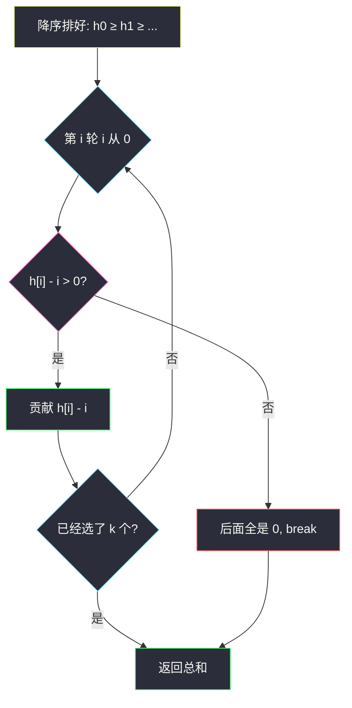
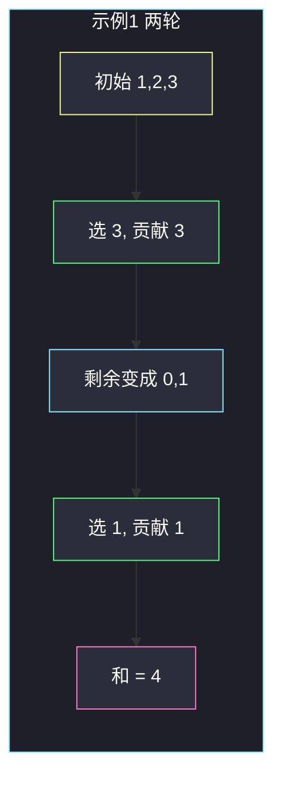

# 幸福值最大化的选择方案（从最大开始贪心）

## 一、问题描述

给你长度为 `n` 的数组 `happiness` 和正整数 `k`。`n` 个孩子，第 `i` 个孩子的幸福值是 `happiness[i]`。你要组织 **恰好 `k` 轮** 挑选：

- 每一轮选 **一个尚未被选中** 的孩子，把他**当前**的幸福值加进答案。
- 选完这一轮后，所有**还没被选中**的孩子幸福值减 `1`；幸福值不能变成负数，已经是 `0` 的就停在 `0`。

返回这 `k` 个被选中孩子贡献之和的最大值。

> 🔗 LeetCode 3075：https://leetcode.cn/problems/maximize-happiness-of-selected-children/
>
> 数据范围：`1 ≤ n ≤ 2×10^5`，`1 ≤ happiness[i] ≤ 10^8`，`1 ≤ k ≤ n`。答案可能超过 `2^31−1`（Python 无忧；Java 必须用 `long`）。
>
> 📚 灵茶题单：**§1.1 从最小/最大开始贪心**（1326 分）。

**示例 1**

```
输入：happiness = [1,2,3], k = 2
输出：4
解释：选 3，剩余孩子变成 [0,1]；再选 1。和 = 3+1 = 4。
注意：有的转载把和写成 5，那是错的——第二轮选到的是衰减后的 1，不是原始的 2。
```

**示例 2**

```
输入：happiness = [1,1,1,1], k = 2
输出：1
解释：先选任意一个 1；其余三个都变成 0。第二轮只能贡献 0。和 = 1。
```

**示例 3**

```
输入：happiness = [2,3,4,5], k = 1
输出：5
解释：只选一轮，直接拿当前最大的 5。
```

**直观理解**

每选一个人，剩下的人全体「掉 1 点心情」。相对大小关系不变：原来更大的，掉完 1 点仍然更大。所以每一轮都该拿**当前还剩的最大那个**。选完 `k` 个之后，第 `i` 个被选的人（`i` 从 0 计）贡献的就是 `max(原值 − i, 0)`。

---

## 二、暴力解法

`k` 轮，每轮在未选集合里枚举选谁，搜索所有排列。选完立刻给剩余的人减 1。

```python
class Solution:
    def maximumHappinessSum(self, happiness: list[int], k: int) -> int:
        n = len(happiness)
        used = [False] * n
        best = 0

        def dfs(round_id: int, acc: int) -> None:
            nonlocal best
            if round_id == k:
                best = max(best, acc)
                return
            for i in range(n):
                if used[i]:
                    continue
                used[i] = True
                gain = max(happiness[i] - round_id, 0)
                dfs(round_id + 1, acc + gain)
                used[i] = False

        dfs(0, 0)
        return best
```

这里用了一个观察：一个人若在第 `round_id` 轮才被选（前面已经选了 `round_id` 个人），他已经被减了 `round_id` 次，贡献就是 `max(原值 − round_id, 0)`。暴力仍然要枚举「选谁、按什么顺序选」，`n! / (n−k)!` 种排列，`n` 到 `2×10^5` 完全不可用。

### 🔴 瓶颈在哪里

排列搜索重复计算了大量「先小后大」的劣质顺序。一旦承认「每一轮都应拿当前最大」，搜索空间直接塌缩成：**把数组排好序，只看最大的 `k` 个**。

---

## 三、优化探索（核心章节）

> 📚 本题在灵茶题单中属于 **§1.1 从最小/最大开始贪心**：要让「被减掉的部分」尽量落在本来就小的人身上，所以从**最大**开始拿。

### 3.1 相对顺序不变，所以永远选当前最大

选一个人之后，剩下的人全体减 1（到 0 为止）。对任意两个还没被选的孩子 `a`、`b`，若减之前 `a ≥ b`，减完仍然 `a' ≥ b'`。全体平移 1 不改变名次。

因此每一轮的局部最优就是：在剩余集合里拿最大的那个。这个局部决策一路做下去，选出的就是原数组里最大的 `k` 个数，并且是按从大到小的顺序拿的。



### 3.2 交换论证：先拿小的会亏

假设某一步剩余里最大的是 `A`，你却拿了更小的 `B`。

- 现在拿 `B`，贡献 `B`；下一轮 `A` 变成 `A−1`，再贡献 `A−1`。两轮和 = `A+B−1`。
- 若先拿 `A` 再拿 `B`：贡献 `A` 再贡献 `max(B−1, 0)`。两轮和 ≥ `A+B−1`（`B≥1` 时相等；`B=0` 时贪心更好，因为 `A` 不会被无意义地再减）。

更关键的是**人选集合**：如果你把一个进不了「前 `k` 大」的人换进来，等于拿一个更小的原值去承受同样的衰减 `0, 1, …, k−1`，总和不会更大。

所以最优集合 = 最大的 `k` 个数；最优顺序 = 从大到小。

### 3.3 贡献公式

降序排列后，第 `i` 个被选的人（`i = 0, 1, …, k−1`）贡献

```
max(happiness[i] - i, 0)
```

直观：他前面已经走了 `i` 轮，自己被减了 `i` 次。因为数组已经降序，一旦某个 `happiness[i] − i ≤ 0`，后面的人原值更小、衰减更多，贡献全是 0，可以提前 `break`。

若不考虑「不能为负」，`k` 个人的总和是「前 `k` 大之和 − `(0+1+…+k−1)`」。地板函数只是把减过头的部分截成 0，不改变「拿最大的 `k` 个」这个结论。

### 3.4 一句话核心

> **降序排序，第 `i` 个（从 0 计）贡献 `max(h[i]−i, 0)`；减到 0 就停。**

---

## 四、代码实现

### Python（主解：降序 + 线性扫 `k` 个）

```python
class Solution:
    def maximumHappinessSum(self, happiness: list[int], k: int) -> int:
        happiness.sort(reverse=True)
        ans = 0
        for i in range(k):
            v = happiness[i] - i
            if v <= 0:
                break
            ans += v
        return ans
```

**变量含义**

| 写法 | 含义 |
|------|------|
| `happiness.sort(reverse=True)` | 从大到小，保证每轮拿的都是当时剩余里的最大 |
| `i` | 已经选过几个人 = 当前这个人被减了几次 |
| `v = happiness[i] - i` | 本轮实际贡献（未截断） |
| `v <= 0` 就 `break` | 后面只会更小，不必再加 0 |

### Java（注意用 `long`）

```java
class Solution {
    public long maximumHappinessSum(int[] happiness, int k) {
        Arrays.sort(happiness);
        long ans = 0;
        int n = happiness.length;
        for (int i = 0; i < k; i++) {
            long v = (long) happiness[n - 1 - i] - i;
            if (v <= 0) {
                break;
            }
            ans += v;
        }
        return ans;
    }
}
```

Java 的 `Arrays.sort` 只能升序，所以从右往左取最大的 `k` 个。`happiness[i]` 最大 `10^8`、`n` 最大 `2×10^5`，`k` 个贡献之和能到约 `2×10^13`，必须 `long`。

---

## 五、具体例子演示

**示例 1**：`happiness = [1,2,3]`，`k = 2`。降序 `[3,2,1]`。

| 轮 `i` | 选谁（原值） | 衰减 | 本轮贡献 | 选完后剩余幸福值 | 累计 |
|--------|--------------|------|----------|------------------|------|
| 0 | 3 | 0 | `max(3−0,0)=3` | `[1−1, 2−1] → [0,1]` | 3 |
| 1 | 原值 2 的那个 | 1 | `max(2−1,0)=1` | 只剩 0 | 4 |

公式直接算：`3 + max(2−1, 0) = 4`。网上把第二轮当成「还是 2」会得到错误的 5。



**反例：先拿小的会亏。** `happiness = [5,4,3]`，`k = 2`。

| 策略 | 第 0 轮 | 第 1 轮 | 和 |
|------|---------|---------|-----|
| 贪心：先 5 再 4 | 5 | `4−1=3` | **8** |
| 先 4 再 5 | 4 | `5−1=4` | 8（人选对了，只是顺序不同；无地板时一样） |
| 先 3 再 5（人选错） | 3 | `5−1=4` | **7** 更差 |

人选集合错了才会少；顺序在「不撞到 0」时只是把衰减 `0+1` 固定扣在两个人头上。

**示例 2**：`[1,1,1,1]`，`k = 2`。降序不变。

| 轮 `i` | 贡献 `max(1−i, 0)` | 累计 |
|--------|---------------------|------|
| 0 | 1 | 1 |
| 1 | 0 | 1 |

第二轮贡献已经是 0，若 `k` 更大也可以直接 `break`。

**示例 3**：`[2,3,4,5]`，`k = 1`。只做第 0 轮，贡献 `5−0=5`。

---

## 六、复杂度分析

| 方法 | 时间 | 空间 | 说明 |
|------|------|------|------|
| 枚举排列 | `O(P(n,k))` | `O(n)` 递归栈 | `n=2×10^5` 不可用 |
| 降序贪心（主解） | `O(n log n)` | `O(1)` 额外（不计排序） | 排序主导；扫最多 `k` 个 |

`n` 到 `2×10^5`，`O(n log n)` 能过。不必堆：只拿前 `k` 大且要按从大到小的顺序扣衰减，排一次序最干净。

---

## 七、对比总结

| 维度 | 本题 | 同节「从最小开始」 |
|------|------|-------------------|
| 贪心方向 | 每轮拿**当前最大** | 每轮拿当前最小（如 [摧毁小行星](https://leetcode.cn/problems/destroying-asteroids/)） |
| 为什么成立 | 全体减 1 不改相对名次 | 先吃掉最容易处理的，给后面攒资本 |
| 公式 | `max(h[i]−i, 0)` 求和 | 按序累加直到失败 |

**易错点**

1. **第二轮仍用原值**：示例 1 选完 3 之后，2 已经变成 1。贡献不是 `3+2`。
2. **Java 用 `int` 累加**：和能超过 `2^31−1`，返回值是 `long`。
3. **忘了截成 0**：`happiness[i]−i` 可能为负，题意规定幸福值不为负。
4. **升序排完却从左边取**：从最大开始，要从右往左或 `reverse=True`。
5. **把 `k` 理解成「最多 k 轮」**：题意是恰好组织 `k` 轮；贡献掉到 0 也要占轮次（加 0），只是提前 `break` 不影响答案。

---

## 八、举一反三

| 题目 | 关系 |
|------|------|
| [2126. 摧毁小行星](https://leetcode.cn/problems/destroying-asteroids/) | 同节 §1.1：本题从**最大**拿，那题从**最小**撞 |
| [2554. 从一个范围内选择最多整数 I](https://leetcode.cn/problems/maximum-number-of-integers-to-choose-from-a-range-i/) | 同节：要个数最多，从**最小**可用数开始攒 |
| [2587. 重排数组以得到最大前缀分数](https://leetcode.cn/problems/rearrange-array-to-maximize-prefix-score/) | 同节：降序把大正数放前面，让前缀尽量久地为正 |
| [1403. 非递增顺序的最小子序列](https://leetcode.cn/problems/minimum-subsequence-in-non-increasing-order/) | 从大到小拿，直到和超过剩下的 |
| [2099. 找到和最大的长度为 K 的子序列](https://leetcode.cn/problems/find-subsequence-of-length-k-with-the-largest-sum/) | 也是「最大的 k 个」，但不涉及衰减 |

**思想迁移**

- 操作是「全体平移」时，名次不变 → 每轮局部取最值就是全局最值。
- 口诀：**「降序排，第 i 个减 i，减穿了就停。」**
