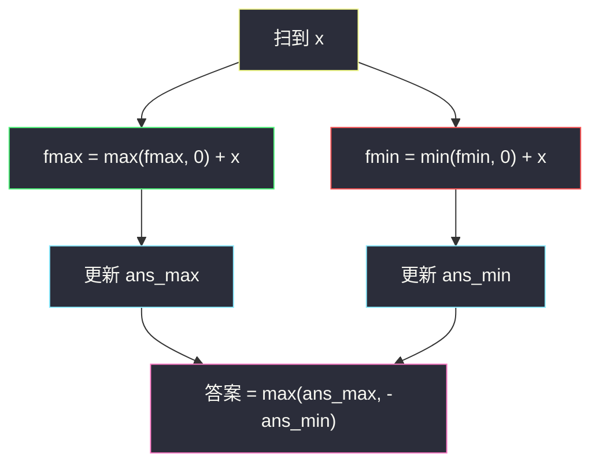
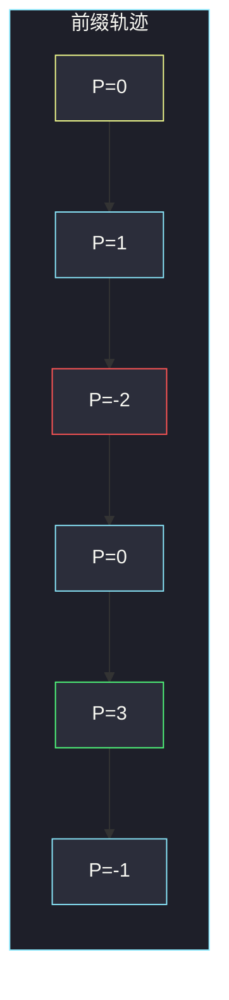

# 任意子数组和的绝对值的最大值（Kadane 最大 / 最小子段和）

## 一、问题描述

给你整数数组 `nums`，求任意连续子数组之和的**绝对值**的最大值。空子数组的和定义为 0，因此答案至少是 0。

> 🔗 LeetCode 1749：https://leetcode.cn/problems/maximum-absolute-sum-of-any-subarray/
>
> 数据范围：`1 ≤ n ≤ 10^5`，`|nums[i]| ≤ 10^4`。
>
> 📚 灵茶题单：**§1.3 最大子数组和（最大子段和）**。绝对值把「冲得最高的正段」和「跌得最深的负段」都变成候选；不能只跑一遍最大子段再取 abs。

**示例 1**

```
输入：nums = [1,-3,2,3,-4]
输出：5
解释：子数组 [2,3] 的和为 5，绝对值最大。
```

**示例 2**

```
输入：nums = [2,-5,1,-4,3,-2]
输出：8
解释：子数组 [-5,1,-4] 的和为 -8，绝对值为 8。
```

**直观理解**

`|子段和|` 大，只有两种来源：这段和本身很大（正），或本身很小（负）。所以答案 = `max(最大子段和, -最小子段和)`。空段把下界托在 0。`n=10^5`，必须线性。

---

## 二、暴力解法

枚举左右端点，滚动求和。

```python
class Solution:
    def maxAbsoluteSum(self, nums: list[int]) -> int:
        n = len(nums)
        ans = 0
        for i in range(n):
            s = 0
            for j in range(i, n):
                s += nums[j]
                ans = max(ans, abs(s))
        return ans
```

官方两例都能过。时间 `O(n²)`，`n=10^5` 超时。

### 🔴 瓶颈在哪里

每个右端点对应的「最大前缀 / 最小前缀」被重复扫描。Kadane 用一个变量记住「接到这里的最优正段 / 负段」；前缀和则把任意子段变成 `P[j]-P[i]`，绝对值最大就是 `maxP - minP`。

---

## 三、优化探索（核心章节）

> 📚 本题在灵茶题单中属于 **§1.3 最大子数组和（最大子段和）**。最大段模板 `f = max(f, 0) + x`；最小段对称 `f = min(f, 0) + x`。答案取两者绝对值的较大者。

### 3.1 为什么不能「先 Kadane 再 abs」

只算最大子段，例 2 得到 `3`（单独的 `3`），`abs(3)=3`，漏掉和为 `-8` 的那段。负得深的段在绝对值意义下同样优秀。必须**同时**维护最大子段和、最小子段和。

### 3.2 双 Kadane

以当前下标结尾：

- 最大子段：前面已经 `≤ 0` 就丢掉，`fmax = max(fmax, 0) + x`；
- 最小子段：前面已经 `≥ 0` 就丢掉，`fmin = min(fmin, 0) + x`。

全程 `ans_max = max(ans_max, fmax)`，`ans_min = min(ans_min, fmin)`。空段合法，两者初值都是 0。答案 `max(ans_max, -ans_min)`。



绿是「冲高」，红是「探底」。最后比谁的绝对值更大。

### 3.3 前缀和：maxP − minP

令 `P[0]=0`，`P[i] = nums[0]+…+nums[i-1]`。子数组 `nums[l..r-1]` 的和是 `P[r]-P[l]`，绝对值 `|P[r]-P[l]|`。所有前缀里最大的减最小的，就是最大差值。扫一遍维护当前前缀 `s` 的历史最大、最小即可，不必真的开数组。

这和双 Kadane 是同一件事：最大子段 = 某两个前缀的最大正差，最小子段 = 最大负差。

### 3.4 一句话核心

> **答案 = max(最大子段和, −最小子段和)；或一遍前缀 maxP−minP。只算最大段再 abs 会漏掉深负段。**

---

## 四、代码实现

### Python（主解：双 Kadane）

```python
class Solution:
    def maxAbsoluteSum(self, nums: list[int]) -> int:
        # fmax / fmin: 以当前下标结尾的最大 / 最小子段和
        fmax = fmin = 0
        ans_max = ans_min = 0
        for x in nums:
            fmax = max(fmax, 0) + x
            fmin = min(fmin, 0) + x
            ans_max = max(ans_max, fmax)
            ans_min = min(ans_min, fmin)
        return max(ans_max, -ans_min)
```

**变量含义**

| 写法 | 含义 |
|------|------|
| `fmax = max(fmax, 0) + x` | §1.3 最大子段：负前缀丢掉 |
| `fmin = min(fmin, 0) + x` | 对称：正前缀丢掉 |
| `ans_max / ans_min` 初值 0 | 空子数组托底 |
| `max(ans_max, -ans_min)` | 正段与负段的绝对值取大 |

### 等价写法：前缀 max − min

```python
class Solution:
    def maxAbsoluteSum(self, nums: list[int]) -> int:
        s = 0
        mx = mn = 0  # 含空前缀 0
        for x in nums:
            s += x
            mx = max(mx, s)
            mn = min(mn, s)
        return mx - mn
```

### Java（最优解）

```java
class Solution {
    public int maxAbsoluteSum(int[] nums) {
        int fMax = 0, fMin = 0;
        int ansMax = 0, ansMin = 0;
        for (int x : nums) {
            fMax = Math.max(fMax, 0) + x;
            fMin = Math.min(fMin, 0) + x;
            ansMax = Math.max(ansMax, fMax);
            ansMin = Math.min(ansMin, fMin);
        }
        return Math.max(ansMax, -ansMin);
    }
}
```

和的范围大约 `n * 10^4 = 10^9`，`int` 够用。

---

## 五、具体例子演示

### 5.1 官方示例 1：双 Kadane 逐步

`nums = [1, -3, 2, 3, -4]`。`f` / `ans` 初值都是 0。

| 步 | x | fmax | ans_max | fmin | ans_min |
|----|---|------|---------|------|---------|
| 1 | 1 | max(0,0)+1=1 | 1 | min(0,0)+1=1 | 0 |
| 2 | -3 | max(1,0)+(-3)=-2 | 1 | min(1,0)+(-3)=-3 | -3 |
| 3 | 2 | max(-2,0)+2=2 | 2 | min(-3,0)+2=2 | -3 |
| 4 | 3 | max(2,0)+3=5 | 5 | min(2,0)+3=3 | -3 |
| 5 | -4 | max(5,0)+(-4)=1 | 5 | min(3,0)+(-4)=-4 | -4 |

`max(5, -(-4)) = 5`。最大段 `[2,3]`，最小段 `[-4]`。对拍官方。

前缀和对照（`s` 从 0 起）：

| 步 | 累加后 s | mx | mn | mx−mn |
|----|----------|----|----|-------|
| 0 | 0 | 0 | 0 | 0 |
| +1 | 1 | 1 | 0 | 1 |
| -3 | -2 | 1 | -2 | 3 |
| +2 | 0 | 1 | -2 | 3 |
| +3 | 3 | 3 | -2 | 5 |
| -4 | -1 | 3 | -2 | 5 |

`mx=3` 对应前缀 `[1,-3,2,3]`，`mn=-2` 对应前缀 `[1,-3]`，差正好是 `[2,3]`。



绿是历史最高前缀，红是历史最低。垂直落差 5 就是答案。

### 5.2 官方示例 2：深负段才是答案

`nums = [2, -5, 1, -4, 3, -2]`。

| 步 | x | fmax | ans_max | fmin | ans_min |
|----|---|------|---------|------|---------|
| 1 | 2 | 2 | 2 | 2 | 0 |
| 2 | -5 | -3 | 2 | -5 | -5 |
| 3 | 1 | 1 | 2 | -4 | -5 |
| 4 | -4 | -3 | 2 | -8 | -8 |
| 5 | 3 | 3 | 3 | -5 | -8 |
| 6 | -2 | 1 | 3 | -7 | -8 |

`max(3, 8) = 8`。若只保留 `ans_max` 再 abs，会得到 3，错。最小段 `[-5,1,-4]` 和为 -8。对拍官方。

前缀：`0, 2, -3, -2, -6, -3, -5`，`mx=2`，`mn=-6`，差 8。对应从「前缀 2」到「前缀 -6」中间那段 `[-5,1,-4]`。

---

## 六、复杂度分析

| 方法 | 时间 | 空间 | 说明 |
|------|------|------|------|
| 枚举子数组 | `O(n²)` | `O(1)` | `n=10^5` 超时 |
| 双 Kadane（主解） | `O(n)` | `O(1)` | 一遍同时维护最大 / 最小 |
| 前缀 max−min | `O(n)` | `O(1)` | 与双 Kadane 等价 |

---

## 七、对比总结

| 维度 | 53 最大子数组和 | 本题 |
|------|-----------------|------|
| 目标 | 子段和本身最大 | 子段和绝对值最大 |
| 空段 | 不允许（约束非空） | 允许，答案 ≥ 0 |
| 负段 | 尽量丢掉 | 深负段可能是答案 |
| 模板 | 只跑最大 Kadane | 最大 + 最小，或 maxP−minP |

**易错点**

1. **只算最大子段再 abs**：例 2 会得到 3 而不是 8。
2. **最小 Kadane 忘了丢掉正前缀**：写成 `fmin += x` 而不 `min(fmin, 0)`，变成整段前缀。
3. **空前缀 0 漏掉**：前缀法必须把 `mx/mn` 初值设成 0，否则从左端开始的段、以及空段会对不齐。
4. **`n=10^5` 仍写双重循环**：过不了。
5. **和 918 环形最大子段搞混**：本题不是环形，不要用 `total - min` 当第二候选（那是环的最大段，不是绝对值）。

---

## 八、举一反三

| 题目 | 关系 |
|------|------|
| [53. 最大子数组和](https://leetcode.cn/problems/maximum-subarray/) | §1.3 模板题；只要最大段 |
| [2606. 找到最大开销的子字符串](https://leetcode.cn/problems/find-the-substring-with-maximum-cost/)（`find-the-substring-with-maximum-cost.md`） | 同批 Kadane；映射后再跑最大段 |
| [3147. 从魔法师身上吸取的最大能量](https://leetcode.cn/problems/taking-maximum-energy-from-the-mystic-dungeon/)（`taking-maximum-energy-from-the-mystic-dungeon.md`） | 对比：那题是链的后缀，不能 Kadane 截断 |
| [918. 环形子数组的最大和](https://leetcode.cn/problems/maximum-sum-circular-subarray/) | 同时用到最大段和最小段，但是为了环 |
| [152. 乘积最大子数组](https://leetcode.cn/problems/maximum-product-subarray/) | 也要同时维护 max / min（负负得正） |
| [1186. 删除一次得到子数组最大和](https://leetcode.cn/problems/maximum-subarray-sum-with-one-deletion/) | Kadane 多一个「删/不删」状态 |

**思想迁移**

- 绝对值 = 正方向极值与负方向极值的较大者；前缀的最高点减最低点就是任意子段的最大落差。
- 口诀：**「最大段、最小段各 Kadane 一遍；答案取 abs 更大的那个，或直接 maxP−minP。」**
