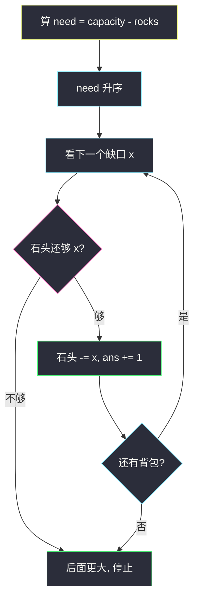
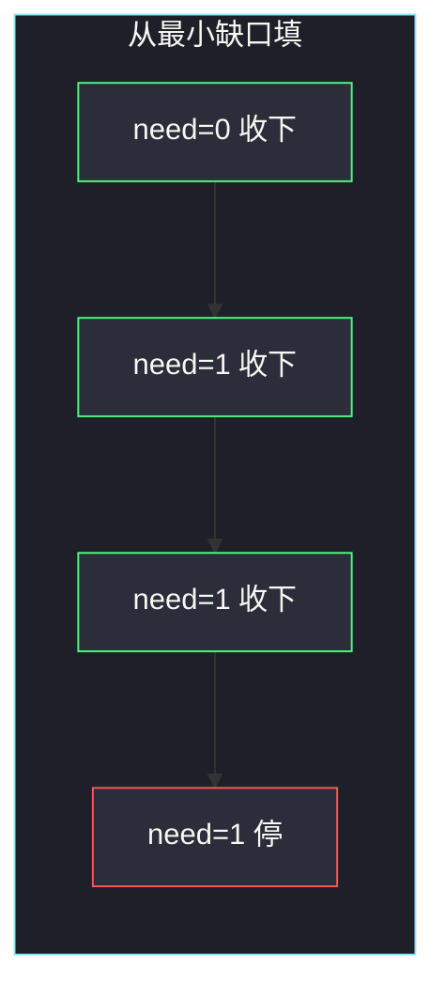

# 装满石头的背包的最大数量（从最小缺口开始填）

## 一、问题描述

有 `n` 个背包。第 `i` 个背包容量为 `capacity[i]`，里面已经放了 `rocks[i]` 块石头。你还有 `additionalRocks` 块额外石头，可以把它们任意分配到这些背包里（一块石头进一个背包，不能拆）。装满的定义：背包里的石头数 **等于** 容量。问最多能让多少个背包处于装满状态。

> 🔗 LeetCode 2279：https://leetcode.cn/problems/maximum-bags-with-full-capacity-of-rocks/
>
> 数据范围：`n == capacity.length == rocks.length`，`1 ≤ n ≤ 10^5`，`0 ≤ rocks[i] ≤ capacity[i] ≤ 10^9`，`1 ≤ additionalRocks ≤ 10^9`。
>
> 📚 灵茶题单：**§1.1 从最小/最大开始贪心**（1249 分）。目标是「个数最多」，每个背包价值相同（装满 +1），代价是缺口 `need[i] = capacity[i] - rocks[i]`。从代价最小的开始买。

**示例 1**

```
输入：capacity = [2,3,4,5], rocks = [1,2,4,4], additionalRocks = 2
输出：3
解释：缺口分别是 1、1、0、1。
     第三个已经满了；再把 2 块石头填进任意两个缺口为 1 的背包，共 3 个满包。
     不可能 4 个：还剩一个缺口 1，石头用尽。
```

**示例 2**

```
输入：capacity = [10,2,2], rocks = [2,2,0], additionalRocks = 100
输出：3
解释：缺口 8、0、2。石头远远够，三个都能装满。
```

**直观理解**

已经满的背包（缺口 0）零成本计入答案。剩下的背包：每填满一个就 +1，花费 `need[i]` 块石头。预算固定、每个物品价值都是 1 时，最优策略是**先买最便宜的**——从缺口小的开始填。

---

## 二、暴力解法

每个背包「填满 / 不填满」两种选择（不填满也可以往里丢几块，但对「满包个数」没有帮助，最优解里多余石头要么拿去填满某个包，要么闲置）。枚举子集，检查缺口之和 ≤ `additionalRocks`，最大化子集大小。

```python
class Solution:
    def maximumBags(
        self, capacity: list[int], rocks: list[int], additionalRocks: int
    ) -> int:
        n = len(capacity)
        need = [capacity[i] - rocks[i] for i in range(n)]
        ans = 0
        for mask in range(1 << n):
            cost = cnt = 0
            for i in range(n):
                if mask >> i & 1:
                    cost += need[i]
                    cnt += 1
            if cost <= additionalRocks:
                ans = max(ans, cnt)
        return ans
```

`n ≤ 10^5`，子集数不可接受。即使 `n = 20` 也只是勉强。

### 🔴 瓶颈在哪里

价值全是 1 的 0-1 背包，容量是 `additionalRocks`（可到 `10^9`），物品体积是 `need[i]`。经典结论：按体积升序贪心取，直到买不起。不必 DP（`additionalRocks` 太大，DP 也放不下）。

---

## 三、优化探索（核心章节）

> 📚 本题在灵茶题单中属于 **§1.1 从最小/最大开始贪心**。问「最多几个」且每个贡献相同，就从**最小代价**开始；若问「最少几个箱子装完」（如 3074），则从**最大容量**开始。方向由目标决定。

### 3.1 局部决策

1. 算 `need[i] = capacity[i] - rocks[i]`（题目保证 `rocks[i] ≤ capacity[i]`，need ≥ 0）。
2. `need` 升序。
3. 从左往右：若 `additionalRocks >= need[i]`，就花掉、答案 +1；否则后面的 need 更大，更买不起，直接停。

已经满的（need=0）会排在最前，零花费先计入，这是对的。

### 3.2 为什么「从最小缺口开始」全局最优

交换论证。设最优方案填满了集合 `O`，贪心填满了集合 `G`（按 need 从小到大尽量拿）。若 `G` 不是最优，则 `|O| > |G|`。把两边的缺口排序：贪心拿的一定是全局最小的 `|G|` 个能买得起的缺口（它停下来是因为预算不够下一个）。`O` 里若包含某个更大的缺口、却丢掉某个更小的，把大的换成小的：个数不变、花费下降，省下的石头至少还能尝试再买——不会更差。因此最优解可以调整成「总是更偏好小缺口」，与贪心一致。

反过来，若先填大缺口会亏根数。对照：`need = [2, 2, 3]`，石头 4。

- 从最小开始：2+2=4，装满 2 个，第三个 3 买不起。
- 从最大开始：先花 3，剩 1，两个缺口 2 都买不起，只装满 1 个。

价值全是 +1 时，大缺口等于「用更多预算买同样的 1」，所以必须从最小开始。逐步对照：

| 策略 | 第一次选 | 剩余石头 | 第二次 | 装满个数 |
|------|----------|----------|--------|----------|
| 缺口升序 | 2 | 2 | 再填 2 | **2** |
| 缺口降序 | 3 | 1 | 两个 2 都不够 | 1 |



### 3.3 部分填没有意义

往一个背包里丢 `k < need[i]` 块，它仍然不满，答案 +0，却占用预算。最优解可以把这些石头挪去填某个缺口 ≤ 剩余预算的包。所以只需考虑「装满或完全不管」。

### 3.4 一句话核心

> **缺口数组升序，从最小的开始填，填不起就停。已经满的 need=0 会自动排在最前。**

---

## 四、代码实现

### Python（主解：缺口排序）

```python
class Solution:
    def maximumBags(
        self, capacity: list[int], rocks: list[int], additionalRocks: int
    ) -> int:
        need = sorted(c - r for c, r in zip(capacity, rocks))
        ans = 0
        for x in need:
            if additionalRocks < x:
                break
            additionalRocks -= x
            ans += 1
        return ans
```

**变量含义**

| 写法 | 含义 |
|------|------|
| `need` | 每个背包还差几块才满 |
| 升序 | 排序关键字 = 缺口，从小到大 |
| `additionalRocks` | 还剩多少块可用石头 |
| `break` | 当前都买不起，后面更大，结束 |

Python 整数任意精度，`additionalRocks` 累减不会溢出。`n = 10^5`，瓶颈在排序。`need` 里的 0 会排在最前，相当于「已经满的免费计入」，不必单独先扫一遍数满包。

### Java（可选：注意 long）

`additionalRocks` 和 `capacity[i]` 都是 `int`，相减仍是 `int`；循环里用 `long` 更稳妥不是必须，但若改成累加总缺口再比，必须用 `long`（`n * 1e9` 会爆 `int`）。本题是逐个减，`int` 够用。

```java
class Solution {
    public int maximumBags(int[] capacity, int[] rocks, int additionalRocks) {
        int n = capacity.length;
        int[] need = new int[n];
        for (int i = 0; i < n; i++) {
            need[i] = capacity[i] - rocks[i];
        }
        Arrays.sort(need);
        int ans = 0;
        for (int x : need) {
            if (additionalRocks < x) {
                break;
            }
            additionalRocks -= x;
            ans++;
        }
        return ans;
    }
}
```

---

## 五、具体例子演示

**示例 1**：`capacity = [2,3,4,5]`，`rocks = [1,2,4,4]`，`additionalRocks = 2`。

| 背包 i | capacity | rocks | need |
|--------|----------|-------|------|
| 0 | 2 | 1 | 1 |
| 1 | 3 | 2 | 1 |
| 2 | 4 | 4 | 0 |
| 3 | 5 | 4 | 1 |

排序关键字：`need` → `[0, 1, 1, 1]`。

| 步 | 选谁（缺口） | 剩余石头 | 够不够 | ans |
|----|--------------|----------|--------|-----|
| 1 | 0（已满） | 2-0=2 | 够 | 1 |
| 2 | 1 | 2-1=1 | 够 | 2 |
| 3 | 1 | 1-1=0 | 够 | 3 |
| 4 | 1 | 0 < 1 | **停** | 3 |

答案 3，与官方一致。三个 need=1 的背包地位相同，先填哪两个不影响个数。



**示例 2**：`need = [8, 0, 2]`，排序 `[0, 2, 8]`，石头 100。0、2、8 都买得起，ans=3。

**边界**

- 全满、石头为 0：`need` 全 0，答案 `n`。
- 石头为 0 且有缺口：只统计 need=0 的个数。
- 一个大缺口刚好等于石头：只装满那一个（若它是最小缺口）或更小的若干个——排序后自然选对。
- `need = [5, 1, 1, 1]`、石头 3：升序 `[1,1,1,5]`，三根 1 刚好花完，答案 3；若先填 5 则答案 0。

也可以排序后做前缀和，再二分「最多装几个」：找到最大的 `k` 使前 `k` 个缺口之和 ≤ `additionalRocks`。与从左扫等价，适合想练习二分的写法。注意前缀和必须用 64 位整数，`n · 10^9` 会超过 32 位。

示例 1 的前缀和：`[0, 1, 2, 3]`。石头 2 对应最大 `k` 满足前缀 ≤ 2，即 `k=3`，同一答案。

---

## 六、复杂度分析

| 方法 | 时间 | 空间 | 说明 |
|------|------|------|------|
| 枚举子集 | `O(2^n · n)` | `O(n)` | `n=1e5` 不可用 |
| 0-1 背包 DP | `O(n · additionalRocks)` | 同左 | 容量 `1e9` 不可用 |
| 缺口升序贪心（主解） | `O(n log n)` | `O(n)` 存 need | 扫描 `O(n)` |

---

## 七、对比总结

| 维度 | 本题 | 1833 买雪糕 | 3074 装苹果 |
|------|------|-------------|-------------|
| 目标 | 最多装满几个包 | 最多买几根 | 最少用几个箱 |
| 排序方向 | 缺口**升序**（从最小开始） | 价格升序 | 容量**降序**（从最大开始） |
| 停止条件 | 买不起当前缺口 | 买不起当前价格 | 容量和已经 ≥ 总量 |
| 每个物品价值 | 全是 1 | 全是 1 | 容量不同，要个数最少 |

**易错点**

1. **按容量或按已有石头排序**：关键字是**缺口**。容量大但已经快满的，可能比容量小却全空的更便宜。
2. **先填大缺口**：3.2 的 `[2,2,3]` + 石头 4，会从 2 个降到 1 个。
3. **部分填还去更新答案**：没装满不能 +1。
4. **`n=1e5` 还去 DP**：容量维度是石头数，不是 `n`。
5. **溢出**：若改成「先求前缀和再二分最多装几个」，前缀和必须用 64 位整数。

和 1833 对比时，只要记住：本题多一步 `need = capacity - rocks`，之后代码逐行相同。不要把「已有石头多」理解成优先填——已有多只意味着缺口可能更小，真正的关键字仍是缺口。

---

## 八、举一反三

| 题目 | 关系 |
|------|------|
| [1833. 雪糕的最大数量](https://leetcode.cn/problems/maximum-ice-cream-bars/)（`maximum-ice-cream-bars.md`） | 同一模板：价值全 1，按代价升序买 |
| [455. 分发饼干](https://leetcode.cn/problems/assign-cookies/) | 双数组：小饼干先喂胃口小的 |
| [1710. 卡车上的最大单元数](https://leetcode.cn/problems/maximum-units-on-a-truck/) | 价值不再相同，改按「每箱单元数」降序 |
| [3074. 重新分装苹果](https://leetcode.cn/problems/apple-redistribution-into-boxes/) | §1.1 另一面：从**最大**容量开始，求最少个数 |
| [2144. 打折购买糖果的最小开销](https://leetcode.cn/problems/minimum-cost-of-buying-candies-with-discount/)（`minimum-cost-of-buying-candies-with-discount.md`） | 排序后按规则配对，也是最值贪心 |

**思想迁移**

- 个数最多 + 单价不同 → 从最便宜的开始；个数最少 + 容量不同 → 从最大的开始。
- 口诀：**「先算还差多少，升序填，填不起就停。」**

石头可以闲置，题目不要求用完 `additionalRocks`。示例 2 剩 90 块完全合法。
