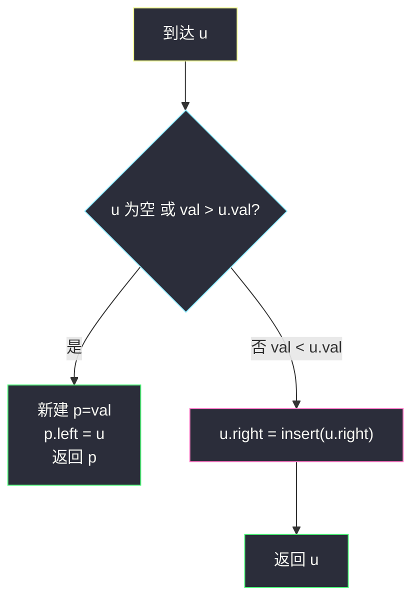
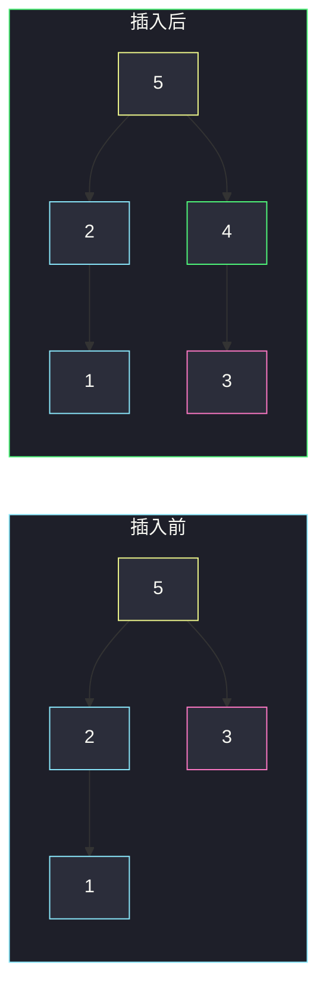

# 最大二叉树 II（追加到末尾 · 只走最右路径）

## 一、问题描述

一棵**最大二叉树**由数组 `A` 这样建成：根是 `A` 的最大值；左子树由该最大值**左边**那段子数组建成；右子树由**右边**那段建成。递归下去，整棵树唯一。

现在已经给你这棵树的根 `root`（对应某个 `A`），以及一个新值 `val`。含义是：把 `val` **追加到 `A` 末尾**得到 `A' = A + [val]`，再按同样规则建最大二叉树。请返回新树的根。

要求想清楚之后做到 **`O(h)`**（`h` 为树高），不要把 `A` 还原出来再 `O(n²)` 重建。

> 🔗 LeetCode 998：https://leetcode.cn/problems/maximum-binary-tree-ii/
>
> 数据范围：节点数 `[1, 100]`；`1 ≤ Node.val, val ≤ 100`；树上值互不相同，且 `val` 与树上任意值都不同。
>
> 📚 灵茶题单：**二叉树 · §2.10 创建二叉树**。先有 [654. 最大二叉树](https://leetcode.cn/problems/maximum-binary-tree/)：从数组建树；本题是「数组末尾多一个数」的增量插入。

**示例 1**

```
输入：root = [4,1,3,null,null,2]，val = 5
输出：[5,4,null,1,3,null,null,null,null,2]

原树（A = [1,4,2,3]）：          插入 5 后（A' 末尾多 5）：
        4                           5
       / \                         /
      1   3                       4
         /                       / \
        2                       1   3
                                   /
                                  2
5 比全局最大还大，成为新根，旧整棵树变成左子树。
```

**示例 2**

```
输入：root = [5,2,4,null,1]，val = 3
输出：[5,2,4,null,1,null,3]

原树（A = [2,1,5,4]）：          插入 3 后：
        5                           5
       / \                         / \
      2   4                       2   4
       \                           \   \
        1                           1   3
3 < 5，只能进右子树；3 < 4，接到 4 的右孩子。
```

**示例 3**

```
输入：root = [5,2,3,null,1]，val = 4
输出：[5,2,4,null,1,3]

原树（A = [2,1,5,3]）：          插入 4 后：
        5                           5
       / \                         / \
      2   3                       2   4
       \                           \  /
        1                           1 3
4 < 5 仍走右路，但 4 > 3：新节点 4 取代 3 成为 5 的右孩子，旧右子树整棵挂到 4 的左边。
```

**直观理解**

`val` 是新数组的**最后一个元素**，所以树上已有的每一个数都在它左边。最大二叉树里「谁当谁的右孩子」完全由「右边那段里谁最大」决定。因此新点只可能出现在**最右路径**上：要么把某段右子树顶掉当新根（旧树变左），要么接到最右路径的空位上。绝不会钻进任何左子树。

---

## 二、暴力解法

中序遍历就能还原 `A`：最大树的定义就是「左子数组 + 根 + 右子数组」，和中序的访问顺序一致。还原后把 `val` 接在末尾，再按 654 的方式重建。

```python
class Solution:
    def insertIntoMaxTree(self, root: Optional[TreeNode], val: int) -> Optional[TreeNode]:
        def inorder(node):
            if node is None:
                return []
            return inorder(node.left) + [node.val] + inorder(node.right)

        def build(nums):
            if not nums:
                return None
            i = nums.index(max(nums))
            node = TreeNode(nums[i])
            node.left = build(nums[:i])
            node.right = build(nums[i + 1:])
            return node

        return build(inorder(root) + [val])
```

### 复杂度

- **时间**：还原 `O(n)`；重建每次找最大值，最坏 `O(n²)`。
- **空间**：额外数组 `O(n)`，递归栈 `O(n)`。

`n ≤ 100` 能过，但没有用上「只追加一个数」这个结构。

### 🔴 瓶颈在哪里

重建把整棵树拆了重装。真正变了的只有最右路径上的若干指针：`val` 要么当新根，要么插在某个「仍比它大」的节点和「已经比它小」的旧右子树之间。沿着最右路径走一遍就够，不必看左子树任何节点。

---

## 三、优化探索（核心章节）

> 📚 本题在灵茶题单中属于 **二叉树 · §2.10 创建二叉树**。654 是「整段数组 → 树」；本题是「已知旧树 + 末尾新值 → 新树」，插入只需 `O(h)`。

### 3.1 为什么 val 一定在最右路径上

最大树可以看成数组上的笛卡尔树（根 = 区间最大值，左/右 = 左右子区间）。`val` 在数组最右侧，所以：

- 任何节点 `u` 的**左子树**里的数，下标都在 `u` 左边，不可能把 `val` 收进去。
- `u` 的右子树 = `u` 右边、且小于 `u` 的那段。`val` 恰在这段的更右边。

所以从根出发，比较只发生在最右路径：`val` 与当前节点比大小，永远走 `right`。

### 3.2 两种局部改法

沿最右路径走到节点 `u` 时：

1. **`val > u.val`（或 `u` 为空）**  
   新节点 `p.val = val`，`p.left = u`（`u` 整棵子树都在 `val` 左边且都比 `val` 小——因为 `u` 是这段的最大值）。`p` 接到原来挂 `u` 的那个右指针上。若 `u` 是旧根，`p` 就是新根。

2. **`val < u.val`**  
   `u` 仍是「自己这段」的最大值，根不变。`val` 只能进 `u` 的右子树，对 `u.right` 递归。

为什么 1 里可以把**整棵** `u` 当左子树，而不用拆开 `u` 的右子树？因为此时 `val > u.val`，而 `u` 是该子数组的最大值，子树里再没有比 `val` 更大的数。整段都在 `val` 左边，按定义全部进左子树。



### 3.3 最右路径的单调性

最右路径上的值从上到下**严格递减**：根是全局最大，右孩子是右子数组最大，再往下是更短后缀的最大。插入就是在这条递减链上找到「第一个小于 `val` 的位置」，把新节点塞进去，旧后缀整段变左孩子。

### 3.4 一句话核心

> **val 只走最右路径：比当前根大则新根、旧树变左；否则递归插入右子树。**

---

## 四、代码实现

结构题主解用递归默写版：先处理「新节点当根」的边界，再改右指针。

### Python（主解：沿最右路径递归）

```python
class Solution:
    def insertIntoMaxTree(
        self, root: Optional[TreeNode], val: int
    ) -> Optional[TreeNode]:
        if root is None or val > root.val:
            p = TreeNode(val)
            p.left = root
            return p
        root.right = self.insertIntoMaxTree(root.right, val)
        return root
```

**变量含义**

| 写法 | 含义 |
|------|------|
| `val > root.val` | `val` 成为这段的新最大值，旧根整棵变左 |
| `root.right = insert(...)` | 旧根仍最大，只改最右路径 |
| 返回值接回右指针 | 和 654 / 后序改树一样，必须接回去 |

空树插入：直接新建。本题数据保证原树非空，但写成这样更稳。

### Python（可选：迭代，沿右脊下行）

```python
class Solution:
    def insertIntoMaxTree(
        self, root: Optional[TreeNode], val: int
    ) -> Optional[TreeNode]:
        if val > root.val:
            p = TreeNode(val)
            p.left = root
            return p
        cur = root
        while cur.right and cur.right.val > val:
            cur = cur.right
        p = TreeNode(val)
        p.left = cur.right
        cur.right = p
        return root
```

循环条件 `cur.right.val > val`：还在「递减且仍比 val 大」的脊上，继续往下；停下来就把新节点插在 `cur` 和旧 `cur.right` 之间。

### Java（可选）

```java
class Solution {
    public TreeNode insertIntoMaxTree(TreeNode root, int val) {
        if (root == null || val > root.val) {
            TreeNode p = new TreeNode(val);
            p.left = root;
            return p;
        }
        root.right = insertIntoMaxTree(root.right, val);
        return root;
    }
}
```

---

## 五、具体例子演示

**示例 3**：`root = [5,2,3,null,1]`，`val = 4`。只走黄边这条最右路径。

```
插入前最右路径：5 → 3
4 < 5 → 进入 5.right
4 > 3 → 新建 4，左挂 3，接到 5.right
```

| 步 | 当前节点 | 比较 | 动作 |
|----|----------|------|------|
| 1 | 5 | 4 < 5 | 根不变，插入右子 |
| 2 | 3 | 4 > 3 | 新建 4，`4.left = 3`，返回给 `5.right` |
| 3 | 返回 | — | 树变成 `5 / 2, 4`，4 的左是 3 |



粉节点 3 整棵（这里只是单点）被挂到新节点 4 的左边；2 和 1 在左子树，插入过程看都没看。

**示例 2**：`val = 3` 插入 `[5,2,4,null,1]`。

| 步 | 当前 | 比较 | 动作 |
|----|------|------|------|
| 1 | 5 | 3 < 5 | 走右 |
| 2 | 4 | 3 < 4 | 走右，右孩子为空 |
| 3 | 空 | 空 | 新建 3，接到 4.right |

**示例 1**：`val = 5 > 根 4`，第一步就新建 5，`left` 指向旧根，结束。左子树 `[1,4,2,3]` 一个指针都不用动。

---

## 六、复杂度分析

| 方法 | 时间 | 空间 | 说明 |
|------|------|------|------|
| 还原数组再 654 重建 | `O(n²)` | `O(n)` | 没用上「只追加一个」 |
| 沿最右路径插入（主解） | `O(h)` | `O(h)` 递归栈；迭代 `O(1)` 额外 | 只碰右脊；最坏链状 `h = n` |

`n ≤ 100`，两种都能过；面试要的是 `O(h)` 这一观察。

---

## 七、对比总结

| 维度 | 654 最大二叉树 | 本题 998 |
|------|----------------|----------|
| 输入 | 整段数组 | 旧树 + 一个末尾新值 |
| 新节点位置 | 最大值在数组任意处 | **一定在最右路径** |
| 复杂度 | 朴素 `O(n²)` / 单调栈 `O(n)` | `O(h)` |

**易错点**

1. **往左子树插**：`val` 下标最大，左子树全是更左的数，不可能。
2. **新节点当根时挂到右边**：旧树全部在 `val` 左边，必须 `p.left = old`，不是 `p.right`。
3. **`val` 介于 `u` 与 `u.right` 之间时只改一个指针**：漏了 `p.left = u.right`，旧右子树会丢。
4. **返回值没接回 `root.right`**：和剪枝题一样，递归改树必须赋值。
5. 值和原树保证互不相同，不用处理相等。

---

## 八、举一反三

| 题目 | 关系 |
|------|------|
| [654. 最大二叉树](https://leetcode.cn/problems/maximum-binary-tree/) | 同节：从数组建最大树；本题是它的增量版 |
| [701. 二叉搜索树中的插入操作](https://leetcode.cn/problems/insert-into-a-binary-search-tree/) | 同样「一路走到空位再挂上」，BST 按值左右走，本题只走右 |
| [450. 删除二叉搜索树中的节点](https://leetcode.cn/problems/delete-node-in-a-bst/) | 改树后要把子树接回去，返回新根 |
| [108. 将有序数组转换为二叉搜索树](https://leetcode.cn/problems/convert-sorted-array-to-binary-search-tree/) | 也是「区间中点当根、左右子数组递归」，和 654 骨架像、中点规则不同 |
| [2196. 根据描述创建二叉树](https://leetcode.cn/problems/create-binary-tree-from-descriptions/) | §2.10 另一类建树：给边建树 |

**思想迁移**

- 笛卡尔树 / 最大树：子树对应一段连续子数组；末尾插入 = 只动右脊。
- 口诀：**「只走最右；更大则新根旧树变左，否则插到右边。」**
